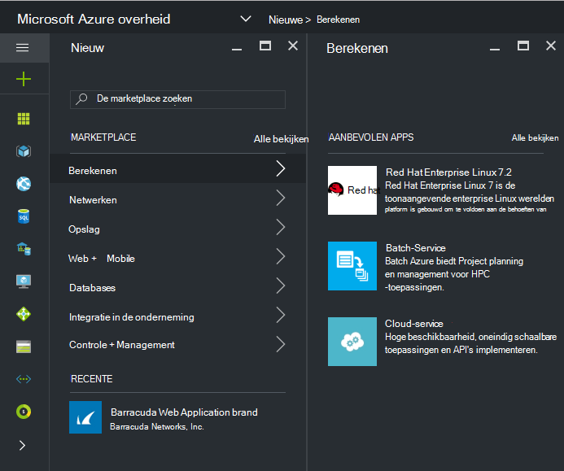
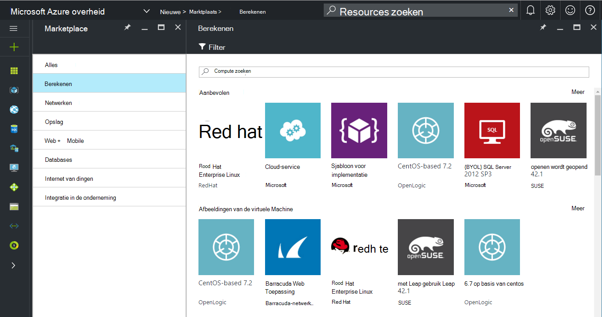
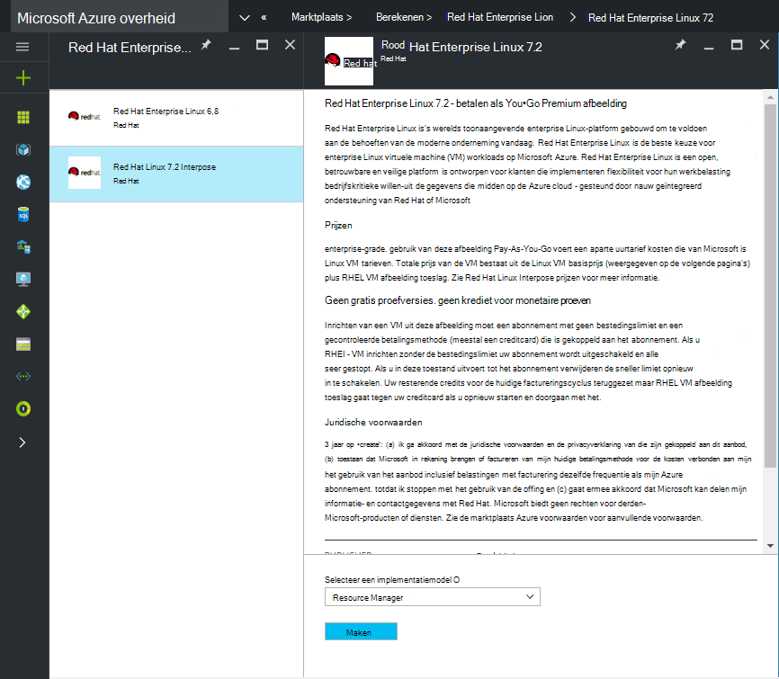
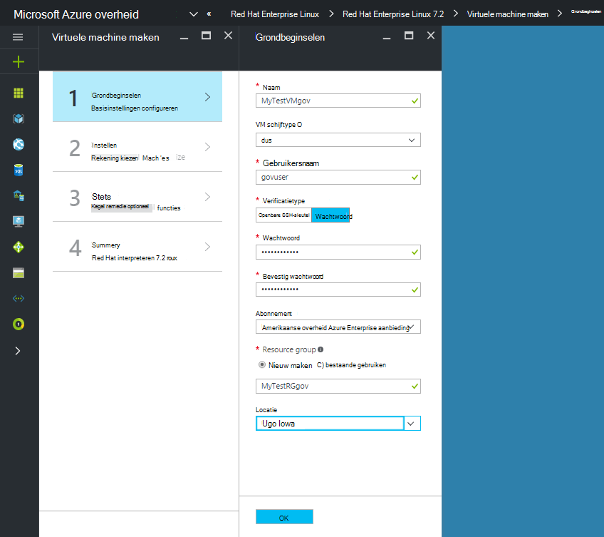
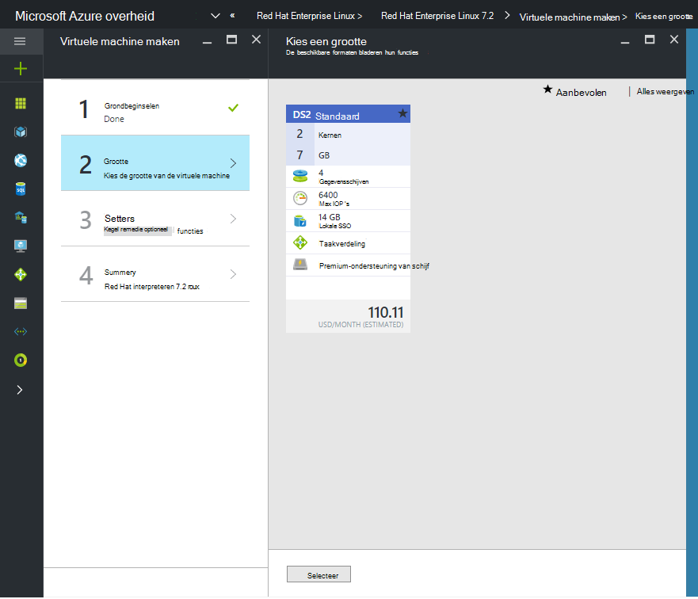

 <properties
    pageTitle="Azure overheid documentatie | Microsoft Azure"
    description="Dit biedt een vergelijking van de functies en de richtlijnen over het ontwikkelen van toepassingen voor de overheid Azure."
    services="Azure-Government"
    cloud="gov"
    documentationCenter=""
    authors="VybavaRamadoss"
    manager="asimm"
    editor=""/>

<tags   ms.service="multiple"
    ms.devlang="na"
    ms.topic="article"
    ms.tgt_pltfrm="na"
    ms.workload="azure-government"
    ms.date="10/20/2016"
    ms.author="zakramer;vybavar"/>

# Azure Marketplace voor de overheid
De markt Azure is beschikbaar voor Azure regering met een bijgewerkte lijst met afbeeldingen uit onze marktplaats uitgevers. 

## Variaties
Hieronder vindt u enkele overwegingen bij het gebruik van Azure Marketplace voor de overheid:

- Alleen doen om uw eigen licentie (BYOL) afbeeldingen zijn beschikbaar. U heeft geen toegang tot alle afbeeldingen waarvoor de inkooptransactie via Azure Marketplace
- Alleen een subset van afbeeldingen is momenteel beschikbaar in vergelijking met de openbare markt. U vindt de lijst met beschikbare afbeeldingen [hier](../azure-government-image-gallery.md) 
- Voor het inrichten van een afbeelding, moet de beheerder van uw onderneming Marketplace inkopen voor uw abonnement Azure inschakelen
  - Meld u aan als beheerder bij een organisatie van de Portal
  - Ga naar *beheren*
  - Klik op het potloodpictogram naast het artikel op de *Azure Marketplace* onder *Inschrijving Details*
  - *Ingeschakeld/uitgeschakeld* als de juiste in-of uitschakelen
  - Klik op *Opslaan*

>[AZURE.NOTE] Als u geïnteresseerd bent in om Zie uw afbeeldingen beschikbaar in Azure overheid [partner onboarding richtlijnen](documentation-government-manage-marketplace-partners.md) voor meer informatie.

### Stap 1
Starten van de markt

  

### Stap 2
Blader door de verschillende producten te vinden van de juiste is.

De uitgever marketplace bevat een lijst van certificaten als onderdeel van de productbeschrijving bij het maken van de juiste keuze. 

### Stap 3
Kies een product\image

### Stap 4
Start de stroom maken en voer de vereiste parameters voor implementatie

>[AZURE.NOTE] In de vervolgkeuzelijst locatie zijn alleen Azure overheid locaties zichtbaar

### Stap 5
Houd rekening met prijzen

### Stap 6
Voer alle stappen uit en klik op Ok om het inrichtingsproces

## Volgende stappen

Voor aanvullende informatie en updates, zich abonneren op de [Blog van Microsoft Azure regering](https://blogs.msdn.microsoft.com/azuregov/).
