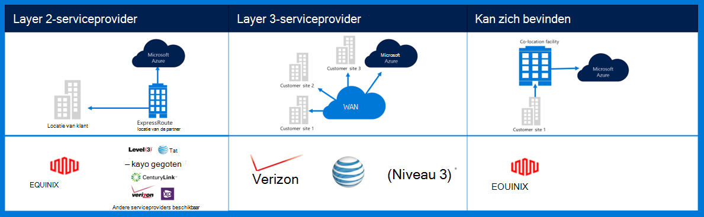
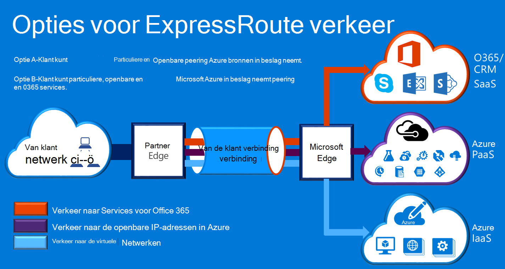

<properties
    pageTitle="Azure Governmenmt documentatie | Microsoft Azure"
    description="Dit levert een vergelijking van de functies en hulp voor de particuliere verbinding met de e-overheid"
    services="Azure-Government"
    cloud="gov" 
    documentationCenter=""
    authors="ryansoc"
    manager="zakramer"
    editor=""/>

<tags
    ms.service="multiple"
    ms.devlang="na"
    ms.topic="article"
    ms.tgt_pltfrm="na"
    ms.workload="azure-government"
    ms.date="09/28/2016"
    ms.author="ryansoc"/>

#  Azure overheid netwerken

##  ExpressRoute (particuliere verbindingen)

ExpressRoute is in Azure overheid in het algemeen beschikbaar. Zie de <a href="https://azure.microsoft.com/en-us/documentation/services/expressroute/">openbare ExpressRoute-documentatie </a>voor meer informatie (met inbegrip van partners en peering locaties).

###  Variaties

ExpressRoute is in Azure overheid algemeen beschikbaar (GA). 

- Overheid klanten via verbinding maken met een capaciteit van fysiek geïsoleerd gereserveerde verbinding Azure overheid (beurs) ExpressRoute (ER)

- Azure finan zorgt voor hogere beschikbaarheid & duurzaamheid door gebruik te maken van meerdere paren van regio zich minimaal 500 mijlen uit elkaar 

- Alle verbindingen van Azure finan Emergency Recovery is standaard geconfigureerde actieve redundante met ondersteuning voor het uiteenspatten en biedt een capaciteit van maximaal 10 G-circuit (kleinste is 50MB)

- Azure finan Emergency Recovery locaties bieden geoptimaliseerde trajecten (kortste hops, lage latentie, hoge prestaties, enz.) voor klanten en geo-redundante Azure finan-regio 's

- Geen gebruik van de particuliere verbinding Azure finan Emergency Recovery, overdragen of afhankelijk zijn van het Internet

- Azure finan fysieke en logische infrastructuur fysiek is gereserveerd en gescheiden en toegang is beperkt tot personen van de Verenigde Staten

- Microsoft is eigenaar van en werkt alle fiber-infrastructuur is tussen Azure finan-regio's en voldoen aan Azure finan Emergency Recovery-Me locaties

- Azure finan Emergency Recovery biedt connectiviteit met Microsoft Azure, O365 en CRM cloud services

### Overwegingen met betrekking tot

Er zijn twee elementaire services voor verbindingen met particuliere netwerken in Azure overheid: VPN (site-tot-site voor een organisatie) en ExpressRoute.

Azure ExpressRoute wordt gebruikt voor het maken van persoonlijke verbindingen tussen datacenters Azure regering en de lokale infrastructuur of in een omgeving met onderbrengen. ExpressRoute verbindingen gaat niet via het openbare Internet, bieden ze meer betrouwbaarheid, hogere snelheden en lagere vertragingstijden dan normale Internet-verbindingen. In sommige gevallen, met behulp van ExpressRoute verbindingen voor gegevensoverdracht tussen op lokale systemen en Azure rendementen aanzienlijke voordelen kosten.   

U tot stand brengen van verbindingen met Azure op een locatie ExpressRoute (zoals een Exchange-provider facility) met ExpressRoute, of u rechtstreeks verbinding maken met Azure uit het bestaande WAN-netwerk (zoals een multiprotocol label switching (MPLS), VPN, verstrekt door een netwerkprovider).

    

Voor het netwerkservices voor ondersteuning van Azure overheid klanttoepassingen en oplossingen, wordt aanbevolen dat ExpressRoute (particuliere verbindingen) voor verbinding met Azure regering wordt geïmplementeerd. Als VPN-verbindingen worden gebruikt, moeten worden beschouwd:

- Klanten moeten contact opnemen met hun afgifte ambtenaar/Agentschap om te bepalen of de particuliere verbindingen of andere manier beveiligde verbinding vereist is en voor eventuele extra beperkingen rekening houden.

- Klanten moeten beslissen of dwingend dat de VPN-verbinding van site naar site wordt gerouteerd via een zone van de particuliere verbinding.

- Klanten dienen een MPLS-circuit of VPN met een Internet-aanbieder gelicentieerde particuliere verbinding te verkrijgen.

Alle klanten die gebruikmaken van een persoonlijke verbinding architectuur moeten valideren dat een juiste implementatie is vastgesteld en gehandhaafd voor de klant verbinding met de Gateway netwerk/Internet (GN / I) router scheidingspunt voor Azure regering van de rand. Netwerkverbinding tussen uw lokale omgeving en de Gateway netwerk klant (GN/C) edge router scheidingspunt moet op dezelfde manier maken voor uw organisatie voor Azure regering.

## Volgende stappen

Voor aanvullende informatie en updates Abonneer u op de <a href="https://blogs.msdn.microsoft.com/azuregov/">Microsoft Azure overheid Blog.</a>
