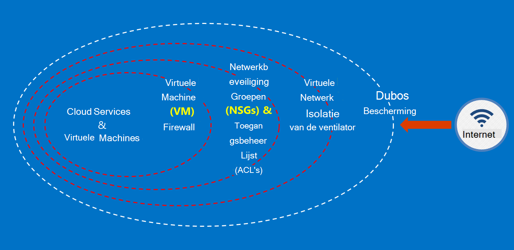

<properties
    pageTitle="Azure overheid documentatie | Microsoft Azure"
    description="Dit zorgt voor een vergelijking van functies en hulp op het ontwikkelen van toepassingen voor de overheid Azure"
    services="Azure-Government"
    cloud="gov" 
    documentationCenter=""
    authors="ryansoc"
    manager="zakramer"
    editor=""/>

<tags
    ms.service="multiple"
    ms.devlang="na"
    ms.topic="article"
    ms.tgt_pltfrm="na"
    ms.workload="azure-government"
    ms.date="08/25/2016"
    ms.author="ryansoc"/>

#  Overzicht van de overheid Azure documentatie

##  Inleiding tot Azure overheid documentatie

Deze website beschrijft de mogelijkheden van de [Microsoft Azure](https://azure.microsoft.com/features/gov/) overheidsdiensten en algemene richtlijnen van toepassing op alle klanten biedt. Voordat met inbegrip van speciaal gereglementeerde gegevens van uw abonnement op Azure regering, moet u vertrouwd raken met de mogelijkheden van Azure overheid en neem contact op met uw accountteam als u vragen hebt.

U moet verwijzen naar de [Microsoft Azure vertrouwen naleving pagina](http://www.microsoft.com/en-us/TrustCenter/Compliance/default.aspx) voor actuele informatie op de Azure overheidsdiensten worden gedekt door specifieke diploma's en voorschriften. Aanvullende Microsoft-diensten mogelijk ook beschikbaar, maar niet binnen het toepassingsgebied van de Azure die overheidsdiensten zijn en niet worden behandeld in dit document. Azure overheidsdiensten mogelijk ook toegang tot tal van extra bronnen, toepassingen of services die worden geleverd door derden, of door Microsoft onder de afzonderlijke termen van gebruik en privacy-beleid, die niet zijn opgenomen in het bereik van dit document. U bent verantwoordelijk voor het controleren van de voorwaarden van alle dergelijke 'Add-ons'-aanbiedingen, zoals marktplaats aanbiedingen, om ervoor te zorgen dat zij voldoen aan uw behoeften met betrekking tot de naleving.

Azure overheid is beschikbaar voor entiteiten die gegevens die aan bepaalde wettelijke voorschriften en voorschriften (zoals NIST 800.171 (DIB), ITAR, IRS 1075, DoD N4- en CJIS) waarbij gebruik van Azure overheid is vereist om te voldoen aan de voorschriften te verwerken. Azure overheid klanten worden validering van geschiktheid.

Entiteiten met vragen over het in aanmerking komen voor Azure regering moeten hun accountteam raadplegen.

##  Beginselen voor het beveiligen van gegevens van de klant in Azure overheid

Azure overheid biedt een scala aan functies en services die u gebruiken kunt om cloud oplossingen aan uw wensen geregeld/gecontroleerde gegevens te maken. Een compatibele klantoplossing is niets meer dan de daadwerkelijke uitvoering van out-of-the-box Azure overheid mogelijkheden, in combinatie met vaste gegevens uit veiligheidsoverwegingen.
Wanneer u een oplossing in Azure overheid host, verwerkt Microsoft veel van deze voorschriften op het niveau van de cloud-infrastructuur.

Het volgende diagram toont de Azure ingrijpende model. Bijvoorbeeld, biedt Microsoft basic cloud infrastructuur DDOS, samen met de klant mogelijkheden zoals beveiligingsapparaten voor klant-specifieke toepassing die DDOS nodig heeft.

Deze pagina geeft een overzicht van het basissysteem beginselen voor het beveiligen van uw Services en toepassingen en biedt richtlijnen en aanbevolen procedures voor het toepassen van deze beginselen; met andere woorden, hoe klanten moeten maken slim gebruik van Azure regering om te voldoen aan de verplichtingen en verantwoordelijkheden die vereist zijn voor een oplossing die ITAR informatie verwerkt.

De overkoepelende beginselen voor het beveiligen van gegevens van de klant zijn:
* Bescherming van gegevens met codering
* Geheimen beheren
* Isolatie voor het beperken van toegang tot gegevens

##  Bescherming van gegevens met codering

Risico beperken en voldoen aan wettelijke verplichtingen zijn het toenemende belang van gegevenscodering en focus te rijden. Een implementatie van effectieve codering gebruiken voor het verbeteren van huidige netwerk- en veiligheidsmaatregelen, en verlagen het algehele risico van uw cloud-omgeving.

### Codering in rust
De codering van gegevens in rust is van toepassing op de bescherming van de klant inhoud schijf opgeslagen. Er zijn verschillende manieren waarop die dit kan gebeuren:

### Opslag Service codering

Azure Storage Service-codering is ingeschakeld op het niveau van de account opslag blok BLOB's en pagina-BLOB's worden automatisch gecodeerd als geschreven naar Azure opslag. Als u de gegevens uit de opslag van Azure leest, wordt gedecodeerd door de storage-service voordat het wordt geretourneerd. Gebruik deze optie als u uw gegevens te beveiligen zonder te wijzigen of toevoegen van code aan toepassingen.

### Azure schijfversleuteling
Azure schijf codering gebruikt voor het coderen van de OS-schijven en gegevensschijven door een Azure Virtual Machine gebruikt. Integratie met Azure sleutel kluis kunt u de controle en helpt bij het beheren van coderingssleutels schijf.

### Client-Side-codering
Client-Side-codering is ingebouwd in de Java en .NET opslag clientbibliotheken, die van Azure sleutel kluis API's gebruikmaken kunnen, waardoor dit eenvoudig te implementeren. Azure sleutel kluis gebruiken om toegang te krijgen tot de geheimen in Azure sleutel kluis voor bepaalde personen met Azure Active Directory.

### Codering in transit

De basic codering beschikbaar voor connectiviteit met Azure overheid ondersteunt protocol beveiliging TLS (Transport Level) 1.2 en x.509-certificaten. Federal Information Processing Standard (FIPS) 140-2 niveau 1 cryptografische algoritmen ook voor infrastructuur netwerkverbindingen tussen datacenters Azure regering gebruikt worden.  Windows Server 2012 R2 en Windows 8-plus VMs en bestandsshares Azure kunt SMB 3.0 gebruiken voor codering tussen de VM en de bestandsshare. Client-Side-codering gebruikt om de gegevens te coderen voordat het op te slaan in een clienttoepassing overbrengen, en om de gegevens na het decoderen geen opslagruimte wordt overgebracht.

### Aanbevolen procedures voor codering

* IaaS VMs: Azure schijf codering gebruiken. Opslag Service versleuteling voor het coderen van de VHD-bestanden die worden gebruikt voor back-up van deze schijven in Azure opslag inschakelen, maar dit zijn onlangs schriftelijke gegevens alleen gecodeerd. Dit betekent dat als u een VM maken en vervolgens Storage Service-codering inschakelen voor de opslag rekening met het VHD-bestand, alleen de wijzigingen worden gecodeerd, niet het oorspronkelijke VHD-bestand.
* Client-Side codering: Dit is de veiligste methode voor het coderen van uw gegevens, omdat het codeert het voor communautair douanevervoer en de gegevens in rust codeert. Echter, is het vereist dat u code toevoegt aan uw toepassingen met behulp van opslag, waarmee u mogelijk niet wilt doen. In dat geval kunt u HTTPs voor uw gegevens in doorvoer en opslag Service codering voor het coderen van de gegevens in rust. Client-Side codering ook betrekking heeft op meer belasting op de client, hebt u voor deze account in uw plannen voor schaalbaarheid, vooral als u zijn gecodeerd en een grote hoeveelheid gegevens.

Zie voor meer informatie over de opties voor wachtwoordcodering in Azure [Beveiligingshandleiding voor opslag](/storage-security-guide).

##  Klantgegevens beschermen door het beheer van geheimen

Veilig beheer van sleutels is van wezenlijk belang voor de bescherming van gegevens in de cloud. Klanten moeten streven naar de belangrijkste beheer vereenvoudigen en het beheer van sleutels die door cloud-toepassingen en services worden gebruikt om gegevens te coderen.

### Aanbevolen procedures voor het beheren van geheimen

* Met sleutel kluis kunt u het risico van geheimen worden blootgesteld via vastgelegde configuratiebestanden, scripts, of in de broncode. Azure sleutel kluis toetsen (zoals de coderingssleutels voor Azure schijfversleuteling) en geheimen (zoals wachtwoorden) worden gecodeerd, doordat ze in FIPS 140-2 niveau 2 gevalideerd hardware security modules (HSM's). U kunt extra garantie, importeren of het genereren van sleutels in deze HSM's.
* Toepassing en sjablonen moeten alleen URI verwijzingen bevatten naar de geheimen (wat betekent dat de werkelijke geheimen zijn niet in de code, de configuratie of de broncode opslagplaatsen). Hiermee voorkomt u dat sleutels phishing-aanvallen op interne of externe repo's, zoals de oogst-bots in de GitHub.
* Gebruik van sterke RBAC besturingselementen binnen sleutel kluis. Als een vertrouwde operator het bedrijf of de overdracht aan een nieuwe groep binnen het bedrijf verlaat, moeten ze niet mogen toegang te krijgen tot de geheimen.  

Zie voor meer informatie [Sleutel kluis voor Azure overheid](/azure-government/azure-government-tech-keyvault)

##  Isolatie voor het beperken van toegang tot gegevens

Isolatie is alles over gegevenstoegang beperken tot alleen geautoriseerde gebruikers, services en toepassingen met behulp van de grenzen, segmentatie en containers. De scheiding tussen de huurders is bijvoorbeeld een essentieel beveiligingsmechanisme voor multitenant wolk platforms zoals Microsoft Azure. Logische isolatie helpt voorkomen dat een huurder verstoren de werking van een andere huurder.

### Isolatie van de omgeving
De regering van Azure-omgeving is een fysieke instantie die losstaat van de rest van het netwerk van Microsoft. Dit wordt bereikt door een reeks fysieke en logische controles die het volgende bevatten: beveiligen van fysieke barrières met biometrische apparaten en camera's.  Het gebruik van specifieke referenties en multifactor-verificatie door personeel van Microsoft die logische verbinding met de productie-omgeving.  Alle-infrastructuur voor Azure regering bevindt zich in de Verenigde Staten.

#### Isolatie per klant
Netwerktoegangsbeheer geïmplementeerd op Azure en scheiding door middel van VLAN-isolatie, ACL's, balancers en IP-filters laden

Klanten kunnen hun bronnen verder isoleren via abonnementen, resourcegroepen, virtuele netwerken en subnetten.

Zie de [sectie van de isolatie van de Azure Security Guide](/azure-security-getting-started/#isolation)voor meer informatie over isolatie in Microsoft Azure.

Voor aanvullende informatie en updates Abonneer u op de <a href="https://blogs.msdn.microsoft.com/azuregov/">Microsoft Azure overheid Blog.</a>
