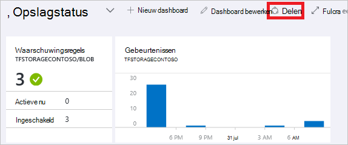
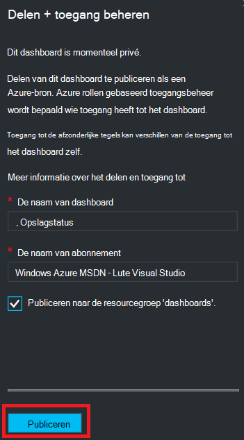
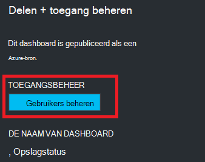
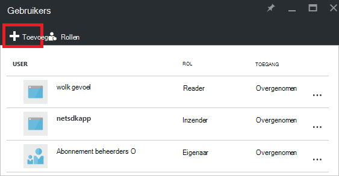
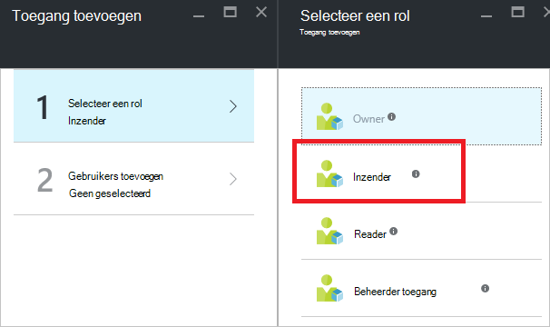
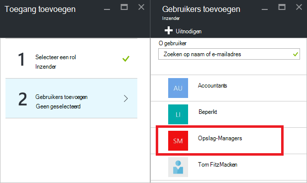
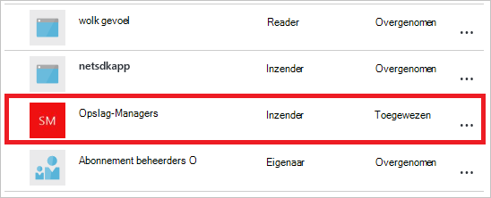

<properties
   pageTitle="Azure portal dashboard toegang | Microsoft Azure"
   description="In dit artikel wordt uitgelegd hoe u toegang tot een dashboard in Azure portal delen."
   services="azure-portal"
   documentationCenter=""
   authors="tfitzmac"
   manager="timlt"
   editor="tysonn"/>

<tags
   ms.service="multiple"
   ms.devlang="NA"
   ms.topic="article"
   ms.tgt_pltfrm="NA"
   ms.workload="na"
   ms.date="08/01/2016"
   ms.author="tomfitz"/>

# Azure dashboards delen

U kunt na het configureren van een dashboard, publiceren en delen met andere gebruikers in uw organisatie. U toestaan dat anderen toegang krijgen tot uw dashboard via Azure [Rollen gebaseerd toegangsbeheer](../active-directory/role-based-access-control-configure.md). U een gebruiker of groep gebruikers toewijzen aan een rol en die rol worden gedefinieerd of die gebruikers kunnen weergeven of wijzigen van de gepubliceerde dashboard. 

Alle gepubliceerde dashboards worden geïmplementeerd als Azure bronnen, wat betekent dat ze bestaan als beheerbare items binnen uw abonnement en bevinden zich in een resourcegroep.  Vanuit een oogpunt access control verschillen dashboards niet van andere bronnen, zoals een virtuele machine of een account voor opslag.

> [AZURE.TIP] Afzonderlijke tegels op het dashboard dwingen hun eigen toegang voorschriften inzake de controle op basis van de bronnen die ze geven.  U kunt daarom een dashboard dat grotendeels wordt gedeeld en nog steeds beschermt de gegevens op de afzonderlijke tegels ontwerpen.

## Wat is toegangsbeheer voor dashboards

Met op functies gebaseerd toegangsbeheer kunt u gebruikers toewijzen aan rollen op drie verschillende niveaus van scope:

- abonnement
- resourcegroep
- resource

De machtigingen die u toewijst, worden overgenomen van abonnement naar de bron. De gepubliceerde dashboard is een bron. Dus misschien al gebruikers met de rol van het abonnement die ook voor de gepubliceerde dashboard werken. 

Hier volgt een voorbeeld.  Stel u hebt een abonnement op Azure en verschillende leden van uw team de rollen van de **eigenaar**, **medewerker**of **lezer** voor het abonnement is toegewezen. Gebruikers die eigenaren of medewerkers kunnen aanbieden, weergeven, maken, wijzigen of verwijderen van dashboards in het abonnement.  Gebruikers die lezers kunnen kunnen dashboards lijst en -weergave, maar wijzigen of verwijderen.  Gebruikers met leestoegang hebben, zijn lokale wijzigingen aanbrengen in een gepubliceerde dashboard (zoals bij het oplossen van een probleem), maar zijn niet in staat zijn deze wijzigingen naar de server publiceren.  Hebben de mogelijkheid zelf een persoonlijke kopie van het dashboard

U kan echter ook machtigingen toewijzen aan de bronnengroep met de diverse dashboards of een individueel dashboard. U kunt bijvoorbeeld besluiten dat een groep gebruikers moet hebben beperkte machtigingen voor het abonnement maar een grotere toegang tot een bepaalde dashboard. U kunt gebruikers toewijzen aan een rol voor deze dashboard. 

## Dashboard publiceren

Stel dat u klaar bent met het configureren van een dashboard dat u wilt delen met een groep gebruikers in uw abonnement. De volgende stappen uit een aangepaste groep met de naam Managers opslag weer, maar u kunt uw groep naam wat u wilt. Zie [groepen in Azure Active Directory beheren](../active-directory/active-directory-accessmanagement-manage-groups.md)voor meer informatie over het maken van een Active Directory-groep en het toevoegen van gebruikers aan die groep.

1. In het dashboard, selecteert u **delen**.

     

2. Voordat u toegang toewijst, moet u het dashboard te publiceren. Standaard wordt het dashboard aan een groep met de naam **dashboards**worden gepubliceerd. Selecteer **publiceren**.

     

Het dashboard is nu gepubliceerd. Als de machtigingen overgenomen van het abonnement geschikt zijn, hoeft u niet meer hoeft te doen. Andere gebruikers in uw organisatie is mogelijk te openen en wijzigen van het dashboard op basis van hun abonnement op rol. Echter voor deze zelfstudie, laten we een groep gebruikers aan een rol toewijzen voor deze dashboard.

## Toegang toewijzen aan een dashboard

1. Na publicatie van het dashboard, selecteert u **gebruikers beheren**.

     

2. U ziet een lijst met bestaande gebruikers die al een rol voor dit dashboard zijn toegewezen. De lijst met bestaande gebruikers zal afwijken van de onderstaande afbeelding. Waarschijnlijk worden de toewijzingen overgenomen van het abonnement. Als u wilt toevoegen aan een nieuwe gebruiker of groep, selecteert u **toevoegen**.

     

3. Selecteer de rol die staat voor de machtigingen die u wilt verlenen. In dit voorbeeld selecteert u **Inzender**.

     

4. Selecteer de gebruiker of groep die u wilt toewijzen aan de rol. Als de gebruiker of groep die u in de lijst zoekt niet wordt weergegeven, gebruikt u het zoekvak. De lijst met beschikbare groepen is afhankelijk van de groepen die u hebt gemaakt in Active Directory.

      

5. Selecteer **OK**als u klaar bent met het toevoegen van gebruikers of groepen. 

6. De nieuwe toewijzing wordt toegevoegd aan de lijst met gebruikers. U ziet dat de **toegang** wordt weergegeven als **toegewezen** in plaats van **overgenomen**.

     

## Volgende stappen

- Zie voor een lijst met rollen [RBAC: ingebouwde functies](../active-directory/role-based-access-built-in-roles.md).
- Zie meer informatie over het beheren van resources, [resources Azure beheren via de portal](resource-group-portal.md).