<properties
   pageTitle="Azure portal dashboards | Microsoft Azure"
   description="Dit artikel wordt beschreven hoe u kunt maken en bewerken van dashboards in Azure portal."
   services="azure-portal"
   documentationCenter=""
   authors="sewatson"
   manager="timlt"
   editor="tysonn"/>

<tags
   ms.service="multiple"
   ms.devlang="NA"
   ms.topic="article"
   ms.tgt_pltfrm="NA"
   ms.workload="na"
   ms.date="09/06/2016"
   ms.author="sewatson"/>

# Maken en delen van dashboards in Azure portal

U kunt meerdere dashboards maken en deze delen met anderen die toegang tot uw abonnementen Azure hebben.  Dit bericht wordt via de basisbeginselen van het maken/bewerken, publiceren en beheren van toegang tot dashboards.

## Dashboards versus blades aanpassen

Sinds het starten van dashboards een paar maanden geleden, is er een gestage daling van de blade-aanpassingen en een snelle stijging van de aanpassingen van dashboard. Dit gebruik van sterke trend toont u liever dashboards aanpassen via de blades. Ter ondersteuning van deze trend wordt kan aanpassen blades en toe te wijzen aan onze inspanningen tot bevordering van de dashboard-functionaliteit verwijderd. Als u een blade aangepast, worden uw aanpassing snel verwijderd. Pin wilt behouden die aanpassing, de aangepaste tegels aan een dashboard. Gewoon met de rechtermuisknop op de tegel en selecteer **Pin dashboard** zoals in de volgende afbeelding.

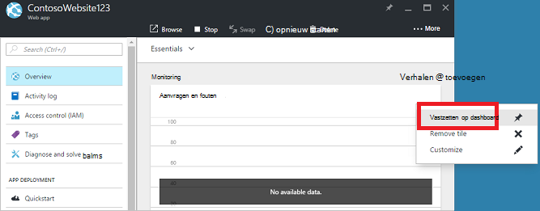

## Een dashboard maken

Als u wilt maken van een dashboard, klik op de knop **nieuw dashboard** naast de naam van het dashboard.  

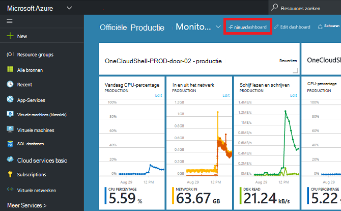

Deze actie maakt u een nieuw, leeg, persoonlijke dashboard en plaatst u in de modus aanpassen kunt u de naam van het dashboard en toevoegen of naast elkaar rangschikken.  In deze modus, heeft de galerie inklapbaar naast elkaar op het linkernavigatiemenu.  De galerie naast elkaar kunt u de tegels voor uw Azure bronnen op verschillende manieren zoeken: u kunt bladeren, [resourcegroep](../azure-resource-manager/resource-group-overview.md#resource-groups), door dit resourcetype, door [tag](../resource-group-using-tags.md)of door te zoeken naar de resource met de naam.  

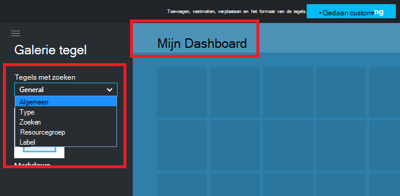

Tegels door slepen en neerzetten op het oppervlak van het dashboard wilt toevoegen.

Er is een nieuwe categorie met de naam **Algemeen** voor tegels die niet gekoppeld aan een bepaalde resource zijn.  In dit voorbeeld vastmaken is de tegel prijsverlaging.  Met dit element kunt u aangepaste inhoud toevoegen aan uw dashboard.  De tegel ondersteunt als tekst zonder opmaak, [prijsverlaging syntaxis](https://daringfireball.net/projects/markdown/syntax)en een beperkt aantal HTML.  (Voor de veiligheid, niet zoiets als ' injecteren ' `<script>` tags of bepaalde opmaaktaken element van CSS die met de portal problemen te gebruiken.) 

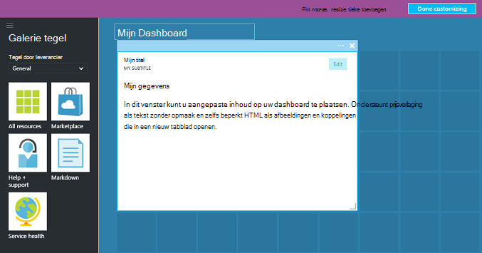

## Een dashboard bewerken

Na het maken van het dashboard kunt u de tegels uit de galerie naast elkaar of de weergave naast elkaar plaatsen van blades vastmaken. Stel de weergave van onze resourcegroep vastmaken. U kunt een PIN-code tijdens het bladeren door het artikel of de resource groep blade. Beide benaderingen leiden tot de weergave naast elkaar plaatsen van de resourcegroep wordt vastgehouden.

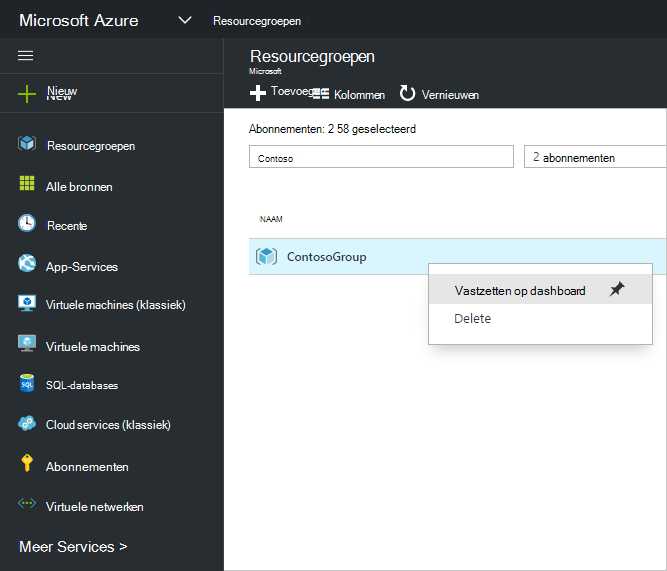

Na het vastzetten van het artikel, wordt deze weergegeven op het dashboard.

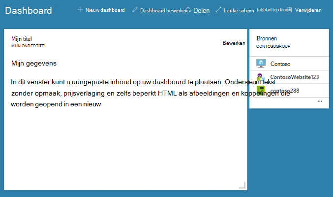

We kunnen nu we een prijsverlaging tegel hebben en dat een resourcegroep is vastgemaakt aan het dashboard, formaat en de tegels in een geschikte indeling rangschikken.

U ziet door aanwijzen en "..." of met de rechtermuisknop op een tegel contextafhankelijke opdrachten voor steen. Er zijn standaard twee items:

1. **Van het dashboard losmaken** – verwijdert de tegel uit het dashboard
2.  **Aanpassen** – voert-modus aanpassen

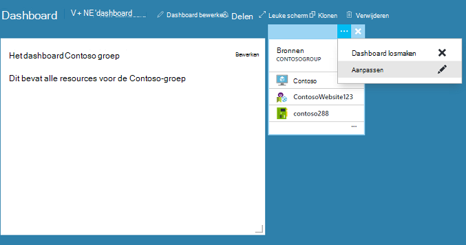

Door te selecteren aanpassen, kunt u het formaat en naast elkaar rangschikken. Om het formaat van een tegel, de nieuwe grootte selecteren in de contextuele menu zoals in de volgende afbeelding.

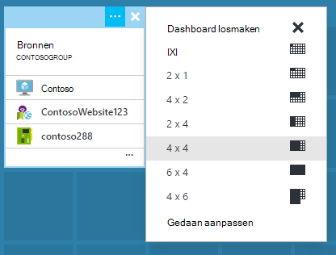

Of als de tegel elke grootte ondersteunt, kunt u de rechter benedenhoek naar de gewenste grootte slepen.

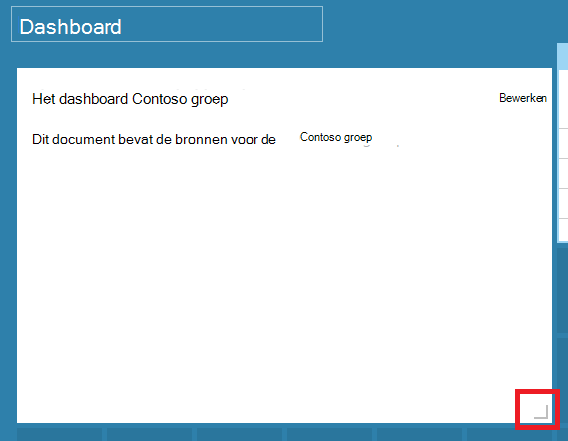

Nadat het formaat tegels, kunt u het dashboard weergeven.

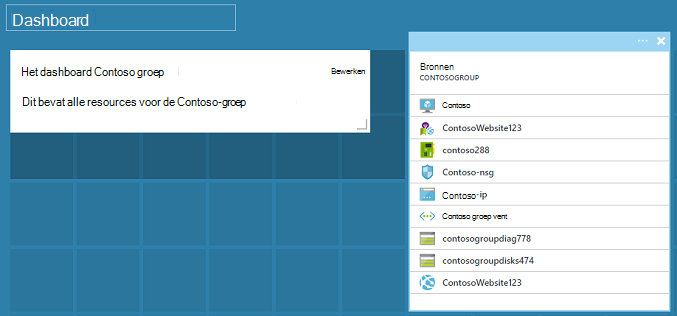

Zodra u klaar bent met het aanpassen van een dashboard, gewoon selecteren de **gedaan aanpassen** om af te sluiten-modus aanpassen of met de rechtermuisknop op en selecteer **gedaan aanpassen** in het contextmenu.

## Een dashboard publiceren en beheren van toegangsbeheer

Als u een dashboard maakt, is het persoonlijke standaard, wat betekent dat u bent de enige persoon die deze kan zien.  Om het voor anderen zichtbaar maken, gebruik de knop **delen** die wordt weergegeven naast de andere opdrachten in het dashboard.

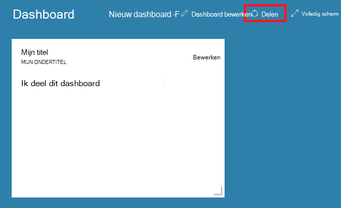

U wordt gevraagd te kiezen voor een abonnement en de resourcegroep voor het dashboard worden gepubliceerd naar. Om dashboards naadloos integreren in het ecosysteem, hebben we geïmplementeerd gedeelde dashboards als Azure resources (zodat u niet delen door een e-mailadres te typen).  Toegang tot de informatie die wordt weergegeven door de meeste van de tegels in de portal worden beheerst door de [Rol van Azure gebaseerd toegangsbeheer](../active-directory/role-based-access-control-configure.md ). Gedeelde dashboards zijn vanuit een oogpunt van de controle toegang niet anders vanaf een virtuele machine of een account voor opslag.  

Stel, u hebt een abonnement op Azure en leden van uw team de rollen van de **eigenaar**, de **Inzender**of de **lezer** van het abonnement zijn toegewezen.  Gebruikers die eigenaren of medewerkers kunnen aanbieden, weergeven, maken, wijzigen of verwijderen van dashboards binnen dit abonnement.  Gebruikers die lezers kunnen kunnen dashboards lijst en -weergave, maar wijzigen of verwijderen.  Gebruikers met leestoegang hebben zijn lokale wijzigingen aanbrengen in een gedeelde dashboard, maar zijn niet in staat zijn deze wijzigingen naar de server publiceren.  Ze kunnen nog wel een eigen exemplaar van het dashboard voor eigen gebruik.  Afzonderlijke tegels op het dashboard afdwingen zoals altijd hun eigen regels voor toegang op basis van de bronnen komen overeen met.  

Voor het gemak leidt publishing ervaring van de portal u naar een patroon plaats van dashboards in een resourcegroep **dashboards**genoemd.  

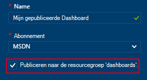

U kunt ook een dashboard publiceren naar een bepaalde bronnengroep.  Het access-besturingselement voor dat het dashboard komt overeen met het access-besturingselement voor de resourcegroep.  Gebruikers die de resources in de resourcegroep kunnen beheren ook hebben toegang tot de dashboards.

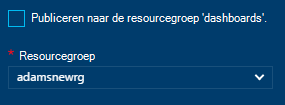

Nadat het dashboard is gepubliceerd, wordt het **delen + access** control venster vernieuwen en u informatie weergeven over de gepubliceerde dashboard, inclusief een koppeling voor het beheren van toegang tot de dashboard.  Deze koppeling wordt de standaard rol gebaseerd toegangsbeheer blade gebruikt voor het beheren van toegang tot elke bron Azure gestart.  U kunt altijd teruggaan naar deze weergave **delen**door.

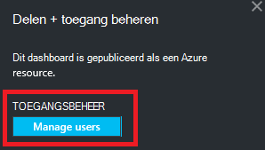

## Volgende stappen

- Zie [bronnen beheren Azure via de portal](resource-group-portal.md)voor het beheren van bronnen.
- Zie voor de implementatie van resources, [resources, distribueren met sjablonen Resource Manager en Azure portal](../resource-group-template-deploy-portal.md).