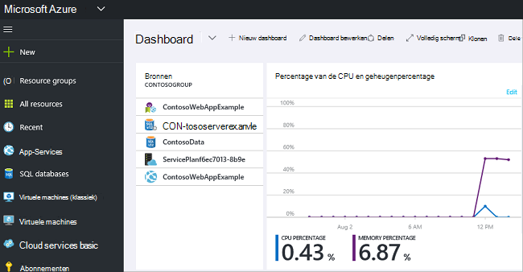

<properties 
    pageTitle="Azure portal gebruiken voor het beheren van bronnen Azure | Microsoft Azure" 
    description="Azure portal en Azure Resource beheren gebruiken om uw bronnen te beheren. Het werken met dashboards voor het controleren van de resources bevat." 
    services="azure-resource-manager,azure-portal" 
    documentationCenter="" 
    authors="tfitzmac" 
    manager="timlt" 
    editor="tysonn"/>

<tags 
    ms.service="azure-resource-manager" 
    ms.workload="multiple" 
    ms.tgt_pltfrm="na" 
    ms.devlang="na" 
    ms.topic="article" 
    ms.date="09/12/2016" 
    ms.author="tomfitz"/>

# Azure bronnen via de portal beheren

> [AZURE.SELECTOR]
- [Azure PowerShell](../powershell-azure-resource-manager.md)
- [Azure CLI](../xplat-cli-azure-resource-manager.md)
- [Portal](resource-group-portal.md) 
- [REST-API](../resource-manager-rest-api.md)

In dit onderwerp wordt beschreven hoe de [Azure portal](https://portal.azure.com) met [Azure Resource Manager](../azure-resource-manager/resource-group-overview.md) gebruiken voor het beheren van uw resources Azure. Zie informatie over de distributie van middelen via de portal, [resources, distribueren met sjablonen Resource Manager en Azure portal](../resource-group-template-deploy-portal.md).

Op dit moment ondersteunt niet elke service portal of resourcemanager. Voor deze services moet u de [klassieke portal](https://manage.windowsazure.com)te gebruiken. Zie [grafiek voor beschikbaarheid van Azure portal](https://azure.microsoft.com/features/azure-portal/availability/)voor de status van elke service.

## Resourcegroepen beheren

1. Overzicht van alle resourcegroepen in uw abonnement, selecteert u **resourcegroepen**.

    

1. Een lege als resourcegroep wilt maken, selecteert u **toevoegen**.

    

1. Geef een naam en locatie voor de nieuwe resourcegroep. Selecteer **maken**.

    

1. U wilt **vernieuwen** voor een overzicht van de laatst gemaakte resourcegroep selecteren.

    

1. De gegevens worden weergegeven voor de bronnengroepen aanpassen, de **kolommen**te selecteren.

    

1. Selecteer de kolommen die u wilt toevoegen en selecteer vervolgens **Update**.

    

1. Zie informatie over het implementeren van bronnen aan de nieuwe resourcegroep, [resources, distribueren met sjablonen Resource Manager en Azure portal](../resource-group-template-deploy-portal.md).

1. Voor snelle toegang tot een groep, kunt u het blad vastmaken aan uw dashboard.

    

1. Het dashboard wordt weergegeven voor de resourcegroep en de bijbehorende bronnen. U kunt de resourcegroepen of selecteren een van de bronnen om te navigeren naar het item.

    

## Label resources

U kunt labels toepassen op de bronnengroepen en bronnen logisch ordenen van uw activa. Zie voor meer informatie over het werken met codes [codes gebruiken voor het ordenen van uw resources Azure](../resource-group-using-tags.md).

[AZURE.INCLUDE [resource-manager-tag-resource](../../includes/resource-manager-tag-resources.md)]

## Monitor, resources

Wanneer u een bron selecteert, wordt de resource blade standaard grafieken en tabellen voor het controleren van dat resourcetype.

1. Selecteer een resource en u ziet **de controlesectie** . Grafieken die relevant voor het resourcetype zijn bevat. De volgende afbeelding toont de standaard gegevens voor een rekening opslag controleren.

    

1. Door het weglatingsteken (...) boven de sectie kunt u een gedeelte van het blad vastmaken aan uw dashboard. U kunt ook aanpassen van de grootte van de sectie in het blad of volledig verwijderen. De volgende afbeelding ziet u hoe vastmaken, aanpassen of verwijderen van de sectie CPU en geheugen.

    

1. Na het vastzetten van de sectie aan het dashboard, ziet u het overzicht op het dashboard. En Direct selecteren gaat u naar meer informatie over de gegevens.

    

1. Volledig aanpassen van de gegevens controleren via de portal, navigeer naar de standaarddashboard en selecteer **nieuw dashboard**.

    

1. Het nieuwe dashboard een naam geven en sleep tegels op het dashboard. De tegels worden gefilterd door de verschillende opties.

    

     Zie meer informatie over het werken met dashboards, [maken en delen van dashboards in Azure portal](azure-portal-dashboards.md).

## Bronnen beheren

In het blad voor een resource ziet u de opties voor het beheer van de bron. De portal biedt opties voor dat type bron. Aan de bovenkant van de resource-blade en aan de linkerkant ziet u de opdrachten voor het beheer.

U kunt uit de volgende opties, bewerkingen, zoals het starten en stoppen van een virtuele machine of opnieuw configureren van de eigenschappen van de virtuele machine uitvoeren.

## Resources verplaatsen

Als u resources verplaatsen naar een andere groep of een ander abonnement, Zie [bronnen aan de nieuwe resourcegroep of abonnement verplaatsen](../resource-group-move-resources.md).

## Vergrendelingsbronnen

U kunt een abonnement, resourcegroep of resource om te voorkomen dat andere gebruikers in uw organisatie per ongeluk verwijderen of wijzigen van kritieke bronnen vergrendelen. Zie [bronnen vergrendelen met Azure Resource Manager](../resource-group-lock-resources.md)voor meer informatie.

[AZURE.INCLUDE [resource-manager-lock-resources](../../includes/resource-manager-lock-resources.md)]

## Uw abonnement en de kosten weergeven

U kunt informatie weergeven over uw abonnement en de samengevouwen kosten voor alle bronnen. Selecteer **abonnementen** en het abonnement dat u wilt weergeven. U hebt slechts één abonnement te selecteren.

U ziet een verbrandingssnelheid binnen de blade abonnement.

En een specificatie van de kosten per resource.

## Sjabloon exporteren

Na het instellen van de resourcegroep, kunt u de sjabloon Resource Manager voor de resourcegroep bekijken. De sjabloon exporteren biedt twee voordelen:

1. Toekomstige implementaties van de oplossing kunt u gemakkelijk automatiseren omdat de sjabloon de volledige infrastructuur bevat.

2. U kunt bekend met de sjabloonsyntaxis worden door te kijken op JavaScript Object Notation (JSON) die uw oplossing vertegenwoordigt.

Zie voor stapsgewijze begeleiding [sjabloon exporteren Azure Resource Manager aan de bestaande bronnen](../resource-manager-export-template.md).

## Resourcegroep of op resources verwijderen

Een groep verwijdert, worden alle bronnen die zich daarin. U kunt ook afzonderlijke resources in een resourcegroep verwijderen. Wilt u voorzichtig zijn wanneer u een groep verwijdert, omdat er mogelijk bronnen in andere resourcegroepen die eraan gekoppeld zijn. Resource Manager verwijdert u gekoppelde bronnen, maar ze kunnen niet goed werken zonder de verwachte bronnen.

## Volgende stappen

- Controlelogboeken, Zie [bewerkingen met Resource Manager controleren](../resource-group-audit.md).
- Zie [Troubleshooting resource groep implementaties met Azure portal](../resource-manager-troubleshoot-deployments-portal.md)voor het oplossen van implementatiefouten.
- Zie voor de implementatie van resources via de portal, [resources, distribueren met sjablonen Resource Manager en Azure portal](../resource-group-template-deploy-portal.md).
- Zie toegang tot bronnen te beheren, [roltoewijzingen gebruiken voor het beheren van toegang tot de bronnen van uw abonnement op Azure](../active-directory/role-based-access-control-configure.md).

