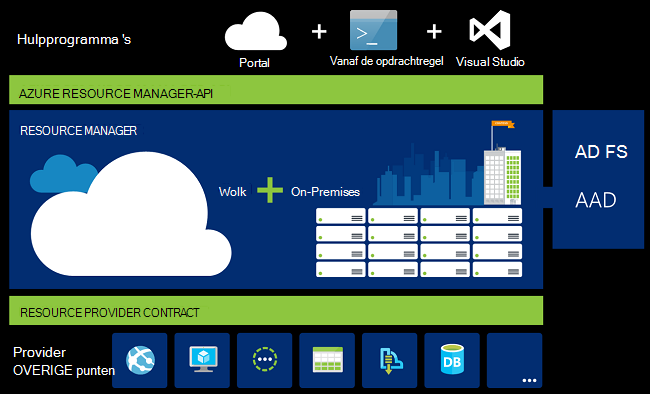
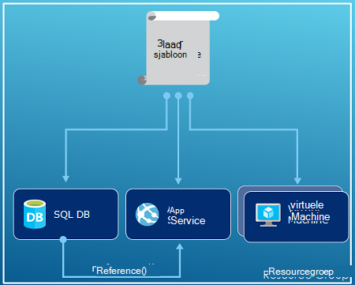
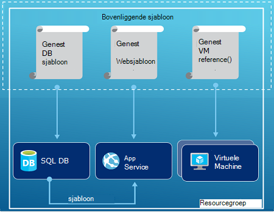
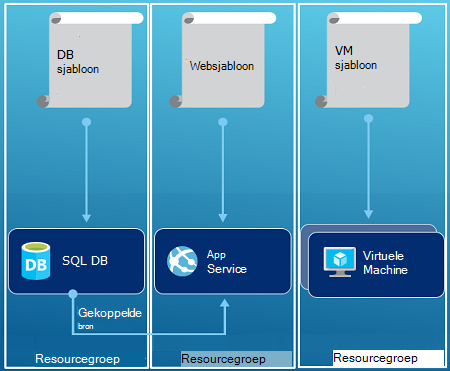

<properties
   pageTitle="Azure Resource Manager-overzicht | Microsoft Azure"
   description="Beschrijving van het Azure Resource Manager gebruiken voor implementatie, beheer en controle van de middelen op Azure."
   services="azure-resource-manager"
   documentationCenter="na"
   authors="tfitzmac"
   manager="timlt"
   editor="tysonn"/>

<tags
   ms.service="azure-resource-manager"
   ms.devlang="na"
   ms.topic="get-started-article"
   ms.tgt_pltfrm="na"
   ms.workload="na"
   ms.date="10/21/2016"
   ms.author="tomfitz"/>

# Azure Resource Manager-overzicht

De infrastructuur voor de toepassing is meestal opgebouwd uit veel onderdelen – misschien een virtuele machine, opslag-account en virtueel netwerk of een web app, database, databaseserver en 3e partij diensten. Deze onderdelen niet wordt weergegeven als afzonderlijke entiteiten, in plaats daarvan ziet u ze als verwante en onderling afhankelijke onderdelen van één enkele entiteit. U wilt implementeren, beheren en volgen ze als een groep. Azure Resource Manager kunt u werken met de resources in uw oplossing als een groep. U kunt implementeren, bijwerken of verwijderen van alle bronnen voor uw oplossing in een enkele, gecoördineerde werking. U een sjabloon gebruiken voor de implementatie en de sjabloon die voor verschillende omgevingen zoals test-, ontwikkel- en productiecomputers kunt werken. Resource Manager biedt beveiliging, controle en functies waarmee u uw bronnen beheren na de implementatie van codering. 

## Terminologie

Als u nieuwe Azure Resource Manager bent, zijn er sommige termen die u niet vertrouwd met zijn misschien.

- **resource** - een beheerbare artikel dat beschikbaar is via Azure. Sommige gemeenschappelijke bronnen een virtuele machine, opslag account web app, database en virtueel netwerk, maar er zijn nog veel meer.
- **resourcegroep** - een container met verwante bronnen voor een oplossing voor Azure. De resourcegroep kan de bronnen voor de oplossing, of alleen de resources die u wilt beheren als een groep bevatten. U besluit hoe u wilt dat resources toewijzen aan resourcegroepen op basis van wat het meest zinvol voor uw organisatie. Zie [brongroepen](#resource-groups).
- **bronnen** - een service die levert de bronnen die u kunt implementeren en beheren door bronbeheer. Elke resource provider biedt activiteiten voor het werken met de resources die zijn geïmplementeerd. Sommige algemene resource-providers zijn Microsoft.Compute, die de bron van de virtuele machine, Microsoft.Storage, die de account opslagbron levert, en Microsoft.Web, die aan web apps gerelateerde bronnen levert. Zie [Resource providers](#resource-providers).
- **Sjabloon voor resource Manager** - A JavaScript Object Notation (JSON)-bestand dat een of meer resources om te implementeren voor een groep definieert. Ook Hiermee definieert u de afhankelijkheden tussen de gebruikte middelen. De sjabloon kan worden gebruikt voor de implementatie van de bronnen consistent en herhaaldelijk. Zie de [implementatie van de sjabloon](#template-deployment).
- **declaratieve syntaxis** - syntaxis kunt u vermelden "Hier is wat ik wilt maken" zonder te hoeven schrijven de volgorde van de programmering voor het maken van deze opdrachten. De sjabloon Resource Manager is een voorbeeld van declaratieve syntaxis. In het bestand definieert u de eigenschappen voor de infrastructuur voor de implementatie van Azure. 

## De voordelen van het gebruik van Resource Manager

Resource Manager biedt verschillende voordelen:

- U kunt implementeren, beheren en controleren van alle bronnen voor uw oplossing als een groep, in plaats van deze bronnen afzonderlijk te verwerken.
- Als u herhaaldelijk implementeren de oplossing gedurende de levenscyclus van de ontwikkeling en vertrouwen die uw resources worden ingezet in een consistente status hebben.
- U kunt uw infrastructuur via declaratieve sjablonen in plaats van scripts beheren.
- U kunt de afhankelijkheden tussen resources, zodat deze kunnen worden gebruikt in de juiste volgorde definiëren.
- U kunt toegangsbeheer toepassen op alle services in de resourcegroep omdat Role-Based Access Control RBAC () is standaard geïntegreerd in het platform voor gegevensbeheer.
- U kunt labels toepassen op de bronnen logisch ordenen van alle resources in uw abonnement.
- U kunt facturen van uw organisatie door de kosten voor een groep resources delen hetzelfde label weer te verduidelijken.  

Resource Manager biedt een nieuwe manier te implementeren en beheren van uw oplossingen. Als u de eerdere implementatiemodel gebruikt en wil meer weten over de wijzigingen, Zie [Wat Resource Manager-implementatie en klassieke implementatie](../resource-manager-deployment-model.md).

## Consistente management-laag

Resource Manager biedt een consistente management-laag voor de taken die u via Azure PowerShell, Azure CLI Azure portal, REST API en ontwikkelingsprogramma's uitvoert. De hulpprogramma's gebruiken een gemeenschappelijke set bewerkingen. U de hulpprogramma's die het meest geschikt voor u en kunnen ze door elkaar gebruiken zonder omwegen. 

De volgende afbeelding ziet u hoe u de hulpprogramma's communiceren met de API voor bronbeheer van dezelfde Azure. De API stuurt verzoeken naar de Resource Manager-service verifieert en machtigt de aanvragen. Resource Manager stuurt vervolgens de aanvragen tot aanbieders van de desbetreffende bron.

## Richtlijnen

De volgende suggesties kunnen u volledig profiteren van Resource Manager bij het werken met uw oplossingen.

1. Definiëren en implementeren van uw infrastructuur via de declaratieve syntaxis in sjablonen Resource Manager in plaats van via dwingende opdrachten.
2. Alle stappen van de implementatie en configuratie in de sjabloon vastleggen. Hebt u geen handmatige stappen voor het instellen van uw oplossing.
3. Dwingende opdrachten voor het beheren van resources, zoals starten of stoppen van een app of computer worden uitgevoerd.
4. Resources rangschikken met de levenscyclus van dezelfde in een resourcegroep. Labels gebruiken voor alle andere ordenen van bronnen.

Zie [Aanbevolen procedures voor het maken van sjablonen voor Azure Resource Manager](../resource-manager-template-best-practices.md)voor meer aanbevelingen.

## Resourcegroepen

Er zijn enkele belangrijke factoren bij de resourcegroep definiëren:

1. Alle bronnen in de groep moeten de levenscyclus van de delen. U implementeert, bijwerken en verwijderen ze samen. Als een resource, zoals een databaseserver moet aanwezig zijn op een andere implementatie cyclus moet zijn in een andere bronnengroep.
2. Elke bron kan alleen bestaan in een resourcegroep.
3. U kunt toevoegen of verwijderen van een resource aan een resourcegroep op elk gewenst moment.
4. U kunt een resource uit een resourcegroep naar een andere groep verplaatsen. Zie de [bronnen naar een nieuwe resourcegroep of abonnement verplaatsen](../resource-group-move-resources.md)voor meer informatie.
4. Een brongroep kan bevatten bronnen die zich in verschillende regio's.
5. Een groep kan worden gebruikt om het bereik van toegangsbeheer voor beheertaken.
6. Een resource kan werken met bronnen in andere resourcegroepen. Deze interactie is normaal wanneer de twee bronnen zijn gerelateerd, maar niet de dezelfde levenscyclus (bijvoorbeeld web apps verbinding maken met een database) delen.

Als u een resourcegroep maakt, moet u een locatie voor de betreffende bronnengroep. U vraagt zich misschien af, "Waarom heeft een resourcegroep nodig een locatie? En, als de resources andere locaties dan de resourcegroep hebt kunnen, waarom maakt de locatie van de resource uit alle?" De resourcegroep worden metagegevens over de resources opgeslagen. Dus wanneer u een locatie voor de resourcegroep opgeven, geeft u aan waar deze metagegevens worden opgeslagen. Om redenen van compatibiliteit moet u ervoor zorgen dat uw gegevens worden opgeslagen in een bepaalde regio.

## Resource-providers

Elke resource provider biedt een reeks bewerkingen voor het werken met een Azure-service en bronnen. Bijvoorbeeld, als u opslaan van sleutels en geheimen wilt, werkt u met de bron **Microsoft.KeyVault** provider. Deze resource-provider biedt een brontype **kluizen** aangeroepen voor het maken van de sleutel kluis en een brontype **kluizen/geheimen** voor het maken van een geheim in de sleutel kluis genoemd. 

Voordat u aan de slag met de implementatie van uw resources, krijgt u een goed begrip van de resource met beschikbare providers. Weet de namen van de providers resource resources helpt u bij het definiëren van resources die u wilt implementeren op Azure.

U ophalen alle resources weer met de volgende PowerShell-cmdlet:

    Get-AzureRmResourceProvider -ListAvailable

Of met Azure CLI, haal u alle resources weer met de volgende opdracht:

    azure provider list

U kunt zoeken in de resulterende lijst met aanbieders van de resource die u nodig hebt.

Toevoegen als u informatie over een resource-provider, de provider-naamruimte aan uw opdracht. De opdracht retourneert de ondersteunde typen voor de resource-provider, en de locaties ondersteunde API-versies voor elk resourcetype. De volgende PowerShell-cmdlet wordt gedetailleerde informatie over Microsoft.Compute:

    (Get-AzureRmResourceProvider -ProviderNamespace Microsoft.Compute).ResourceTypes

Of met Azure CLI, haal de ondersteunde typen, locaties en versies van de API voor Microsoft.Compute, met de volgende opdracht:

    azure provider show Microsoft.Compute --json > c:\Azure\compute.json

Zie [Resource Manager providers, regio's, API-versies en schema's](../resource-manager-supported-services.md)voor meer informatie.

## Voor sjabloonimplementatie

Met bronbeheer kunt u een sjabloon (JSON-indeling) die de infrastructuur en de configuratie van uw Azure oplossing definieert. Met behulp van een sjabloon, kunt u herhaaldelijk implementeren de oplossing gedurende de gehele levenscyclus en vertrouwen die uw resources worden ingezet in een consistente status hebben. Wanneer u een oplossing via de portal maakt, neemt de oplossing automatisch een sjabloon voor de implementatie. U hoeft niet de sjabloon voor het nieuwe maken omdat u kunt met de sjabloon voor uw oplossing beginnen en aan te passen aan uw specifieke behoeften. Door de huidige status van de resourcegroep exporteren of weergeven van de sjabloon die wordt gebruikt voor een bepaalde implementatie kunt u een sjabloon voor een bestaande resourcegroep ophalen. De [geëxporteerde sjabloon](../resource-manager-export-template.md) weergeven is een handige manier voor meer informatie over de sjabloonsyntaxis van de.

Zie voor meer informatie over de opmaak van de sjabloon en de manier waarop u samenstelt, [Azure Resource Manager sjablonen ontwerpen](../resource-group-authoring-templates.md) en [Resource Manager sjabloon scenario](../resource-manager-template-walkthrough.md).

Resource Manager de sjabloon net als elke andere aanvraag verwerkt (Zie de afbeelding voor een [Consistent beheer laag](#consistent-management-layer)). Het analyseert de sjabloon en wordt de syntaxis ervan omgezet in bewerkingen voor de desbetreffende bron providers REST API. Bijvoorbeeld als Resource Manager krijgt een sjabloon met de volgende definitie voor de resource:

    "resources": [
      {
        "apiVersion": "2016-01-01",
        "type": "Microsoft.Storage/storageAccounts",
        "name": "mystorageaccount",
        "location": "westus",
        "sku": {
          "name": "Standard_LRS"
        },
        "kind": "Storage",
        "properties": {
        }
      }
      ]

De definitie wordt geconverteerd naar de volgende bewerking REST API, die wordt verzonden naar de resource Microsoft.Storage provider:

    PUT
    https://management.azure.com/subscriptions/{subscriptionId}/resourceGroups/{resourceGroupName}/providers/Microsoft.Storage/storageAccounts/mystorageaccount?api-version=2016-01-01
    REQUEST BODY
    {
      "location": "westus",
      "properties": {
      }
      "sku": {
        "name": "Standard_LRS"
      },   
      "kind": "Storage"
    }

Hoe u sjablonen en resourcegroepen definiëren is geheel aan u en hoe u uw oplossing te beheren. U kunt bijvoorbeeld de drie-tier toepassing via een enkele sjabloon implementeren op één brongroep.

Maar u hebt niet de hele infrastructuur definiëren in een bepaalde sjabloon. Vaak is het handig uw implementatievereisten in een reeks gerichte, doel-specifieke sjablonen te verdelen. U kunt deze sjablonen voor verschillende oplossingen eenvoudig hergebruiken. Een bepaalde oplossing geïmplementeerd, kunt u een master sjabloon die is gekoppeld van de vereiste sjablonen maken. In de volgende afbeelding ziet u hoe een oplossing met drie niveaus via een bovenliggende sjabloon drie geneste sjablonen bevat implementeren.

Als u de lagen met afzonderlijke Lifecycle-beleid voor ogen hebt, kunt u de drie lagen om aparte bronnengroepen te implementeren. U ziet dat de bronnen kunnen nog steeds worden gekoppeld aan bronnen in andere resourcegroepen.

Zie voor meer suggesties over het ontwerpen van uw sjablonen [patronen voor het ontwerpen van Azure Resource Manager-sjablonen](../best-practices-resource-manager-design-templates.md). Zie voor meer informatie over geneste sjablonen [met gekoppelde sjablonen met Azure Resource Manager](../resource-group-linked-templates.md).

Azure Resource Manager analyseert afhankelijkheden zodat bronnen worden gemaakt in de juiste volgorde. Als een resource is gebaseerd op een waarde uit een andere bron (bijvoorbeeld een virtuele machine die behoefte hebben aan een account voor de opslag van schijven), stelt u een afhankelijkheid. Zie [afhankelijkheden definiëren in Azure Resource Manager-sjablonen](../resource-group-define-dependencies.md)voor meer informatie.

U kunt de sjabloon ook gebruiken voor updates van de infrastructuur. U kunt bijvoorbeeld een resource toevoegen aan uw oplossing en voeg toe configuratieregels voor de resources die al zijn geïmplementeerd. Als sjabloon voor het maken van een bron, maar dat de resource bestaat al, voert de bronnenbeheerder Azure een update in plaats van nieuwe activa maken. Azure Resource Manager werkt het bestaande activum naar een zelfde staat als het als nieuw zijn zou.  

Resource Manager biedt uitbreidingen voor scenario's wanneer u extra bewerkingen moet, zoals het installeren van bepaalde software die niet is opgenomen in de instellingen. Als u al een configuration management-service, zoals DSC, chef-kok of Puppet, kunt u blijven werken met die service met behulp van uitbreidingen. Zie voor meer informatie over uitbreidingen van de virtuele machine [over functies en uitbreidingen van de virtuele machine](../virtual-machines/virtual-machines-windows-extensions-features.md). 

Ten slotte wordt de sjabloon die deel uitmaken van de broncode van uw app. U kunt inchecken tot de bron code repository en bijwerken uw app ontwikkeld. U kunt de sjabloon via Visual Studio kunt bewerken.

Na het definiëren van uw sjabloon, bent u klaar voor de implementatie van de bronnen naar Azure. Zie voor de opdrachten voor de implementatie van de bronnen:

- [Resources met bronbeheer sjablonen en Azure PowerShell implementeren](../resource-group-template-deploy.md)
- [Resources met bronbeheer sjablonen en Azure CLI implementeren](../resource-group-template-deploy-cli.md)
- [Resources met bronbeheer sjablonen en Azure portal implementeren](../resource-group-template-deploy-portal.md)
- [Resources met bronbeheer sjablonen en Resource Manager REST API implementeren](../resource-group-template-deploy-rest.md)

## Tags

Resource Manager bevat een tagging functie waarmee u kunt resources groeperen op uw vereisten voor het beheer of facturering. Codes gebruikt wanneer u een complexe verzameling van bronnengroepen en bronnen en moet deze activa op de manier die voor u het handigst visualiseren. U kunt bijvoorbeeld resources die een vergelijkbare rol hebben in uw organisatie of deel uitmaken van dezelfde afdeling labelen. Zonder codes, kunnen gebruikers in uw organisatie maken van meerdere bronnen, die moeilijk te later identificeren en beheren. U wilt bijvoorbeeld alle resources voor een bepaald project verwijderen. Als deze bronnen niet worden gecodeerd voor het project, hebt u ze handmatig te vinden. Codering is een belangrijke manier om onnodige kosten in uw abonnement te verlagen. 

Bronnen hoeft te bevinden zich in dezelfde bronnengroep voor het delen van een label. Kunt u uw eigen label taxonomie om ervoor te zorgen dat alle gebruikers in uw organisatie gebruiken veelgebruikte codes in plaats van gebruikers per ongeluk iets andere codes (zoals "dept" in plaats van "afdeling") toe te passen.

In het volgende voorbeeld wordt een label wordt toegepast op een virtuele machine.

    "resources": [    
      {
        "type": "Microsoft.Compute/virtualMachines",
        "apiVersion": "2015-06-15",
        "name": "SimpleWindowsVM",
        "location": "[resourceGroup().location]",
        "tags": {
            "costCenter": "Finance"
        },
        ...
      }
    ]

Gebruik de volgende PowerShell-cmdlet voor het ophalen van alle bronnen met een tagwaarde:

    Find-AzureRmResource -TagName costCenter -TagValue Finance

Of de volgende Azure CLI-opdracht:

    azure resource list -t costCenter=Finance --json

U kunt ook gecodeerde bronnen via de portal Azure weergeven.

Bevat het [rapport Resourcegebruik](../billing/billing-understand-your-bill.md) voor uw abonnement labelnamen en waarden, waarmee u kosten door codes ingedeeld. Zie voor meer informatie over tags [labels gebruiken voor het ordenen van uw resources Azure](../resource-group-using-tags.md).

## Toegangsbeheer

Resource Manager kunt u bepalen wie toegang tot specifieke acties voor uw organisatie heeft. Standaard integreert op rollen gebaseerde toegangscontrole (RBAC) in het platform voor gegevensbeheer en geldt die toegangsbeheer voor alle services in de resourcegroep. 

Er zijn twee belangrijke concepten te begrijpen als u werkt met op rollen gebaseerde toegangscontrole:

- Roldefinities - een set machtigingen beschreven en in een groot aantal toewijzingen kan worden gebruikt.
- Roltoewijzingen - Koppel een definitie met een identiteit (gebruiker of groep) voor een bepaald bereik (abonnement, resourcegroep of resource). De toewijzing wordt overgenomen door lagere bereiken.

U kunt gebruikers toevoegen aan de vooraf gedefinieerde platform en resource-specifieke functies. Zo kunt u profiteren van de vooraf gedefinieerde rol genaamd lezer waarmee gebruikers bronnen bekijken, maar niet te wijzigen. Het toevoegen van gebruikers in uw organisatie die dit type toegang tot de rol van lezer en de rol van toepassing op het abonnement, resource of resourcegroep.

Azure biedt de volgende vier platform rollen:

1.  Eigenaar - kunt alles, met inbegrip van de toegang beheren
2.  Medewerker - kunt alles behalve de toegang beheren
3.  Reader - alles kunt bekijken maar geen wijzigingen aanbrengen
4.  Beheerder toegang - kunt gebruikerstoegang tot Azure bronnen beheren

Azure biedt ook verschillende bron-specifieke functies. Sommige meest gangbare zijn:

1.  Virtuele Machine Inzender - virtuele machines kunt beheren, maar niet verlenen toegang tot deze en niet de virtuele netwerk- of account waaraan ze zijn aangesloten beheren
2.  Medewerker netwerk - alle netwerkbronnen beheren, maar geen toegang verlenen tot deze
3.  Opslag Account Inzender - opslag accounts beheren, maar geen toegang verlenen tot deze
4. Inzender voor SQL Server - kunnen SQL-servers en databases, maar niet hun beleid-beveiliging beheren
5. Website-medewerker - kunt websites, maar niet de plannen waarmee ze verbonden beheren

Zie voor de volledige lijst van functies en toegestane acties [RBAC: rollen ingebouwd](../active-directory/role-based-access-built-in-roles.md). Zie voor meer informatie over toegangsbeheer op basis van rollen, [Azure op rollen gebaseerde toegangscontrole](../active-directory/role-based-access-control-configure.md). 

In sommige gevallen wilt u uitvoeren van code of script dat toegang heeft tot bronnen, maar niet wilt dat deze worden uitgevoerd met de referenties van een gebruiker. In plaats daarvan wilt u een identiteit een service principal genoemd voor de toepassing maken en toewijzen van de juiste rol voor de service principal. Resource Manager kunt u de referenties voor de toepassing maken en de toepassing programmatisch te verifiëren. Zie meer informatie over het maken van beveiligings-principals service, een van de volgende onderwerpen:

- [Azure PowerShell gebruiken voor het maken van een service principal voor toegang tot bronnen](../resource-group-authenticate-service-principal.md)
- [Azure CLI gebruiken voor het maken van een service principal voor toegang tot bronnen](../resource-group-authenticate-service-principal-cli.md)
- [Portal gebruiken om Active Directory-toepassing en service principal die toegang bronnen tot te maken](../resource-group-create-service-principal-portal.md)

U kunt ook expliciet vergrendelen kritieke bronnen om te voorkomen dat gebruikers deze wijzigen of verwijderen. Zie [bronnen vergrendelen met Azure Resource Manager](../resource-group-lock-resources.md)voor meer informatie.

## Logboeken voor faxactiviteit

Resource Manager registreert alle bewerkingen die maken, wijzigen of verwijderen van een resource. U kunt de logboeken voor faxactiviteit een fout ontdekt bij het oplossen van problemen of om te controleren hoe een gebruiker in uw organisatie een resource gewijzigd. Overzicht van de logboeken van **Logboeken voor faxactiviteit** in blade van de **Instellingen** voor een resourcegroep te selecteren. U kunt de logboeken filteren op veel verschillende waarden, met inbegrip van welke gebruiker de bewerking heeft gestart. Zie voor meer informatie over het werken met de logboeken voor faxactiviteit [controleverrichtingen met Resource Manager](../resource-group-audit.md).

## Aangepaste machtigingen

Resource Manager kunt u aangepaste beleidsregels maken voor het beheer van bronnen. De soorten beleid dat u maakt kunnen zijn diverse scenario's. Een naamgevingsschema op resources, beperken welke typen en instanties van de middelen kan worden ingezet of beperken welke gebieden een soort resource kunnen hosten, kunt u afdwingen. U kunt een tagwaarde op resources indelen facturering op afdelingen vereisen. U maakt beleid om te helpen de kosten te verlagen en de consistentie in uw abonnement. 

U definieert beleid met JSON en beleid vervolgens toepassen op uw abonnement of binnen een groep. Beleid is anders dan op rollen gebaseerde toegangscontrole omdat ze worden toegepast op de brontypen.

In het volgende voorbeeld ziet u een beleid dat zorgt voor consistentie van de code door te geven dat alle bronnen een tag costCenter bevatten.

    {
      "if": {
        "not" : {
          "field" : "tags",
          "containsKey" : "costCenter"
        }
      },
      "then" : {
        "effect" : "deny"
      }
    }

Er zijn veel meer soorten beleid die u kunt maken. Zie [Beleid voor netwerkbronnen beheren en toegang beheren](../resource-manager-policy.md)voor meer informatie.

## SDK 's

Azure SDK's zijn beschikbaar voor meerdere platforms en talen.
Elke taal implementatie is beschikbaar via het ecosysteem package manager en de GitHub.

De code in elk van deze SDK's is gegenereerd op basis van Azure RESTful API-specificaties.
Deze specificaties zijn open-source en gebaseerd op de Swagger 2.0-specificatie.
De SDK-code wordt gegenereerd via een open source project met de naam AutoRest.
AutoRest zet deze specificaties RESTful API in clientbibliotheken in meerdere talen.
Als u wilt dat alle aspecten van de gegenereerde code in de SDK's verbeteren, zijn de volledige set hulpprogramma's voor het maken van de SDK's openen, vrij toegankelijk is en op basis van een indeling verbreide API-specificatie.

Hier vindt u onze opslagplaatsen voor Open Source SDK. We feedback van problemen, Welkom en pull-aanvragen.

[.NET](https://github.com/Azure/azure-sdk-for-net) | [Java](https://github.com/Azure/azure-sdk-for-java) | [Node.js](https://github.com/Azure/azure-sdk-for-node) | [PHP](https://github.com/Azure/azure-sdk-for-php) | [Python](https://github.com/Azure/azure-sdk-for-python) | [Ruby](https://github.com/Azure/azure-sdk-ruby)

> [AZURE.NOTE]Als de SDK niet de vereiste functionaliteit, kunt u ook bellen naar de [Azure REST API](https://msdn.microsoft.com/library/azure/dn790568.aspx) rechtstreeks.

## Voorbeelden

### .NET

- [Azure resources en resourcegroepen beheren](https://azure.microsoft.com/documentation/samples/resource-manager-dotnet-resources-and-groups/)
- [Implementeren van een SSH VM ingeschakeld met een sjabloon](https://azure.microsoft.com/documentation/samples/resource-manager-dotnet-template-deployment/)

### Java

- [Azure bronnen beheren](https://azure.microsoft.com/documentation/samples/resources-java-manage-resource/)
- [Azure resourcegroepen beheren](https://azure.microsoft.com/documentation/samples/resources-java-manage-resource-group/)
- [Implementeren van een SSH VM ingeschakeld met een sjabloon](https://azure.microsoft.com/documentation/samples/resources-java-deploy-using-arm-template/)

### Node.js

- [Azure resources en resourcegroepen beheren](https://azure.microsoft.com/documentation/samples/resource-manager-node-resources-and-groups/)
- [Implementeren van een SSH VM ingeschakeld met een sjabloon](https://azure.microsoft.com/documentation/samples/resource-manager-node-template-deployment/)

### Python

- [Azure resources en resourcegroepen beheren](https://azure.microsoft.com/documentation/samples/resource-manager-python-resources-and-groups/)
- [Implementeren van een SSH VM ingeschakeld met een sjabloon](https://azure.microsoft.com/documentation/samples/resource-manager-python-template-deployment/)

### Ruby

- [Azure resources en resourcegroepen beheren](https://azure.microsoft.com/documentation/samples/resource-manager-ruby-resources-and-groups/)
- [Implementeren van een SSH VM ingeschakeld met een sjabloon](https://azure.microsoft.com/documentation/samples/resource-manager-ruby-template-deployment/)

Naast deze voorbeelden, kunt u zoeken via de galerie monsters.

[.NET](https://azure.microsoft.com/documentation/samples/?service=azure-resource-manager&platform=dotnet) | [Java](https://azure.microsoft.com/documentation/samples/?service=azure-resource-manager&platform=java) | [Node.js](https://azure.microsoft.com/documentation/samples/?service=azure-resource-manager&platform=nodejs) | [Python](https://azure.microsoft.com/documentation/samples/?service=azure-resource-manager&platform=python) | [Ruby](https://azure.microsoft.com/documentation/samples/?service=azure-resource-manager&platform=ruby)

## Volgende stappen

- Zie [een sjabloon Azure Resource Manager aan de bestaande bronnen exporteren](../resource-manager-export-template.md)voor een eenvoudige Inleiding tot het werken met sjablonen.
- Zie [Resource Manager sjabloon scenario](../resource-manager-template-walkthrough.md)voor een meer uitgebreide procedure voor het maken van een sjabloon.
- Zie [functies van de sjabloon](../resource-group-template-functions.md) inzicht in de functies die u in een sjabloon gebruiken kunt
- Zie voor meer informatie over het gebruik van Visual Studio met Resource Manager [maken en implementeren van Azure resourcegroepen via Visual Studio](../vs-azure-tools-resource-groups-deployment-projects-create-deploy.md).
- Zie [werken met Azure Resource Manager Templates in Visual Studio Code](../resource-manager-vs-code.md)voor meer informatie over het gebruik van Code VS met bronbeheer.

Hier is een video demonstratie van dit overzicht:

[AZURE.VIDEO azure-resource-manager-overview]

[powershellref]: https://msdn.microsoft.com/library/azure/dn757692(v=azure.200).aspx
