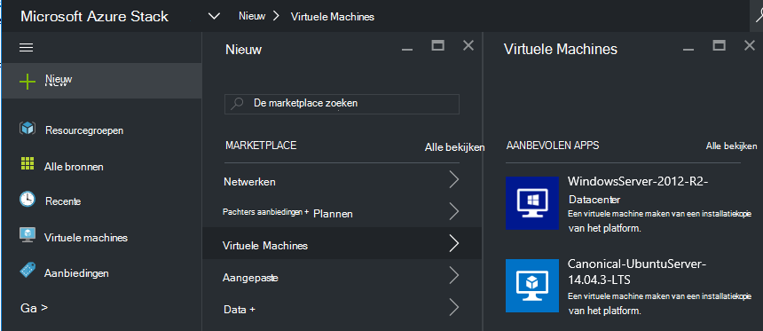
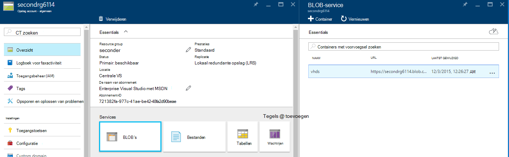
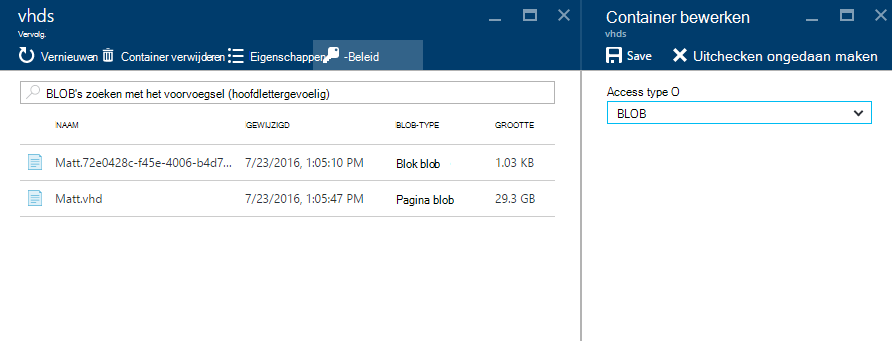
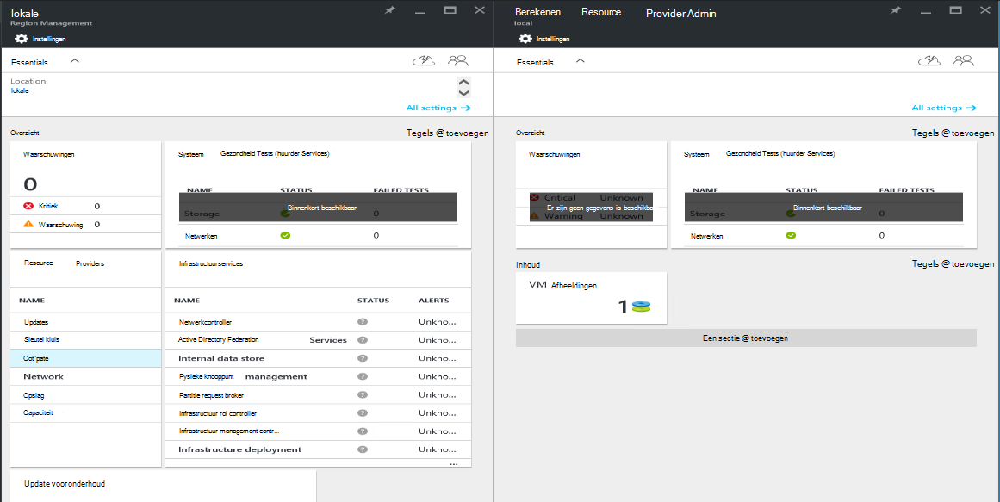
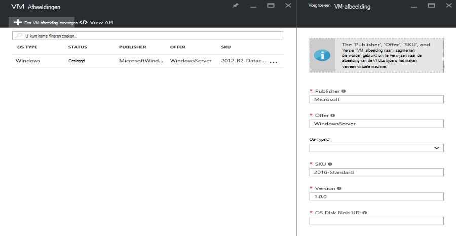

<properties
    pageTitle="VM image toevoegen aan de stapel Azure | Microsoft Azure"
    description="Toevoegen van uw organisatie eigen Windows of Linux VM afbeelding voor huurders gebruiken"
    services="azure-stack"
    documentationCenter=""
    authors="mattmcg"
    manager="darmour"
    editor=""/>

<tags
    ms.service="azure-stack"
    ms.workload="na"
    ms.tgt_pltfrm="na"
    ms.devlang="na"
    ms.topic="get-started-article"
    ms.date="09/26/2016"
    ms.author="mattmcg"/>

# <a name="make-a-custom-virtual-machine-image-available-in-azure-stack"></a>Een afbeelding aangepaste virtuele machine in de stapel Azure beschikbaar maken


Azure Stack kan beheerders VM afbeeldingen, zoals aangepaste VHD van hun organisatie beschikbaar maken voor hun huurders. Afbeeldingen kunnen waarnaar wordt verwezen door bronbeheer Azure sjablonen of toegevoegd aan de gebruikersinterface Azure Marketplace met het maken van een item Marketplace. Een installatiekopie van Windows Server 2012 R2 is standaard opgenomen in de technische Preview van Azure Stack.

> [AZURE.NOTE] VM-afbeeldingen met Marketplace items kunnen worden geïmplementeerd door **Nieuw** in de gebruikersinterface selecteren en vervolgens te klikken op de categorie van **virtuele Machines** . De afbeelding VM items worden weergegeven.


## <a name="add-a-vm-image-to-marketplace-with-powershell"></a>Een VM toevoegen aan Marketplace met PowerShell

Als de afbeelding VM VHD lokaal op de VM-console (of een ander extern aangesloten apparaat) beschikbaar is, gebruikt u de volgende stappen uit:

1. Voorbereiden van een Windows- of Linux-besturingssysteem virtuele harde schijf afbeelding in VHD format (niet VHDX).
    -   Voor Windows-installatiekopieën bevat het [uploaden van een afbeelding met een VM Windows Azure voor bronbeheer implementaties](virtual-machines-windows-upload-image.md) artikel afbeelding voorbereiding instructies in de sectie **de VHD voor uploaden voorbereiden** .
    -   Volg de stappen voor het voorbereiden van de afbeelding of een bestaande afbeelding van Azure Stack Linux gebruiken zoals beschreven in het artikel [implementatie van Linux virtuele machines op Azure Stack](azure-stack-linux.md)voor Linux-afbeeldingen.

2. De [Azure Stack extra opslagplaats](https://aka.ms/azurestackaddvmimage)klonen en importeer de module **ComputeAdmin**

    ```powershell
    Import-Module .\ComputeAdmin\AzureStack.ComputeAdmin.psm1
    ```

3. De VM-afbeelding toevoegen door het aanroepen van de cmdlet Add-VMImage.
    -  De uitgever, aanbieding, SKU en versie van de VM-afbeelding opgenomen. Deze parameters worden gebruikt door bronbeheer Azure sjablonen die verwijzen naar de VM-afbeelding.
    -  Waardereeksen opgeven als Windows of Linux.
    -  De ID van de huurder Azure Active Directory opnemen in het formulier * &lt;myaadtenant&gt;*. onmicrosoft.com.
    - Hier volgt een voorbeeld van de aanroep van het script:

    ```powershell
       Add-VMImage -publisher "Canonical" -offer "UbuntuServer" -sku "14.04.3-LTS" -version "1.0.0" -osType Linux -osDiskLocalPath 'C:\Users\AzureStackAdmin\Desktop\UbuntuServer.vhd' -tenantID <myaadtenant>.onmicrosoft.com
    ```

    > [AZURE.NOTE] De cmdlet vraagt om referenties voor de VM-afbeelding toe te voegen. Referenties van de beheerder Azure Active Directory, zoals serviceadmin@ * &lt;myaadtenant&gt;*. onmicrosoft.com op de vraag.  

De opdracht doet het volgende:
- Wordt geverifieerd bij de Stack Azure-omgeving
- De lokale VHD uploadt naar een nieuwe tijdelijke opslag
- De VM-afbeelding toegevoegd aan de bibliotheek VM afbeelding
- Hiermee maakt u een item Marketplace

Als u wilt controleren of de opdracht is uitgevoerd, gaat u naar de markt in de portal en controleer of de afbeelding VM is beschikbaar in de categorie van **virtuele Machines** .

> 

Hier volgt een beschrijving van de opdrachtparameters.


| Parameter | Beschrijving |
|----------| ------------ |
|**tenantID** | De ID van de huurder Azure Active Directory in het formulier * &lt;AADTenantID*. onmicrosoft.com&gt;. |
|**Publisher** | Het segment van de naam van uitgever van de VM afbeelding pachters gebruiken bij de implementatie van de afbeelding. Een voorbeeld is 'Microsoft'. Neem geen spaties of andere speciale tekens in dit veld.|
|**aanbieding** | Het voorstel naam segment van de VM-afbeelding die huurders gebruiken bij de implementatie van de VM-afbeelding. Een voorbeeld is 'WindowsServer'. Neem geen spaties of andere speciale tekens in dit veld. |
| **SKU** | De SKU naam segment van de VM-afbeelding die huurders gebruiken bij de implementatie van de VM-afbeelding. Een voorbeeld is 'Datacenter2016'. Neem geen spaties of andere speciale tekens in dit veld. |
|**Versie** | De versie van de VM-afbeelding die huurders gebruiken bij de implementatie van de VM-afbeelding. Deze versie is in de notatie * \#.\#. \#*. Een voorbeeld is '1.0.0'. Neem geen spaties of andere speciale tekens in dit veld.|
| **waardereeksen** | De waardereeksen van de afbeelding moet 'Windows' of 'Linux'. |
|**osDiskLocalPath** | Het lokale pad naar de schijf OS VHD die u als een afbeelding met een VM Azure Stack uploaden wilt. |
|**dataDiskLocalPaths**| Een optionele matrix van de lokale paden voor gegevensschijven die kunnen worden geüpload als onderdeel van de VM-afbeelding.|
|**CreateGalleryItem**| Een Boole-vlag die bepaalt of een item wilt maken in de Marketplace. De standaardwaarde is ingesteld op true.|
|**titel**| De weergavenaam van het item Marketplace. De standaardwaarde is de Publisher-aanbieding-Sku van de VM-afbeelding instellen.|
|**Beschrijving**| De omschrijving van het artikel Marketplace. |
|**osDiskBlobURI**| Optioneel, accepteert dit script ook een Blob-opslag URI voor osDisk.|
|**dataDiskBlobURIs**| Dit script accepteert een matrix van Blob-opslag URI's eventueel ook voor gegevensschijven toe te voegen aan de afbeelding.|


## <a name="add-a-vm-image-through-the-portal"></a>Een VM via de portal toevoegen

> [AZURE.NOTE] Deze methode moet maken van het Marktonderzoek afzonderlijk.

Een vereiste van afbeeldingen is dat kan worden verwezen door de URI van een Blob-opslag. Voorbereiden van een Windows- of Linux-besturingssysteem virtuele harde schijf afbeelding in VHD format (niet VHDX) en de afbeelding vervolgens uploaden naar een opslag in Azure of Azure Stack. Als uw afbeelding is al geüpload naar een Blob-opslag in Azure of Azure stapel, kunt u deze stap overslaan.

Voer de stappen uit artikel tot en met het **uploaden van de afbeelding VM op uw account opslag** [uploaden van een afbeelding met een VM Windows Azure voor Resource Manager-implementaties](https://azure.microsoft.com/documentation/articles/virtual-machines-windows-upload-image/) . Houd rekening met het volgende:

-   Volg de instructies voor het voorbereiden van de afbeelding voor een Linux-image of een bestaande afbeelding van Azure Stack Linux gebruiken zoals beschreven in het artikel [implementatie van Linux virtuele machines op Azure Stack](azure-stack-linux.md).

- Het is efficiënter een afbeelding uploaden naar Azure Stack Blob storage dan naar Azure Blob-opslag omdat minder tijd kost om de VM-afbeelding met de opslagplaats Azure Stack afbeelding. Tijdens het uploaden van de instructies te volgen, moet de [PowerShell verifiëren met Microsoft Azure Stack](azure-stack-deploy-template-powershell.md) stap voor de stap 'Aanmelden bij de Azure' vervangen.

- Maak een notitie van de Blob-opslag URI waar u de afbeelding wilt uploaden. Heeft de volgende notatie: * &lt;storageAccount&gt;/&lt;blobContainer&gt;/&lt;targetVHDName&gt;*VHD

2.  De blob anoniem om toegankelijk te maken, gaat u naar de opslag account blob-container waarin de afbeelding VM VHD is geüpload naar **Blob,** en selecteer vervolgens **-Beleid**. Als u wilt, kunt u in plaats daarvan genereren een gedeelde access-handtekening voor de container en dit opnemen als onderdeel van de blob-URI.





1.  Aanmelden bij Azure Stack als beheerder. Ga naar het **Management van de regio**. Selecteer onder **RPs**, **Resource-Provider berekenen** > **VM afbeeldingen** > **toevoegen.**

    

2.  Voer de uitgever, aanbieding, SKU en versie van de VM-afbeelding op het volgende blad. Deze segmenten naam verwijzen naar de afbeelding VM in Azure Resource Manager-sjablonen. Zorg ervoor dat de **waardereeksen** correct te selecteren. Voer voor **osDiskBlobURI**, de URI waar de afbeelding is geüpload in stap 1. Klik op **maken** om te beginnen met het maken van de VM-afbeelding.

    

3.  De status van de VM afbeelding gewijzigd in 'Geslaagd' wanneer de afbeelding wordt toegevoegd.

4.  Huurders kunnen de VM-installatiekopie implementeren door te geven van de uitgever, aanbieding, SKU en versie van de VM-afbeelding in een sjabloon Azure Resource Manager. Als u de afbeelding VM vaker beschikbaar is voor het verbruik van de huurder in de gebruikersinterface, is het raadzaam [een Marketplace](azure-stack-create-and-publish-marketplace-item.md)te maken.
