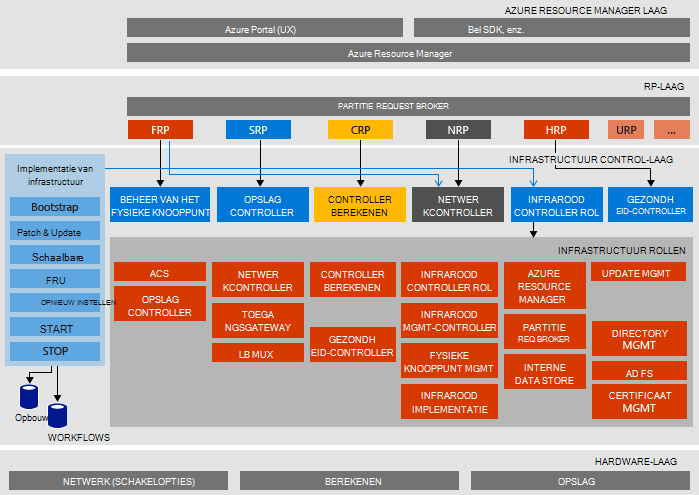

<properties
    pageTitle="Architectuur Microsoft Azure Stack bewijs van Concept (Implementatiemodel) | Microsoft Azure"
    description="De architectuur van Microsoft Azure Stack Implementatiemodel weergeven."
    services="azure-stack"
    documentationCenter=""
    authors="heathl17"
    manager="byronr"
    editor=""/>

<tags
    ms.service="azure-stack"
    ms.workload="na"
    ms.tgt_pltfrm="na"
    ms.devlang="na"
    ms.topic="article"
    ms.date="10/25/2016"
    ms.author="helaw"/>

# Architectuur Microsoft Azure Stack Haalbaarheidstest

De Stack Azure Implementatiemodel is een implementatie met één knooppunt van Azure Stack technische Preview 2. Alle onderdelen worden geïnstalleerd in de virtuele machines die worden uitgevoerd op een computer met één host. 

## Diagram van de logische architectuur
In het volgende diagram ziet u de logische architectuur van de Stack Azure Implementatiemodel en de bijbehorende onderdelen.

## Virtuele machine rollen
De Stack Azure Implementatiemodel biedt services met behulp van de volgende VMs op de host Implementatiemodel:

 - **MAS ACS01** Virtuele machine Azure Stack storage-services te hosten.

 - **MAS ADFS01** Virtuele machine die als host fungeert voor Active Directory Federation Services.  Deze virtuele machine wordt niet gebruikt in technische Preview 2.  

 - **MAS ASQL01**  Virtuele machine met een interne opslaggebied voor Azure Stack infrastructuur rollen.  

 - **MAS BGPNAT01** Virtuele Machine die fungeert als router rand en NAT en VPN-mogelijkheden biedt voor Azure Stack.

 - **MAS CA01** Virtuele machine verzorgt certificate authority voor Azure Stack rolservices.

 - **MAS CON01** Virtuele machine voor ontwikkelaars voor het installeren van PowerShell, Visual Studio en andere hulpprogramma's beschikbaar.

 - **MAS DC01** Virtuele machine die als host fungeert voor Active Directory, DNS- en DHCP-services voor Microsoft Azure Stack.

 - **MAS GWY01** Virtuele machine edge gatewayservices, zoals VPN-verbindingen op de website voor huurder netwerken bieden.

 - **MAS NC01**  Virtuele machine host netwerkcontroller die Azure-Stack, netwerkservices beheert.  

 - **MAS SLB01**  Virtuele machine biedt load balancing services in de Azure voor zowel huurders en Azure Stack infrastructuurservices.  

 - **MAS SUS01**  De virtuele machine Windows Server Update Services die als host fungeert en die verantwoordelijk is voor het leveren van updates voor andere Azure stapel virtuele machines.

 - **MAS WAS01**  Virtuele machine portal en de bronnenbeheerder Azure services hosten.

 - **MAS XRP01** Virtuele machine die fungeert als host voor de core resource providers van Microsoft Azure stapel, met inbegrip van de Compute-, netwerk- en resource-providers.

## Storage-services
In het besturingssysteem op de fysieke host Storage-services omvatten:

 - **Blob ACS-Service** Azure Blob met consistente opslag service, waarmee en de tabel blob storage-services.

 - **SoFS** Scale-out File Server.

 - **Verwijzing naar de desbetreffende CSV** Robuuste bestand gedeelde systeem Volume.

 - **Virtuele schijf**, **Opslagruimte**en **Opslag spaties directe** zijn de respectieve onderliggende technologie voor gegevensopslag in Windows Server voor het inschakelen van de Microsoft Azure Stack core opslag resource provider.

## Volgende stappen

[Azure Stack implementeren](azure-stack-deploy.md)

[Eerste scenario's om te proberen](azure-stack-first-scenarios.md)

