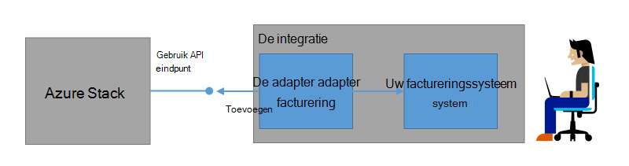
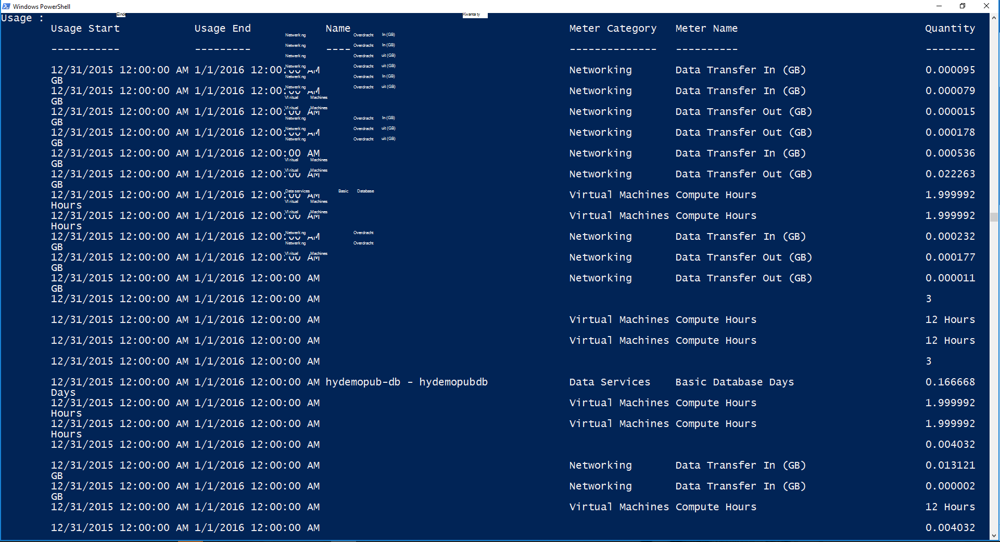

<properties
    pageTitle="Klant facturering en terugboeking In Azure stapel | Microsoft Azure"
    description="Informatie over het ophalen van informatie over het gebruik van de resource van Azure Stack."
    services="azure-stack"
    documentationCenter=""
    authors="AlfredoPizzirani"
    manager="byronr"
    editor=""/>

<tags
    ms.service="azure-stack"
    ms.workload="na"
    ms.tgt_pltfrm="na"
    ms.devlang="na"
    ms.topic="article"
    ms.date="10/18/2016"
    ms.author="alfredop"/>

# Klant facturering en terugboeking in Azure stapel

Nu u Azure Stack gebruikt, is het een goed idee om na te denken over het gebruik bij te houden. Serviceproviders vertrouwen op informatie over het gebruik om hun facturen en inzicht krijgen in de kosten van de diensten.
Ondernemingen, bijhouden meestal gebruik per afdeling.

Azure Stack is niet een factureringssysteem. Het schrijven niets van uw huurders voor de bronnen die ze gebruiken. Maar Azure-Stack beschikt over de infrastructuur voor het verzamelen en de statistische gegevens over het gebruik voor elke provider één resource. U kunt toegang krijgen tot deze gegevens en exporteren naar een factureringssysteem met behulp van een adapter voor facturering of exporteren naar een business intelligence-hulpprogramma zoals Microsoft Power BI.

## Welke informatie kan ik vinden, en hoe?

Azure Stack resource providers genereren gebruik tussenpoos van één uur. De administratie is het bedrag van elke resource die is verbruikt en welke abonnement verbruikt de resource. Deze gegevens worden opgeslagen. Toegang tot de gegevens via de API van de REST.

Een servicebeheerder kunt ophalen gebruiksgegevens voor alle abonnementen van de huurder. Individuele huurders kunnen alleen hun eigen gegevens worden opgehaald.

Gebruik records bevatten informatie over opslag, netwerk en het gebruik berekenen. Zie [dit artikel](azure-stack-usage-related-faq.md)voor een lijst met meters.

## Gebruikersinformatie ophalen

Als u wilt worden gegenereerd, is het van essentieel belang dat u hebt uitgevoerd en het systeem actief gebruikt. Als u niet zeker weet of u hebt geen bronnen uitgevoerd, in Azure Stack Marketplace implementeren en voer vervolgens een virtuele machine (VM). Bekijk de VM blade controleren om te controleren of deze wordt uitgevoerd.

Wij raden aan de Windows PowerShell-cmdlets om gegevens weer te geven.
PowerShell roept de Resource gebruik van API's.

1.  [Installeren en configureren van Azure PowerShell](https://azure.microsoft.com/en-us/documentation/articles/powershell-install-configure/).

2.  Gebruiken om aan te melden op Azure Resource Manager, de PowerShell-cmdlet **Aanmelding AzureRmAccount**.

3.  Selecteer het abonnement dat u gebruikt voor het maken van bronnen, typt u 'uw sub' Get-AzureRmSubscription-SubscriptionName **| Selecteer AzureRmSubscription**.

4.  Gebruik de PowerShell-cmdlet [**Get-UsageAggregates**](https://msdn.microsoft.com/en-us/library/mt619285.aspx)voor het ophalen van de gegevens.
    Als u gebruiksgegevens beschikbaar is, wordt het teruggestuurd in PowerShell, zoals in het volgende voorbeeld. PowerShell retourneert 1000 regels gebruik per aanroep.
    U kunt het argument *voortzetting* sets van regels na de eerste 1000 ophalen. Zie voor meer informatie over het gebruik van de [Resource gebruik API reference](azure-stack-provider-resource-api.md).

    

## Volgende stappen

[Resourcegebruik provider API](azure-stack-provider-resource-api.md)

[Pachters Resourcegebruik API](azure-stack-tenant-resource-usage-api.md)

[Veelgestelde vragen over het gebruik van gerelateerde](azure-stack-usage-related-faq.md)
