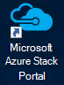
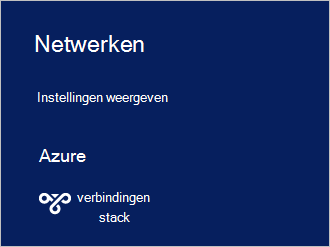

<properties
    pageTitle="Verbinding maken met Azure Stack | Microsoft Azure"
    description="Informatie over het aansluiten van Azure Stack"
    services="azure-stack"
    documentationCenter=""
    authors="ErikjeMS"
    manager="byronr"
    editor=""/>

<tags
    ms.service="azure-stack"
    ms.workload="na"
    ms.tgt_pltfrm="na"
    ms.devlang="na"
    ms.topic="get-started-article"
    ms.date="10/18/2016"
    ms.author="erikje"/>

# <a name="connect-to-azure-stack"></a>Verbinding maken met Azure Stack
Om bronnen te beheren, moet u verbinding maken met de computer Azure Stack Implementatiemodel. U kunt een van de volgende opties:

 - Extern bureaublad: één gelijktijdige gebruiker snel verbinding maken vanaf de computer Haalbaarheidstest kunt.
 - Virtueel particulier netwerk (VPN): kunnen meerdere gebruikers gelijktijdig verbinding maken vanaf clients buiten de stapel Azure-infrastructuur (configuratie vereist).

## <a name="connect-with-remote-desktop"></a>Verbinding met extern bureaublad
Één gelijktijdige gebruiker kunt met verbinding met extern bureaublad werken met de portal om bronnen te beheren. U kunt ook extra op de MAS CON01 virtuele machine.

1.  Log in op de fysieke machine Azure Stack Implementatiemodel.

2.  Een verbinding met extern bureaublad openen en verbinding maken met MAS CON01. Typ **AzureStack\AzureStackAdmin** als de gebruikersnaam en het beheerwachtwoord dat u hebt opgegeven tijdens de installatie van Azure Stack.  

3.  Dubbelklik op het bureaublad MAS CON01 op **Microsoft Azure Stack Portal** pictogram (https://portal.azurestack.local/) om de [portal](azure-stack-key-features.md#portal).

    

4.  Meld u aan met de referenties van de Azure Active Directory tijdens de installatie hebt opgegeven.

## <a name="connect-with-vpn"></a>Verbinding maken met VPN
Virtuele particuliere netwerkverbindingen kunnen meerdere gebruikers tegelijk verbinding maken van buiten de infrastructuur Azure Stack-clients. U kunt de portal zullen beheren. Ook kunt u hulpprogramma's zoals Visual Studio en PowerShell, op de lokale client.

1.  Installeer de module AzureRM met de volgende opdracht:
   
    ```PowerShell
    Install-Module -Name AzureRm -RequiredVersion 1.2.6 -Scope CurrentUser
    ```   
   
2. Azure Stack extra scripts downloaden.  Deze ondersteuning kunnen bestanden worden gedownload door te bladeren naar de [opslagplaats van GitHub](https://github.com/Azure/AzureStack-Tools)of de volgende Windows PowerShell-script uitvoeren als beheerder:
    
    >[AZURE.NOTE]  De volgende stappen moet PowerShell 5.0.  Controleer uw versie, $PSVersionTable.PSVersion uitvoeren en het vergelijken van de 'Grote' versie.  

    ```PowerShell
       
       #Download the tools archive
       invoke-webrequest https://github.com/Azure/AzureStack-Tools/archive/master.zip -OutFile master.zip

       #Expand the downloaded files. 
       expand-archive master.zip -DestinationPath . -Force

       #Change to the tools directory
       cd AzureStack-Tools-master
    ````

3.  Ga naar de map **verbinding maken** en importeren van de module AzureStack.Connect.psm1 in dezelfde PowerShell-sessie:

    ```PowerShell
    cd Connect
    import-module .\AzureStack.Connect.psm1
    ```

4.  De Azure Stack VPN-verbinding wilt maken, voert u de volgende Windows PowerShell. Voordat u, vult u de admin-wachtwoord en Azure Stack host adresvelden. 
    
    ```PowerShell
    #Change the IP Address below to match your Azure Stack host
    $hostIP = "<HostIP>"

    # Change password below to reference the password provided for administrator during Azure Stack installation
    $Password = ConvertTo-SecureString "<Admin Password>" -AsPlainText -Force

    # Add Azure Stack One Node host & CA to the trusted hosts on your client computer
    Set-Item wsman:\localhost\Client\TrustedHosts -Value $hostIP -Concatenate
    Set-Item wsman:\localhost\Client\TrustedHosts -Value mas-ca01.azurestack.local -Concatenate  

    # Update Azure Stack host address to be the IP Address of the Azure Stack POC Host
    $natIp = Get-AzureStackNatServerAddress -HostComputer $hostIP -Password $Password

    # Create VPN connection entry for the current user
    Add-AzureStackVpnConnection -ServerAddress $natIp -Password $Password

    # Connect to the Azure Stack instance. This command (or the GUI steps in step 5) can be used to reconnect
    Connect-AzureStackVpn -Password $Password 
    ```

5. Wanneer dat wordt gevraagd, vertrouwt de host Stack Azure.

6. Wanneer dat wordt gevraagd, installeert u een certificaat (het bericht wordt weergegeven achter het venster Powershell-sessie).

7. De portal om verbinding te testen, in een Internet-browser, Ga naar *https://portal.azurestack.local*.

8. Bekijken en beheren van de verbinding Azure Stack, **netwerken** gebruiken op de client:

    

>[AZURE.NOTE] Deze VPN-verbinding biedt geen connectiviteit aan VMs en andere bronnen. Zie voor informatie over de verbinding met bronnen, [Één knooppunt VPN-verbinding](azure-stack-create-vpn-connection-one-node-tp2.md)


## <a name="next-steps"></a>Volgende stappen
[Eerste taken](azure-stack-first-scenarios.md)

[Installeren en aansluiten van PowerShell](azure-stack-connect-powershell.md)

[Installeren en aansluiten van CLI](azure-stack-connect-cli.md)


