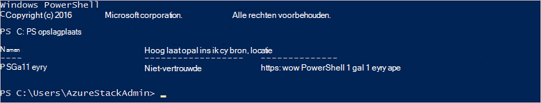

<properties
    pageTitle="Verbinding maken met Azure Stack met PowerShell | Microsoft Azure"
    description="Informatie over het beheren van Azure Stack met PowerShell"
    services="azure-stack"
    documentationCenter=""
    authors="HeathL17"
    manager="byronr"
    editor=""/>

<tags
    ms.service="azure-stack"
    ms.workload="na"
    ms.tgt_pltfrm="na"
    ms.devlang="na"
    ms.topic="article"
    ms.date="10/19/2016"
    ms.author="helaw"/>

# PowerShell installeren en aansluiten op de stapel Azure
In deze handleiding doorlopen we de stappen voor het verbinden met Azure Stack met PowerShell. Zodra voltooid, kunt deze stappen u resources implementeren en beheren.

## Azure Stack PowerShell cmdlets installeert

1.  AzureRM-cmdlets worden geïnstalleerd in de galerie met PowerShell. Open een PowerShell Console op MAS CON01 en de volgende opdracht een lijst opgevraagd van de opslagplaatsen van PowerShell beschikbaar om te beginnen:

        Get-PSRepository

      

2.  Voer de volgende opdracht om de module AzureRM installeren:

        Install-Module -Name AzureRM -RequiredVersion 1.2.6 -Scope CurrentUser

    >[AZURE.NOTE] *-Scope CurrentUser* is optioneel. Als u meer dan de huidige gebruiker toegang hebben tot de modules wilt, gebruikt u een opdrachtprompt en laat uit de parameter *Scope* .

3.  Bevestig de installatie van modules AzureRM door de volgende opdrachten worden uitgevoerd:

        Get-Command -Module AzureRM.AzureStackAdmin

## Verbinding maken met Azure Stack
Een module is beschikbaar voor download, dat zorgt voor de verbinding PowerShell met Azure Stack voor u configureren.  Ga naar [Azure Stack-hulpprogramma's](http://aka.ms/ConnectToAzureStackPS) voor de module en extra stappen. 

## Een lijst met abonnementen ophalen
In deze sectie controleert u PowerShell cmdlets worden uitgevoerd tegen Azure Stack ophalen en selecteert u een abonnement voor het gebruik.

Voer de volgende opdracht op te halen van een lijst van Azure Stack abonnementen aan uw account gekoppeld:

    Get-AzureRmSubscription

## Volgende stappen
[Sjablonen met PowerShell implementeren](azure-stack-deploy-template-powershell.md)

[Verbinding maken met Azure CLI](azure-stack-connect-cli.md)

[Sjablonen met Visual Studio implementeren](azure-stack-deploy-template-visual-studio.md)

