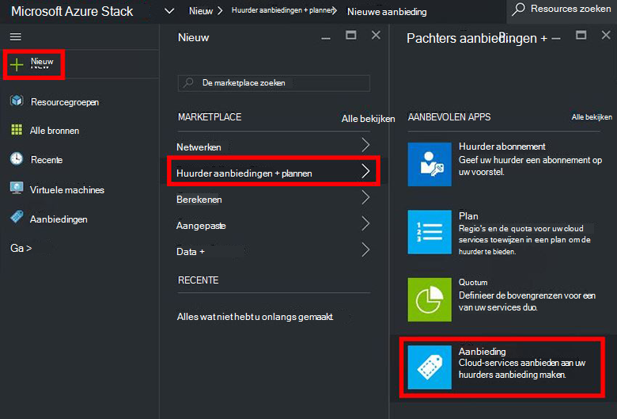
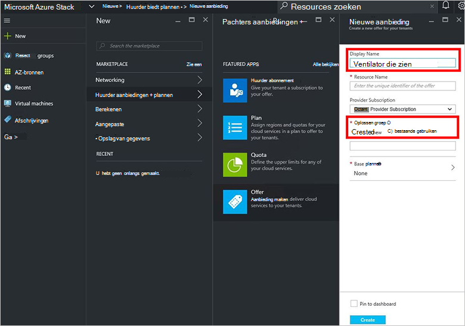
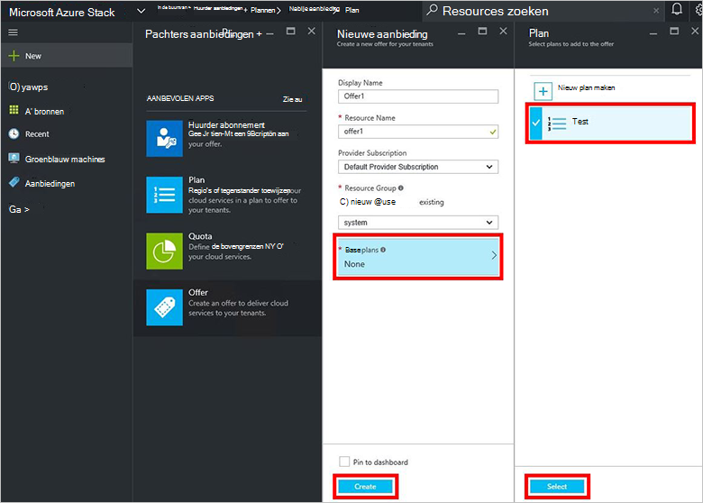
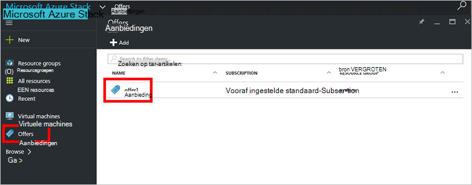
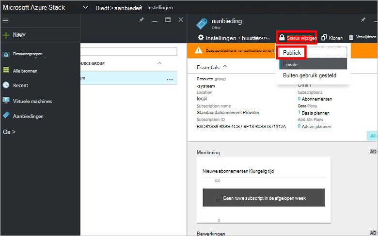

<properties
    pageTitle="Een voorstel maken in de stapel Azure | Microsoft Azure"
    description="Informatie over het maken van een voorstel voor de huurders in Azure stapel als servicebeheerder."
    services="azure-stack"
    documentationCenter=""
    authors="ErikjeMS"
    manager="byronr"
    editor=""/>

<tags
    ms.service="azure-stack"
    ms.workload="na"
    ms.tgt_pltfrm="na"
    ms.devlang="na"
    ms.topic="get-started-article"
    ms.date="09/26/2016"
    ms.author="erikje"/>

# Maak een voorstel in Azure Stack

[Voorstellen](azure-stack-key-features.md#services-plans-offers-and-subscriptions) zijn groepen van een of meer plannen dat providers aan huurders aan te schaffen of te abonneren. Dit document wordt beschreven hoe u een voorstel met het [plan dat u hebt gemaakt](azure-stack-create-plan.md) in de laatste stap te maken. Dit voorstel biedt abonnees de mogelijkheid tot het creëren van virtuele machines.

1.  [Log in](azure-stack-connect-azure-stack.md#log-in-as-a-service-administrator) op de portal als servicebeheerder en klik vervolgens op **Nieuw** > **huurder biedt + plannen** > **bieden**.
    

2.  **Weergegeven naam** en de **Naam van de Resource**invullen in het blad **Nieuwe bieden** en selecteert u vervolgens een nieuwe of bestaande **Groep**. De weergavenaam is de beschrijvende naam van het voorstel. Alleen de beheerder ziet de naam van de Resource. Dit is de naam die Administrators gebruiken om te werken met het voorstel als een bronnenbeheerder Azure-bron.

    

3.  Klik op **Base plannen** , selecteer in het blad **van plan bent** de plannen die u wilt opnemen in de aanbieding en klik vervolgens op **selecteren**. Klik op **maken** om het voorstel te maken.

    
    
4. **Biedt** en klik op de aanbieding die u zojuist hebt gemaakt.

    

5.  Klik op **Status wijzigen**en klik vervolgens op **openbaar**.
  
    

Aanbiedingen moeten openbaar worden gemaakt voor de huurder om de volledige weergave als u zich abonneert. Aanbiedingen zijn:

- **Openbare**: zichtbaar voor huurders.

- **Privé**: alleen zichtbaar voor de servicebeheerders. Handig bij het opstellen van het plan of een aanbod, of als de beheerder van de wil om goed te keuren elk abonnement.

- **Buiten bedrijf**: gesloten voor nieuwe abonnees. De servicebeheerder kunt gebruiken om te voorkomen dat toekomstige abonnementen, maar bestaande abonnees ongewijzigd laat buiten gebruik gestelde.

Wijzigingen in het voorstel worden niet onmiddellijk zichtbaar voor de huurder. Overzicht van de wijzigingen die u wellicht logout/login voor een overzicht van het nieuwe abonnement in de kiezer"abonnement" bij het maken van resources/resourcegroepen.

## Volgende stappen

[Abonneer u op een aanbieding en richt een VM](azure-stack-subscribe-plan-provision-vm.md)
