<properties
    pageTitle="Maak een plan in Azure stapel | Microsoft Azure"
    description="Als servicebeheerder, een plan waarmee abonnees bepaling virtuele machines te maken."
    services="azure-stack"
    documentationCenter=""
    authors="ErikjeMS"
    manager="byronr"
    editor=""/>

<tags
    ms.service="azure-stack"
    ms.workload="na"
    ms.tgt_pltfrm="na"
    ms.devlang="na"
    ms.topic="get-started-article"
    ms.date="09/26/2016"
    ms.author="erikje"/>

# Maak een plan in Azure stapel

[Plannen](azure-stack-key-features.md#services-plans-offers-and-subscriptions) zijn groeperingen van een of meer services. Als een provider, kunt u plannen om uw huurders te bieden. Op zijn beurt abonneren de huurders op uw aanbiedingen plannen en diensten die ze bevatten te gebruiken. In dit voorbeeld wordt beschreven hoe u een plan waarin de compute, netwerk en opslag resource providers maken. Dit plan biedt abonnees de mogelijkheid tot het creëren van virtuele machines.

1.  In een webbrowser en Ga naar https://portal.azurestack.local.

2.  [Log in](azure-stack-connect-azure-stack.md#log-in-as-a-service-administrator) op de Portal Azure Stack als servicebeheerder uw beheerdersreferenties service (de account die u hebt gemaakt bij stap 5 van de sectie [het PowerShell script uitvoeren](azure-stack-run-powershell-script.md) ) invoeren en klik vervolgens op **aanmelden**.

    Servicebeheerders kunnen voorstellen en plannen maken en beheren van gebruikers.

3.  Klik op **Nieuw**om een plan en een voorstel dat huurders kunnen zich abonneren op > **biedt huurder + plannen** > **Plan**.

    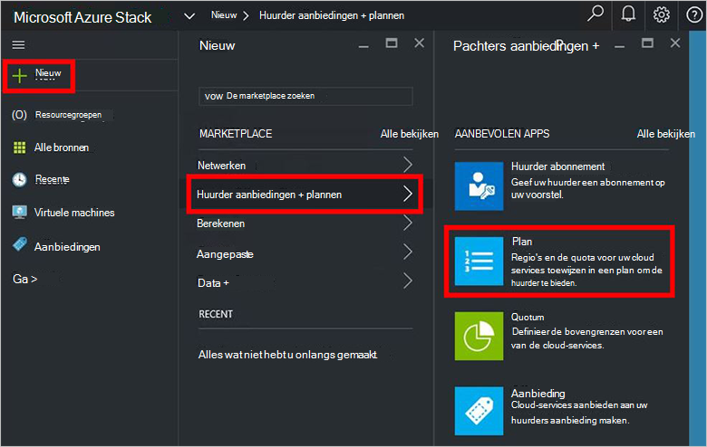

4.  Vul in de **Weergegeven naam** en de **Naam**van de bladeserver **Nieuwe plannen** . De weergavenaam is de beschrijvende naam van het plan dat huurders zien. Alleen de beheerder ziet de naam van de Resource. Het is de naam die beheerders gebruiken voor het werken met het plan als een bronnenbeheerder Azure-bron.

    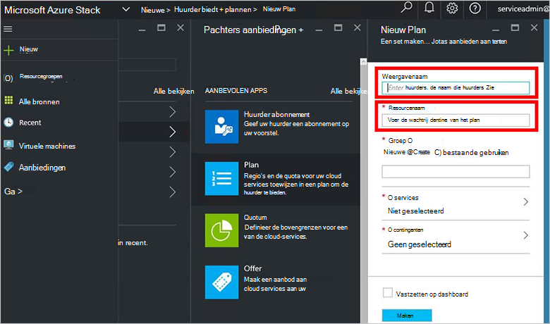

5.  Een nieuwe **Resourcegroep**maken of Selecteer een bestaande, als een container voor het plan (b.v. "OffersAndPlans")

    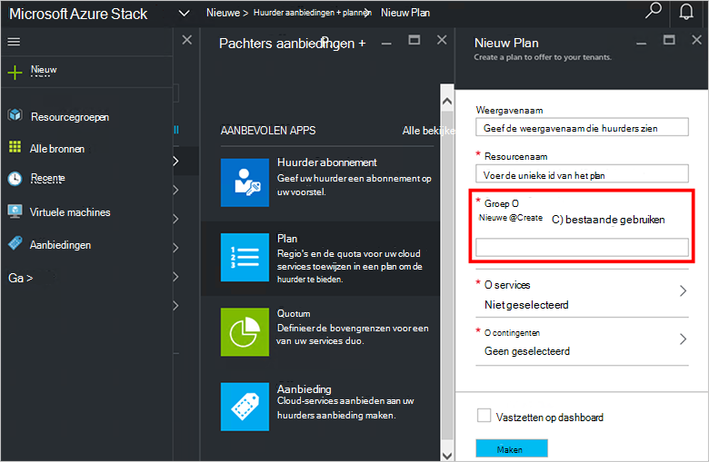

6.  Klik op **Services**, **Microsoft.Compute**, **Microsoft.Network**en **Microsoft.Storage**selecteren en klik vervolgens op **selecteren**.

    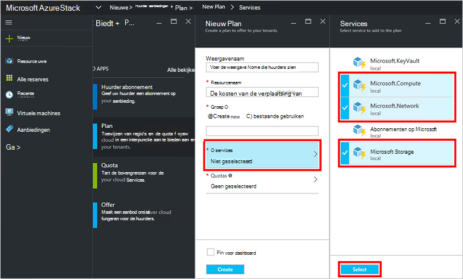

7.  Klik op **quota's**, **Microsoft.Storage (lokaal)**, klikt u op en vervolgens selecteert u het standaardquotum of klik op **nieuwe quota maken** voor het aanpassen van de quota.

    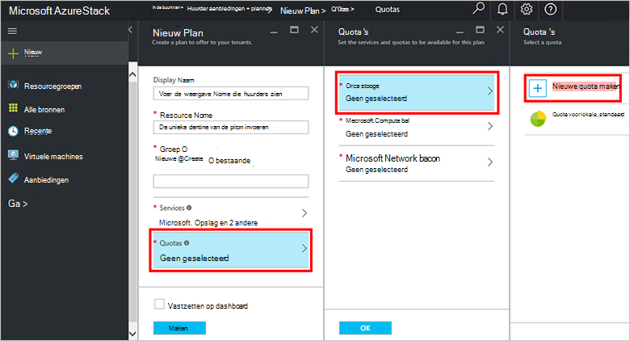

8.  Typ een naam voor de quota, **Quota-instellingen**, de quotawaarden instellen en klik op **OK**en klik vervolgens op **maken**.

    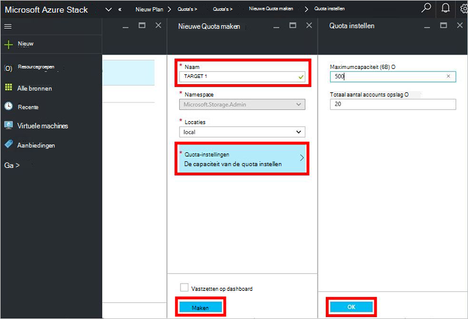

9. **Microsoft.Network (lokaal)**, klikt u op en vervolgens selecteert u het standaardquotum of klik op **nieuwe quota maken** voor het aanpassen van de quota.

    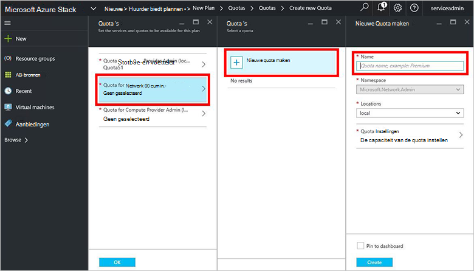

10. Typ een naam voor de quota, **Quota-instellingen**, de quotawaarden instellen en klik op **OK**en klik vervolgens op **maken**.

    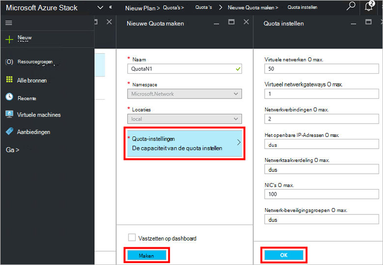

11. **Microsoft.Compute (lokaal)**, klikt u op en vervolgens selecteert u het standaardquotum of klik op **nieuwe quota maken** voor het aanpassen van de quota.

    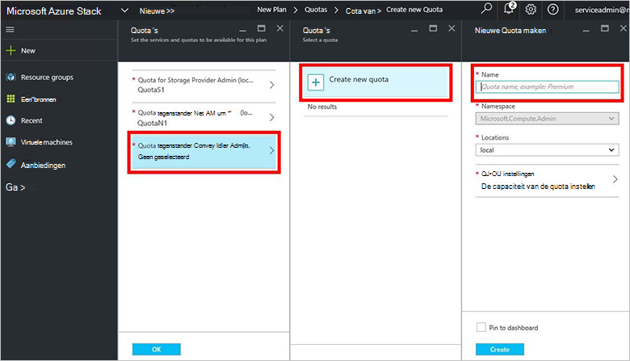

12.  Typ een naam voor de quota, **Quota-instellingen**, de quotawaarden instellen en klik op **OK**en klik vervolgens op **maken**.

    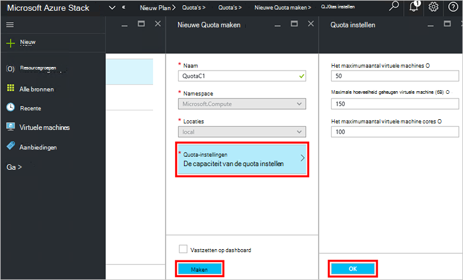

13. Klik op **OK**in het blad **quota** en klikt u in het blad **Nieuw Plan** **maken** om het plan te maken.

    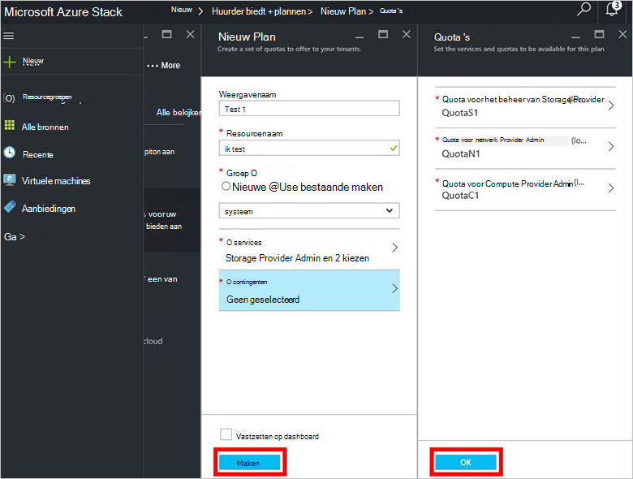

14. Overzicht van de nieuwe planning **alle bronnen**, en vervolgens zoeken naar het plan en klik op de naam.

    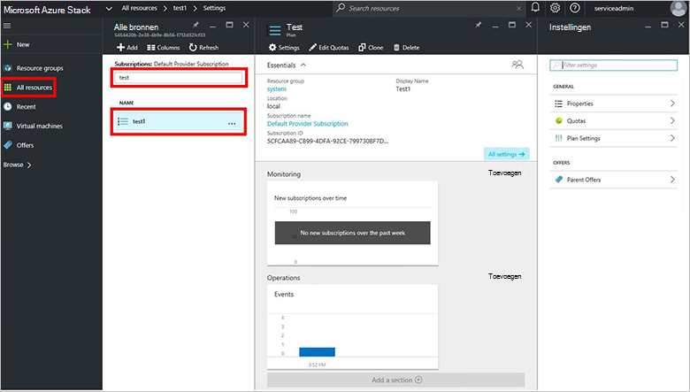

## Volgende stappen

[Een aanbieding maken](azure-stack-create-offer.md)
