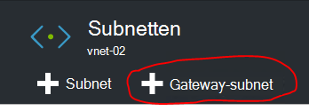

<properties
    pageTitle="Maken van een Site naar Site VPN-verbinding tussen twee virtuele netwerken in verschillende omgevingen met Azure Stack implementatiemodel | Microsoft Azure"
    description="Stapsgewijze procedure waarmee een beheerder van een wolk voor het maken van een Site naar Site VPN-verbinding tussen twee omgevingen met één knooppunt Implementatiemodel in TP2."
    services="azure-stack"
    documentationCenter=""
    authors="ScottNapolitan"
    manager="darmour"
    editor=""/>

<tags
    ms.service="azure-stack"
    ms.workload="na"
    ms.tgt_pltfrm="na"
    ms.devlang="na"
    ms.topic="get-started-article"
    ms.date="09/26/2016"
    ms.author="scottnap"/>

# Maken van een Site naar Site VPN-verbinding tussen twee virtuele netwerken in verschillende omgevingen met Azure Stack haalbaarheidstest

## Overzicht

Dit artikel begeleidt u door de stappen voor het maken van een Site naar Site VPN-verbinding tussen twee virtuele netwerken in twee aparte stapel Azure bewijs-van-haalbaarheidstest omgevingen. Het doel van dit is om te helpen mensen die zijn evaluatie van Site naar Site gateways begrijpen het instellen van VPN-verbindingen tussen virtuele netwerken in twee verschillende Azure Stack implementaties.  Bij het doen, krijgt u inzicht hoe VPN-Gateways in Azure stapel werken.

>[AZURE.NOTE] Dit document is van toepassing op de Azure Stack TP2 Implementatiemodel.

### Diagram van de verbinding

Hieronder ziet u een diagram dat laat wat onze configuratie ziet er zien nu als we klaar bent.

### Voordat u begint

Om deze configuratie hebt voltooid, moet u de volgende items, dus zorg ervoor dat u deze dingen hebt voordat u begint.

-   Twee Servers die voldoen aan de hardwarevereisten voor Azure Stack Implementatiemodel gedefinieerd door de [Vereisten voor de implementatie van de Azure Stack](azure-stack-deploy.md)en vereisten gedefinieerd door het document.

-   De Stack Azure technische Preview 2 implementatiepakket.

## De omgevingen Haalbaarheidstest implementeren

Implementeert u twee Azure Stack Implementatiemodel omgevingen om deze configuratie te voltooien.

-   Voor elke Haalbaarheidstest die u implementeert, kunt u de instructies beschreven in het artikel in [Azure Stack Haalbaarheidstest implementeren](azure-stack-run-powershell-script.md)te volgen.
    We verwijzen naar elke omgeving Implementatiemodel in dit document generieke als POC1 en POC2.

## Quota's configureren voor Compute, netwerk en opslag

U moet quota voor Compute-, netwerk- en zodanig configureren dat deze services gekoppeld aan een Plan worden kunnen en vervolgens een aanbieding die huurders zich kan abonneren.

>[AZURE.NOTE] U moet deze stappen voor elke omgeving Azure Stack Implementatiemodel doen.

De ervaring voor het maken van quota's voor Services is gewijzigd van TP1. De stappen voor het maken van quota's in TP2 kunnen u vinden op <http://aka.ms/mas-create-quotas>. U kunt voor alle quota-instellingen voor deze oefening de standaardwaarden accepteren.

## Maak een Plan en een voorstel

[Plannen](azure-stack-key-features.md) zijn groeperingen van een of meer services. Als een provider, kunt u plannen om uw huurders te bieden. Op zijn beurt abonneren de huurders op uw aanbiedingen plannen en diensten die ze bevatten te gebruiken.

>[AZURE.NOTE] U moet deze stappen uitvoeren voor elke omgeving Azure Stack Implementatiemodel.

1.  Maak eerst een Plan. Hiervoor kunt u de stappen in het [maken van een Plan](azure-stack-create-plan.md) online artikel.

2.  Maak een voorstel dat de procedure die wordt beschreven in [een aanbieding in Azure stapel maken](azure-stack-create-offer.md).

3.  Meld u aan als huurder beheerder van de Portal en [Abonneer u op de aanbieding die u hebt gemaakt] (azure-stack-abonneren-plan-bepaling-vm.md.

## Maken van de netwerkbronnen in Implementatiemodel 1

We gaan nu daadwerkelijk maken van de middelen die we van onze configuratie wilt instellen. De volgende stappen laten zien wat we zullen doen. Deze instructies het maken van bronnen via het Portal worden weergegeven, maar hetzelfde kan worden bereikt via PowerShell.

### Meld u aan als een huurder

Een beheerder kunt aanmelden als een huurder voor het testen van de plannen, aanbiedingen en abonnementen die van hun huurders gebruikmaken mogelijk. Als u nog geen, [een huurder account maken hebt](azure-stack-add-new-user-aad.md) voordat u zich aanmeldt.

### Het virtuele netwerk & VM subnet maken

1.  Aanmelden met een account van de huurder.

2.  Klik op het pictogram **Nieuw** in het portal voor Azure.

     
3.  Selecteer de optie **netwerk** in het menu Marketplace.

4.  Klik op het item van het **virtuele netwerk** in het menu.

5.  Klik op de knop **maken** in de buurt van de onderkant van het blad resource beschrijving. Voer de volgende waarden in de juiste velden op basis van deze tabel.

  	| **Veld**             | **Waarde** |
  	|----------------------- | ------ |
  	| Naam                  |vnet-01 |
  	| Adresruimte         | 10.0.10.0/23 |
  	| Subnetnaam           | subnet-01 |
  	| Subnet-adresbereik  | 10.0.10.0/24 |

6.  Hier ziet u het abonnement dat u eerder ingevuld in het veld **abonnement** hebt gemaakt.

7.  Voor de resourcegroep, kunt u een nieuwe resourcegroep maken of als u nog hebt, selecteer gebruik bestaande.

8.  Controleer of de standaardlocatie.

9.  Klik op de knop **maken** .

### De Gateway-Subnet maken

1.  Open de virtuele netwerkbron die u zojuist hebt gemaakt (Vnet-01) het Dashboard.

2.  Selecteer op het blad instellingen subnetten

3.  Klik op **Gateway Subnet** om een Gateway Subnet toevoegen aan het virtuele netwerk.

     
4.  De naam van het Subnet is standaard ingesteld op **GatewaySubnet** .
    Gateway subnetten zijn speciale en deze specifieke naam goed moeten hebben.

5.  Voer in het veld **adresbereik** **10.0.11.0/24**.

6.  Klik op de knop **maken** voor het maken van het subnet van de Gateway.

### De Gateway virtueel netwerk maken

1.  Klik op het pictogram **Nieuw** in het portal voor Azure.

    

2.  Selecteer de optie **netwerk** in het menu Marketplace.

3.  **Virtueel netwerkgateway** selecteren uit de lijst met netwerkbronnen.

4.  Bekijk de beschrijving en klik op **maken**.

5.  Typ **GW1**in het veld **naam** .

6.  Klik op het item **virtueel netwerk** als u een virtueel netwerk.
    **Vnet-01** in de lijst selecteren.

7.  Klik op het menu-item van het **openbare IP-adres** . Klik op op de nieuwe knop maken wanneer het blad kiezen openbare IP-adres wordt geopend.

8.  Voer in het veld **naam** **GW1 PiP** en klik op **Ok.**

9.  Het **type Gateway** hebt **VPN** standaard geselecteerd. Deze instelling behouden.

10. Het **VPN-type** moet hebben **op basis van Route** standaard geselecteerd.
    Deze instelling behouden.

11. Controleer of het **abonnement** en de **locatie** juist zijn. Indien gewenst kunt u de resource aan het Dashboard vastmaken. Klik op **maken**.

### De Gateway voor het lokale netwerk maken

De bron van het lokale netwerkgateway is een beetje vreemd in ons scenario.
U in Azure vindt, dezelfde resource is echter in Azure heeft meestal willen vertegenwoordigen een fysieke, lokale apparaat zou u verbinding maken met het van virtuele netwerkgateway in Azure. In ons voorbeeld worden beide uiteinden van de verbinding daadwerkelijk virtueel netwerkgateways!

Een manier om na te denken over deze meer algemene zin is de bron van het lokale netwerkgateway is altijd bedoeld om aan te geven van de externe gateway aan het andere uiteinde van de verbinding. Door de manier waarop die het Implementatiemodel is ontworpen, moeten we daadwerkelijk voor het adres van de externe netwerkadapter op de VM NAT van de andere Implementatiemodel als het openbare IP-adres van de Gateway van het lokale netwerk. Vervolgens maken we NAT-toewijzingen op de VM NAT om ervoor te zorgen dat beide kanten goed zijn aangesloten.

### Het IP-adres van de externe Adapter van de NAT-VM

1.  Log in op de fysieke machine Azure Stack voor POC2.

2.  [Windows-toets] + R **uitvoeren** in het menu te openen en typ **mstsc** en druk op enter.

3.  Voer in het veld **Computer** de naam **MAS BGPNAT01** en klik op de knop **verbinden** .

4.  Klik in het Menu Start en klik met de rechtermuisknop op PowerShell en selecteer **Als Administrator uitvoeren**.

5.  Type **IPConfig/all**.

6.  Zoek de Ethernet-Adapter die is verbonden met het lokale netwerk en Let op het IPv4-adres dat is gekoppeld aan die adapter. **10.16.167.195** is in Mijn omgeving, maar jij iets anders zijn.

7.  Dit adres opnemen. Dit is wat we gebruikt als het openbare IP-adres van de lokale netwerkgateway resource we in de POC1 maken.

### Het lokale netwerk Gateway bron maken

1.  Log in op de fysieke machine Azure Stack voor POC1.

2.  In het veld **Computer** de naam **MAS CON01** en klik op de knop **verbinden** .

3.  Klik op het pictogram **Nieuw** in het portal voor Azure.

    

4.  Selecteer de optie **netwerk** in het menu Marketplace.

5.  Selecteer **LAN gateway** in de lijst met resources.

6.  Voer in het veld **naam** **POC2 GW**.

7.  We het IP-adres van onze andere Gateway nog niet kent, maar dat is ok omdat we kunnen terugkomen en later wijzigen. Voer **10.16.167.195** in het **veld IP-adres**op dit moment.

8.  Voer in het veld **Adres** de adresruimte van de Vnet die we in de POC2 gaat maken. Dit is het verstandig om **10.0.20.0/23** dus die waarde invoeren.

9.  Controleer of uw **abonnement**, **Resourcegroep** en **locatie** alle juist zijn en klik op **maken**.

### Maak de verbinding

1.  Klik op het pictogram **Nieuw** in het portal voor Azure.

     

2.  Selecteer de optie **netwerk** in het menu Marketplace.

3.  Selecteer **verbinding** uit de lijst met resources.

4.  Kies in de **elementaire** instellingen blade, **Site naar site (IPSec)** als het **type verbinding**.

5.  Het **abonnement**, **Resourcegroep** en **locatie** en klik op **Ok**.

6.  Kies in de blade **Instellingen voor** het **Virtuele netwerkgateway** (**GW1**) u eerder hebt gemaakt.

7.  Kies het **lokale** **Netwerkgateway** (**POC2 GW**) u eerder hebt gemaakt.

8.  Voer in het veld **Naam van de verbinding** **POC1 POC2**.

9.  Voer in het veld **Gedeelde sleutel (PSK)** **12345**. Klik op **Ok**.

### Een VM maken

Valideren van gegevens via de VPN-verbinding, moet u VMs verzenden en ontvangen van gegevens in elke Implementatiemodel. We gaan nu een VM maken in POC1 en in onze VM subnet van onze virtuele netwerk plaatsen.

1. Klik op het pictogram  **Nieuw** in het portal voor Azure.

     

2.  **Virtuele Machines** selecteren in het menu van de markt.

3.  In de lijst met afbeeldingen van de virtuele machine en selecteer de installatiekopie van **Windows Server 2012 R2 Datacenter** .

4.  Voer de waarde **VM01**in het veld **naam** op de bladeserver **Grondbeginselen** .

5.  Voer een geldige gebruikersnaam en wachtwoord. U gebruikt deze account aan te melden de VM nadat deze is gemaakt.

6.  Een **abonnement**, **Resourcegroep** en **locatie** en klik vervolgens op **Ok**.

7.  Kies een VM-grootte voor dit exemplaar op het blad **grootte** en klik vervolgens op **selecteren**.

8.  Op het blad instellingen kunt u de standaardwaarden accepteren, maar zorg ervoor dat het virtuele netwerk geselecteerd **VNET-01** en het subnetmasker is ingesteld op **10.0.10.0/24**. Klik op **Ok**.

9.  De instellingen op het blad **Overzicht** en klik op **Ok**.

## Maken van de netwerkbronnen in Implementatiemodel 2

### Meld u aan als een huurder

Een beheerder kunt aanmelden als een huurder voor het testen van de plannen, aanbiedingen en abonnementen die van hun huurders gebruikmaken mogelijk. Als u nog geen, [een huurder account maken hebt](azure-stack-add-new-user-aad.md) voordat u zich aanmeldt.

### Het virtuele netwerk & VM subnet maken

1. Aanmelden met een account van de huurder.

2. Klik op het pictogram  **Nieuw** in het portal voor Azure.

     

3.  Selecteer de optie **netwerk** in het menu Marketplace.

4.  Klik op het item van het **virtuele netwerk** in het menu.

5.  Klik op de knop **maken** in de buurt van de onderkant van het blad resource beschrijving. Voer de volgende waarden voor de gewenste velden in de tabel hieronder weergegeven.

  	|**Veld**              |**Waarde** |
  	| ----------------------|----------|
  	| Naam                  | vnet-02 |
  	| Adresruimte         | 10.0.20.0/23 |
  	| Subnetnaam           | subnet-02 |
  	| Subnet-adresbereik  | 10.0.20.0/24 |

6.  Hier ziet u het abonnement dat u eerder ingevuld in het veld **abonnement** hebt gemaakt.

7.  Voor de resourcegroep, kunt u een nieuwe resourcegroep maken of als u nog hebt, selecteer gebruik bestaande.

8.  Controleer of de standaard **locatie**. Als u wilt, kunt u het virtuele netwerk aan het Dashboard voor eenvoudige toegang kunt vastmaken.

9.  Klik op de knop **maken** .

### De Gateway-Subnet maken

1.  Open de virtuele netwerkbron die u hebt gemaakt (**Vnet-02**) uit het Dashboard.

2.  Selecteer op het blad **Instellingen** **subnetten.**

3.  Klik op **Gateway Subnet** om een Gateway Subnet toevoegen aan het virtuele netwerk.

     

4.  De naam van het Subnet is standaard ingesteld op **GatewaySubnet** .
    Gateway subnetten zijn speciale en deze specifieke naam goed moeten hebben.

5.  Voer in het veld **adresbereik** **10.0.20.0/24**.

6.  Klik op de knop **maken** om het Gateway-subnet maken.

### De Gateway virtueel netwerk maken

1. Klik op het pictogram  **Nieuw** in het portal voor Azure.

     

2.  Selecteer de optie **netwerk** in het menu Marketplace.

3.  **Virtueel netwerkgateway** selecteren uit de lijst met netwerkbronnen.

4.  Bekijk de beschrijving en klik op **maken**.

5.  Typ **GW2**in het veld **naam** .

6.  Klik op het item **virtueel netwerk** als u een virtueel netwerk.
    **Vnet-02** selecteert in de lijst.

7.  Klik op het menu-item van het **openbare IP-adres** . Klik op op de nieuwe knop maken wanneer het blad kiezen openbare IP-adres wordt geopend.

8.  Voer in het veld **naam** **GW2 PiP** en klik op **Ok.**

9.  Het **type Gateway** hebt **VPN** standaard geselecteerd. Deze instelling behouden.

10. Het **VPN-type** moet hebben **op basis van Route** standaard geselecteerd.
    Deze instelling behouden.

11. Controleer of het **abonnement** en de **locatie** juist zijn. Indien gewenst kunt u de resource aan het Dashboard vastmaken. Klik op **maken**.

### De Gateway voor het lokale netwerk maken

#### Het IP-adres van de externe Adapter van de NAT-VM

1.  Log in op de fysieke machine Azure Stack voor POC1.

2.  Druk op en wacht [Windows-toets] + R **uitvoeren** in het menu te openen en typ **mstsc** en druk op invoeren.

3.  Voer in het veld **Computer** de naam **MAS BGPNAT01** en klik op de knop **verbinden** .

4.  Klik in het Menu Start en klik met de rechtermuisknop op PowerShell en selecteer **Als Administrator uitvoeren**.

5.  Type **IPConfig/all**.

6.  Zoek de Ethernet-Adapter die is verbonden met het lokale netwerk en Let op het IPv4-adres dat is gekoppeld aan die adapter. In Mijn omgeving is **10.16.169.131** maar jou wel iets anders.

7.  Dit adres opnemen. Dit is wat we later gebruiken als het openbare IP-adres van de lokale netwerkgateway resource we in de POC1 maken.

#### Het lokale netwerk Gateway bron maken

1.  Log in op de fysieke machine Azure Stack voor POC2.

2.  Voer in het veld **Computer** de naam **MAS CON01** en klik op de knop **verbinden** .

3. Klik op het pictogram **Nieuw** in het portal voor Azure.

     

4.  Selecteer de optie **netwerk** in het menu Marketplace.

5.  Selecteer **LAN gateway** in de lijst met resources.

6.  Voer in het veld **naam** **POC1 GW**.

7.  Nu moeten we het openbare IP-adres dat is geregistreerd voor het virtuele netwerkgateway in POC1. **10.16.169.131** invoeren in het **veld IP-adres**.

8.  Voer in het veld **Adres** de adresruimte van **Vnet-01** van POC1 - **10.0.0.0/16**.

9.  Controleer of uw **abonnement**, **Resourcegroep** en **locatie** alle juist zijn en klik op **maken**.

## Maak de verbinding

1. Klik op het pictogram  **Nieuw** in het portal voor Azure.

     

2.  Selecteer de optie **netwerk** in het menu Marketplace.

3.  Selecteer **verbinding** uit de lijst met resources.

4.  Kies in de **elementaire** instellingen blade, **Site naar site (IPSec)** als het **type verbinding**.

5.  Het **abonnement**, **Resourcegroep** en **locatie** en klik op **Ok**.

6.  Kies in de blade **Instellingen voor** het **Virtuele netwerkgateway** (**GW1**) u eerder hebt gemaakt.

7.  Kies het **lokale** **Netwerkgateway** (**POC1 GW**) u eerder hebt gemaakt.

8.  Voer in het veld **Naam van de verbinding** **POC2 POC1**.

9.  Voer in het veld **Gedeelde sleutel (PSK)** **12345**. Als u een andere waarde kiest, moet u onthouden dat moet overeenkomen met de waarde voor de gedeelde sleutel die u hebt toegewezen in de POC1. Klik op **Ok**.

## Een VM maken

Nu een VM maken in POC1 en op onze VM subnet in ons virtuele netwerk plaatsen.

1.  Klik op het pictogram **Nieuw** in het portal voor Azure.

     

2.  **Virtuele Machines** selecteren in het menu van de markt.

3.  In de lijst met afbeeldingen van de virtuele machine en selecteer de installatiekopie van **Windows Server 2012 R2 Datacenter** .

4.  Voer de waarde **VM02**in het veld **naam** op de bladeserver **Grondbeginselen** .

5.  Voer een geldige gebruikersnaam en wachtwoord. U gebruikt deze account aan te melden de VM nadat deze is gemaakt.

6.  Een **abonnement**, **Resourcegroep** en **locatie** en klik vervolgens op **Ok**.

7.  Kies een VM-grootte voor dit exemplaar op het blad **grootte** en klik vervolgens op **selecteren**.

8.  Op het blad instellingen kunt u de standaardwaarden accepteren, maar zorg ervoor dat het virtuele netwerk geselecteerd **VNET-02 is** en het subnetmasker is ingesteld op **20.0.0.0/24**. Klik op **Ok**.

9.  De instellingen op het blad **Overzicht** en klik op **Ok**.

## De VM NAT in elke Implementatiemodel voor traversal gateway configureren

Omdat het Implementatiemodel is ontworpen voor zelfstandig en gescheiden van het netwerk waarop de fysieke host wordt geïmplementeerd en de 'Externe' VIP-netwerk die zijn met de gateways verbonden is niet werkelijk extern, maar in plaats daarvan is verborgen achter een router NAT (Network Address Translation) doen. De router is echt een Windows Server VM (**MAS BGPNAT01**) met de Routing and Remote Access Services (RRAS) rol in de infrastructuur Implementatiemodel. We moeten voor het configureren van NAT op de VM MAS BGPNAT01 zodat de VPN-verbinding van Site naar Site verbinding aan beide uiteinden.

>[AZURE.NOTE] Deze configuratie is vereist voor alleen Implementatiemodel omgevingen.

### NAT configureren

U moet als volgt te werk in een omgeving met zowel Implementatiemodel.

1.  Log in op de fysieke machine Azure Stack voor POC1.

2.  Druk op en wacht [Windows-toets] + R **uitvoeren** in het menu te openen en typ **mstsc** en druk op invoeren.

3.  Voer in het veld **Computer** de naam **MAS BGPNAT01** en klik op de knop **verbinden** .

4.  Klik in het Menu Start en klik met de rechtermuisknop op PowerShell en selecteer **Als Administrator uitvoeren**.

5.  Type **IPConfig/all**.

6.  Zoek de Ethernet-Adapter die is verbonden met het lokale netwerk en Let op het IPv4-adres dat is gekoppeld aan die adapter. **10.16.169.131** (omcirkeld in het rood hieronder) is in Mijn omgeving, maar jij is iets anders.

     

7.  Voer de volgende opdracht PowerShell om het externe adres van de NAT voor de poorten aangeven dat de IKE-verificatie. Vergeet niet te wijzigen in het IP-adres dat overeenkomt met uw omgeving.

        Add-NetNatExternalAddress -NatName BGPNAT -IPAddress 10.16.169.131 PortStart 499 -PortEnd 501

8. Vervolgens maken we een statische toewijzing NAT het externe adres worden toegewezen aan het openbare IP-adres Gateway toe te wijzen de ISAKMP-poort 500 voor fase 1 van de IPSec-tunnel.

        Add-NetNatStaticMapping -NatName BGPNAT -Protocol UDP -ExternalIPAddress 10.16.169.131 -InternalIPAddress 192.168.102.1 -ExternalPort 500 -InternalPort 500

9.  Ten slotte moeten we doen NAT-passage die met succes de volledige IPEC-tunnel tot stand brengen via NAT-apparaten met behulp van poort 4500.

         Add-NetNatStaticMapping -NatName BGPNAT -Protocol UDP -ExternalIPAddress 10.16.169.131 -InternalIPAddress 192.168.102.1 -ExternalPort 4500 -InternalPort 4500

10.  Herhaal de stappen 1-9 in de POC2.

## Test de verbinding.

Nu dat de verbinding van Site naar Site is vastgesteld dat moeten we controleren dat krijgen we doorstromende verkeer. Deze taak is eenvoudig maar hierbij aanmelden op één van de VMs in een omgeving Haalbaarheidstest gemaakt en ping de VM in de andere omgeving is gemaakt. We willen om ervoor te zorgen dat we het verkeer via de verbinding van Site naar Site wilt opslaan, om ervoor te zorgen dat we het directe IP (DIP)-adres van de VM op het externe subnet, niet de VIP pingen. Hiervoor moeten we weten wat het adres aan het andere uiteinde van de verbinding is.

### Log in bij de huurder VM in POC1

1.  Meld u aan bij de fysieke machine Azure Stack voor POC1 en Log in op de Portal met behulp van een rekening van de huurder.

3.  Klik op het pictogram van de **virtuele Machines** in de linkernavigatiebalk.

4.  **VM01** die eerder in de lijst van VMs zoeken en klikt u op.

5. Klik op het blad voor de virtuele machine **verbinden**.

     

6.  Open een opdrachtprompt uit binnen de VM en het type **IPConfig/all**.

7.  Het **IPv4-adres** vinden in de uitvoer en noteer deze. Dit is het adres u van POC2 pingt. In deze omgeving, het adres is **10.0.10.4**, maar in uw omgeving kan het anders zijn. Het moet echter vallen binnen het subnet **10.0.10.0/24** , die eerder is gemaakt.

### Log in bij de huurder VM in POC2

1.  Log in op de fysieke machine Azure Stack voor POC2 en het logboek in de portal via een rekening van de huurder.

3.  Klik op het pictogram van de **virtuele Machines** in de linkernavigatiebalk.

4.  **VM02** die eerder in de lijst van VMs zoeken en klikt u op.

5.  Klik op het blad voor de virtuele machine **verbinden**.

     

6.  Open een opdrachtprompt uit binnen de VM en het type **IPConfig/all**.

7.  Hier ziet u een IPv4-adres dat binnen de 10.0.20.0/24 valt. Het adres is 10.0.20.4 in mijn testlab, maar jij kan afwijken.

8.  Nu uit de VM in POC2 willen we de VM in POC1, via de tunnel te pingen. Om dit te doen die we de opdracht ping de DIP die we van de VM01 vastgelegd.
    In mijn lab is dit 10.0.10.4, maar zorg ervoor dat u het adres in uw testomgeving pingen. Hier ziet u een resultaat ziet.

     

9.  Een antwoord van de externe VM geeft aan dat een geslaagde test! U sluit het venster VM-verbinding of, indien gewenst, doen sommige andere gegevensoverdracht om uw verbinding (zoals het kopiëren van een bestand) te testen.

### Statistische gegevens via de gateway verbinding voor gegevensoverdracht weergeven

Als u weten hoeveel gegevens wordt doorgegeven via de verbinding van Site naar Site wilt, is deze informatie beschikbaar in het blad van de verbinding. Deze test is ook een andere goede manier om te controleren of de opdracht ping die u zojuist hebt verzonden is werkelijk is gegaan via de VPN-verbinding.

1.  Hoewel nog steeds aangemeld bij de **ClientVM** in POC2, meld u aan op de **Microsoft Azure Stack Implementatiemodel Portal** met behulp van de rekening van de huurder.

2.  Klik op de menuopdracht **Zoeken** en selecteer **verbindingen**.

3.  Klik op de **POC2-POC1** -verbinding in de lijst.

4.  Op het blad verbinding ziet u statistieken voor de gegevens in en uit. In de volgende afbeelding ziet u de dat getallen die groter zijn dan gewoon ping zouden verantwoorden. Dat komt omdat we hebben ook sommige bestandsoverdrachten. Sommige niet-nul waarden te zien.

     
