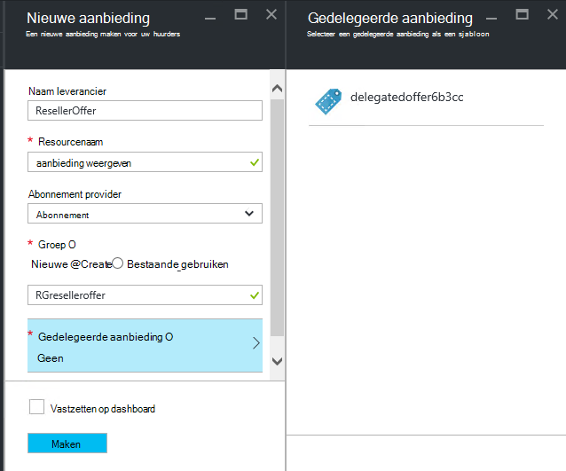

<properties
    pageTitle="Aanbiedingen in Azure stapel overdragen | Microsoft Azure"
    description="Informatie over het plaatsen van andere mensen die verantwoordelijk is voor aanbiedingen maken en gebruikers aanmelden voor u."
    services="azure-stack"
    documentationCenter=""
    authors="AlfredoPizzirani"
    manager="byronr"
    editor=""/>

<tags
    ms.service="azure-stack"
    ms.workload="na"
    ms.tgt_pltfrm="na"
    ms.devlang="na"
    ms.topic="article"
    ms.date="10/07/2016"
    ms.author="alfredop"/>

#Aanbiedingen in Azure stapel overdragen

Als servicebeheerder wilt vaak u andere mensen die verantwoordelijk is voor aanbiedingen maken en gebruikers aanmelden voor u plaatsen. Dit kan bijvoorbeeld gebeuren als u een serviceprovider bent en u wilt dat de wederverkopers klanten aanmelden en namens u worden beheerd. Het kan ook gebeuren in een onderneming, als u deel van een centrale IT-groep uitmaken en divisies of dochterondernemingen aanmelden van gebruikers zonder uw tussenkomst.

Overdracht kunt u met deze taak, zodat u kunt bereiken en meer gebruikers dan u zou kunnen doen rechtstreeks beheren. De volgende afbeelding ziet u één niveau van de delegatie, maar Azure-Stack ondersteunt meerdere niveaus. Gedelegeerde providers kunnen op zijn beurt overdragen aan andere aanbieders, tot vijf niveaus.

Beheerders kunnen het overdragen van maakrechten aanbiedingen en huurders aan andere gebruikers met behulp van de functionaliteit van de delegatie.

##Rollen en de stappen in de delegatie

Om overdracht te begrijpen, houd er rekening mee dat er drie rollen betrokken zijn:

-   De **beheerder** beheert de infrastructuur van Azure Stack, maakt u een sjabloon aanbieding en delegeert anderen aanbieden aan hun gebruikers.

-   De gemachtigde gebruikers, **overgedragen providers**worden genoemd. Zij kunnen behoren tot andere organisaties (zoals andere huurders Azure Active Directory).

-   **Gebruikers** zich aanmelden voor de aanbiedingen en ze te gebruiken voor het beheren van hun werkbelasting, maken van VMs, opslag van gegevens, enz.

Zoals in de volgende afbeelding, zijn er twee stappen bij het instellen van de delegatie.

1.  Identificeer de gedelegeerde providers. Dit doen door ze te abonneren op een voorstel op basis van een plan met alleen de service abonnementen.
    Gebruikers die zich op dit voorstel abonneren aan te schaffen van de servicebeheerder mogelijkheden, waaronder de mogelijkheid biedt uitgebreid en gebruikers voor deze ondertekenen.

2.  Een voorstel aan de provider overgedragen delegeren. Dit voorstel werkt als een sjabloon voor wat de gedelegeerde provider kan aanbieden. De gedelegeerde provider kunnen nemen van het aanbod, kies een naam voor het (maar niet de services en quota te wijzigen), en aanbieden aan klanten.

Om te fungeren als gedelegeerde providers, moeten gebruikers een relatie tot stand brengen met de belangrijkste dienstverlener; met andere woorden, nodig ze hebben om een abonnement te maken. In dit scenario identificeert dit abonnement de gedelegeerde providers hebben het recht deze voorstellen ten behoeve van de belangrijkste aanbieder.

Wanneer deze relatie is gemaakt, kan de systeembeheerder een voorstel aan de provider overgedragen overdragen. De gedelegeerde provider kunnen nemen van het aanbod, wijzigt u de naam (maar niet wijzigen van de stof) en aan zijn klanten aanbieden.

Om vast te stellen een gedelegeerde provider, een voorstel delegeren en controleren of gebruikers kunnen zich aanmelden voor deze, de aanwijzingen in de volgende secties uit te voeren.

##Rollen instellen

Als een provider overgedragen aan het werk zien, moet u extra Azure Active Directory-accounts naast de administrator-account van de service. Als u deze niet hebt, maakt u twee accounts. De rekeningen kunnen deel uitmaken van een huurder AAD. We naar te verwijzen naar hen de gedelegeerde provider (DP) en de gebruiker.

| **Rol** | **Beheersysteem voor het rechtenbeleid** |
| -------------------- | ----------------------- |
|  Gedelegeerde Provider | Gebruiker |
| Gebruiker | Gebruiker |

##De gedelegeerde providers identificeren

1.  Meld je aan als beheerder.

2.  De aanbieding die huurders worden overgedragen providers mogelijk maken. Dit moet u een plan en een op basis van het voorstel:

    een.  [Een plan maken](azure-stack-create-plan.md).
        Dit plan moet bevatten alleen de service abonnementen. In dit artikel gebruiken we een plan genaamd PlanForDelegation.

    b.  [Een voorstel maken](azure-stack-create-offer.md) 
     op basis van dit plan. In dit artikel gebruiken we een voorstel OfferToDP genoemd.

    c.  Als het maken van de aanbieding voltooid is, de gebruikers-ID van de provider overgedragen als toevoegen een huurder voor dit voorstel door te klikken op     **abonnementen** &gt; **Add** &gt; **Nieuwe huurder abonnement**.

  

> [AZURE.NOTE]Zoals met alle aanbiedingen voor Azure Stack, hebt u de mogelijkheid die de aanbieding van openbare en laat gebruikers aanmelden voor, of het privé houden en met de beheerder van de aanmelding beheren. Gedelegeerde providers zijn meestal een kleine groep en u wilt bepalen wie wordt toegelaten, zodat het privé houden van dit voorstel zal zinvol zijn in de meeste gevallen.

##Admin service maakt de gedelegeerde aanbieding

U hebt nu uw provider overgedragen vastgesteld. De volgende stap is het maken van het plan en de aanbieding die u wilt overdragen en die uw klanten gebruiken. Precies zo als u de klanten om te zien, omdat de provider overgedragen worden niet wijzigen van de plannen en de quota's bevat, moet u dit voorstel definiëren.

1.  Als de beheerder, [een plan maken](azure-stack-create-plan.md) en [een voorstel](azure-stack-create-offer.md) op basis van deze. Voor dit artikel gebruiken we een voorstel DelegatedOffer genoemd.
> [AZURE.NOTE]Dit voorstel hoeft niet te worden openbaar gemaakt. Deze kan openbaar worden gemaakt als u kiest, maar, in de meeste gevallen wilt u alleen overgedragen providers toegang hebben tot deze. Zodra u een persoonlijke aanbieding delegeren zoals beschreven in de volgende stappen uit, wordt de overgedragen provider toegang toe hebben.

2.  Overdragen van het voorstel. Ga naar DelegatedOffer en klik in het deelvenster instellingen, klik op **Providers overgedragen** &gt; **toevoegen**.

3.  Selecteer de gedelegeerde provider abonnement in de vervolgkeuzelijst en klik op de **gemachtigde**.

> 

##Gedelegeerde provider aanpassen de aanbieding

Aanmelden als de provider overgedragen en maak een nieuwe aanbieding met de overgedragen aanbieding als sjabloon.

1.  Klik op **nieuwe** &gt; **huurder biedt + plan** &gt; **bieden**.

    

2.  Aan de aanbieding een naam toewijzen. We kiezen hier ResellerOffer. Selecteer de gedelegeerde aanbieding op baseren en klik vervolgens op **maken**.
    
    

    >[AZURE.NOTE] Let op het verschil vergeleken met maken als ervaren door de servicebeheerder te bieden. De gedelegeerde provider wordt niet maken het aanbod van basis plannen en de invoegtoepassing plannen; ze kan alleen kiezen uit de voorstellen die aan haar zijn overgedragen en zal niet wijzigen.

3. Het aanbod openbaar maken door te klikken op **Bladeren** &gt; **biedt**, de aanbieding te selecteren en te klikken op **Status wijzigen**.

4. De gedelegeerde provider beschrijft deze aanbiedingen via zijn of haar eigen portal URL. Houd er rekening mee dat deze voorstellen alleen via dit portaal overgedragen zichtbaar zijn. Zoeken en wijzigen van deze URL:

    een.  Klik op **Bladeren** &gt; **Providerinstellingen** &gt; **Portal-URL**.

    b.  De Provider-ID zo nodig wijzigen.

    c.  Kopieer de portal URL op een aparte locatie, zoals Kladblok.

    
<!-- -->
Het maken van een aanbieding overgedragen als een gedelegeerde provider is nu voltooid. Meldt u af als de provider overgedragen. Sluit het tabblad browser dat u gebruikt.

##Meld u aan voor de aanbieding

1.  In een nieuw venster, gaat u naar de portal overgedragen URL die u in de vorige stap hebt opgeslagen. Aanmelden bij de portal als gebruiker. Opmerking: u moet de gedelegeerde portal gebruiken voor deze stap. Aanbieding van de overgedragen worden niet zichtbaar anders.

2.  In het dashboard, klikt u op **een abonnement**. U ziet dat alleen de gedelegeerde aanbiedingen gemaakt door de provider overgedragen aan de gebruiker worden gepresenteerd:

> 

Dit concludeert dat het proces van de delegatie van het voorstel. De gebruiker kan nu inschrijven voor dit voorstel door een abonnement voor het ophalen.

##Overdracht van meerdere niveaus

Overdracht van meerdere lagen, kan de gedelegeerde provider het aanbod aan andere entiteiten te delegeren. Dit kan bijvoorbeeld het maken van een diepere reseller kanalen, waarin de voorziening beheren Azure Stack delegeert aanbieding een distributeur, die op zijn beurt aan de leverancier delegeert.
Azure-Stack ondersteunt maximaal vijf niveaus van de delegatie.

Wilt maken op meerdere niveaus van de delegatie van het voorstel, delegeert de gedelegeerde provider op zijn beurt het aanbod aan de volgende provider. Het proces is hetzelfde voor de gedelegeerde provider zoals deze voor de servicebeheerder was (Zie [Service admin wordt gemaakt van de overgedragen aanbieding](#service-admin-creates-the-delegated-offer)).

##Volgende stappen
[Inrichten van een VM](azure-stack-provision-vm.md)
