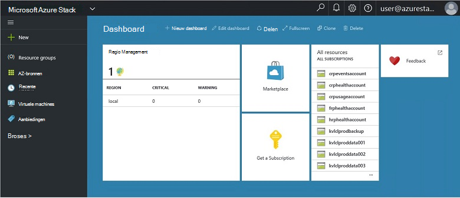
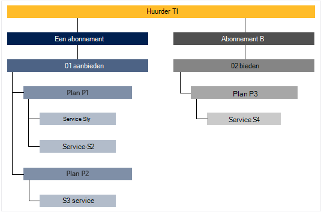

<properties
    pageTitle="Belangrijke functies en concepten in de stapel Azure | Microsoft Azure"
    description="Meer informatie over de belangrijkste functies en concepten in de stapel Azure."
    services="azure-stack"
    documentationCenter=""
    authors="Heathl17"
    manager="byronr"
    editor=""/>

<tags
    ms.service="azure-stack"
    ms.workload="na"
    ms.tgt_pltfrm="na"
    ms.devlang="na"
    ms.topic="article"
    ms.date="10/25/2016"
    ms.author="helaw"/>

# De belangrijkste functies en concepten in de stapel Azure

Als u nog naar Microsoft Azure Stack nooit, zijn deze voorwaarden en beschrijvingen handig.

## Personas

Er zijn twee soorten gebruikers voor Microsoft Azure Stack, servicebeheerder van de en de huurder (klant).

-  Een **servicebeheerder** kunt configureren en beheren van resources providers, huurder aanbiedingen plannen, services, quota en prijzen.
-  Een **huurder** verwerft (of aankopen) services biedt de servicebeheerder. Huurders kunnen inrichten, controleren en beheren van services waarop ze zijn geabonneerd, zoals Web Apps, opslag en virtuele Machines.

## Portal

De primaire methoden van uw interactie met Microsoft Azure Stack is de portal en PowerShell.

De portal voor Microsoft Azure stapel is een instantie van de Azure portal wordt uitgevoerd op de servers. Het is een website die een self-service ervaring voor zowel servicebeheerders als huurders met op rollen gebaseerde toegangscontrole (RBAC) voor resources en capaciteit van de wolk biedt, waardoor toepassingen snel en serviceontwikkeling en implementatie.

## Regio's, services, plannen, voorstellen en abonnementen

Services worden geleverd in Azure-Stack aan huurders met regio's, abonnementen, aanbiedingen en plannen. Huurders kunnen zich abonneren op meerdere aanbiedingen. Aanbiedingen kunnen een of meer plannen en plannen kunnen een of meer services hebben.

Voorbeeld van de hiërarchie van een huurder van abonnementen op voorstellen, elk met variërende plannen en diensten.

### Regio 's
Azure Stack gebieden zijn een basiselement van schaal- en management.  Een organisatie kan meerdere regio's met de beschikbare middelen in elke regio hebben.  Regio's kunnen ook andere services beschikbaar hebben.

### Services

Microsoft Azure Stack kunnen providers bieden tal van services en toepassingen, zoals virtuele machines, SQL Server-databases, SharePoint, Exchange, en meer.

### Plannen

Plannen zijn groeperingen van een of meer services. Als een provider, kunt u plannen om uw huurders te bieden maken. Op zijn beurt abonneren de huurders op uw aanbiedingen plannen en diensten die ze bevatten te gebruiken.

Elke service die wordt toegevoegd aan een plan kan worden geconfigureerd met de quota-instellingen voor het beheren van de capaciteit van de wolk. Quota worden toegepast per gebruikerabonnement en beperkingen zoals VM, RAM-geheugen en CPU-limieten opnemen. Quota kunnen worden gedifferentieerd op locatie. Een plan met compute-services van een regio kan bijvoorbeeld een quotum van twee virtuele machines, 4GB RAM en 10 CPU cores.

Bij het opstellen van een voorstel, kan de servicebeheerder **basis plannen**bevatten. Deze basis plannen zijn standaard opgenomen als een huurder zich op die aanbieding abonneert. Als een gebruiker zich abonneert (en het abonnement is gemaakt), heeft de gebruiker toegang tot alle resource-providers in deze basis plannen (met de bijbehorende targets) opgegeven.

De servicebeheerder kunt **plannen invoegtoepassing** ook opnemen in een voorstel. Invoegtoepassing plannen zijn niet standaard opgenomen in het abonnement. Invoegtoepassingen zijn aanvullende schema's (quota) in een voorstel dat de eigenaar van een abonnement aan hun abonnementen toevoegen kunt beschikbaar.

### Aanbiedingen

Aanbiedingen zijn groepen een of meer plannen dat providers aan huurders te kopen (geabonneerd). Alpha bieden kan bijvoorbeeld Plan A (van regio 1 met een reeks services compute) en Plan B (van regio 2 die een set van netwerk- en opslag) bevatten.

Een voorstel wordt geleverd met een set basis plannen en servicebeheerders invoegtoepassing plannen die huurders aan hun abonnement toevoegen kunnen kunnen maken.

### Abonnementen

Een abonnement is hoe huurders kopen voor uw aanbiedingen. Een abonnement is een combinatie van een huurder met een voorstel. Een huurder kan hebben van abonnementen op meerdere aanbiedingen. Elk abonnement geldt voor slechts één aanbieding. Abonnementen van de huurder bepalen welke plannen en diensten die zij toegang hebben.

Aanbieders van toegang en gebruik van de cloud-bronnen en services te ordenen met behulp van abonnementen.

## Azure Resource Manager

Met behulp van bronbeheer Azure, kunt u werken met de resources van uw infrastructuur in een model op basis van een sjabloon, declaritive.   Het biedt één interface waarmee u kunt implementeren, beheren en controleren van de onderdelen ervan, zoals virtuele machines, opslag, accounts, web-apps en databases. Zie [Overzicht Azure Resource Manager](../azure-resource-manager/resource-group-overview.md)voor meer informatie en instructies.

### Resourcegroepen

Resourcegroepen zijn verzamelingen van bronnen, services en toepassingen, en elke resource heeft een type, zoals virtuele machines, virtuele netwerken, openbare IP-adressen, opslag, accounts en websites. Elke resource moet worden in een resourcegroep en zodat resourcegroepen logisch indelen van bronnen, zoals door de werklast of locatie.

Hier volgen enkele belangrijke overwegingen bij het definiëren van een groep:

-   Elke bron kan alleen bestaan in een resourcegroep.

-   U implementeert, bijwerken en verwijderen van items in een groep bij elkaar. Als een resource, zoals een databaseserver aanwezig zijn op een andere implementatie-cyclus moet, moet in een andere bronnengroep.

-   U kunt toevoegen of verwijderen van een resource aan een resourcegroep op elk gewenst moment.

-   U kunt een resource uit een resourcegroep naar een andere groep verplaatsen.

-   Een brongroep kan bevatten bronnen die zich in verschillende regio's.

-   Een groep kan worden gebruikt om het bereik van toegangsbeheer voor beheertaken.

-   Een resource kan worden gekoppeld aan een bron in een andere bronnengroep wanneer twee resources met elkaar moeten werken, maar ze niet de levenscyclus van de delen. Bijvoorbeeld meerdere apps moeten verbinding maken met een database, maar die database moet niet worden bijgewerkt of hetzelfde tempo als de apps verwijderd.

-   In Microsoft Azure stapel, worden bronnen, zoals plannen en biedt ook beheerd in resourcegroepen.

-   U kunt een groep opnieuw implementeren.  Dit is handig voor het testen of voor ontwikkeldoeleinden.  

### Azure Resource Manager-sjablonen

Met Azure Resource Manager kunt u een eenvoudige sjabloon (in JSON-formaat) waarin u de installatie en configuratie van uw toepassing. Deze sjabloon is bekend als een sjabloon Azure Resource Manager en biedt een declaratieve manier om implementatie te definiëren. Met behulp van een sjabloon, kunt u herhaaldelijk uw toepassing gedurende de levenscyclus app implementeert en vertrouwen die uw resources worden ingezet in een consistente status hebben.

## Resource-providers (RPs) — netwerk RP, berekenen RP opslag RP

Resource-providers zijn webservices die de basis van alle op basis van Azure IaaS vormen en PaaS-services. Azure Resource Manager is gebaseerd op verschillende RPs toegang te verlenen tot de diensten van een hoster.

Er zijn drie belangrijke RPs: netwerk, opslag en berekenen. Elk van deze RPs helpt u bij het configureren en beheren van de desbetreffende bronnen. Servicebeheerders kunnen ook nieuwe aangepaste providers toevoegen.

### RP berekenen

Azure Stack huurders aan hun eigen virtuele machines maken kunt u berekenen Resource Provider (CAPPL). Ook biedt functionaliteit voor de servicebeheerder instellen en configureren van de resource-provider voor huurders. De CAPPL biedt de mogelijkheid voor het maken van virtuele machines zoals VM-extensies. De virtuele Machine extensie service helpt IaaS mogelijkheden bieden voor Windows en Linux virtuele machines.

### RP-netwerk

De Network Resource Provider (NRP) biedt een reeks functies Software gedefinieerd Networking (SDN) en Network functie virtualisatie (NFV) voor de particuliere wolk. Deze functies komen overeen met de openbare Azure cloud zodat Toepassingssjablonen worden één keer geschreven en zowel in de Azure openbare cloud of op locatie Microsoft Azure Stack geïmplementeerd. Het netwerk RP biedt u meer gedetailleerde reguleren, metadata-codes sneller configuratie, snelle en herhaalbare aanpassing en meerdere interfaces voor (met inbegrip van PowerShell, .NET SDK, Node.JS SDK, REST gebaseerde API). U kunt de NRP software load balancers, openbare IP-adressen, netwerk beveiligingsgroepen, onder andere virtuele netwerken maken.

### RP-opslag

De RP opslag biedt vier Azure consistent opslagservices: blob, tabel, wachtrij en accountbeheer. Hij biedt ook een opslag wolk beheerservice serviceprovider beheer van Azure consistent opslagservices te vergemakkelijken. Azure opslag biedt de flexibiliteit voor het opslaan en ophalen van grote hoeveelheden ongestructureerde gegevens, zoals documenten en mediabestanden met Azure BLOB's, en gestructureerde NoSQL op basis van gegevens met Azure tabellen. Zie [Inleiding tot Microsoft Azure opslag](../storage/storage-introduction.md)voor meer informatie over opslag Azure.

#### BLOB-opslag

BLOB-opslag wordt een set gegevens opgeslagen. Een blob kan tekst of binaire gegevens, zoals een document, bestand of installatieprogramma voor elk type zijn. Tabelopslag gestructureerde datasets worden opgeslagen. Tabelopslag is een NoSQL sleutel kenmerk gegevensopslag, waardoor snelle ontwikkeling en snelle toegang tot grote hoeveelheden gegevens. Wachtrij opslag biedt betrouwbare berichten voor verwerking van de workflow voor communicatie tussen onderdelen van cloud-services.

Elke blob is ingedeeld in een container. Containers bieden ook een handige manier om beveiligingsbeleid toewijzen aan groepen van objecten. Een opslag-account kan een willekeurig aantal containers bevatten en een container kan een willekeurig aantal BLOB's tot aan de limiet van 500 TB capaciteit van de opslag account bevatten. BLOB-opslag biedt drie soorten BLOB's, BLOB's blokkeren, append BLOB's en pagina BLOB's (schijven). Blok BLOB's zijn geoptimaliseerd voor streaming en cloud-objecten op te slaan en zijn een goede keuze voor het opslaan van documenten, media-bestanden, back-ups enz. Append BLOB's zijn vergelijkbaar met de BLOB's blokkeren, maar zijn geoptimaliseerd voor bewerkingen toevoegen. Een toevoegquery blob kan alleen worden bijgewerkt met een nieuw blok toe te voegen aan het einde. Append BLOB's zijn een goede keuze voor scenario's zoals registratie, waarin nieuwe gegevens moet worden geschreven alleen aan het einde van de blob. Pagina BLOB's zijn geoptimaliseerd voor die schijven IaaS en ondersteunende willekeurige schrijft, en mogelijk tot 1 TB in grootte. Een netwerk voor Azure VM IaaS schijf een VHD opgeslagen als een blob pagina is gekoppeld.

#### Tabelopslag

Tabelopslag is van Microsoft NoSQL sleutel/kenmerk Archief – werd een ontwerp zonder schema's, waardoor het anders dan de traditionele relationele databases. Aangezien gegevens ontbreken schema's worden opgeslagen, is het gemakkelijk om uw gegevens aan te passen als de behoeften van uw toepassing evolve. Tabelopslag is eenvoudig te gebruiken, zodat ontwikkelaars toepassingen snel kunnen maken. Tabelopslag is een sleutel kenmerk Archief, wat betekent dat elke waarde in een tabel is opgeslagen met een getypte naam. Naam van de eigenschap kan worden gebruikt voor het filteren en selectiecriteria op te geven. Een verzameling eigenschappen en bijbehorende waarden bestaan uit een entiteit. Aangezien tabelschema opslag ontbreken, twee entiteiten in dezelfde tabel kunnen bevatten verschillende verzamelingen van eigenschappen en de eigenschappen van verschillende typen kunnen worden. U kunt opslag tabel opslaan flexibele datasets, zoals gegevens van de gebruiker voor webtoepassingen, adresboeken, gegevens van een apparaat en een ander type metagegevens die de service nodig heeft. U kunt een willekeurig aantal entiteiten opslaan in een tabel en een opslag-account kan een willekeurig aantal tabellen tot de capaciteit van de opslag account bevatten.

#### Queue Storage
Azure Queue storage biedt cloud messaging tussen toepassingsonderdelen van de. Bij het ontwerpen van toepassingen voor schaal, zijn componenten van toepassing vaak ontkoppeld, zodat ze kunnen onafhankelijk van elkaar worden geschaald. Wachtrij opslag biedt voor communicatie tussen toepassingscomponenten van, een systeem voor asynchrone berichtafhandeling of ze worden uitgevoerd in de cloud, op het bureaublad, op een server op locatie of op een mobiel apparaat. Wachtrij opslag biedt ook ondersteuning voor asynchrone taken beheren en processen proces te bouwen.

## Role-Based Access Control RBAC)

U kunt RBAC systeemtoegang verlenen tot gemachtigde gebruikers, groepen en services door het toewijzen van rollen aan een abonnement, niveau van de afzonderlijke resource of resourcegroep. Elke rol definieert het toegangsniveau dat gebruiker, groep of service op Microsoft Azure Stack bronnen heeft.

Azure RBAC heeft drie elementaire functies die betrekking hebben op alle brontypen: eigenaar, Inzender en Reader. De eigenaar heeft volledige toegang tot alle bronnen, met inbegrip van het recht op toegang aan anderen overdragen. Inzender kunt maken en beheren van alle soorten Azure bronnen maar kan geen toegang tot de andere. Reader kan alleen bestaande Azure resources bekijken. De rest van de RBAC-rollen in Azure beheer van specifieke bronnen van Azure toestaan. Bijvoorbeeld de rol van inzender voor virtuele Machine kunt maken en beheren van virtuele machines maar kan geen beheer van het virtuele netwerk of het subnet dat verbinding met de virtuele machine maakt.

## Gebruiksgegevens

Microsoft Azure Stack verzamelt en aggregaten gebruiksgegevens voor alle resource-providers te bieden een beknopt rapport per gebruiker. Gegevens worden net zo eenvoudig als het aantal verbruikte resources of zoiets complex als afzonderlijke tellers van prestaties en de schaal. De gegevens zijn beschikbaar via de REST API. Er is een Azure consistent huurder API als Provider en overgedragen Provider API's om gebruiksgegevens over alle abonnementen van de huurder. Deze gegevens kunnen worden gebruikt voor de integratie met een extern hulpprogramma of service voor facturering of terugboeking.

## Volgende stappen

[Azure Stack technische Preview 2 (Implementatiemodel) implementeren](azure-stack-deploy.md)
