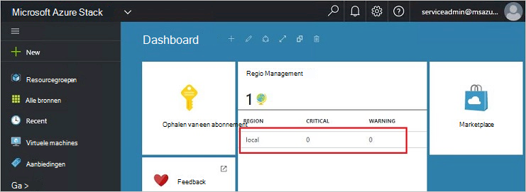
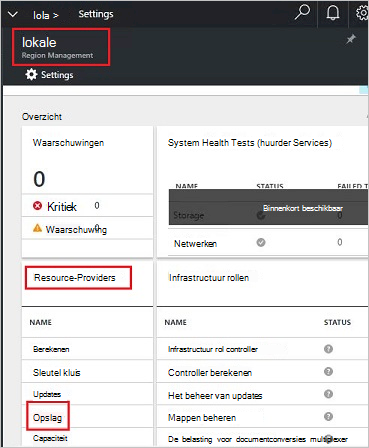
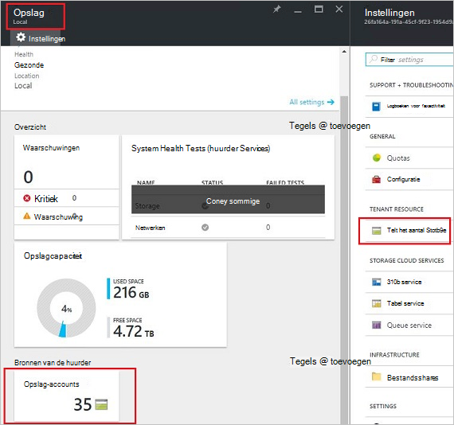
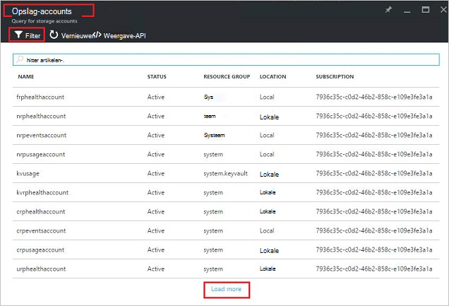
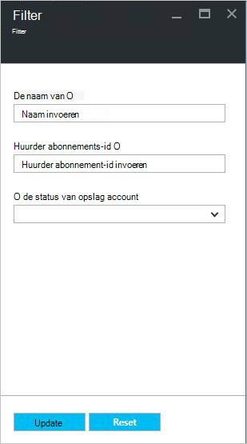
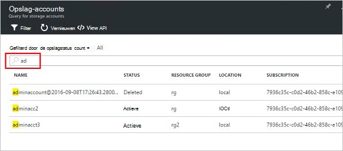
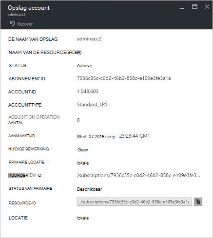
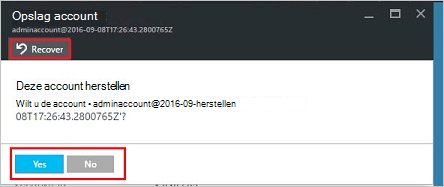
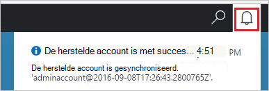
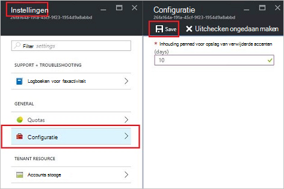

<properties
    pageTitle="Azure Stack opslag accounts beheren | Microsoft Azure"
    description="Meer informatie over het zoeken, beheren, herstellen en vrij Azure Stack opslag rekeningen"
    services="azure-stack"
    documentationCenter=""
    authors="AniAnirudh"
    manager="darmour"
    editor=""/>

<tags
    ms.service="azure-stack"
    ms.workload="na"
    ms.tgt_pltfrm="na"
    ms.devlang="na"
    ms.topic="get-started-article"
    ms.date="09/26/2016"
    ms.author="anirudha"/>

# <a name="manage-storage-accounts-in-azure-stack"></a>Accounts in Azure stapel opslag beheren

Informatie over het beheren van accounts in Azure stapel wilt zoeken, herstellen en opslagcapaciteit op basis van bedrijfsbehoeften vrij opslag.

## <a name="find-a-storage-account"></a>Een opslag account zoeken

De lijst met accounts voor opslag in de regio kan worden bekeken in Azure stapelen op:

1.  In een webbrowser en Ga naar [https://portal.azurestack.local](https://portal.azurestack.local/).

2.  Aanmelden bij de portal Azure Stack als beheerder (met behulp van de referenties die u hebt opgegeven tijdens de installatie)

3.  Zoeken op de standaarddashboard-lijst voor **de regio** en klikt u op het gebied dat u wilt verkennen zoals **(lokaal**).

    

4.  **Opslag** in de lijst **Bron Providers** selecteren.

    

5.  Nu op de opslag Resource Provider Admin blade: Ga naar het tabblad 'Accounts opslag' en klikt u op.

    
    
    De resulterende pagina wordt de lijst met accounts voor opslag in die regio.

    

De eerste 10 accounts worden standaard weergegeven. U kunt informatie ophalen door te klikken op de link 'meer laden' onder aan de lijst <br>
OR <br>
Als u geïnteresseerd in een bepaalde opslag-account bent: u kunt **filteren en haal de bijbehorende rekeningen** alleen.<br>

Voor accounts filteren:

1. Klik op de filterknop aan de bovenkant van het blad.

2. Op het blad filter kunt u opgeven **accountnaam**,  **abonnements-ID** of **status** voor het aanpassen van de lijst met accounts voor opslag moet worden weergegeven. Gebruik ze.

3. Klik op bijwerken. De lijst moet dienovereenkomstig vernieuwen.

    

4. De selecties wissen om het filter opnieuw instellen: klik op de filterknop, en bijwerken.

Het zoekvak boven aan de opslag blade lijst met accounts, kunt u het markeren van de geselecteerde tekst in de lijst met accounts. Dit is erg handig in het geval wanneer de volledige naam of id niet gemakkelijk beschikbaar is.<br>
Om te zoeken naar de rekening die u geïnteresseerd bent kunt u hier de vrije tekst.




## <a name="look-at-account-details"></a>Bekijk de details

Zodra u de accounts die u geïnteresseerd bent in de weergave hebt gevonden, kunt u klikken op de rekening om bepaalde details te bekijken. Een nieuwe blade wordt geopend met de details van het type van de account, aanmaakdatum, locatie enz.




## <a name="recover-a-deleted-account"></a>Een verwijderde account herstellen

Het is mogelijk in een situatie waarin u wilt herstellen van verwijderde account.<br>
In AzureStack is een zeer eenvoudige manier om dit te doen.

1.  Blader naar de opslaglijst gaan [Zie een opslag account zoeken](#find-a-storage-account)

2.  Dat met name rekening zoekt in de lijst. U wilt filteren.

3.  Controleer de status van de account. Het moet zeggen 'verwijderd'.

4.  Klik op de account die de blade account details wordt geopend.

5.  Op deze blade – Zoek de "herstellen" knop en klikt u op.

6.  Door op 'Ja' te bevestigen

    

7.  Het herstel is nu in behandeling... wachten op aanwijzing dat gelukt is.
    U kunt ook klikken op het pictogram 'bel' aan de bovenkant van de portal aanduidingen voortgang weergeven.

    

  Zodra de herstelde account wordt gesynchroniseerd, kunt een teruggaan naar deze.

### <a name="some-gotchas"></a>Sommige Gotchas

- Staat wordt uw verwijderde account als 'bewaren'.

  Dit betekent dat de verwijderde account de verloopperiode is overschreden en niet hersteld niet meer worden kan.

- De verwijderde account wordt niet weergegeven in de accountlijst.

  Dit kan betekenen dat de verwijderde account al permanent verwijderd is heeft. In dit geval het niet herstellen niet meer. Zie 'capaciteit vrij' hieronder.

## <a name="set-retention-period"></a>Bewaartermijn instellen

Bewaartermijn instellen kan een beheerder een periode opgeven in dagen (tussen 0 en 9999 dagen) gedurende welke een verwijderde account mogelijk kan worden hersteld. De bewaarperiode standaard ingesteld op 15 dagen. Als de waarde '0' betekent dat de verwijderde account onmiddellijk ingehouden worden en periodieke opschoonbewerking is gemarkeerd.

De bewaartermijn – wijzigen

1.  In een webbrowser en Ga naar [https://portal.azurestack.local](https://portal.azurestack.local/).

2.  Aanmelden bij de portal Azure Stack als beheerder (met behulp van de referenties die u hebt opgegeven tijdens de installatie)

3.  Zoeken op de standaarddashboard-lijst voor **de regio** en klikt u op het gebied dat u wilt verkennen zoals **(lokaal**).

4.  **Opslag** in de lijst **Bron Providers** selecteren.

5.  Klik op het pictogram instellingen bovenaan de blade instelling te openen.

6.  Klik op configuratie - periode.

7.  U kunt de waarde bewerken en opslaan.

 Deze waarde wordt onmiddellijk van kracht en weerspiegelen over de hele regio.



## <a name="reclaim-capacity"></a>Capaciteit vrij

Een van de neveneffecten hebben een verloopperiode is dat een verwijderde account verbruiken capaciteit blijven zal totdat het afkomstig uit de bewaartermijn is. Nu als Administrator, moet u mogelijk verwijderd een manier om dit vrij accounts ruimte zelfs als de bewaarperiode nog niet is verstreken. Momenteel kunt u een opdrachtregel expliciet overschrijft de bewaarperiode en capaciteit onmiddellijk vrij. Om dit te doen:

1.  Ervan uitgaande dat u hebt Azure PowerShell geïnstalleerd en geconfigureerd. Als niet Volg de instructies hier: Zie als u wilt koppelen aan uw abonnement Azure en installeer de nieuwste versie van Azure PowerShell [installeren en configureren van Azure PowerShell](http://azure.microsoft.com/documentation/articles/powershell-install-configure/).
    Zie voor meer informatie over Azure Resource Manager-cmdlets [Gebruiken Azure PowerShell Azure Resource Manager](http://go.microsoft.com/fwlink/?LinkId=394767)

2.  Deze cmdlet uitvoeren:

    ```
    PS C:\\>; Clear-ACSStorageAccount -ResourceGroupName system
    -FarmName <your farmname>
    ```

> Raadpleeg voor meer informatie [AzureStack powershell documentatie](https://msdn.microsoft.com/library/mt637964.aspx)

> [AZURE.NOTE] Deze cmdlet uitvoert wordt definitief verwijderd en de inhoud van de account. Het zal niet meer worden hersteld. Met zorg gebruiken.

