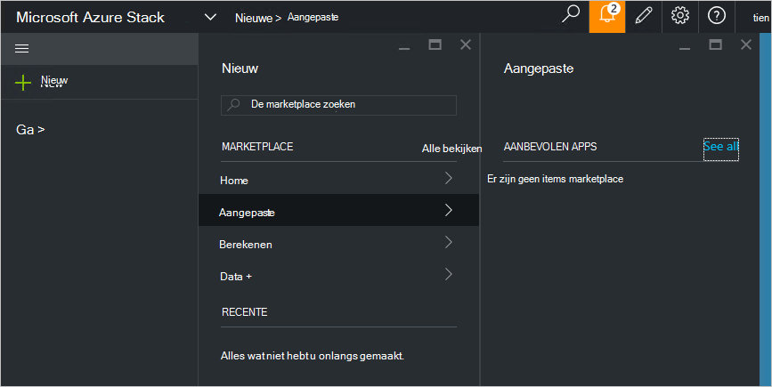

<properties
    pageTitle="Een aangepaste marketplace-item publiceren in Azure stapel (de beheerder) | Microsoft Azure"
    description="Informatie over het publiceren van een item met aangepaste marketplace in Azure stapel als servicebeheerder."
    services="azure-stack"
    documentationCenter=""
    authors="rupisure"
    manager="byronr"
    editor=""/>

<tags
    ms.service="azure-stack"
    ms.workload="na"
    ms.tgt_pltfrm="na"
    ms.devlang="na"
    ms.topic="article"
    ms.date="09/26/2016"
    ms.author="rupisure"/>

# De Stack Azure Marketplace

De Marketplace is een verzameling items die zijn aangepast voor Azure Stack, zoals diensten, toepassingen en bronnen. Het is de plaats waar de huurders komen nieuwe resources maken en implementeren van nieuwe toepassingen. Servicebeheerders kunnen toevoegen aan de aangepaste items op de markt en huurders zien ze meteen.

De markt, klikt u op **Nieuw**.

De markt wordt elke vijf minuten bijgewerkt.

## Marktplaats items

Elk item Marketplace is:

-   Een sjabloon Azure Resource Manager voor het inrichten van resource

-   Metagegevens, zoals tekenreeksen, pictogrammen en andere marketingmateriaal

-   Wanneer u opmaakgegevens voor het item in de portal weergeven

Elk artikel is gepubliceerd op de markt gebruikt een indeling die de Azure galerie pakket (azpkg) genoemd. Implementatie- of runtime-bronnen (zoals code, zip-bestanden met software of beelden die virtuele machine) moeten worden toegevoegd aan Azure stapel afzonderlijk, niet als onderdeel van het artikel Marketplace. 

## Volgende stappen

[Maken en publiceren van een artikel marketplace](azure-stack-create-and-publish-marketplace-item.md)
