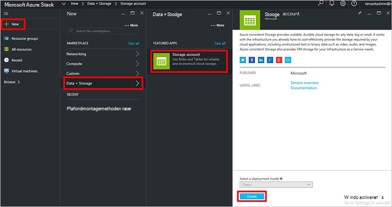
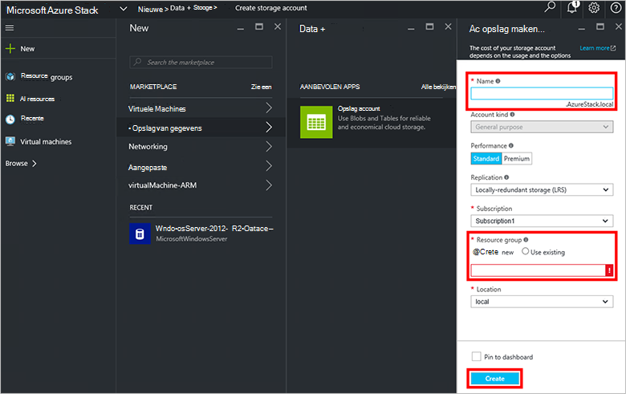
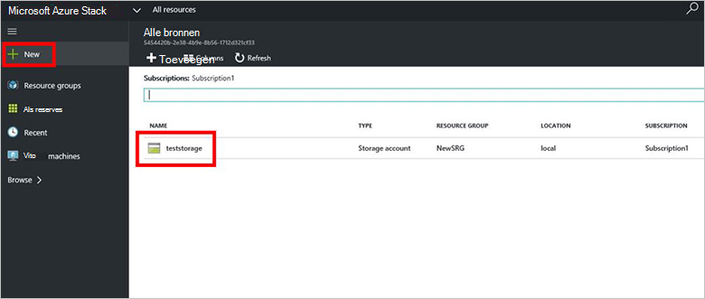

<properties
    pageTitle="Opslag rekeningen in Azure Stack | Microsoft Azure"
    description="Informatie over het maken van een account van de storage Stack Azure."
    services="azure-stack"
    documentationCenter=""
    authors="ErikjeMS"
    manager="byronr"
    editor=""/>

<tags
    ms.service="azure-stack"
    ms.workload="na"
    ms.tgt_pltfrm="na"
    ms.devlang="na"
    ms.topic="get-started-article"
    ms.date="09/26/2016"
    ms.author="erikje"/>

# Opslag rekeningen in Azure Stack

Opslag rekeningen bevatten Blob en tabel en de unieke naamruimte voor uw objecten voor gegevensopslag gegevens. De gegevens in uw account is standaard alleen beschikbaar voor u, de eigenaar van de opslag-account.

1.  Op de computer Azure Stack Implementatiemodel aanmelden bij `https://portal.azurestack.local` als [beheerder](azure-stack-connect-azure-stack.md#log-in-as-a-service-administrator), en klik vervolgens op **Nieuw** > **Data- +** > **opslag account**.

    

2.  Typ een naam voor de account van uw opslag in de blade **opslag-account maken** . Een nieuwe **Resourcegroep**maken of een bestaande selecteren aan en klik vervolgens op **maken** om de opslag-account te maken.

    

3. Om te zien de nieuwe opslag-account, klikt u op **alle resources**, en vervolgens zoeken naar de rekening voor de opslag en klik op de naam.

    
    
## Volgende stappen

[Azure Resource Manager-sjablonen gebruiken](azure-stack-arm-templates.md)

[Meer informatie over accounts Azure opslag](../storage/storage-create-storage-account.md)

[De Stack Azure Azure consistent opslag validatie handleiding downloaden:](http://aka.ms/azurestacktp1doc)
