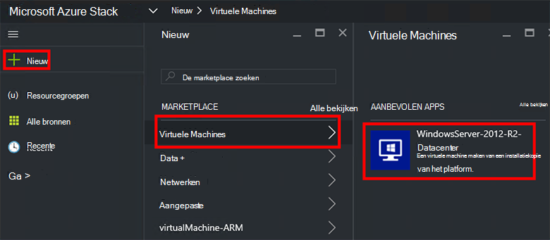

<properties
    pageTitle="Inrichten van een VM in Azure Stack (huurder) | Microsoft Azure"
    description="Als een huurder, informatie over het inrichten van een VM in Azure stapel."
    services="azure-stack"
    documentationCenter=""
    authors="ErikjeMS"
    manager="byronr"
    editor=""/>

<tags
    ms.service="azure-stack"
    ms.workload="na"
    ms.tgt_pltfrm="na"
    ms.devlang="na"
    ms.topic="get-started-article"
    ms.date="10/12/2016"
    ms.author="erikje"/>

# Inrichten van een virtuele machine

Als beheerder kunt u virtuele machines om resources te evalueren voordat ze aanbieden in plannen.

## Inrichten van een virtuele machine

1.  Op de computer Azure Stack Implementatiemodel aanmelden bij `https://portal.azurestack.local` als [beheerder](azure-stack-connect-azure-stack.md#log-in-as-a-service-administrator), en klik vervolgens op **Nieuw** > **virtuele machines** > **WindowsServer 2012-R2 Datacenter**.  

    

2.  Typ een **naam**, **gebruikersnaam**en **wachtwoord**in de blade **Grondbeginselen** . Kies **VM schijftype** **harde schijf**. Kies een **abonnement**. Een **resourcegroep**maken of een bestaande selecteren en klik op **OK**.  

3.  Klik op **Basis van A1**in het blad **een formaat kiezen** en klik op **selecteren**.  

4.  Klik in de blade **Instellingen** **virtueel netwerk**. Klik op **Nieuw**in het blad **virtueel netwerk kiezen** . Alle standaardwaarden accepteren in de blade **virtueel netwerk maken** en klik op **OK**. Klik op **OK**in het blad **Instellingen** .

    

5.  Klik op **OK** om de virtuele machine maken in het blad **Overzicht** .  

6. Overzicht van de nieuwe virtuele machine, **alle bronnen**, en vervolgens zoeken naar de virtuele machine en klik op de naam.

    

## Volgende stappen

[Opslag-accounts](azure-stack-provision-storage-account.md)
