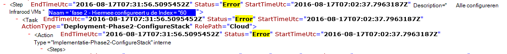

<properties
    pageTitle="Een implementatie van een mislukte stap opnieuw uitvoeren | Microsoft Azure"
    description="Als u problemen tijdens de implementatie ondervindt, kunt u de volgende stappen uit om de implementatie van waar deze niet opnieuw proberen."
    services="azure-stack"
    documentationCenter=""
    authors="ErikjeMS"
    manager="byronr"
    editor=""/>

<tags
    ms.service="azure-stack"
    ms.workload="na"
    ms.tgt_pltfrm="na"
    ms.devlang="na"
    ms.topic="get-started-article"
    ms.date="09/26/2016"
    ms.author="erikje"/>
    
# Een implementatie van een mislukte stap opnieuw uitvoeren
  
Als u problemen tijdens de implementatie ondervindt, kunt u de volgende stappen uit om de implementatie van waar deze niet opnieuw proberen.

## Zoek de fout

Nemen nota van de storing, met name het gedeelte dat uit bij welke stap de aanroep roept mislukt. Bijvoorbeeld:

**2016-08-17 00:30:57 1 fout 1 > > actie: aanroep van stap 60.140.143 is mislukt. Aanroepen van het actieplan wordt gestopt.**

Dit is de stap van de implementatie waar u wilt beginnen met het opnieuw uitvoeren van de implementatie.

## Meer details over de fout vinden

Als u meer informatie over de fout, vindt de bijbehorende **overzicht. JJJJ-MM-DD.tt.N.log.xml** in de **C:\CloudDeployment\Logs\* * map.
De tekenreeks 'Fout' zoeken en volgen deze tot de uitvoer totdat er een grote hoeveelheid niet-XML-indeling tekst met het foutbericht (deze sectie vaak valt samen met het laatste exemplaar van de tekenreeks 'Fout'). Bijvoorbeeld:

U kunt deze informatie ook naar de stap opnieuw bijhouden, volgen de nummers "Index" van de laatste fout. In de bovenstaande afbeelding ziet u (vanaf de onderkant): 143, 140 en vervolgens naar boven schuiven, ziet u 60:

U plaatst dit allemaal bij elkaar (nu van boven naar beneden), krijgt u 60.140.143, net als in de uitvoer van de PS-console van de fout (zoals die in de sectie 'De fout vinden' hierboven).

## De implementatie op een bepaalde stap opnieuw uitvoeren

Nu dat u de stap die hebt op de implementatie is mislukt, kunt u proberen een - opnieuw uitvoeren van de implementatie van die stap.

> [AZURE.IMPORTANT] De volgende opdrachten moeten worden uitgevoerd door de juiste gebruikers, in verband met de fout die is opgetreden. Als de fout is opgetreden voordat de HOST is toegevoegd aan het domein, worden deze stappen uitgevoerd als de lokale administrator-account. Als de fout is opgetreden nadat de HOST is toegevoegd aan het domein, worden deze stappen als beheerder van het domein (azurestack\azurestackadmin) uitgevoerd.

### De opdracht Invoke-EceAction

1. Importeren van een verhoogde PS-console de volgende Modules:

        Import-Module C:\CloudDeployment\CloudDeployment.psd1 -Force
        Import-Module C:\CloudDeployment\ECEngine\EnterpriseCloudEngine.psd1 -Force 

2. De volgende opdracht (voorbeeld boven de hier gebruikte) wordt uitgevoerd:

        Invoke-EceAction -RolePath Cloud -ActionType Deployment -Start 60.140.143 -Verbose

3.  Dit zal de implementatie van de stap die starten met de - parameter Start van de opdracht Invoke-EceAction

### Resultaten van een - opnieuw uitvoeren/begin

Ongeacht de optie u kiest, begint de installatie opnieuw starten vanaf de opgegeven - parameter.

1.  Als de fout hersteld is, blijft de implementatie tot aan de voltooiing.

2.  Als de installatie opnieuw mislukt op...
    
    - de plaats: de fout is waarschijnlijk niet terug te vorderen, en verder onderzoek nodig is.

    - een nieuwe plaats na waar het deze keer niet: u kunt dezelfde stappen als u deze verbinding opnieuw proberen.

    - een nieuwe plaats voor waar het deze keer niet: iets anders verkeerd is gegaan met een aanroep idempotency is ingeschakeld, die verder onderzoek vereist.

## Volgende stappen

[Verbinding maken met Azure Stack](azure-stack-connect-azure-stack.md)

