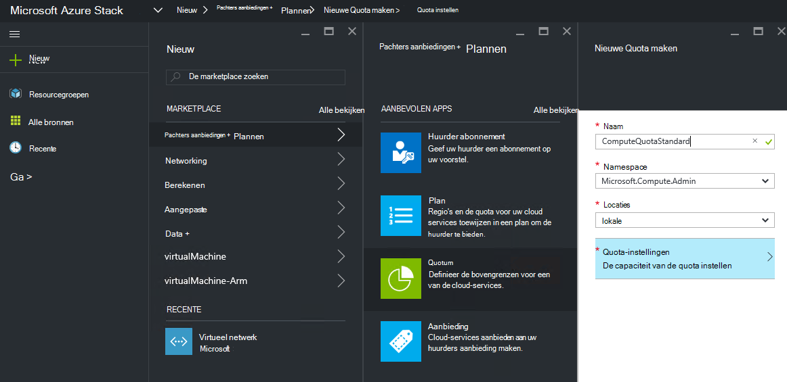
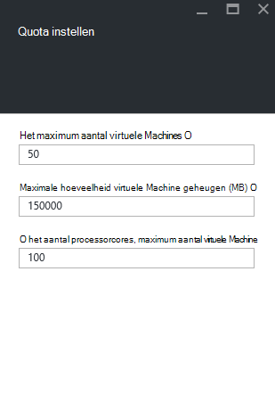
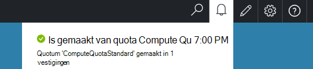

<properties
    pageTitle="Quota's in stapel Azure | Microsoft Azure"
    description="Beheerders instellen quota voor het beperken van het maximumbedrag van huurders toegang tot hebben bronnen."
    services="azure-stack"
    documentationCenter=""
    authors="mattmcg"
    manager="byronr"
    editor=""/>

<tags
    ms.service="azure-stack"
    ms.workload="na"
    ms.tgt_pltfrm="na"
    ms.devlang="na"
    ms.topic="get-started-article"
    ms.date="09/26/2016"
    ms.author="mattmcg"/>

# Set quota's in stapel Azure

Quota's definiëren de grenzen van de middelen die een huurder abonnement kunt inrichten of verbruiken. Een target kunt bijvoorbeeld een huurder maximaal vijf VMs maken. Als een service aan een plan, moet de beheerder de instellingen voor die service configureren.

Quota worden geconfigureerd per service en per locatie, waardoor beheerders granulaire controle over het verbruik van middelen voorzien. Beheerders kunnen een of meer resources voor quota maken en koppelen aan plannen, wat betekent dat gedifferentieerde aanbod voor hun diensten aanbieden. Quota's voor een bepaalde dienst kunnen worden gemaakt van de **Bronnen** beheer blade voor die service.

Een huurder die zich abonneert op een aanbieding met meerdere plannen kunt alle bronnen die beschikbaar in elk plan zijn.

## Voor het maken van een quotum IaaS

1.  In een browser, Ga naar [https://portal.azurestack.local](https://portal.azurestack.local/).

    Aanmelden bij de portal Azure Stack als beheerder (met behulp van de referenties die u hebt opgegeven tijdens de installatie).

2.  Selecteer **Nieuw**en selecteer vervolgens een **Quotum**.

3.  Selecteer de eerste service waarvoor u een quota maken. Volg deze stappen voor de Compute-, netwerk- en services voor een quotum IaaS.
In dit voorbeeld maken we eerst een quota voor de Compute-service. Selecteer in de lijst **Namespace** de naamruimte **Microsoft.Compute.Admin** .

    > 

4.  Kies de locatie waar het quotum is gedefinieerd (bijvoorbeeld 'local').

5.  Op het item **Quotuminstellingen** zegt het **instellen van de capaciteit van TARGET**. Klik op deze opdracht om de quota-instellingen configureren.

6.  U ziet alle Compute-bronnen die u kunt limieten configureren op de bladeserver **Quota instellen** . Elk type heeft een standaardwaarde die is gekoppeld. U kunt deze waarden wijzigen of kunt u de knop **Ok** onderaan het blad aan de standaardinstellingen te accepteren.

    > 

7.  Nadat u hebt geconfigureerd, de waarden en op **Ok**hebt geklikt, verschijnt het item **Quota-instellingen** als **geconfigureerd**. Klik op **Ok** om de bron van de **Quota** maken.

    U ziet een melding die aangeeft dat er misbruik wordt gemaakt van de bron van de quota.

8.   Nadat u de set quota heeft gemaakt, ontvangt u een tweede kennisgeving. Het contingent Compute service is nu klaar om te worden gekoppeld aan een plan. Herhaal deze stappen met de netwerk- en -services en u bent gereed voor het maken van een planning IaaS!

    >   

## Quotatypen berekenen

|**Type**                    |**Standaardwaarde**| **Beschrijving**|
|--------------------------- | ------------------------------------|------------------------------------------------------------------|
|Het maximumaantal virtuele machines   |50|Het maximum aantal virtuele machines die een abonnement op deze locatie kunt maken. |
|Het maximumaantal cores virtuele machine              |100|Het maximum aantal cores die een abonnement op deze locatie kunt maken (bijvoorbeeld een VM A3 heeft vier cores).|
|Maximale hoeveelheid geheugen virtuele machine (GB)         |150|De maximale hoeveelheid RAM-geheugen dat kan worden ingericht in MB (bijvoorbeeld een VM A1 1,75 GB RAM-geheugen verbruikt).|

> [AZURE.NOTE] Berekent de quota niet worden afgedwongen in deze technische preview.

## Opslagtypen quotum

|**Artikel**                           |**Standaardwaarde**   |**Beschrijving**|
|---------------------------------- |------------------- |-----------------------------------------------------------|
|Maximale capaciteit (GB)              |500                 |Totale opslagcapaciteit die kan worden gebruikt door een abonnement op deze locatie.|
|Totaal aantal accounts voor opslag   |20                  |Het maximum aantal opslag rekeningen die een abonnement op deze locatie kunt maken.|

## Quotatypen

|**Artikel**                                                   |**Standaardwaarde**   |**Beschrijving**|
|----------------------------------------------------------| ------------------- |--------------------------------------------------------------------------------------------------------------------------------------------------------------------|
| Max openbare IP-adressen                         |50                  |Het maximum aantal openbare IP-adressen die een abonnement op deze locatie kunt maken. |
| Max virtuele netwerken                   |50                  |Het maximum aantal virtuele netwerken die een abonnement op deze locatie kunt maken. |
| Max virtueel netwerkgateways           |1                   |Het maximum aantal virtuele netwerkgateways (VPN-Gateways) die een abonnement op deze locatie kunt maken. |
| Maximum aantal verbindingen                |2                   |Het maximum aantal netwerkverbindingen (point-to-point of site naar site) die een abonnement via netwerkgateways voor alle virtuele op deze locatie maken kunt. |
| Max, Netwerktaakverdeling                     |50                  |Het maximum aantal Netwerktaakverdeling die een abonnement op deze locatie kunt maken. |
| Max NIC 's                               |100                 |Het maximum aantal netwerkinterfaces die een abonnement op deze locatie kunt maken. |
| Max netwerk beveiligingsgroepen            |50                  |Het maximum aantal netwerk-beveiligingsgroepen die een abonnement op deze locatie kunt maken. |
