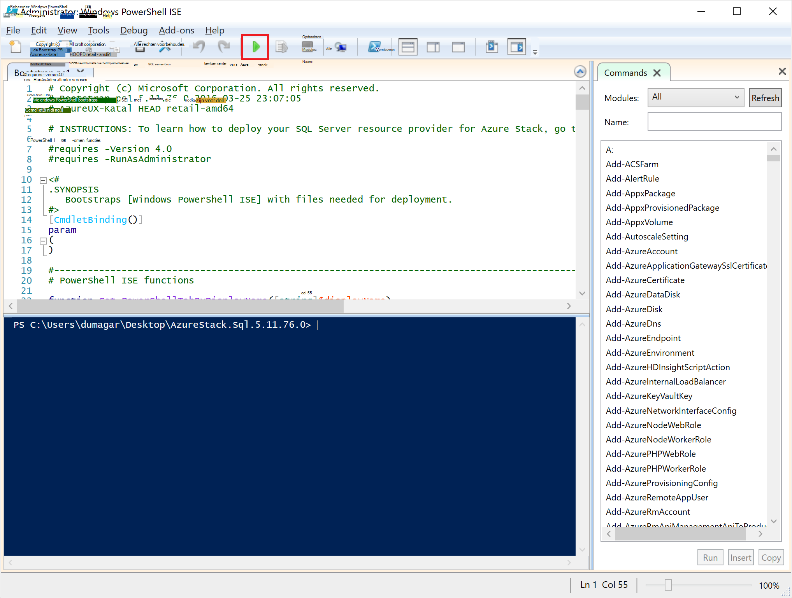

<properties
    pageTitle="De provider SQL Server resource op Azure Stack implementeren | Microsoft Azure"
    description="Gedetailleerde stappen voor de implementatie van een SQL Server Resource Provider Adapter op Azure Stack."
    services="azure-stack"
    documentationCenter=""
    authors="Dumagar"
    manager="byronr"
    editor=""/>

<tags
    ms.service="multiple"
    ms.workload="na"
    ms.tgt_pltfrm="na"
    ms.devlang="na"
    ms.topic="article"
    ms.date="09/26/2016"
    ms.author="dumagar"/>

# De Provider SQL Server Resource Adapter op Azure Stack implementeren

> [AZURE.NOTE] De volgende informatie geldt alleen voor Azure Stack TP1-implementaties.

In dit artikel gebruiken om gedetailleerde stappen voor het instellen van de Provider SQL Server Resource Adapter op de Stack Azure bewijs van haalbaarheidstest. Zie [SQL-databases op Azure Stack gebruiken](azure-stack-sql-rp-deploy-short.md) Bronmogelijkheden provider en de architectuur.

## Stappen instellen voordat u implementeren

Voordat u de resource provider implementeert, moet u:

- Een standaard Windows Server-installatiekopie met .NET 3.5
- Verbeterde beveiliging van Internet Explorer (IE) uitschakelen
- Installeer de nieuwste versie van Azure PowerShell

### Maak een installatiekopie van Windows Server, met inbegrip van .NET 3.5

Als u de bits Azure Stack na 23-2/2016 gedownload omdat de standaard Windows Server 2012 R2 basisinstallatiekopie .NET 3.5 framework in deze download en hoger bevat, kunt u deze stap overslaan.

Als u vóór 23-2/2016 hebt gedownload, moet u een Windows Server 2012 R2 Datacenter VHD maken met .NET 3.5 afbeelding en is ingesteld als de standaard-installatiekopie in de opslagplaats Platform images.

### Uitschakelen Internet Explorer enhanced security en enable cookies

Voor de implementatie van een resource-provider uitvoeren u PowerShell Integrated Scripting Environment (ISE) als beheerder, dus u moet toestaan van cookies en JavaScript in de Internet Explorer-profiel kunt u voor zowel beheerders- als aanmeldingen aanmelden bij Azure Active Directory.

**Als u wilt uitschakelen in Internet Explorer Verbeterde beveiliging:**

1. Aanmelden bij de computer Azure Stack bewijs van concept (implementatiemodel) als AzureStack/beheerder en opent u Server Manager.

2. **Internet Explorer Enhanced Security Configuration** uitschakelen voor zowel beheerders als gebruikers.

3. **ClientVM.AzureStack.local** virtual machine als beheerder aanmelden en opent u Server Manager.

4. **Internet Explorer Enhanced Security Configuration** uitschakelen voor zowel beheerders als gebruikers.

**Cookies inschakelen:**

1. Op het scherm Start van Windows klikt u op **alle apps** **Windows**Bureau-accessoires, met de rechtermuisknop op **Internet Explorer**, **meer**en klik vervolgens op **Als administrator uitvoeren**.

2. Als u wordt gevraagd, **Gebruik aanbevolen beveiliging**controleren en klik op **OK**.

3. In Internet Explorer, klikt u op de **hulpmiddelen (vistuig) pictogram** &gt; **Internet-opties** &gt; tabblad **Privacy** .

4. Klik op **Geavanceerd**, zorg ervoor dat beide knoppen **accepteren** zijn geselecteerd, klikt u op **OK**en klik vervolgens op **OK** .

5. Internet Explorer sluiten en opnieuw starten van PowerShell ISE als beheerder.

### Een stapel Azure compatibele versie van Azure PowerShell installeren

1. Verwijder alle bestaande Azure PowerShell van uw VM-Client.

2. Aanmelden bij de computer Azure Stack Implementatiemodel als AzureStack/beheerder.

3. Met behulp van extern bureaublad aanmelden bij de **ClientVM.AzureStack.local** virtuele machine als beheerder.

4. Open het Configuratiescherm, klikt u op **een programma verwijderen** &gt; Klik op **Azure PowerShell** &gt; Klik op **verwijderen**.

5. [De nieuwste Azure PowerShell die Azure-Stack ondersteunt downloaden](http://aka.ms/azstackpsh) en te installeren.

    Nadat u PowerShell hebt geïnstalleerd, kunt u deze verificatie PowerShell-script om te controleren of u verbinding kunt maken met de stapel Azure-sessie (login webpagina moet worden weergegeven) uitvoeren.

## De implementatie van resource provider PowerShell bootstrap

1. Verbinding maken met het externe bureaublad Azure Stack Implementatiemodel clientVm.AzureStack.Local en meld je aan als azurestack\\azurestackuser.

2. [De binaire bestanden van SQLRP te downloaden](http://aka.ms/massqlrprfrsh) bestand. Wellicht moet u de blokkering van Internet downloaden beveiliging verwijderen door met de rechtermuisknop op het bestand, **Eigenschappen** te selecteren en op het tabblad **Algemeen** , tick **deblokkeren**, **OK**. Hierdoor 'Kan niet worden geladen bestand of assembly' uitzonderingen in verband met DeploymentTelemetry.dll en de volgende Trace-implementatie uitzonderingen.

3. De bestanden extraheren naar D:\\SQLRP.

4. D: uitvoeren\\SQLRP\\Bootstrap.cmd-bestand als een beheerder (azurestack\\beheerder).

    Hiermee opent u het bestand Bootstrap.ps1 in de PowerShell ISE.

5. Wanneer het venster PowerShell ISE laden voltooit, klikt u op de knop afspelen of druk op F5.

    

    Twee belangrijke tabbladen laden, elk met de scripts en bestanden die u nodig hebt voor de implementatie van de provider van de resource.

## Voorwaarden voor te bereiden

Klik op het tabblad **Vereisten voorbereiden** :

- Vereiste certificaten maken
- Onderdelen uploaden naar een opslag op de Stack Azure
- Galerie items publiceren

### De vereiste certificaten maken
Dit **Nieuwe SslCert.ps1** script voegt de \_. AzureStack.local.pfx SSL-certificaat op de D:\\SQLRP\\voorwaarden\\BlobStorage\\Container map. Het certificaat wordt de communicatie tussen de bron-provider en het lokale exemplaar van de bronnenbeheerder Azure beveiligd.

1. Klik op het tabblad **Nieuw SslCert.ps1** in het tabblad belangrijke **Vereisten voorbereiden** en uitvoeren.

2. Typ een PFX-wachtwoord beveiliging voor de persoonlijke sleutel en **Noteer dit wachtwoord**in de prompt. U zult het later nodig hebt.

### Alle artefacten uploaden naar een opslag op de Stack Azure

1. Klik op het tabblad **Upload-Microsoft.Sql-RP.ps1** en uit te voeren.

2. Typ in het dialoogvenster Windows PowerShell referentie verzoek de Stack Azure service administrator-referenties.

3. Wanneer voor de Azure Active Directory huurder-ID wordt gevraagd, typt u de FQDN-naam van Azure Active Directory huurder: bijvoorbeeld microsoftazurestack.onmicrosoft.com.

    Een pop-upvenster wordt u gevraagd om referenties.

    

    > [AZURE.TIP] U die ofwel niet hebt uitgeschakeld met Internet Explorer Verbeterde beveiliging JavaScript inschakelen op deze computer en de gebruiker als het pop-upmenu wordt niet weergegeven, of u cookies in Internet Explorer nog niet hebt geaccepteerd. Zie [stappen voordat u het implementeert](#set-up-steps-before-you-deploy).

4. Typ uw referenties Azure Stack Service Admin en klik op **Aanmelden**.

### Galerijobjecten voor het maken van latere bron publiceren

Klik op het tabblad **Publiceren GalleryPackages.ps1** en uit te voeren. Met dit script voegt twee marketplace items aan van de portal Azure Stack Implementatiemodel marketplace kunt u bronnen als marktplaats items database implementeren.

## De Provider voor SQL Server Resource VM implementeren

Nu dat u de haalbaarheidstest Azure Stack met de nodige certificaten en marketplace items hebt voorbereid, kunt u een Resource-voorziening voor SQL Server implementeren. Klik op het tabblad **provider SQL implementeren** :

   - Waarden in een JSON-bestand dat wordt verwezen naar het implementatieproces
   - Implementeren van de resource-provider
   - De lokale DNS-server bijwerken
   - Registreren van de Provider SQL Server Resource-Adapter

### Geef waarden op in de JSON-bestand

Klik op **Microsoft.Sqlprovider.Parameters.JSON**. Dit bestand heeft de parameters die de sjabloon Azure Resource Manager moet correct implementeren op Azure Stack.

1. Vul de **lege** parameters in de JSON-bestand:

    - Zorg ervoor dat u de **adminusername** en **adminpassword** opgeven voor de VM SQL Resource Provider:

        

    - Zorg ervoor dat u het wachtwoord opgeven voor de parameter **SetupPfxPassword** die u een notitie van in de stap [prequisites voorbereiden gemaakt](#prepare-prerequisites) :

    

2. Klik op **Opslaan** om het parameterbestand.

### Implementeren van de resource-provider

1. Klik op het tabblad **implementeren-Microsoft.sql-provider.PS1** en het script wordt uitgevoerd.
2. Typ de naam van de huurder in Azure Active Directory wanneer daarom wordt gevraagd.
3. In het pop-upvenster dienen uw stapel Azure service admin referenties.

De volledige implementatie duurt tussen 25 en 55 minuten op sommige zeer benutte Azure Stack POCs. De langste stappen worden de uitbreiding gewenst staat configuratie (DSC) en de PowerShell kan worden uitgevoerd, is de laatste stap. Elk kan 10-25 minuten duren.

### De lokale DNS-server bijwerken

1. Klik op het tabblad **Register-Microsoft.SQL-fqdn.ps1** en het script wordt uitgevoerd.
2. Wanneer u wordt gevraagd voor Azure Active Directory huurder-ID, de volledig gekwalificeerde domeinnaam van uw Azure Active Directory-huurder invoer: bijvoorbeeld **microsoftazurestack.onmicrosoft.com**.

### De Provider SQL RP Resource registreren##

1. Klik op het tabblad **Register-Microsoft.SQL-provider.ps1** en het script wordt uitgevoerd.

2. Als u om referenties wordt gevraagd, moet u de volgende waarden gebruiken voor gebruikersnaam en wachtwoord:

   - **sqlRpUsername**
   - **sqlRpPassw0rd**

   > [AZURE.IMPORTANT] Dit zijn de *letterlijke* waarden die u typen moet wanneer u wordt gevraagd om referenties. Dit zijn geen tijdelijke aanduidingen. * *Kan *geen* type ** de username\password die u in de parameterbestand opgeslagen voordat de VM.

## Controleer of de distributie via de Portal Azure Stack

1. Meld u af bij de ClientVM en opnieuw aanmelden als **AzureStack\AzureStackUser**.

2. Op het bureaublad, klik op **Azure Stack Implementatiemodel Portal** en zich aanmelden bij de portal als de beheerder van de service.

3. Controleer of dat de installatie is voltooid. Klik op **Bladeren** &gt; **Resourcegroepen** &gt; Klik op de resourcegroep die u gebruikt (standaard is **SQLRP**), en zorg ervoor dat de hoofdzaken deel van de bladeserver (bovenste helft) **implementatie is voltooid lezen**.

      

4. Controleer of dat de registratie is voltooid. Klik op **Bladeren** &gt; **Resource providers**en zoekt u naar een **Lokale SQL**:

      

## De Provider SQL-bron capaciteit bieden door deze verbinding te maken met een SQL-server hosting

1. De portal Azure Stack Implementatiemodel aanmelden als een service admin

2. Klik op **Resource-Providers** &gt; **lokale SQL** &gt; **gaat u naar de Provider Resourcemanagement** &gt; **Servers** &gt; **toevoegen**.

    De **SQL-Servers die als host fungeert** -bladeserver is waar kunt u de Provider voor SQL Server Resource werkelijke exemplaren van SQL Server als backend van de provider van de resource.

    

3. Vul het formulier met details van de verbinding van uw SQL Server-exemplaar. Standaard een voorgeconfigureerde SQL Server de naam 'SQLRP' met de gebruikersnaam administrator "sa" en het wachtwoord dat u in de parameter "adminpassword" in de parameters die JSON wordt uitgevoerd op de VM wordt genoemd.

## De eerste SQL-Database om de implementatie te maken

1. Aanmelden op de portal Azure Stack Implementatiemodel als servicebeheerder.

2. Klik op **Bladeren** &gt; **SQL-Databases** &gt; **toevoegen**
  

3. Vul in het formulier met informatie over de database, inclusief een **Naam van de Server**, **Server Admin Login**en het **wachtwoord** voor een nieuwe *virtuele server* in de **Nieuwe Server** -blade.

    

    De virtuele server is een kunstmatige constructie. Niet is toegewezen aan de SQL Server zelf, maar in plaats daarvan doet via de gebruikersnaam in de verbindingsreeks, de resource-provider wordt gegenereerd aan het einde van dit proces. **Opmerking het wachtwoord voor de virtuele server afzonderlijk worden ingevoerd**. De portal wordt nooit het wachtwoord weergegeven.

4. U wordt gevraagd te kiezen een prijzen laag voor uw database.

    

    Lagen zijn niet geïmplementeerd in deze versie, maar de consumptie door de Azure Resource Manager wordt bijgehouden als een manier voor de etalage van de differentiatie die kunt u in het afdwingen van quota enz.

5. Het formulier indienen en wacht totdat de installatie te voltooien.

6. In de resulterende blade, ziet u het veld 'Connection string'. In de stapel Azure kunt u deze tekenreeks in elke toepassing die toegang tot de SQL Server (bijvoorbeeld een web app) vereist.

    

## Volgende stappen

Probeer andere [PaaS-services](azure-stack-tools-paas-services.md) , zoals de [MySQL Server resource provider](azure-stack-mysql-rp-deploy-short.md) en het [Web Apps resource provider](azure-stack-webapps-deploy.md).
