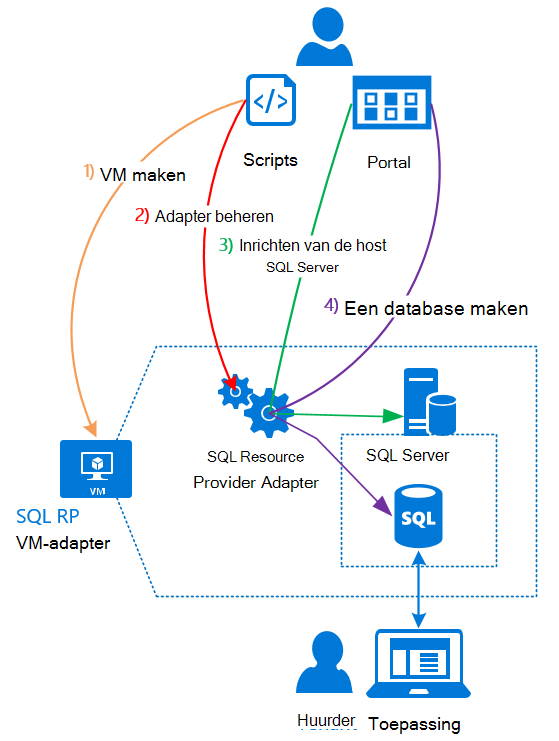

<properties
    pageTitle="Met behulp van SQL-databases op Azure Stack | Microsoft Azure"
    description="Informatie over hoe u SQL-databases als een service op Azure Stack en de snelle stappen voor de implementatie van de SQL Server resource provider adapter kunt implementeren."
    services="azure-stack"
    documentationCenter=""
    authors="Dumagar"
    manager="byronr"
    editor=""/>

<tags
    ms.service="multiple"
    ms.workload="na"
    ms.tgt_pltfrm="na"
    ms.devlang="na"
    ms.topic="article"
    ms.date="09/26/2016"
    ms.author="dumagar"/>

# SQL-databases gebruiken in Azure Stack

> [AZURE.NOTE] De volgende informatie geldt alleen voor Azure Stack TP1-implementaties.

Gebruik de SQL Server resource provider adapter SQL-databases weergegeven als een service van de Azure. Nadat u de resource-provider kunnen u en uw gebruikers databases maken voor cloud native apps en websites die zijn gebaseerd op SQL workloads die zijn gebaseerd op SQL zonder het inrichten van een virtuele machine (VM) waarop SQL Server elke keer.

Omdat de provider van de resource niet alle mogelijkheden van Azure SQL-Database tijdens de haalbaarheidstest bewijs, worden in dit artikel begint met een overzicht van de resource provider-architectuur. Vervolgens krijgt u een snel overzicht van de stappen voor het instellen van de provider van de bron, met koppelingen naar de meer gedetailleerde stappen in [de SQL-Database resource provider adapter op Azure Stack Haalbaarheidstest implementeren](azure-stack-sql-rp-deploy-long.md).

## SQL Server resource provider adapter-architectuur
De resource-provider biedt niet alle database mogelijkheden voor beheer van Azure SQL-Database. Bijvoorbeeld elastische database pools en prestaties van de database omhoog en omlaag kunt uitbellen onderweg zijn niet beschikbaar. Echter, de resource voorziening ondersteunt de dezelfde maken, lezen, bijwerken en verwijderen van (CRUD) dat beschikbaar is in Azure SQL-Database.

De resource-provider bestaat uit drie onderdelen:

- **De SQL resource provider adapter VM**, hetgeen overeenkomt met het bron-provider en de servers met SQL Server.
- **De resource-provider zelf**, die leveringsaanvragen verwerkt en beschrijft de bronnen van de database.
- **Servers die host voor SQL Server**, die de capaciteit voor databases.

De volgende conceptueel diagram ziet deze onderdelen en de stappen die u hebt doorlopen bij het implementeren van de provider van de resource, instellen van een server die als host fungeert voor SQL Server en vervolgens een database maken.

## Snelle stappen voor de implementatie van de resource-provider
Volg deze procedure als u al bekend met Azure Stack bent. Als u meer informatie wilt, volgt u de koppelingen in elke sectie of Ga direct naar [de SQL-Database resource provider adapter op Azure Stack Haalbaarheidstest implementeren](azure-stack-sql-rp-deploy-long.md).

1.  Zorg ervoor dat u alle [instellen stappen voordat u](azure-stack-sql-rp-deploy-long.md#set-up-steps-before-you-deploy) de resource-provider hebt voltooid:

  - .NET 3.5 framework is al ingesteld in de basisinstallatiekopie van Windows Server. (Als u de bits Azure Stack gedownload na 23 februari 2016, kunt u deze stap overslaan.)
  - [Een uitgave van Azure PowerShell die compatibel is met Azure-Stack is geïnstalleerd](http://aka.ms/azStackPsh).
  - In Internet Explorer de beveiligingsinstellingen op de ClientVM, [Internet Explorer Verbeterde beveiliging is uitgeschakeld en cookies zijn ingeschakeld](azure-stack-sql-rp-deploy-long.md#Turn-off-IE-enhanced-security-and-enable-cookies).

2. [Download het bestand van de binaire bestanden van SQL Server RP](http://aka.ms/massqlrprfrsh) en pak het het ClientVM in de Stack Azure Implementatiemodel.

3. [Bootstrap.cmd en -scripts uitvoeren](azure-stack-sql-rp-deploy-long.md#Bootstrap-the-resource-provider-deployment-PowerShell-and-Prepare-for-deployment).

    Een set van scripts is gegroepeerd op twee belangrijke tabbladen openen in de PowerShell Integrated Scripting Environment (ISE). De geladen scripts uitvoeren in volgorde van links naar rechts in elk tabblad.

    1. Een script uitvoeren op het tabblad **voorbereiden** van links naar rechts voor:

        - Maak een wildcard certificaat om beveiligde communicatie tussen de bronnen en Azure Resource Manager.
        - De certificaten en alle andere onderdelen uploaden naar een opslag voor Azure Stack.
        - Galerie pakketten publiceren zodat u kunt SQL-bronnen door de galerie en implementeren.

        > [AZURE.IMPORTANT] Als een van de scripts zonder aanwijsbare reden vastloopt nadat u uw huurder Azure Active Directory indienen, blokkeert door uw beveiligingsinstellingen een DLL-bestand dat is vereist voor de implementatie uit te voeren. Dit probleem op te lossen zoeken naar de Microsoft.AzureStack.Deployment.Telemetry.Dll in de map resource provider, met de rechtermuisknop klikt u op **Eigenschappen**en Controleer op het tabblad **Algemeen** op **blokkering opheffen** .

    1. Een script uitvoeren op het tabblad **implementeren** van links naar rechts aan:

        - [Een VM implementeren](azure-stack-sql-rp-deploy-long.md#Deploy-the-SQL-Server-Resource-Provider-VM) waarop de resource provider en de SQL Server. Dit script verwijst naar een JSON parameter-bestand dat u nodig hebt om te werken met bepaalde waarden voordat u het script uitvoert.
        - [Een lokale DNS-record registreren](azure-stack-sql-rp-deploy-long.md#Update-the-local-DNS) die is toegewezen aan de resource provider VM.
        - [Registreer uw provider resource](azure-stack-sql-rp-deploy-long.md#Register-the-SQL-RP-Resource-Provider) met de lokale Azure Resource Manager.

        > [AZURE.IMPORTANT] Alle scripts wordt ervan uitgegaan dat de installatiekopie van het besturingssysteem voldoet aan de vereisten (.NET 3.5 geïnstalleerd, JavaScript en cookies zijn ingeschakeld op de ClientVM en een compatibele versie van Azure PowerShell is geïnstalleerd). Als u foutmeldingen ontvangt wanneer u de scripts uitvoert, controleert u nogmaals dat u de voorwaarden hebt voldaan.

6. [Verbinding maken met de provider van de resource naar een server die als SQL Server host fungeert](#Provide-capacity-to-your-SQL-Resource-Provider-by-connecting-it-to-a-hosting-SQL-server) in de Stack Azure-portal. Klik op **Bladeren** &gt; **Resource Providers** &gt; **SQLRP** &gt; **Ga naar de Provider Resourcemanagement** &gt; **Servers** &gt; **toevoegen**.

    Gebruik "sa" voor de gebruikersnaam en het wachtwoord die u gebruikt wanneer u de resource provider VM geïmplementeerd.

7. [Test uw nieuwe provider voor SQL Server-bron](/azure-stack-sql-rp-deploy-long.md#create-your-first-sql-database-to-test-your-deployment), een SQL-database in de Stack Azure-portal te implementeren. **Klik op** &gt; **aangepaste** &gt; **SQL Server-Database**.

Dit moet krijgen de provider SQL Server resource hoger in ongeveer 45 minuten (afhankelijk van de hardware).
