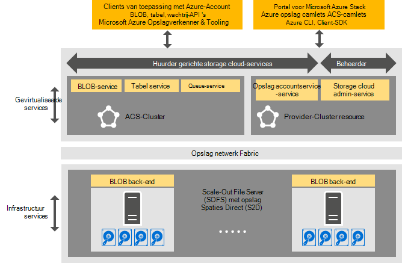

<properties
    pageTitle="Inleiding tot Azure consistent opslag | Microsoft Azure"
    description="Meer informatie over Azure consistent opslag"
    services="azure-stack"
    documentationCenter=""
    authors="AniAnirudh"
    manager="darmour"
    editor=""/>

<tags
    ms.service="azure-stack"
    ms.workload="na"
    ms.tgt_pltfrm="na"
    ms.devlang="na"
    ms.topic="get-started-article"
    ms.date="09/26/2016"
    ms.author="anirudha"/>

# Inleiding tot Azure consistent opslag
Azure consistent opslag is de set van de storage cloud-services in Microsoft Azure stapel. Azure consistent opslag biedt blob, tabel, wachtrij en account management functionaliteit met Azure consistent semantiek. Het biedt ook een functie waarmee een beheerder van een cloud storage-services beheren. Dit artikel introduceert Azure consistent opslag en hoe storage cloud-services in Azure stapel past mooi bij de uitgebreide [opslagmogelijkheden in Windows Server 2016 software gedefinieerd](https://blogs.technet.microsoft.com/windowsserver/2016/04/14/ten-reasons-youll-love-windows-server-2016-5-software-defined-storage/).

Azure consistent opslag biedt de volgende categorieën van functies:

- **BLOB's**: BLOB's pagina, BLOB's blokkeren en append BLOB met   [Azure consistent blob's](https://msdn.microsoft.com/library/azure/dd179355.aspx#Anchor_1) 
   gedrag

- **Tabellen**: entiteiten, partities en andere eigenschappen van de tabel met   [Azure consistent tabel](https://msdn.microsoft.com/library/azure/dd179355.aspx#Anchor_3) 
   gedrag

- **Wachtrijen**: betrouwbaar en permanente berichten en wachtrijen met   [Azure consistent wachtrij](https://msdn.microsoft.com/library/azure/dd179355.aspx#Anchor_2) 
   gedrag

- **Accounts**: beheer van opslagbronnen rekening met   [Azure consistent account](https://azure.microsoft.com/documentation/articles/storage-create-storage-account/) 
   gedrag voor algemene opslag rekeningen ingericht via het [implementatiemodel Azure Resource Manager](https://azure.microsoft.com/documentation/articles/resource-manager-deployment-model/)

- **Beheer**: beheer van de huurder gerichte en Azure consistent interne opslag opslagservices (besproken in andere artikelen)

## Azure consistent opslagarchitectuur

Figuur 1. Azure consistent opslag: oplossing weergeven

## Azure consistent opslag gevirtualiseerde services en clusters

In de Azure consistent opslagarchitectuur alle huurder of beheerder toegankelijk opslagservices gevirtualiseerd. Dat wil zeggen, ze worden uitgevoerd in de service provider wordt beheerd, hoge beschikbaarheid die VMS op basis van [Hyper-V](https://technet.microsoft.com/library/dn765471.aspx) -functie in [Windows Server 2016](http://www.microsoft.com/server-cloud/products/windows-server-2016/).
Hoewel het VMs uiterst beschikbaar op basis van [Windows Server Failover Clustering](https://technet.microsoft.com/library/dn765474.aspx) -technologie zijn, zijn de Azure consistent gevirtualiseerde opslagservices zelf Gast geclusterd, maximaal beschikbare diensten op basis van [Azure Service Fabric-technologie](http://azure.microsoft.com/campaigns/service-fabric/).

Azure consistent opslag maakt gebruik van twee Service Fabric clusters in een stapel Azure-implementatie.
De opslag Resource Provider-service is geïmplementeerd op een Service Fabric '-cluster ('RP cluster') die ook door andere services van de provider moeten beschikken over bron wordt gedeeld. De rest van de opslag gevirtualiseerde gegevens pad services--inclusief de Blob, een tabel en een wachtrij services--worden gehost op een tweede Service Fabric '-cluster ('Azure consistent opslag cluster').

## BLOB-service en de software-defined storage

De Blob terug service beëindigen, aan de andere kant wordt rechtstreeks op de clusterknooppunten [Scale-Out File Server](https://technet.microsoft.com/library/hh831349.aspx) uitgevoerd. In de oplossing Azure-Stack architectuur bestandsserver Scale-Out is gebaseerd op de [Opslag spaties directe](https://technet.microsoft.com/library/mt126109.aspx)-basis, gedeelde failover-cluster. Afbeelding 1 ziet u de belangrijkste Azure consistent opslag componentservices en hun distributed deployment-model. Zoals u in het diagram ziet, geassembleerd Azure consistent opslag met bestaande software-defined storage-functies in Windows Server 2016. Er is geen speciale hardware is vereist voor Azure consistent opslag buiten deze vereisten voor Windows Server-platform.

## Opslagsysteem

Opslagsysteem is de verzameling van opslaginfrastructuur, resources en back-end services die samen huurder gerichte en gerichte beheerder Azure consistent storage-services in een stapel Azure-implementatie bieden. Opslagsysteem bevat de volgende gegevens op:

- De opslaghardware (bijvoorbeeld knooppunten Scale-Out File Server, schijven)

- Fabric opslagbronnen (bijvoorbeeld SMB-shares)

- Opslag-gerelateerde Service configuratieservices (bijvoorbeeld Blob eindpunt service uit het cluster met Azure consistent opslag)

- Opslag-gerelateerde services die worden uitgevoerd op de bestandsserver Scale-Out knooppunten (bijvoorbeeld de Blob-service)

## Gebruiksscenario's voor storage IaaS en PaaS

Azure consistent opslag pagina BLOB's, zoals in Azure, bieden de virtuele schijven in alle infrastructuur als het gebruik van een service (IaaS) scenario's:

- Een VM met behulp van de aangepaste OS schijf in een blob pagina maken

- Een VM met behulp van de aangepaste installatiekopie van het besturingssysteem in een blob pagina maken

- Een VM maken met behulp van een Azure Marketplace-afbeelding in een nieuwe pagina blob

- Een VM maken met behulp van een lege schijf in een nieuwe pagina blob

Op dezelfde manier voor platform als een service (PaaS)-scenario's, Azure consistent opslag blok-blobs BLOB's, wachtrijen, toevoegen en tabellen werken zoals ze in Azure doen.

## Gebruikersrollen

Azure consistent opslag is waardevol voor twee rollen:

- Eigenaren van toepassing, met inbegrip van ontwikkelaars en IT-onderneming. Ze moeten niet meer twee versies van een toepassing en scripts waarmee dezelfde taak via een openbare cloud en een wolk en een persoonlijke gehost in een datacenter uitvoeren te implementeren of onderhouden. Azure consistent opslag verzorgt opslag via REST API, SDK cmdlet en Azure Stack portal.

- Dienstverleners, met inbegrip van enterprise IT, die implementeren en beheren van Microsoft Azure Stack, multitenant storage cloud-services.

## Volgende stappen

- [Azure consistent opslag: verschillen en overwegingen] (azure-stack-acs-verschillen-tp2.md)
