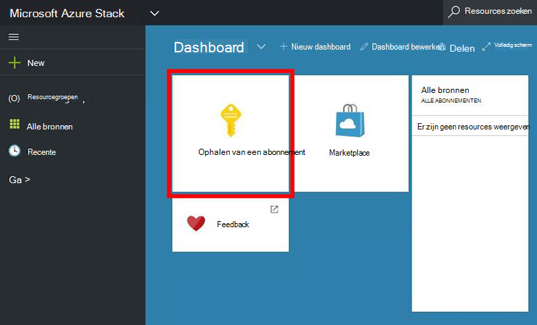
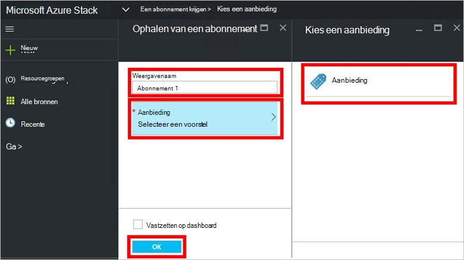
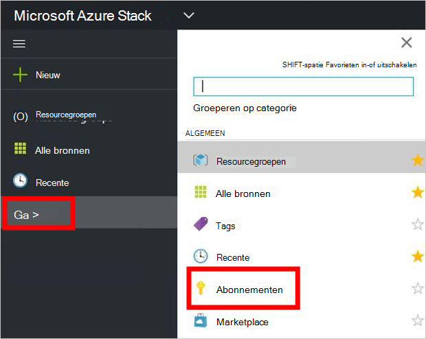

<properties
    pageTitle="Abonneer u op een aanbieding en richt een VM in Azure Stack (huurder) | Microsoft Azure"
    description="Als een huurder, informatie over het abonneren op een aanbieding en richt een VM in Azure stapel."
    services="azure-stack"
    documentationCenter=""
    authors="ErikjeMS"
    manager="byronr"
    editor=""/>

<tags
    ms.service="azure-stack"
    ms.workload="na"
    ms.tgt_pltfrm="na"
    ms.devlang="na"
    ms.topic="get-started-article"
    ms.date="09/26/2016"
    ms.author="erikje"/>

# Abonneer u op een aanbieding

Nu dat u [gemaakt van een aanbieding hebt](azure-stack-create-offer.md), test u kunnen uw huurders een abonnement maken.

1.  Op de computer Azure Stack Implementatiemodel aanmelden bij `https://portal.azurestack.local` als [een huurder](azure-stack-connect-azure-stack.md#log-in-as-a-tenant) en op **een abonnement**.

    

2.  Typ een naam voor uw abonnement, klikt u op **bieden**, klikt u op een van de aanbiedingen in het blad **een aanbieding kiezen** en klik op **maken**in het veld **Weergegeven naam** .

    

4.  Als u wilt weergeven van het abonnement dat u hebt gemaakt, klikt u op **Bladeren**, **abonnementen**, klik op het nieuwe abonnement.  

    

Nadat u zich op een voorstel abonneert, vernieuwt u de portal om te zien welke diensten deel uitmaken van het nieuwe abonnement.

## Volgende stappen

[Inrichten van een virtuele machine](azure-stack-provision-vm.md)
