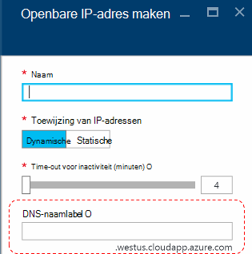
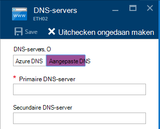
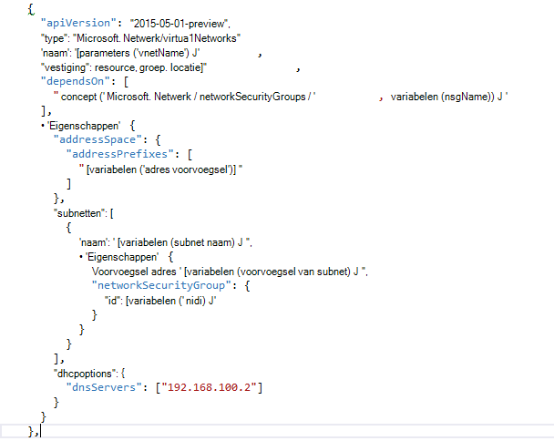

<properties
    pageTitle="Wat is DNS in Azure Stack TP2 | Microsoft Azure"
    description="Wat zijn de nieuwe DNS-functies en voorzieningen in Azure Stack TP2"
    services="azure-stack"
    documentationCenter=""
    authors="ScottNapolitan"
    manager="darmour"
    editor=""/>

<tags
    ms.service="azure-stack"
    ms.workload="na"
    ms.tgt_pltfrm="na"
    ms.devlang="na"
    ms.topic="get-started-article"
    ms.date="09/26/2016"
    ms.author="scottnap"/>

# Introductie van IDN's voor Azure Stack
================================

IDN is een nieuwe functie in de Technology Preview 2 voor Azure Stack, waarmee u kunt oplossen door de externe DNS-namen (bijvoorbeeld http://www.bing.com).
Ook kunt u interne virtuele netwerknamen registreren. Op deze manier kunt u oplossen VMs in hetzelfde virtuele netwerk door naam in plaats van IP-adres, zonder aangepaste DNS-serververmeldingen bieden.

Het is iets dat er in Azure is, maar nu is het beschikbaar in Windows Server 2016 en Azure-Stack te.

Wat doet de IDN's?
------------------

Met IDN's in stapel Azure krijgt u de volgende mogelijkheden zonder aangepaste DNS-serververmeldingen opgeven.

-   DNS-naamomzettingsservices voor werkbelasting huurder gedeeld.

-   Gezaghebbende DNS-service voor naamomzetting en DNS-registratie in het virtuele netwerk huurder.

-   Recursive DNS-service voor het herleiden van namen van huurder VMs Internet. Huurders langer niet te aangepaste DNS-vermeldingen voor oplossen van Internet-namen (bijvoorbeeld www.bing.com) opgeven.

U kunt doen om uw eigen DNS en aangepaste DNS-servers gebruiken als u wilt. Maar nu, als u wilt kunnen Internet DNS-namen en andere virtuele machines in hetzelfde virtuele netwerk verbinding kunnen maken, u hoeft en werkt gewoon op te lossen.

Wat is IDN's niet?
---------------------

Welke IDN's kunt u niet te doen is een DNS-record maken voor een naam die herleid uit buiten het virtuele netwerk worden kan.

In Azure hebt u de optie voor het opgeven van een DNS-naamlabel die gekoppeld aan een openbaar IP-adres worden kan. U kunt het label (voorvoegsel), maar Azure kiest het achtervoegsel dat is gebaseerd op de regio waarin u het openbare IP-adres maken.

In de afbeelding maakt Azure een A-record in DNS voor de DNS-naamlabel die is opgegeven in de zone **westus.cloudapp.azure.com**. Het voorvoegsel en het achtervoegsel samen vormen een volledig gekwalificeerde domein naam (Fully Qualified Domain Name) die uit een willekeurige plaats op het openbare Internet kunnen worden opgelost.

In TP2 ondersteunt Azure-Stack alleen het IDN's voor interne naamregistratie, zodat het volgende niet doen.

-   Maak een DNS-record in een bestaande host DNS-zone (bijvoorbeeld azurestack.local).

-   Maak een DNS-zone (zoals Contoso.com).

-   Maak een record onder uw eigen aangepaste DNS-zone.

-   Ondersteuning voor de aankoop van domeinnamen.

Wijzigingen in de DNS van Azure Stack TP1
-----------------------------------

In de Technology Preview 1 (TP1) versie van Azure Stack moest u aangepaste DNS-servers opgeven als u wilt kunnen hosts kunt oplossen door de naam in plaats van IP-adres. Dit betekent dat als u een virtueel netwerk of een VM maakt, moest u ten minste één vermelding van de DNS-server opgeven. Dit betekende het onderzoektijdvak Implementatiemodel Fabric-DNS-server, namelijk 192.168.200.2 invoeren voor het milieu TP1 Implementatiemodel.

Als u een VM via het portal gemaakt, moest u **Aangepaste DNS** in het virtuele netwerk of een Ethernet-Adapterinstellingen selecteren.

In TP2, Azure DNS kunt selecteren en hoeft geen aangepaste DNS-serververmeldingen opgeven.

Als u een VM via een sjabloon hebt gemaakt met uw eigen afbeelding, moest u de eigenschap **DHCPOptions** toevoegen en de DNS-server om de DNS-naamomzetting werkt. De volgende afbeelding ziet wat dit staande.

In TP2 langer u niet aan deze wijzigingen aanbrengen in uw VM-sjablonen waarmee u uw VMs Internet-namen om te zetten. Zij moeten werken.