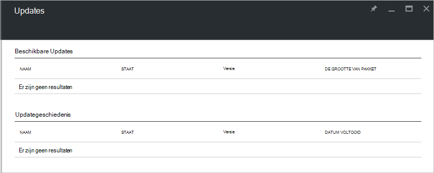

<properties
    pageTitle="Updates in Azure stapel | Microsoft Azure"
    description="Meer informatie over de updates in Azure Stack"
    services="azure-stack"
    documentationCenter=""
    authors="HeathL17"
    manager="byronr"
    editor=""/>

<tags
    ms.service="azure-stack"
    ms.workload="na"
    ms.tgt_pltfrm="na"
    ms.devlang="na"
    ms.topic="article"
    ms.date="09/26/2016"
    ms.author="Helaw"/>

# Beheer van updates in Azure stapel
Technische Preview 2 bevat een voorbeeld van de ervaring voor het beheren van updates Azure Stack.  In dit onderwerp gaat u naar het knooppunt updates navigeren.  

## Updates blade
1.  Als u het blad Updates, klikt u op **Bladeren** en klik vervolgens op **Updates**.

2.  Klik op de **lokale** locatie.

3.  U ziet een scherm met beschikbare updates en historie bijwerken.  In technische Preview 2 worden er geen updates beschikbaar zijn voor installatie.  

    

## Volgende stappen
- [Azure-Stack Implementatiemodel architectuur te begrijpen](azure-stack-architecture.md)      
- [Vereisten voor implementatie begrijpen](azure-stack-deploy.md)
- [Azure Stack implementeren](azure-stack-run-powershell-script.md)
 
    
  

  

