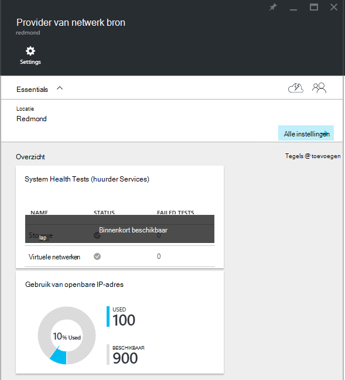
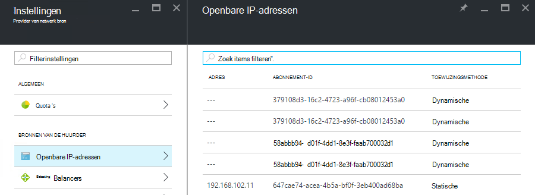

<properties
    pageTitle="Verbruik van openbare IP-adres weergeven in TP2 | Microsoft Azure"
    description="Beheerders kunnen het verbruik van openbare IP-adressen weergeven in een regio"
    services="azure-stack"
    documentationCenter=""
    authors="ScottNapolitan"
    manager="darmour"
    editor=""/>

<tags
    ms.service="azure-stack"
    ms.workload="na"
    ms.tgt_pltfrm="na"
    ms.devlang="na"
    ms.topic="get-started-article"
    ms.date="09/26/2016"
    ms.author="scottnap"/>

# Verbruik van openbare IP-adres in Azure Stack TP2 weergeven

Als servicebeheerder kunt u het aantal openbare IP-adressen die zijn toegewezen aan huurders, het aantal openbare IP-adressen die zijn nog steeds beschikbaar zijn voor de toewijzing en het percentage van openbare IP-adressen die zijn toegewezen op die locatie te bekijken.

De tegel **Gebruik van openbare IP-adres** geeft het totale aantal openbare IP-adressen die in alle openbare IP-adresgroepen van de fabric zijn verbruikt, of ze zijn gebruikt voor pachters IaaS VM instanties, configuratieservices infrastructure of openbare IP-adresbronnen die expliciet door de huurders zijn gemaakt.

Het doel van deze tegel is Azure Stack beheerders geven een beeld van het totale aantal openbare IP-adressen op deze locatie zijn verbruikt. Hiermee kan beheerders bepalen of ze weinig van deze bron.

Op het blad **Instellingen** het **Openbare IP-adressen** menu onder **huurder bronnen** worden vermeld alleen de openbare IP-adressen die *expliciet gemaakt door huurders zijn*. Als zodanig, dat het aantal **gebruikte** openbare IP-adressen op het **Gebruik van openbare IP-adres** van elkaar verschilt altijd (groter dan) het nummer op de tegel **Openbare IP-adressen** onder **huurder resources**.

## Het openbare IP-adres gebruiksgegevens weergeven

Het totale aantal openbare IP-adressen zijn verbruikt in de regio bekijken:

1.  In de portal Azure Stack klikt u op **Bladeren**en selecteert u de **Resource-Providers**.

2.  Selecteer uit de lijst van **Aanbieders van Resource** **Network Resource Provider Admin**.

3.  Ook kunt u Bladeren **| Locaties** en selecteer de locatie die u wilt weergeven in de lijst. Selecteer vervolgens op de tegel **Providers Resource** **Network Resource Provider Admin**.

4.  De **Netwerkprovider Resource** aanvoer blade wordt de tegel **Gebruik van openbare IP-adres** weergegeven in de sectie **Overzicht** .

Houd er rekening mee dat de **gebruikte** getal geeft het aantal openbare IP-van alle openbare IP adressen-adres op die locatie van toepassingen die zijn toegewezen. De **beschikbare** getal geeft het aantal openbare IP-van alle openbare IP adressen adres van toepassingen die niet zijn toegewezen en zijn nog steeds beschikbaar. De **% gebruikt** getal geeft het aantal gebruikte of toegewezen adressen als een percentage van het totale aantal van openbare IP-in alle openbare IP adressen-adres van toepassingen op die locatie.

## Het openbare IP-adressen die zijn gemaakt door de huurder abonnementen weergeven

Een overzicht van openbare IP-adressen die expliciet door de huurder abonnementen in een bepaalde regio zijn gemaakt, gaat u naar de blade **Instellingen** van het **Netwerk Resource Provider Admin**en selecteer **Openbare IP-adressen**.

U zult merken dat sommige openbare IP-adressen die dynamisch zijn toegewezen in de lijst weergegeven, maar er geen adres die daaraan nog. Dit is omdat de bron van het adres is in de netwerkprovider bron, maar niet in de Controller van het netwerk nog gemaakt.

De netwerkcontroller heeft geen adres toegewezen aan deze bron totdat deze daadwerkelijk is gebonden aan een interface, een netwerk-interfacekaart (NIC), een load balancer of een virtueel netwerkgateway. Het openbare IP-adres is gekoppeld aan een interface, de domeincontroller netwerk wijst een IP-adres aan als deze wordt weergegeven in het veld **adres** .

## De openbare IP-adres samenvattende tabel weergeven

Er zijn een aantal andere gevallen waarin de openbare IP-adressen worden toegewezen die bepalen of het adres wordt weergegeven in een lijst of een andere.

| **Geval van openbare IP-adres toewijzing** | **Wordt weergegeven in het gebruiksoverzicht** | **Wordt weergegeven in de lijst van huurder openbare IP-adressen** |
| ------------------------------------- | ----------------------------| ---------------------------------------------- |
| Dynamische openbare IP-adres nog niet is toegewezen aan een NIC of load balancer (tijdelijke) | Nee | Ja |
| Dynamische openbare IP-adres is toegewezen aan een NIC of load balancer. | Ja | Ja |
| Statische openbare IP-adres dat is toegewezen aan een huurder NIC of load balancer. | Ja | Ja |
| Statische openbare IP-adres dat is toegewezen aan een fabric-infrastructuur-service-eindpunt. | Ja | Nee |
| Openbare IP-adres wordt impliciet gemaakt voor VM IaaS exemplaren en gebruikt voor uitgaande NAT voor het virtuele netwerk. Deze worden achter de schermen gemaakt wanneer een huurder een VM-sessie maakt, zodat de VMs verstuurt informatie naar het Internet. | Ja | Nee |
