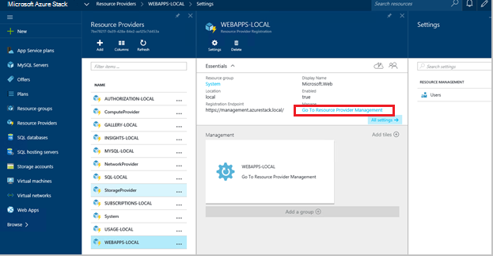
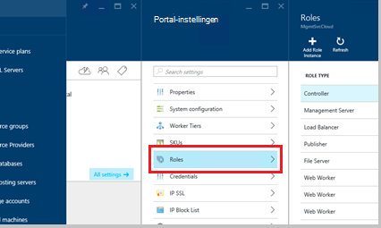
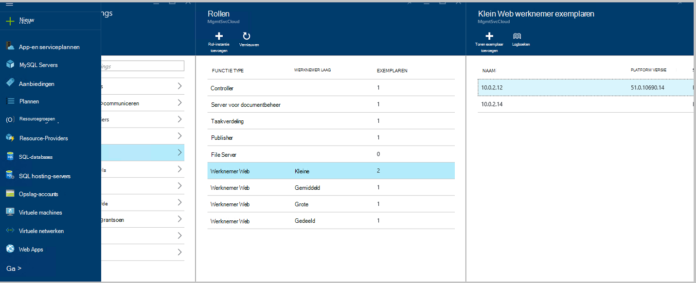
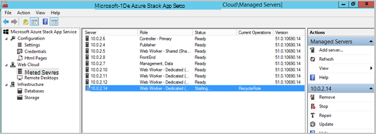
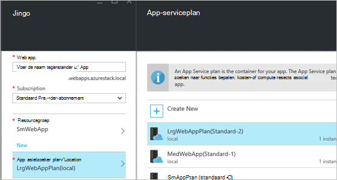
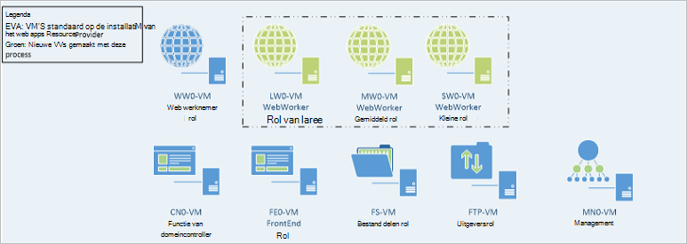

<properties
    pageTitle="Web-Web-Apps toe te voegen meer rollen werknemer | Microsoft Azure"
    description="Gedetailleerde richtsnoeren voor schalen Azure Stack Web App"
    services="azure-stack"
    documentationCenter=""
    authors="kathm"
    manager="slinehan"
    editor=""/>

<tags
    ms.service="azure-stack"
    ms.workload="app-service"
    ms.tgt_pltfrm="na"
    ms.devlang="na"
    ms.topic="article"
    ms.date="09/26/2016"
    ms.author="kathm"/>

#   <a name="web-apps-adding-more-web-worker-roles"></a>Web Apps: Meer web werknemer rollen toevoegen

> [AZURE.NOTE] De volgende informatie geldt alleen voor Azure Stack TP1-implementaties.

Dit document bevat instructies voor het schalen van Web-Apps web werknemer rollen. Het bevat stappen voor het maken van extra werknemer functies ter ondersteuning van web apps aanbiedingen van elke omvang.

Azure-Stack ondersteunt gratis en gedeelde web app-implementaties. Als u wilt toevoegen andere typen, moet u meer web werknemer rollen toevoegen.

Als u niet zeker wat bij de standaardinstallatie van Web Apps is geïmplementeerd weet, kunt u controleren als u meer informatie [hier](azure-stack-webapps-overview.md).

Schaal web werknemer rollen moeten de volgende stappen uit:

1.  [Een nieuwe virtuele machine maken](#step-1-create-a-new-vm-to-support-the-new-instance-size)

2.  [Configureer de virtuele machine](#step-2-configure-the-virtual-machine)

3.  [De rol van de werknemer web in de portal Azure-Stack configureren](#step-3-configure-the-web-worker-role-in-the-azure-stack-portal)

4.  [App serviceplannen configureren](#step-4-configure-app-service-plans)

##<a name="step-1-create-a-new-vm-to-support-the-new-instance-size"></a>Stap 1: Maak een nieuwe VM ter ondersteuning van het nieuwe exemplaar van formaat

Een virtuele machine maken zoals beschreven in [dit artikel](azure-stack-provision-vm.md), ervoor te zorgen dat de volgende selecties worden gemaakt:

 - Gebruikersnaam en wachtwoord: de gebruikersnaam en het wachtwoord dat u hebt opgegeven tijdens de installatie van Web Apps bieden.

 - Abonnement: Gebruik de provider standaardabonnement.

 - Resourcegroep: kies **AppService Local**.

> [AZURE.NOTE]De virtuele machines voor het rollen van de werknemer in dezelfde bronnengroep als de toepassing wordt gedistribueerd naar Web-Apps opslaan. (Dit wordt aanbevolen voor deze versie.)

##<a name="step-2-configure-the-virtual-machine"></a>Stap 2: De virtuele Machine configureren

Nadat de installatie is voltooid, worden de volgende configuratie is vereist ter ondersteuning van de rol van de werknemer web:

1.  Open Serverbeheer op de hostcomputer en klik op **Extra** &gt; **HyperV Manager**.

2.  Verbinding maken met behulp van Remote Desktop Protocol (RDP) op de nieuwe virtuele machine die u in stap 1 hebt gemaakt. De naam van de server bevindt zich in het deelvenster overzicht bij het selecteren van elke VM.

3.  PowerShell openen door op de knop **Start** te klikken en te typen PowerShell. Met de rechtermuisknop op de **PowerShell.exe**en selecteer **Als administrator uitvoeren** PowerShell openen in de administrator-modus.

4.  Kopiëren en plakken elke van de volgende opdrachten (één tegelijk) in het venster PowerShell en druk op enter:

    ```netsh advfirewall firewall set rule group="File and Printer Sharing" new enable=Yes```
    ```netsh advfirewall firewall set rule group="Windows Management Instrumentation (WMI)" new enable=yes```
    ```reg add HKLM\\SOFTWARE\\Microsoft\\Windows\\CurrentVersion\\Policies\\system /v LocalAccountTokenFilterPolicy /t REG\_DWORD /d 1 /f```

5.  De virtuele machine opnieuw op te starten.

> [AZURE.NOTE]Opmerking: Dit zijn minimale vereisten voor Web Apps. De standaardinstellingen van de Windows 2012 R2 afbeelding met Azure Stack opgenomen zijn. De instructies zijn verleend ter referentie en voor mensen met een andere afbeelding.

##<a name="step-3-configure-the-web-worker-role-in-the-azure-stack-portal"></a>Stap 3: De rol van de werknemer web in de portal Azure-Stack configureren

1.  De portal worden geopend als de servicebeheerder op **ClientVM**.

2.  Ga naar de **Resource Providers** &gt; **WEBAPPS lokaal**.

    
 
3.  Klik op **Ga naar Provider Resourcemanagement**.

4.  Klik op **rollen**.

    
 
5.  Klik op **rol-instantie toevoegen**.

6.  Klik op de **laag** de gewenste implementatie van het nieuwe exemplaar aan (kleine, middelgrote, grote of gedeeld).

    
 
7.  Het volgende configureren:
 - Servernaam: Geef het IP-adres van de server die u eerder (in sectie 1) gemaakt.
 - Type functie: Web werknemer.
 - Werknemer fase: Overeenkomsten trapsgewijs grootte geselecteerd.

8. Klik op **OK.**

9. Log in op CN0 VM en open de **Webpagina Cloud Management MMC**.

10. Ga naar de **Cloud Web** &gt; **Servers beheerd**.

11. Klik op de naam van de server die u zojuist hebt geïmplementeerd. De statuskolom te bekijken en te verplaatsen naar de volgende stap, totdat de status "Gereed" wachten.

    

##<a name="step-4-configure-app-service-plans"></a>Stap 4: Configureer serviceplannen app

> [AZURE.NOTE]In de huidige versie van Web Apps moeten app serviceplannen worden opgeslagen in aparte bronnengroepen. Een resourcegroep voor elke grootte van web app maken en plannen voor de toepassing in de juiste resourcegroepen plaats.

1.  Log in om de portal op de ClientVM.

2.  Ga naar de **nieuwe** &gt; **Web en Mobile**.

3.  Selecteer de webtoepassing die u wilt implementeren.

4.  De gegevens op het web app en selecteer **AppService Plan / locatie**.

-   Klik op **Nieuw maken**.

-   Maak uw nieuwe schema, de bijbehorende prijzen laag voor het plan te selecteren.

> [AZURE.NOTE]U kunt meerdere plannen op deze blade. Voordat u implementeert, moet u ervoor zorgen dat u het juiste plan hebt geselecteerd.

Hier volgt een voorbeeld van de verschillende plannen beschikbaar:    

##<a name="final-web-app-service-vm-configuration"></a>Laatste Web App service VM configuratie

De onderstaande afbeelding geeft een overzicht van de omgeving als u de werknemer web rollen hebt geschaald. De groene items vertegenwoordigen de nieuwe functie toegevoegd.
    
