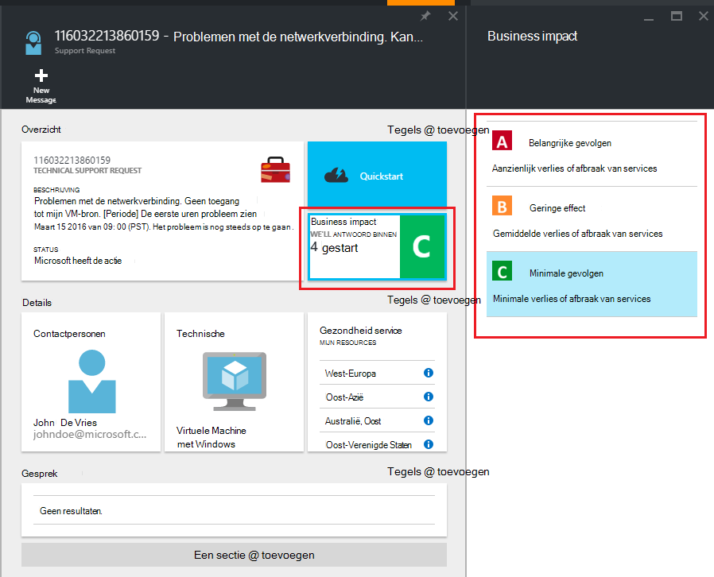

<properties
     pageTitle="Het maken van een ondersteuningsverzoek Azure | Microsoft Azure"
     description="Het maken van een ondersteuningsverzoek Azure."
     services="Azure Supportability"
     documentationCenter=""
     authors="ganganarayanan"
     manager="scotthit"
     editor=""/>

<tags
     ms.service="azure-supportability"
     ms.workload="na"
     ms.tgt_pltfrm="na"
     ms.devlang="na"
     ms.topic="article"
     ms.date="10/25/2016"
     ms.author="gangan"/>

# Het maken van een ondersteuningsverzoek Azure

## Samenvatting
Azure klanten kunnen maken en beheren van aanvragen voor ondersteuning in Azure portal [https://portal.azure.com](https://portal.azure.com).
>[AZURE.NOTE] De Azure portal voor Duitsland is [https://portal.microsoftazure.de](https://portal.microsoftazure.de) en Azure regering portal is het [https://portal.azure.us](https://portal.azure.us).

We hebben op basis van feedback van klanten, de ervaring van de aanvraag ondersteuning bijgewerkt zich concentreren op de drie belangrijkste doelstellingen:

- **Streamlined**: muisklikken en bladen te vereenvoudigen het proces voor het indienen van een verzoek om ondersteuning te verminderen.
- **Geïntegreerde**: wanneer u een probleem met een Azure-bron oplossen wilt, moet eenvoudig een verzoek om ondersteuning voor die bron openen zonder het overschakelen naar een andere context.
- **Efficiënt**: de belangrijkste informatie efficiënt uw probleem op te lossen moet de ondersteuningstechnicus verzamelen.

## Aan de slag
Kunt u een verzoek om ondersteuning van de bovenste navigatiemenu of rechtstreeks vanuit een bron blade.

**Op de bovenste navigatiebalk**

**Van een resource blade**

## Grondbeginselen
De eerste stap van het aanvraagproces voor ondersteuning verzamelt informatie over uw probleem en uw ondersteuningsplan.

We nemen een voorbeeld: U bent technische problemen geconfronteerd met de virtuele machine en vermoedt dat de problemen met de netwerkverbinding.
Selecteer de service ("virtuele Machine met Windows") en de bron (de naam van de virtuele machine) in de eerste stap van de wizard het proces voor het opvragen van help voor dit probleem te starten.

>[AZURE.NOTE] Azure biedt onbeperkte ondersteuning voor abonnementen beheren (dingen zoals facturering, quota aanpassingen en overdrachten account). Voor technische ondersteuning moet u een ondersteuningsplan. [Meer informatie over het ondersteuningsplannen](https://azure.microsoft.com/support/plans).

## Probleem
De tweede stap van de wizard wordt aanvullende informatie over het probleem verzameld. Die nauwkeurige gegevens in deze stap kan wij uw aanvraag doorsturen naar de beste ondersteuningstechnicus voor de afgifte en de diagnose van het probleem zo spoedig mogelijk beginnen.

U doorgaat met het voorbeeld van de virtuele machine connectiviteit van boven, dan vult u dit formulier om aan te geven van de problemen met de netwerkverbinding en u zou bieden meer informatie over het probleem, inclusief de bij benadering de tijd waarop het probleem optrad.

## Verwante Help-onderwerpen
Voor sommige problemen bieden we verwante help-koppelingen voor het oplossen van het probleem. Als de aanbevolen documenten niet helpen, kunt u door het proces voor het maken van een verzoek om ondersteuning blijven.

## Contactgegevens
De laatste stap van de wizard bevestigt uw contactgegevens, zodat wij weten hoe u bereiken.

Afhankelijk van de ernst van het probleem, kan u worden gevraagd om aan te geven als u tijdens de kantooruren of dat wilt als u liever een 24 x 7 respons, wat betekent dat we mogelijk contact met u op elk gewenst moment contact met u.

## Ondersteuningsaanvragen beheren
Nadat u het verzoek om ondersteuning maakt, kunt u de details van de pagina **Ondersteuning aanvragen beheren** weergeven.

**Op de bovenste navigatiebalk**

Op de pagina **aanvragen voor ondersteuning met beheren** kunt u alle ondersteuningsverzoeken en hun status bekijken.

Selecteer het verzoek om ondersteuning te bekijken van informatie, zoals de ernst en de verwachte tijd die het duurt om een ondersteuningstechnicus te reageren.

Als u wilt dat de ernst van de aanvraag te wijzigen, klikt u op de tegel **impact op uw bedrijf** . In het voorgaande voorbeeld wordt is de aanvraag ingesteld op prioriteit C.

De tegel klikken ziet u de lijst met severities die u aan een ondersteuningsverzoek openen toewijzen kunt.

>[AZURE.NOTE] De maximale ernst hangt af van het ondersteuningsplan. [Meer informatie over het ondersteuningsplannen](https://azure.microsoft.com/support/plans).

## Feedback
We zijn altijd open voor feedback en suggesties! Stuur ons uw [suggesties](https://feedback.azure.com/forums/266794-support-feedback). Bovendien kunt u met ons benaderd via [Twitter](https://twitter.com/azuresupport) of de [MSDN forums](https://social.msdn.microsoft.com/Forums/azure).

## Meer informatie
[Veelgestelde vragen over ondersteuning van Azure](https://azure.microsoft.com/support/faq)
