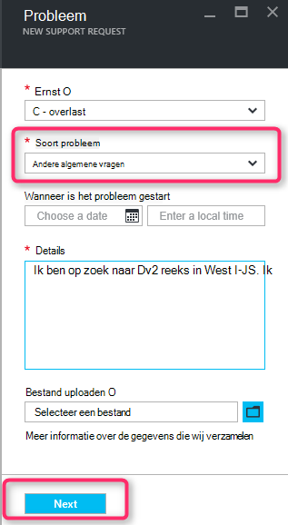

<properties
     pageTitle="SKU-serie niet beschikbaar | Microsoft Azure"
     description="Sommige SKU-serie zijn niet beschikbaar voor het geselecteerde abonnement voor dit gebied."
     services="Azure Supportability"
     documentationCenter=""
     authors="ganganarayanan"
     manager="scotthit"
     editor=""/>

<tags
     ms.service="azure-supportability"
     ms.workload="na"
     ms.tgt_pltfrm="na"
     ms.devlang="na"
     ms.topic="article"
     ms.date="08/12/2016"
     ms.author="gangan"/>

# SKU-reeks is niet beschikbaar

Bepaalde SKU's zijn in sommige regio's niet automatisch op nieuwe abonnementen beschikbaar.  Dit kan gebeuren als [krachtige SKU's zijn geïntroduceerd in een regio](https://azure.microsoft.com/updates/announcing-new-dv2-series-virtual-machine-size/) en de populariteit van de oude SKU afwijst.
Het bericht '*Sommige SKU-serie zijn niet beschikbaar voor het geselecteerde abonnement voor dit gebied*' wordt weergegeven bij het maken van een ondersteuningsverzoek compute core quota verhogen.

U kunt de SKU-beschikbaarheid op de pagina [Azure services per regio](https://azure.microsoft.com/regions/#services) zien. 

Maak een ondersteuningsverzoek "Abonnementen beheren" voor het aanvragen van toegang tot een SKU die uit uw abonnement is beperkt.

- Selecteer het type probleem als "Abonnementen beheren" op de pagina grondbeginselen en klik op 'Volgende'.

- Selecteert u het type probleem als 'Andere algemene vragen' en voer de exacte regio en de SKU die u ziet zijn niet op de pagina probleem.
Dit helpt versnellen het ondersteuningsproces.

- Klik op de pagina informatie contact op met uw contactgegevens en klik op 'Maken'.

## Feedback
We zijn altijd open voor feedback en suggesties! Stuur ons uw [suggesties](https://feedback.azure.com/forums/266794-support-feedback). Bovendien kunt u met ons benaderd via [Twitter](https://twitter.com/azuresupport) of de [MSDN forums](https://social.msdn.microsoft.com/Forums/azure).

## Meer informatie
[Veelgestelde vragen over ondersteuning van Azure](https://azure.microsoft.com/support/faq)
