<properties
    pageTitle="Herstellen van gegevens in een andere DPM-server in de back-kluis | Microsoft Azure"
    description="De gegevens die u naar een kluis Azure back-up hebt beveiligd tegen eventuele DPM server geregistreerd voor die kluis herstellen."
    services="backup"
    documentationCenter=""
    authors="nkolli1"
    manager="shreeshd"
    editor=""/>

<tags
    ms.service="backup"
    ms.workload="storage-backup-recovery"
    ms.tgt_pltfrm="na"
    ms.devlang="na"
    ms.topic="article"
    ms.date="08/08/2016"
    ms.author="giridham;jimpark;trinadhk;markgal"/>

# Herstellen van gegevens in een andere DPM-server in de back-kluis
U kunt de gegevens die u naar een kluis Azure back-up hebt beveiligd tegen eventuele DPM server geregistreerd op de kluis die nu herstellen. Het proces hiervoor dus volledig is geïntegreerd in de beheerconsole van DPM en is vergelijkbaar met de andere werkstromen voor herstel.

Om gegevens te herstellen van een andere DPM-server in de back-kluis moet u [UR7 van System Center Data Protection Manager](https://support.microsoft.com/en-us/kb/3065246) en de [meest recente Azure reservekopie-agent](http://aka.ms/azurebackup_agent).

## Gegevens herstellen uit een andere DPM-Server
Gegevens herstellen uit een andere DPM-server:

1. Klik op het tabblad **herstel** van de DPM-beheerconsole van **Externe DPM toevoegen** (op links boven in het scherm).

    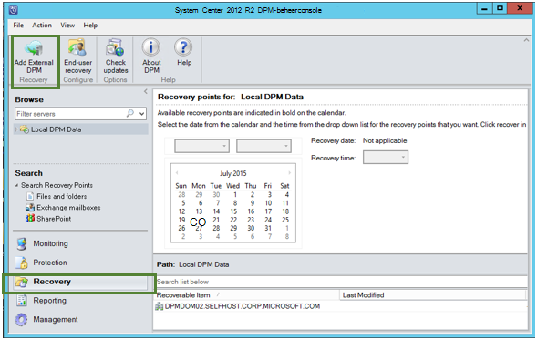

2. Download nieuwe **kluis referenties** van de kluis die is gekoppeld aan de **DPM-server** waar de gegevens worden hersteld, kiest de DPM-server uit de lijst van DPM-servers die zijn geregistreerd bij de back-kluis en bieden de **wachtwoordzin codering** die zijn gekoppeld aan de DPM-server waarvan de gegevens worden hersteld.

    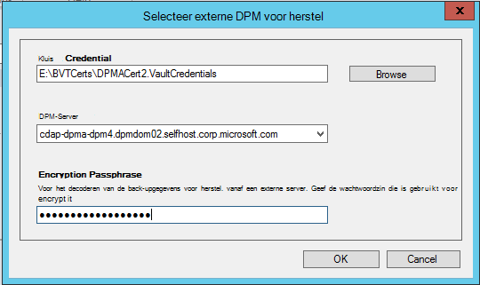

    >[AZURE.NOTE] Alleen DPM servers die zijn gekoppeld aan de dezelfde registratie vault kunnen elkaars gegevens herstellen.

    Nadat u de server extern DPM is toegevoegd, kunt u de gegevens van een externe DPM server en lokale DPM-server op het tabblad **Systeemherstel** .

3. De lijst met beschikbare productie servers beschermd door de externe DPM-server bladeren en de juiste gegevensbron selecteren.

    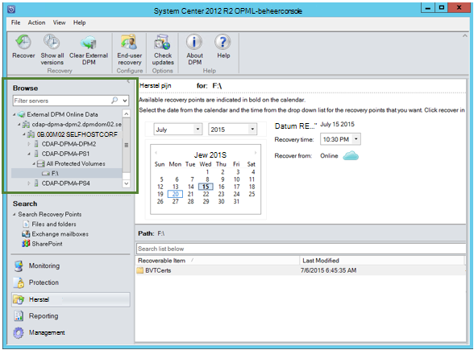

4. Selecteer **de maand en het jaar** van de **punten herstel** vervolgkeuzelijst, selecteert u de vereiste **herstel datum** waarop het herstelpunt is gemaakt, en selecteer de **hersteltijd**.

    Een lijst met bestanden en mappen worden weergegeven in het onderste deelvenster die kan worden bekeken en hersteld naar elke gewenste locatie.

    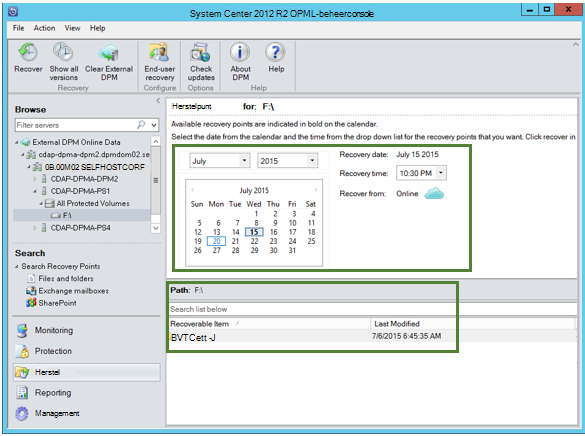

5. Rechtermuisknop op het gewenste item en klikt u op **herstellen**.

    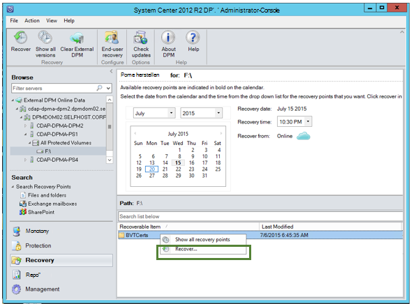

6. Bekijk de **selectie herstellen**. Controleer of de gegevens en tijd van de back-up wordt hersteld, als de bron van waaruit de back-up is gemaakt. Als de selectie niet juist is, klikt u op **Annuleren** terug naar het tabblad herstel juiste herstelpunt selecteren. Als de selectie correct is, klikt u op **volgende**.

    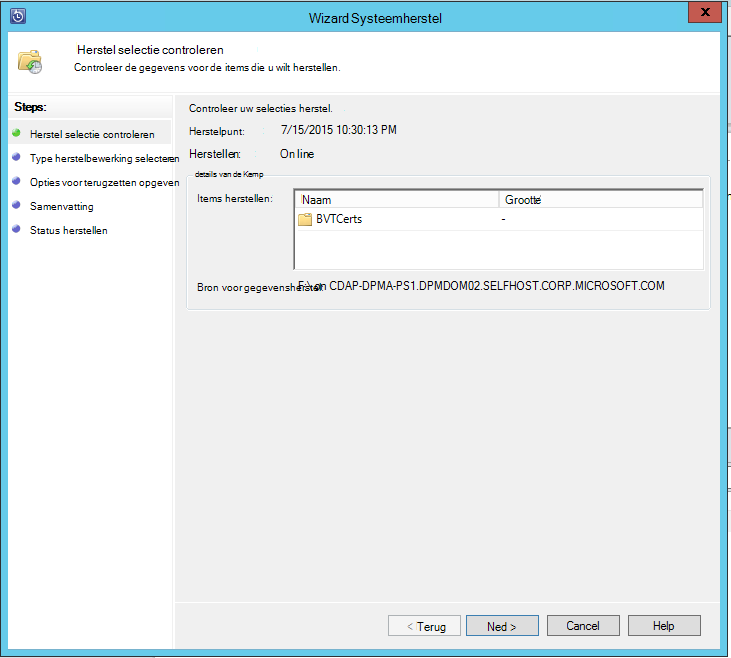

7. Selecteer **terugzetten op een alternatieve locatie**. **Blader** naar de juiste locatie voor het herstel.

    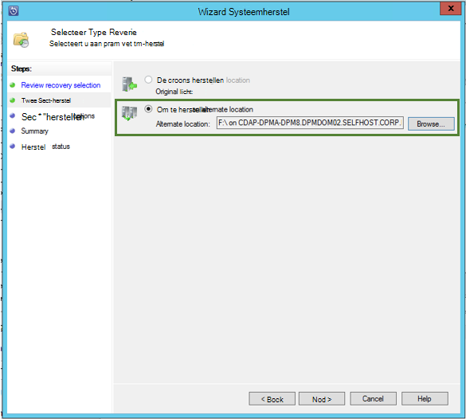

8. Kies de optie die betrekking hebben op een **kopie maken**, **overslaan**of **overschrijven**.
    - **Kopie maken** maakt in het geval van een botsing met de naam is een kopie van het bestand.
    - **Overslaan** slaat het bestand herstellen in het geval van een botsing met de naam is.
    - **Overschrijven** overschrijft de bestaande kopiëren in de locatie die is opgegeven bij een botsing met de naam.

    Kies de gewenste optie om de **beveiliging te herstellen**. U kunt toepassen op de beveiligingsinstellingen van de doelcomputer waarop de gegevens worden hersteld of de beveiligingsinstellingen die van toepassing is op het product waren op het tijdstip waarop dat het herstelpunt is gemaakt.

    Vaststellen of een **melding** wordt verzonden zodra de herstelbewerking voltooid is.

    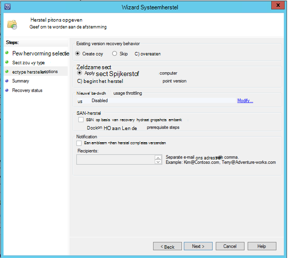

9. Het scherm **Samenvatting** toont de opties gekozen tot nu toe. Nadat u op **'Herstellen'**, worden de gegevens worden hersteld naar de locatie van de juiste op gebouwen.

    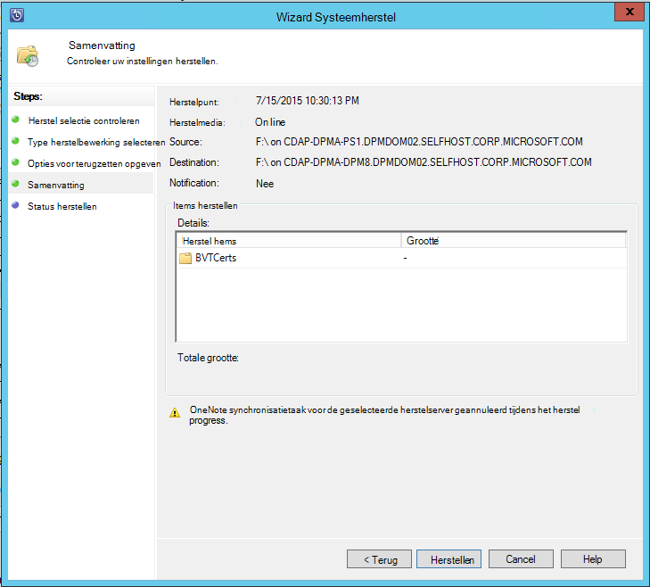

    >[AZURE.NOTE] De taak van herstel kan worden gecontroleerd in het tabblad **controle** van de DPM-server.

    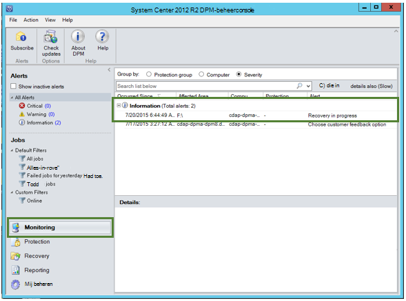

10. Op het tabblad **herstel** van de DPM-server voor het verwijderen van de weergave van de externe DPM-server kunt u **Duidelijke externe DPM** .

    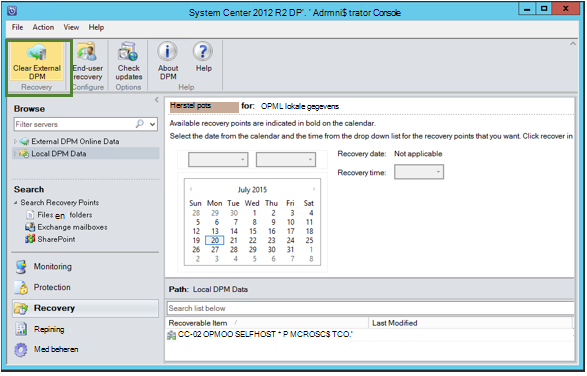

## Foutberichten oplossen
|Nr. |  Foutbericht | Stappen voor probleemoplossing |
| :-------------: |:-------------| :-----|
|1.|        Deze server is niet geregistreerd op de kluis die is opgegeven door de referentie van de kluis.|  **Oorzaak:** Dit foutbericht verschijnt wanneer u het geselecteerde bestand kluis referentie behoort niet om de back-up die is gekoppeld aan de DPM-server waarop het herstel wordt uitgevoerd.   **Resolutie:** De kluis referentie-bestand downloaden van de back-kluis waaraan de DPM-server is geregistreerd.|
|2.|        Herstelbare gegevens is niet beschikbaar of de geselecteerde server is geen DPM-server.|   **Oorzaak:** Er zijn dat geen andere DPM servers met DPM 2012 R2 UR7 geregistreerd om de back-up, of de geselecteerde server niet DPM server (aka Windows Server of Windows-Client) is de DPM servers met DPM 2012 R2 UR7 zijn de metagegevens nog niet geüpload.   **Resolutie:** Als er andere servers DPM is geregistreerd om de back-up, Controleer SCDPM 2012 R2 UR7 en de meest recente Azure reserve-agent worden geïnstalleerd.  Als er andere DPM-servers om de back-up met DPM 2012 R2 UR7 geregistreerd, wacht u een dag na de installatie van UR7 om het herstelproces te starten. De nachtelijke taak zal de metagegevens voor alle eerder beveiligde back-ups naar cloud uploaden. De gegevens zijn beschikbaar voor herstel.|
|3.|        Geen andere DPM-server is geregistreerd voor deze kluis.|   **Oorzaak:** Er zijn geen andere DPM servers met DPM 2012 R2 UR7 of hoger die zijn geregistreerd op de kluis die het herstel wordt geprobeerd. **Resolutie:** Als er andere servers DPM is geregistreerd om de back-up, Controleer SCDPM 2012 R2 UR7 en de meest recente Azure reserve-agent worden geïnstalleerd. Als er andere DPM-servers om de back-up met DPM 2012 R2 UR7 geregistreerd, wacht u een dag na de installatie van UR7 om het herstelproces te starten. De nachtelijke taak zal de metagegevens voor alle eerder beveiligde back-ups naar cloud uploaden. De gegevens zijn beschikbaar voor herstel.|
|4.|        De codering wachtwoordzin opgegeven komt niet overeen met de wachtwoordzin is gekoppeld aan de volgende server:**<server name>**|  **Oorzaak:** De wachtwoordzin codering is gebruikt bij het coderen van de gegevens van de DPM-server-gegevens worden hersteld, komt niet overeen met de codering wachtwoordzin geleverd. De agent is om de gegevens te decoderen. Vandaar mislukt de herstelbewerking. **Resolutie:** Geef de exacte dezelfde codering wachtwoordzin is gekoppeld aan de DPM-server waarvan de gegevens worden hersteld.|

## Veelgestelde vragen:
1. **Waarom kan niet ik een externe DPM-server van een andere DPM server na het installeren van de UR7 en de meest recente back-up Azure agent toevoegen?**

    A) voor de bestaande DPM servers met gegevensbronnen die naar de cloud (via een updatepakket eerder dan Update Rollup 7) zijn beveiligd, hebt u wacht ten minste één dag na de installatie van de UR7 en de nieuwste Azure Backup agent om *externe DPM toevoegen server*te starten. Dit is nodig om de metagegevens van de DPM bescherming groepen uploaden naar Azure. Dit gebeurt via een nachtelijke taak voor het eerst.

2. **Wat is de minimale versie van Azure Backup agent nodig?**

    A) de minimale versie van Azure back-up agent voor deze functie is 2.0.8719.0.  Azure agent-versie van back-up kan worden gecontroleerd door te gaan naar het Configuratiescherm **>** alle Configuratiescherm-items **>** programma's en onderdelen **>** Microsoft Azure Services herstelagent. Als de versie minder dan 2.0.8719.0 is, de [meest recente back-up Azure agent](https://go.microsoft.com/fwLink/?LinkID=288905) downloaden en installeren.

    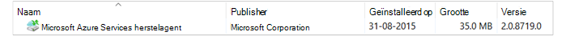

## Volgende stappen:
• [Azure back-Veelgestelde vragen](backup-azure-backup-faq.md)
