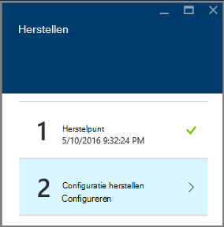
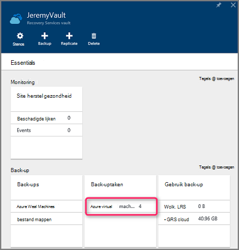

<properties
    pageTitle="Virtuele machines terugzetten vanaf back-up met Azure portal | Microsoft Azure"
    description="Een Azure virtuele machine herstellen vanaf een herstelpunt met Azure portal"
    services="backup"
    documentationCenter=""
    authors="markgalioto"
    manager="cfreeman"
    editor=""
    keywords="back-up terugzetten. hoe om te zetten; herstelpunt;"/>

<tags
    ms.service="backup"
    ms.workload="storage-backup-recovery"
    ms.tgt_pltfrm="na"
    ms.devlang="na"
    ms.topic="article"
    ms.date="08/10/2016"
    ms.author="trinadhk; jimpark;"/>

# Azure portal gebruiken voor het herstellen van virtuele machines

> [AZURE.SELECTOR]
- [VMs in klassieke portal herstellen](backup-azure-restore-vms.md)
- [VMs in Azure portal herstellen](backup-azure-arm-restore-vms.md)

Uw gegevens beveiligen door het maken van momentopnamen van uw gegevens met bepaalde intervallen. Deze momentopnamen herstel punten worden genoemd en die worden opgeslagen in de recovery services kluizen. Als of wanneer dit nodig is om te herstellen of opnieuw maken een VM is, kunt u de VM terugzetten vanaf een van de punten herstellen opgeslagen. Wanneer u een herstelpunt herstellen, kunt u terug of de VM aan de staat te herstellen wanneer het herstelpunt is gemaakt. In dit artikel wordt uitgelegd hoe een VM herstellen.

> [AZURE.NOTE] Azure heeft twee implementatiemodellen voor het maken en werken met resources: [Resource Manager en klassiek](../resource-manager-deployment-model.md). Dit artikel bevat informatie en procedures voor het terugzetten van VMs met behulp van het model van de bronnenbeheerder geïmplementeerd.

## Een herstelpunt herstellen

1. Aanmelden bij de [Azure portal](http://portal.azure.com/)

2. Klik op **Bladeren** en typt u **Recovery Services**in de lijst met services op het menu Azure. De lijst met services worden aangepast aan wat u typt. Wanneer u **de kluizen Recovery Services**ziet, selecteert u deze.

    

    De lijst van kluizen in het abonnement wordt weergegeven.

    

3. Selecteer in de lijst, de kluis die is gekoppeld aan de VM die u wilt terugzetten. Wanneer u op de kluis, opent u het dashboard.

    

4. Nu dat u zich in het dashboard van de kluis. Naast elkaar op de **Back-up van Items** , klikt u op **Azure virtuele Machines** voor het weergeven van het VMs is gekoppeld aan de kluis.

    

    De **Back-up Items** blade geopend en geeft de lijst van Azure virtual machines.

    

5. Selecteer in de lijst een VM voor het openen van het dashboard. Het dashboard VM wordt geopend op het gebied van controle, met de tegel herstellen punten.

    

6. Klik op **terugzetten** in het menu van het dashboard VM

    

    De blade herstellen wordt geopend.

    

7. Klik op het blad **herstellen** **herstelpunt** de blade **terugbrengen selecteren** te openen.

    

    Standaard geeft het dialoogvenster alle herstelpunten van de laatste 30 dagen. Gebruik het **Filter** voor het wijzigen van het tijdsbereik van de herstelpunten worden weergegeven. Herstelpunten van alle consistentie worden standaard weergegeven. Filter **terugzetten op alle punten** een specifieke consistentie van herstelpunten selecteren wijzigen. Voor meer informatie over elk type van herstel punt, Zie de uitleg van de [consistentie van de gegevens](./backup-azure-vms-introduction.md#data-consistency).  
    - **Herstel punt consistentie** in deze lijst kiezen:
        - Consistente herstelpunten crash
        - Consistente herstelpunten van toepassing,
        - Consistente systeemherstelpunten bestand
        - Alle herstelpunten.  

8. Kies een herstelpunt op en klik op **OK**.

    

    De blade **herstellen** ziet u dat het herstelpunt is ingesteld.

    

9. Op het blad **herstellen** **configuratie herstellen** wordt automatisch geopend nadat het herstelpunt is ingesteld.

    

## U kiest een VM-configuratie terugzetten

Nu dat u het herstelpunt hebt geselecteerd, kiest u een configuratie voor het terugzetten van VM. Uw keuzes voor het configureren van de teruggezette VM te gebruiken zijn: Azure portal of PowerShell.

> [AZURE.NOTE] Portal biedt een optie voor het snel maken voor herstelde VM. Als u wilt voor het aanpassen van de VM-configuratie van de to-be herstelde VM, PowerShell gebruiken om te herstellen back-ups van schijven en koppel deze aan de keuze van de VM-configuratie. Zie [herstellen van een VM met speciale netwerkconfiguraties](#restoring-vms-with-special-network-configurations).

1. Als u nog niet bevat, gaat u naar de blade **herstellen** . Controleer een **herstelpunt** is geselecteerd en klik op **configuratie herstellen** als u wilt openen de blade **-configuratie herstellen** .

    

2. Voer op de blade **-configuratie herstellen** of Selecteer waarden voor elk van de volgende velden:
    - De **naam van de virtuele machine** - een naam voor de VM. De naam moet uniek zijn voor de resourcegroep (voor een bronnenbeheerder geïmplementeerd VM) of cloud-service (voor een klassieke VM). De virtuele machine kan niet worden vervangen als deze al in het abonnement bestaat.
    - **Resourcegroep** - een bestaande bronnengroep gebruiken of een nieuwe maken. Als u een klassieke VM terugzetten wilt, gebruikt u dit veld geeft u de naam van een nieuwe wolk service. Als u een nieuwe resource group/cloud service zijn gemaakt, moet de naam uniek zijn. Normaal gesproken de naam van de cloud-service is gekoppeld aan een openbare URL - bijvoorbeeld: [cloudservice]. cloudapp.net. Als u een naam voor de cloud resource group/cloud service al gebruikt probeert is, wijst Azure dezelfde naam als de VM aan de resource groep/cloud-service. Azure weergegeven resource groepen/cloud services en VMs niet is gekoppeld aan de affiniteit groepen. Zie [de migratie van groepen affiniteit met regionale virtueel netwerk (VNet)](../virtual-network/virtual-networks-migrate-to-regional-vnet.md)voor meer informatie.
    - **Virtueel netwerk** - Selecteer het virtuele netwerk (VNET) bij het maken van de VM. Het veld bevat alle VNETs die is gekoppeld aan het abonnement. De resourcegroep van de VM wordt tussen haakjes weergegeven.
    - **Subnet** - als de VNET subnetten heeft, het eerste subnet is standaard ingeschakeld. Als er extra subnetten, selecteert u de gewenste subnet.
    - **Opslag account** - dit menu worden de rekeningen van de opslag op dezelfde locatie als de kluis Recovery Services. Bij het kiezen van een account voor opslag, een account selecteert die dezelfde locatie als de kluis Recovery Services deelt. Opslag-accounts die redundant Zone zijn worden niet ondersteund. Als er geen opslag rekeningen met dezelfde locatie als de kluis Recovery Services, moet u er een maken voordat u begint met het terugzetten. Replicatietype voor de opslag van de account wordt tussen haakjes vermeld.

    > [AZURE.NOTE] Als u een bronnenbeheerder geïmplementeerd VM terugzet, moet u een virtueel netwerk (VNET) te identificeren. Een virtueel netwerk (VNET) is optioneel voor een klassieke VM.

3. Klik op **OK** om het voltooien van de configuratie terugzetten op de blade **-configuratie herstellen** .

4. Klik op het blad **terugzetten** **herstellen** om de bewerking voor terugzetten te activeren.

    

## Bijhouden van de bewerking voor terugzetten

Zodra u de bewerking voor terugzetten hebt geactiveerd, maakt de back-up-service een taak voor het bijhouden van de bewerking voor terugzetten. De back-up-service maakt ook en tijdelijk de melding weergegeven in het gebied met meldingen van de portal. Als u de melding niet wordt weergegeven, kunt u altijd het pictogram meldingen om uw berichten weer te geven.

Open de takenlijst voor back-up van de bewerking weergeven tijdens het verwerken of weergeven wanneer deze voltooid.

1. Klik op **Bladeren** en typt u **Recovery Services**in de lijst met services op het menu Azure. De lijst met services worden aangepast aan wat u typt. Wanneer u **de kluizen Recovery Services**ziet, selecteert u deze.

    

    De lijst van kluizen in het abonnement wordt weergegeven.

    

2. Selecteer in de lijst, de kluis die is gekoppeld aan de VM zijn teruggezet. Wanneer u op de kluis, opent u het dashboard.

3. Naast elkaar weergeven, klikt u op **Azure virtuele Machines** voor het weergeven van de taken die zijn gekoppeld aan de kluis in het dashboard kluis op de **Back-uptaken** .

    

    De **Back-uptaken** blade wordt geopend en wordt de lijst met taken weergegeven.

    

## VMs herstellen met speciale netwerkconfiguraties.
Het is mogelijk een back-up en terugzetten van VMs met de volgende speciale netwerkconfiguraties. Deze configuraties vereist echter dat sommige speciale aandacht tijdens het doorlopen van het herstelproces.

- VMs onder taakverdeling (intern en extern)
- VMs met meerdere gereserveerde IP-adressen
- VMs met meerdere NIC 's

>[AZURE.IMPORTANT] Bij het maken van de speciale configuratie voor VMs, moet u PowerShell VMs maken van de schijf hersteld.

Om de virtuele machines volledig na het terugzetten naar de schijf opnieuw te maken, als volgt te werk:

1. De schijven herstellen vanuit een recovery services kluis met [PowerShell](../backup-azure-vms-automation.md#restore-an-azure-vm)

2. De VM-configuratie vereist voor taakverdeling maken / meerdere NIC/meerdere gereserveerde IP met behulp van de PowerShell-cmdlets en het gebruik te maken van VM configuratie nodig.
    - VM maken in de cloud-service met [interne taakverdeling](https://azure.microsoft.com/documentation/articles/load-balancer-internal-getstarted/)
    - VM verbinding maken met [Internet facing taakverdeling] maken (https://azure.microsoft.com/en-us/documentation/articles/load-balancer-internet-getstarted/)
    - VM maken met [meerdere NIC 's](https://azure.microsoft.com/documentation/articles/virtual-networks-multiple-nics/)
    - VM maken met [meerdere gereserveerde IP-adressen](https://azure.microsoft.com/documentation/articles/virtual-networks-reserved-public-ip/)

## Volgende stappen
Nu kunt u uw VMs herstellen kijken artikel voor informatie over probleemoplossing voor veelvoorkomende fouten met VMs. Controleer ook het artikel over het beheren van taken met uw VMs.

- [Het oplossen van problemen](backup-azure-vms-troubleshoot.md#restore)
- [Beheren van virtuele machines](backup-azure-manage-vms.md)
