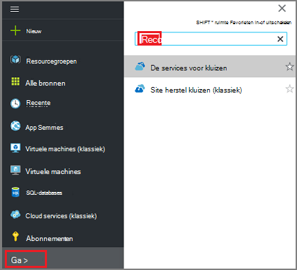
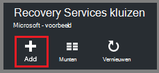
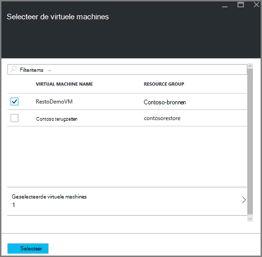
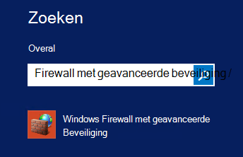
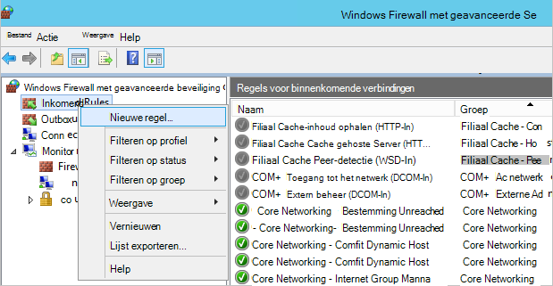
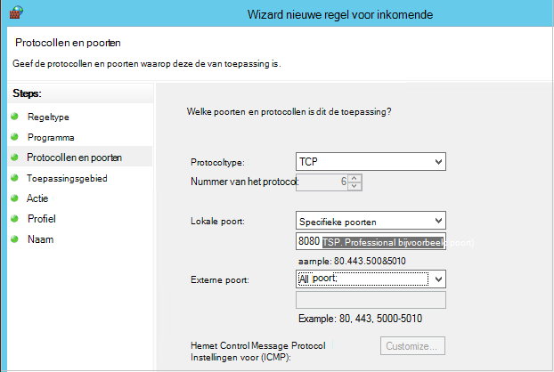

<properties
    pageTitle="Voorbereiden van uw omgeving om back-up van virtuele machines bronnenbeheerder geïmplementeerd | Microsoft Azure"
    description="Zorg ervoor dat uw omgeving is voorbereid voor back-ups van virtuele machines in Azure"
    services="backup"
    documentationCenter=""
    authors="markgalioto"
    manager="cfreeman"
    editor=""
    keywords="back-ups; back-up;"/>

<tags
    ms.service="backup"
    ms.workload="storage-backup-recovery"
    ms.tgt_pltfrm="na"
    ms.devlang="na"
    ms.topic="article"
    ms.date="08/21/2016"
    ms.author="trinadhk; jimpark; markgal;"/>


# <a name="prepare-your-environment-to-back-up-resource-manager-deployed-virtual-machines"></a>Voorbereiden van uw omgeving om back-up van virtuele machines bronnenbeheerder geïmplementeerd

> [AZURE.SELECTOR]
- [Model van Resource Manager](backup-azure-arm-vms-prepare.md)
- [Klassiek model](backup-azure-vms-prepare.md)

Dit artikel bevat stappen voor het voorbereiden van uw back-up een bronnenbeheerder geïmplementeerd virtuele machine (VM)-omgeving. De weergegeven stappen in de procedures de Azure portal gebruiken.  

De back-up Azure-service kent twee soorten kluizen (back-up van kluizen en recovery services kluizen) voor de bescherming van uw VMs. Een back-up vault beschermt geïmplementeerd met behulp van het model Klassiek implementatie VMs. Een kluis recovery services beschermt **VMs zowel klassieke geïmplementeerd of bronnenbeheerder geïmplementeerd** . Een kluis Recovery Services moet u een bronnenbeheerder geïmplementeerd VM te beschermen.

>[AZURE.NOTE] Azure heeft twee implementatiemodellen voor het maken en werken met resources: [Resource Manager en klassiek](../resource-manager-deployment-model.md). Zie [voorbereiden uw omgeving back-up Azure virtuele machines maken](backup-azure-vms-prepare.md) voor meer informatie over het werken met klassieke implementatiemodel VMs.

Voordat u kunt beveiligen of back-up van een bronnenbeheerder geïmplementeerd VM (virtual machine), moet dat deze vereisten zijn:

- Maak een kluis recovery services (of een bestaande recovery services kluis identificeren) *op dezelfde locatie als uw VM*.
- Selecteer een scenario, de back-beleid definiëren en artikelen definiëren.
- Controleer de installatie van de VM-Agent op de virtuele machine.
- Netwerkverbinding controleren

Als u weet dat deze voorwaarden al aanwezig zijn in uw omgeving gaat u verder met de [Back-up van uw artikel VMs](backup-azure-vms.md). Als u wilt instellen of controleren van deze voorwaarden, leidt dit artikel u door de stappen voor te bereiden die vereiste.


## <a name="limitations-when-backing-up-and-restoring-a-vm"></a>Beperkingen bij de back-up en terugzetten van een VM

Voordat u uw omgeving voorbereidt, moet u de beperkingen te begrijpen.

- Back-ups maken van virtuele machines met meer dan 16 data schijven wordt niet ondersteund.
- Back-ups maken van virtuele machines met een gereserveerd IP-adres en geen gedefinieerde eindpunt wordt niet ondersteund.
- Back-up van Linux virtuele machines met de extensie Docker wordt niet ondersteund. 
- Back-upgegevens bevat geen gekoppelde netwerkstations gekoppeld aan VM. 
- Vervangen van een bestaande virtuele machine tijdens het terugzetten wordt niet ondersteund. Als u de VM herstellen probeert wanneer de VM bestaat, mislukt de terugzetbewerking.
- Cross-regio back-up en terugzetten wordt niet ondersteund.
- U kunt back-up van virtuele machines in alle openbare gebieden van Azure (Zie de [Controlelijst](https://azure.microsoft.com/regions/#services) van ondersteunde regio's). Als het gebied dat u zoekt niet-ondersteunde vandaag, deze niet in de vervolgkeuzelijst bij het maken van de kluis.
- U kunt een reservekopie maken van virtuele machines alleen voor bepaalde besturingssystemen:
  - **Linux**: Azure Backup biedt ondersteuning voor [een lijst met distributies die door Azure worden geviseerd](../virtual-machines/virtual-machines-linux-endorsed-distros.md) , met uitzondering van Core OS Linux.  Andere plaatsen-uw-eigen-Linux-distributies kunnen ook werken als de agent VM beschikbaar op de virtuele machine is en ondersteuning voor Python bestaat.
  - **Windows Server**: versies ouder dan Windows Server 2008 R2 worden niet ondersteund.
- Herstellen van een domeincontroller wordt (DC) VM die deel uitmaakt van een configuratie met meerdere DC uitsluitend ondersteund via PowerShell. Meer informatie over het [herstellen van een domeincontroller multi-DC](backup-azure-restore-vms.md#restoring-domain-controller-vms).
- Virtuele machines met de volgende speciale netwerkconfiguraties terugzetten wordt uitsluitend ondersteund via PowerShell. VMs gemaakt met behulp van de werkstroom terugzetten in de gebruikersinterface geen deze netwerkconfiguraties nadat de bewerking voor terugzetten voltooid is. Voor meer informatie, Zie [VMs herstellen met speciale netwerkconfiguraties](backup-azure-restore-vms.md#restoring-vms-with-special-netwrok-configurations).
  - Virtuele machines onder load balancer-configuratie (intern en extern)
  - Virtuele machines met meerdere gereserveerde IP-adressen
  - Virtuele machines met meerdere netwerkadapters

## <a name="create-a-recovery-services-vault-for-a-vm"></a>Een kluis recovery services voor een VM maken

Een kluis recovery services is een entiteit die de back-ups en herstel punten die zijn gemaakt na verloop van tijd worden opgeslagen. De kluis recovery services bevat ook de back-beleid dat is gekoppeld aan de beveiligde virtuele machines.

Voor het maken van een kluis recovery services:

1. Log in om de [Azure portal](https://portal.azure.com/).

2. Klik op **Bladeren** en typ in de lijst met resources **Recovery Services**in het menu Hub. Als u te typen begint, de lijst wordt gefilterd op basis van uw invoer. Klik op **de kluis Recovery Services**.

     <br/>

    De lijst van kluizen Recovery Services wordt weergegeven.

3. Klik in het menu **kluizen Recovery Services** op **toevoegen**.

    

    De kluis Recovery Services blade wordt geopend, waarin u een **naam**, **abonnement**, **resourcegroep**en **locatie**.

    

4. Voer voor de **naam**een beschrijvende naam ter identificatie van de kluis. De naam moet uniek zijn voor het abonnement Azure. Typ een naam die tussen 2 en 50 tekens bevat. Het moet beginnen met een letter en mag alleen letters, cijfers en streepjes.

5. Klik op **abonnement** overzicht de beschikbare abonnementen. Als u niet zeker weet welke abonnement wilt gebruiken, gebruikt u de standaardinstelling (of voorgesteld) abonnement. Zullen er meerdere opties als uw organisatie-account gekoppeld aan meerdere Azure abonnementen is.

6. Klik op **resourcegroep** overzicht de beschikbare brongroepen of klik op **Nieuw** om een nieuwe resourcegroep te maken. Zie voor volledige informatie over resourcegroepen, [Azure Resource Manager-overzicht](../azure-resource-manager/resource-group-overview.md)

7. Klik op **locatie** selecteren van de geografische regio van de kluis. De kluis **moet** zich in hetzelfde gebied, als de virtuele machines die u wilt beveiligen.

    >[AZURE.IMPORTANT] Als u niet zeker van de locatie waar uw VM bestaat bent, sluiten een dialoogvenster voor het maken van de kluis en Ga naar de lijst van virtuele Machines in de portal. Als u virtuele machines in meerdere regio's, moet u voor het maken van een kluis Recovery Services in elke regio. De kluis in de eerste locatie voordat u gaat naar de volgende locatie maken. Het is niet nodig om opslag rekeningen voor het opslaan van de back-upgegevens--de kluis Recovery Services te geven en de Azure back-service verwerkt dit automatisch.

8. Klik op **maken**. Het kan even duren voor de kluis Recovery Services moet worden gemaakt. Controleren van de van statusmeldingen in het bovenste rechter gebied in de portal. Zodra uw kluis is gemaakt, wordt het weergegeven in de lijst van kluizen Recovery Services.

    

    Nu dat u hebt gemaakt de kluis, informatie over het instellen van de replicatie van opslag.

## <a name="set-storage-replication"></a>Opslag, replicatie instellen

De opslagoptie voor replicatie kunt u kiezen tussen geo-redundante opslag en lokaal redundante opslag. Standaard heeft de kluis geo-redundante opslag. Laat de optie ingesteld op geo-redundante opslag als dit uw primaire back-up. Kies lokaal redundante opslag als u wilt een goedkopere optie die niet helemaal zo duurzaam. Meer informatie over [geo-redundante](../storage/storage-redundancy.md#geo-redundant-storage) [lokaal redundante](../storage/storage-redundancy.md#locally-redundant-storage) opslagopties en in de [opslag van Azure replicatie-overzicht](../storage/storage-redundancy.md).

De instelling opslag replicatie bewerken:

1. Selecteer de kluis te openen de kluis dashboard en de instellingen voor blade. Als het blad **Instellingen** niet wordt geopend, klikt u op **alle instellingen** in het dashboard van de kluis.

2. Klik op het blad **Instellingen** **Back-up infrastructuur** > **Back-up configureren** voor het openen van de **Back-up configuratie** blade. Kies de optie van de replicatie opslag voor uw kluis op de **Back-up van configuratie** -blade.

    

    Nadat u de opslagoptie voor uw kluis, bent u gereed om de VM koppelen aan de kluis. Om te beginnen met de koppeling, ontdekken en u registreren de Azure virtuele machines.


## <a name="select-a-backup-goal-set-policy-and-define-items-to-protect"></a>Selecteer een back-up doel, beleid instellen en definiëren van items die u wilt beveiligen

Een VM met een kluis, uitvoeren voordat u zich registreert de discovery-proces om ervoor te zorgen dat alle nieuwe virtuele machines die zijn toegevoegd aan het abonnement zijn geïdentificeerd. De query's proces Azure voor de lijst met virtuele machines in het abonnement, aanvullende informatie, zoals de naam van de wolk en de regio. De portal voor Azure verwijst scenario naar wat u wilt opnemen in de kluis recovery services. Het beleid is het schema voor hoe vaak en wanneer herstel punten worden genomen. Beleid omvat ook het bereik van de inhouding voor de herstel-punten.

1. Hebt u al een kluis Recovery Services geopend, gaat u verder met stap 2. Als u beschikt niet over een Recovery Services kluis openen, maar in de Azure portal de Hub op het menu **Bladeren**.

  - Typ in de lijst met resources **Recovery Services**.
  - Als u te typen begint, de lijst wordt gefilterd op basis van uw invoer. Wanneer u **de kluizen Recovery Services**ziet, klikt u erop.

     <br/>

    De lijst van kluizen Recovery Services weergegeven.
  - Selecteer in de lijst van kluizen Recovery Services, een kluis.

    Hiermee opent u het geselecteerde kluis dashboard.

    

2. Klik op **back-up** de blade back-up openen vanuit het menu kluis dashboard.

    

    Als het blad wordt geopend, zoekt naar de back-up-service nieuwe VMs in het abonnement.

    

3. Klik op de bladeserver back-up **back-up doel** om de back-up doel blade openen.

    

4. Stel op de back-up doel-blade **waar uw werkbelasting actief is** op Azure en **Waar wilt u back-up wilt** met virtuele machine, klikt u op **OK**.

    De back-up doel blade sluiten en openen van de back-up beleid blade.

    

5. Selecteer de back-beleid dat u wilt toepassen op de kluis en klik op **OK**op de back-up beleid-blade.

    

    De details van het standaardbeleid worden weergegeven in de details. Als u wilt dat een nieuw beleid maken, **Nieuw** te selecteren uit de vervolgkeuzelijst. Het menu biedt ook een optie waarmee u de tijd wanneer de momentopname is, tot 7 uur. Zie [een back-beleid definiëren](backup-azure-vms-first-look-arm.md#defining-a-backup-policy)voor instructies over het definiëren van een back-up beleid. Zodra u op **OK**klikt, wordt het back-beleid gekoppeld aan de kluis.

    Kies vervolgens de VMs koppelen aan de kluis.

6. Kies de virtuele machines te koppelen aan het opgegeven beleid en klik op **selecteren**.

    

    Als u de gewenste VM, controleren of het bestaat in Azure dezelfde locatie als de kluis Recovery Services niet ziet.

7. Nu u hebt gedefinieerd alle instellingen voor de kluis, in de blade back-up klikt u op **Back-up inschakelen** op de onderkant van de pagina. Dit implementeert het beleid naar de kluis en het VMs.

    

De volgende fase in de voorbereiding is het installeren van de Agent VM of zorg ervoor dat de VM-Agent is geïnstalleerd.


## <a name="install-the-vm-agent-on-the-virtual-machine"></a>De VM-Agent installeren op de virtuele machine

De Azure VM-Agent moet worden geïnstalleerd op de Azure virtual machine voor de uitbreiding van de back-up om te werken. De VM-Agent is al aanwezig op de virtuele machine als uw VM is gemaakt vanuit de galerie met Azure. Deze informatie wordt verstrekt voor de situaties waarin u *niet* met een VM uit de galerie Azure - bijvoorbeeld gemaakt dat u een VM gemigreerd van een datacenter in gebouwen. In dat geval moet de Agent VM ter bescherming van de virtuele machine worden geïnstalleerd.

Meer informatie over de [VM-Agent](https://go.microsoft.com/fwLink/?LinkID=390493&clcid=0x409) en [de Agent VM installeren](../virtual-machines/virtual-machines-windows-classic-manage-extensions.md).

Als u back-ups van de Azure VM problemen hebt, controleert u dat de Agent Azure VM juist is geïnstalleerd op de virtuele machine (Zie onderstaande tabel). Als u een aangepaste VM hebt gemaakt, is [schakelt u het selectievakje **de VM-Agent installeren** ](../virtual-machines/virtual-machines-windows-classic-agents-and-extensions.md) voordat u de virtuele machine ingericht.

De volgende tabel vindt u meer informatie wilt over de VM-Agent voor Windows en Linux VMs.

| **Bewerking** | **Windows** | **Linux** |
| --- | --- | --- |
| De VM-Agent installeren | <li>Download en installeer de [agent MSI](http://go.microsoft.com/fwlink/?LinkID=394789&clcid=0x409). U moet Administrator-bevoegdheden om de installatie te voltooien. <li>[De eigenschap VM bijwerken](http://blogs.msdn.com/b/mast/archive/2014/04/08/install-the-vm-agent-on-an-existing-azure-vm.aspx) om aan te geven dat de agent is geïnstalleerd. | <li> Installeer de meest recente [Linux agent](https://github.com/Azure/WALinuxAgent) van GitHub. U moet Administrator-bevoegdheden om de installatie te voltooien. <li> [De eigenschap VM bijwerken](http://blogs.msdn.com/b/mast/archive/2014/04/08/install-the-vm-agent-on-an-existing-azure-vm.aspx) om aan te geven dat de agent is geïnstalleerd. |
| De Agent VM bijwerken | Bijwerken van de VM-Agent is net zo eenvoudig als de [binaire bestanden voor VM-Agent](http://go.microsoft.com/fwlink/?LinkID=394789&clcid=0x409)opnieuw te installeren. <br>Zorg ervoor dat er geen back-up wordt uitgevoerd terwijl de VM-agent wordt bijgewerkt. | Volg de instructies over het [bijwerken van de Agent Linux VM ](../virtual-machines-linux-update-agent.md). <br>Zorg ervoor dat er geen back-up wordt uitgevoerd terwijl de VM-Agent wordt bijgewerkt. |
| De Agent voor VM-installatie valideren | <li>Ga naar de map *C:\WindowsAzure\Packages* in Azure VM. <li>U moet het bestand WaAppAgent.exe aanwezig.<li> Klik met de rechtermuisknop op het bestand, Ga naar **Eigenschappen**en selecteer vervolgens het tabblad **Details** . Het veld versie van het Product dient te worden 2.6.1198.718 of hoger. | N.V.T. |


### <a name="backup-extension"></a>Back-extensie

Zodra de VM-Agent op de virtuele machine is geïnstalleerd, installeert de Azure back-service de back-extensie naar de VM-Agent. De Azure back-service naadloos upgrades en patches van de back-extensie.

De back-extensie is geïnstalleerd door de back-up-service al dan niet de VM wordt uitgevoerd. Een actieve VM biedt de grootste kans om een consistente toepassing herstelpunt. De back-up Azure service blijft echter een back-up de VM zelfs als deze is uitgeschakeld en de extensie kan niet worden geïnstalleerd. Dit staat bekend als off line VM. In dit geval zijn het herstelpunt *crash consistent*.


## <a name="network-connectivity"></a>Verbinding met het netwerk

Om het beheren van de VM-snapshots, moet de extensie back-verbinding met de Azure openbare IP-adressen. Zonder het juiste Internet-verbinding time-out van de virtuele machine van HTTP-aanvragen en de back-upbewerking is mislukt. Als uw implementatie heeft toegangsbeperkingen (via een netwerk security group (NSG), voor het voorbeeld), kiest u een van deze opties voor het leveren van een duidelijk pad voor back-verkeer:

- ["Witte" lijst de Azure datacenter IP ranges](http://www.microsoft.com/en-us/download/details.aspx?id=41653) - Zie het artikel voor instructies over hoe te "witte" lijst de IP-adressen.
- Implementeren van een HTTP-proxyserver voor het routeren van verkeer.

Bij het bepalen van welke optie u moet gebruiken, zijn de e-mailverkeer tussen de beheersbaarheid, granulaire controle en kosten.

|Optie|Voordelen|Nadelen|
|------|----------|-------------|
|Whitelist IP-bereiken| Geen extra kosten.<br><br>Voor access te openen in een NSG, gebruikt u de cmdlet <i>Set-AzureNetworkSecurityRule</i> . | Complex om te beheren als het risico IP-bereiken veranderen.<br><br>Biedt toegang tot het geheel van Azure en niet alleen opslag.|
|HTTP-proxy| Detail te beheren in de proxy de opslag URL's toegestaan.<br>Eén punt van internettoegang tot VMs.<br>Niet onderworpen zijn aan wijzigingen van Azure IP-adres.| Extra kosten voor het uitvoeren van een VM met de proxysoftware.|

### <a name="whitelist-the-azure-datacenter-ip-ranges"></a>"Witte" lijst de Azure datacenter IP-bereiken

Aan de "witte" lijst vindt de Azure datacenter IP-adresbereiken u de [Azure-website](http://www.microsoft.com/en-us/download/details.aspx?id=41653) voor meer informatie over de IP-bereiken en instructies.

### <a name="using-an-http-proxy-for-vm-backups"></a>Met behulp van een HTTP-proxy voor VM back-ups
Bij het maken van back-up een VM, verzendt de back-extensie op de VM opdrachten voor het beheer van de momentopname naar Azure opslag met behulp van een HTTPS-API. Route de uitbreiding back-verkeer via de HTTP-proxy, omdat dit het enige onderdeel dat is geconfigureerd voor toegang tot het openbare Internet.

>[AZURE.NOTE] Er is geen aanbeveling voor de proxysoftware die moet worden gebruikt. Zorg ervoor dat u een proxy die compatibel is met de van onderstaande configuratiestappen kiezen.

Het van de voorbeeldafbeelding hieronder ziet u de met drie configuratiestappen nodig voor het gebruik van een HTTP-proxy:

- App VM routeert alle HTTP-verkeer voor het openbare Internet via een Proxy-VM.
- VM-proxy kunt binnenkomend verkeer van VMs in het virtuele netwerk.
- De netwerk Security Group (NSG) met de naam NSF lockdown moet een beveiliging regel zodat uitgaande internetverkeer van Proxy-VM.


Voor het gebruik van een HTTP-proxy te communiceren met het openbare Internet als volgt te werk:

#### <a name="step-1-configure-outgoing-network-connections"></a>Stap 1. Uitgaande verbindingen configureren

###### <a name="for-windows-machines"></a>Voor Windows-computers
Hierdoor wordt setup configuratie van de proxyserver voor lokale systeemaccount.

1. [Gg.bat](https://technet.microsoft.com/sysinternals/bb897553) downloaden
2. Voer de volgende opdracht uit met verhoogde bevoegdheid om

     ```
     psexec -i -s "c:\Program Files\Internet Explorer\iexplore.exe"
     ```
     Internet explorer-venster wordt geopend.
3. Ga naar Extra -> Internet-opties -> verbindingen -> LAN-instellingen.
4. Controleer of de proxy-instellingen voor de account System. Proxy IP-adres en poort instellen.
5. Sluit Internet Explorer.

Dit zal een proxyconfiguratie voor alle computers instellen en wordt gebruikt voor alle uitgaande HTTP/HTTPS-verkeer.

Als u hebt een proxy-server ingesteld op de huidige gebruikersaccount (niet een lokale systeemaccount), gebruikt u het volgende script toepassen op SYSTEMACCOUNT:

```
   $obj = Get-ItemProperty -Path Registry::”HKEY_CURRENT_USER\Software\Microsoft\Windows\CurrentVersion\Internet Settings\Connections"
   Set-ItemProperty -Path Registry::”HKEY_USERS\S-1-5-18\Software\Microsoft\Windows\CurrentVersion\Internet Settings\Connections" -Name DefaultConnectionSettings -Value $obj.DefaultConnectionSettings
   Set-ItemProperty -Path Registry::”HKEY_USERS\S-1-5-18\Software\Microsoft\Windows\CurrentVersion\Internet Settings\Connections" -Name SavedLegacySettings -Value $obj.SavedLegacySettings
   $obj = Get-ItemProperty -Path Registry::”HKEY_CURRENT_USER\Software\Microsoft\Windows\CurrentVersion\Internet Settings"
   Set-ItemProperty -Path Registry::”HKEY_USERS\S-1-5-18\Software\Microsoft\Windows\CurrentVersion\Internet Settings" -Name ProxyEnable -Value $obj.ProxyEnable
   Set-ItemProperty -Path Registry::”HKEY_USERS\S-1-5-18\Software\Microsoft\Windows\CurrentVersion\Internet Settings" -Name Proxyserver -Value $obj.Proxyserver
```

>[AZURE.NOTE] Als u '(407) proxyverificatie vereist' in het logboek voor proxy server ziet, Controleer dat uw verificatie juist is geconfigureerd.

######<a name="for-linux-machines"></a>Voor Linux-machines

Voeg de volgende regel aan de ```/etc/environment``` bestand:

```
http_proxy=http://<proxy IP>:<proxy port>
```

Voeg de volgende regels aan de ```/etc/waagent.conf``` bestand:

```
HttpProxy.Host=<proxy IP>
HttpProxy.Port=<proxy port>
```

#### <a name="step-2-allow-incoming-connections-on-the-proxy-server"></a>Stap 2. Binnenkomende verbindingen toestaan op de proxy-server:

1. Open Windows Firewall op de proxyserver. De eenvoudigste manier om toegang tot de firewall is om te zoeken naar Windows Firewall met geavanceerde beveiliging.

    

2. Klik in het dialoogvenster Windows Firewall met de rechtermuisknop op **Binnenkomende regels** en klik op **Nieuwe regel...**.

    

3. In de **Inkomende Wizard nieuwe regel voor**, kiest u de optie **aangepast** voor het **Type regel** en klikt u op **volgende**.
4. **Alle programma's** en klik op **volgende**op de pagina om het **programma**te selecteren.

5. Voer de volgende gegevens op de pagina **protocollen en poorten** en klik op **volgende**:

    

    - Kies voor het *protocoltype* *TCP*
    - Kies *lokale poort* in *Specifieke poorten*, Geef in het onderstaande veld de ```<Proxy Port>``` die is geconfigureerd.
    - Selecteer *Alle poorten* voor *externe poort*

    Voor de rest van de wizard, klikt u op naar het eind en deze regel een naam geven.

#### <a name="step-3-add-an-exception-rule-to-the-nsg"></a>Stap 3. Een uitzonderingsregel toevoegen aan de NSG:

In de Azure PowerShell-prompt, typ de volgende opdracht:

De volgende opdracht wordt een uitzondering op de NSG. Deze uitzondering kan de TCP-verkeer van een willekeurige poort op de 10.0.0.5 aan een internetadres op poort 80 (HTTP) of 443 (HTTPS). Als u een specifieke poort in het openbare Internet vereist, moet u die poort wilt toevoegen de ```-DestinationPortRange``` ook.

```
Get-AzureNetworkSecurityGroup -Name "NSG-lockdown" |
Set-AzureNetworkSecurityRule -Name "allow-proxy " -Action Allow -Protocol TCP -Type Outbound -Priority 200 -SourceAddressPrefix "10.0.0.5/32" -SourcePortRange "*" -DestinationAddressPrefix Internet -DestinationPortRange "80-443"
```


*Deze stappen worden specifieke namen en waarden voor dit voorbeeld gebruiken. Gebruik de namen en waarden voor uw implementatie bij het invoeren, of knippen en plakken van gegevens in uw code.*


Als u weet dat u een netwerkverbinding hebt, bent u klaar om een back-up van uw VM. Zie [Back-up van VMs bronnenbeheerder geïmplementeerd](backup-azure-arm-vms.md).

## <a name="questions"></a>Heb je vragen?
Als u vragen hebt of als er een functie die u zou willen zien opgenomen, [feedback verzenden](http://aka.ms/azurebackup_feedback).

## <a name="next-steps"></a>Volgende stappen
Nu u uw omgeving voor back-ups van uw VM hebt voorbereid, de volgende logische stap is voor het maken van een back-up. De planning artikel vindt meer gedetailleerde informatie over back-ups van VMs.

- [Back-up van virtuele machines](backup-azure-vms.md)
- [Plan uw back-upinfrastructuur VM](backup-azure-vms-introduction.md)
- [Back-ups maken van virtuele machine](backup-azure-manage-vms.md)
