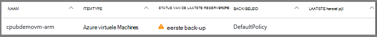
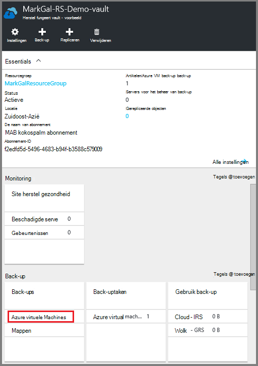
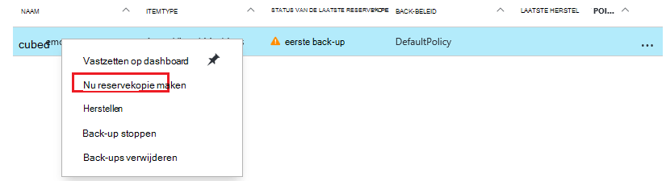
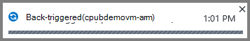
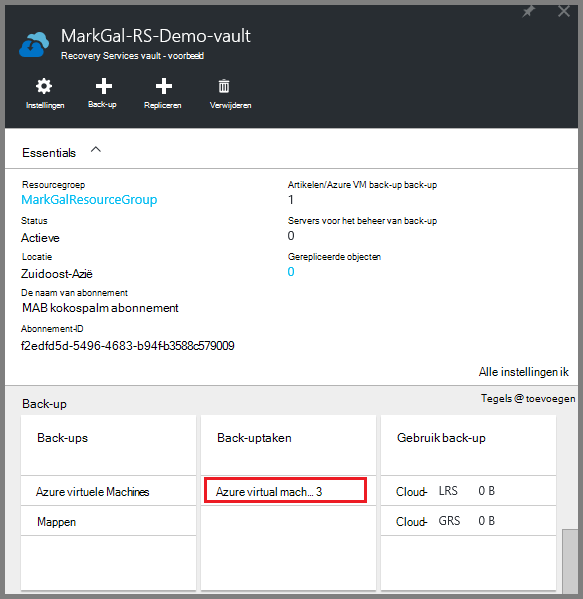
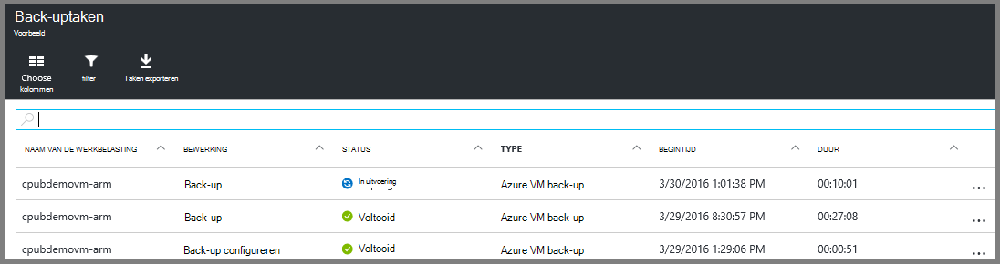

<properties
    pageTitle="Back-up van Azure VMs naar een kluis Recovery Services | Microsoft Azure"
    description="Ontdekken, registreren en back-up Azure virtuele machines in een kluis recovery services met deze procedures voor Azure VM back-up."
    services="backup"
    documentationCenter=""
    authors="markgalioto"
    manager="cfreeman"
    editor=""
    keywords="virtuele machine back-up. een back-up in virtuele machine; back-up en herstel na storing herstel; arm vm back-up"/>

<tags
    ms.service="backup"
    ms.workload="storage-backup-recovery"
    ms.tgt_pltfrm="na"
    ms.devlang="na"
    ms.topic="article"
    ms.date="07/29/2016"
    ms.author="trinadhk; jimpark; markgal;"/>

# Back-up Azure VMs in een kluis Recovery Services

> [AZURE.SELECTOR]
- [Back-up VMs in kluis Recovery Services](backup-azure-arm-vms.md)
- [Back-up VMs op back-up-kluis](backup-azure-vms.md)

Dit artikel bevat de procedure voor de back-ups van Azure VMs (bronnenbeheerder geïmplementeerd en klassieke geïmplementeerd) naar een kluis Recovery Services. Het merendeel van de werkzaamheden voor back-ups van VMs gaat in de voorbereiding. Voordat u kunt een back-up of een VM te beschermen, moet u de [vereisten](backup-azure-arm-vms-prepare.md) om uw omgeving voor het beveiligen van uw VMs gereed te voltooien. Als u de vereisten hebt voltooid, kunt u de back-up bewerking om momentopnamen van uw VM te initiëren.

>[AZURE.NOTE] Azure heeft twee implementatiemodellen voor het maken en werken met resources: [Resource Manager en klassiek](../resource-manager-deployment-model.md). VMs bronnenbeheerder geïmplementeerd en klassieke VMs kunt u beveiligen met kluizen Recovery Services. Zie [Back-up van Azure virtuele machines](backup-azure-vms.md) voor meer informatie over het werken met klassieke implementatiemodel VMs.

Voor meer informatie, Zie de artikelen op [de back-upinfrastructuur van uw VM in Azure plannings](backup-azure-vms-introduction.md) - en [Azure virtuele machines](https://azure.microsoft.com/documentation/services/virtual-machines/).

## De back-up taak starten

De back-up die is gekoppeld aan de kluis Recovery Services beleid bepaalt hoe vaak en wanneer de back-up wordt uitgevoerd. De eerste geplande back-up is de eerste back-up. Totdat de eerste back-up, ziet u de laatste back-Status van de **Back-uptaken** blade als **waarschuwing (eerste back-up in behandeling)**.

Het is raadzaam dat u **nu een Back-up**uitvoeren tenzij uw eerste back-up moet betaald om te beginnen met zeer snel worden. De volgende procedure begint vanaf de kluis dashboard. Deze procedure dient voor de eerste back-uptaak wordt uitgevoerd nadat u alle onderdelen hebt voltooid. Deze procedure is niet beschikbaar als de eerste back-uptaak al is uitgevoerd. Het gekoppelde back-beleid bepaalt de volgende back-uptaak.  

De eerste back-uptaak uitvoeren:

1. Klik op het dashboard kluis op de tegel **back-up van** **Azure Virtual Machines**.  
    

    Hiermee opent u de **Back-up Items** blade.

2. Op het blad **Back-up van Items** met de rechtermuisknop op de kluis die u back wilt-up en klik op **Nu back**.

    

    De back-uptaak wordt geactiveerd.  

    

3. U kunt dat uw eerste back-up is voltooid, klikt u op het dashboard kluis op de tegel **Back-uptaken** op **Azure virtuele machines**.

    

    Hiermee opent u het back-uptaken blade.

4. In het blad **back-uptaken** kunt u de status van alle taken bekijken.

    

    >[AZURE.NOTE] Als onderdeel van de back-upbewerking verleent de Azure back-service een opdracht aan de back-extensie in elke virtuele machine leegmaken alle schrijfbewerkingen en een consistente momentopname.

    Als de back-uptaak is voltooid, wordt de status *voltooid*is.

## Het oplossen van problemen
Als u problemen tijdens het maken van een reservekopie van uw virtuele machine, Zie de [Probleemoplossing VM-artikel](backup-azure-vms-troubleshoot.md) voor meer informatie.

## Volgende stappen

Nu dat u uw VM hebt beveiligd, bekijk de volgende artikelen voor meer administratieve u taken kunt doen met uw VMs en het herstellen van VMs.

- [Beheren en controleren van uw virtuele machines](backup-azure-manage-vms.md)
- [Herstellen van virtuele machines](backup-azure-arm-restore-vms.md)
