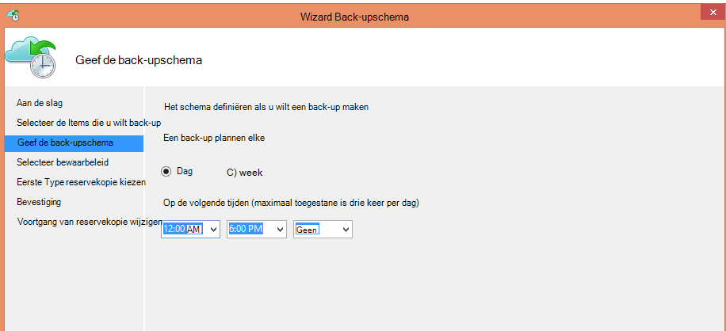
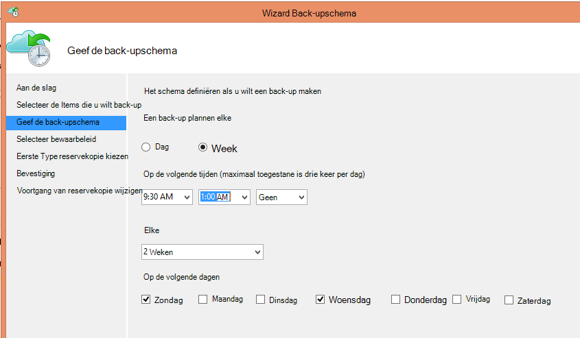
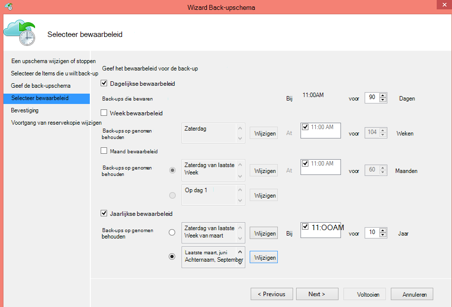
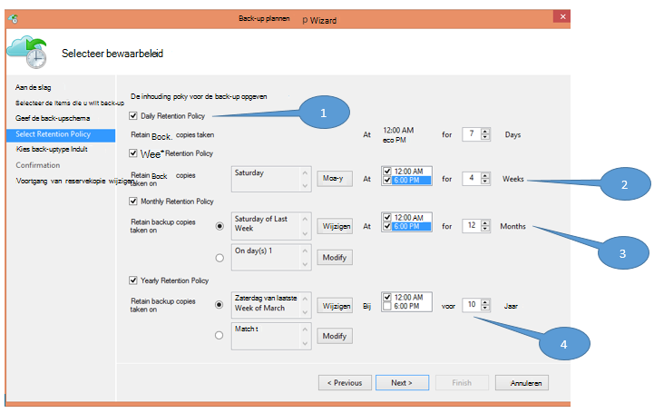
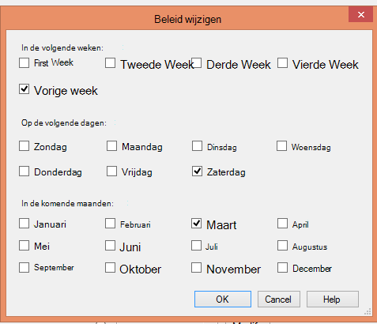

<properties
   pageTitle="Azure back-up gebruiken ter vervanging van uw infrastructuur tape | Microsoft Azure"
   description="Meer informatie over hoe Azure back-up biedt tape-achtige semantiek waarmee u back-up maken en terugzetten van gegevens in Azure"
   services="backup"
   documentationCenter=""
   authors="trinadhk"
   manager="vijayts"
   editor=""/>
<tags
   ms.service="backup"
   ms.devlang="na"
   ms.topic="article"
   ms.tgt_pltfrm="na"
   ms.workload="storage-backup-recovery"
   ms.date="09/27/2016"
   ms.author="jimpark;trinadhk;markgal"/>

# Azure back-up gebruiken ter vervanging van uw infrastructuur tape

Azure back-up en System Center Data Protection Manager-klanten kunnen:

- Back-up van gegevens in de schema's die het beste aan de behoeften van de organisatie.
- De back-upgegevens voor langere perioden bewaren
- Azure is een onderdeel van hun behoud op lange termijn (in plaats van tape) moet maken.

In dit artikel wordt uitgelegd hoe klanten back-up en vasthouden kunnen inschakelen. Klanten die met hun lange-termijn-inhouding adres tapes nodig hebben nu een krachtige en levensvatbare alternatief met de beschikbaarheid van deze functie. De functie is ingeschakeld in de meest recente versie van de back-up van Azure (die beschikbaar is [hier](http://aka.ms/azurebackup_agent)). Klanten van System Center DPM moeten bijwerken, ten minste DPM 2012 R2 UR5 voordat u DPM met de back-up Azure service.

## Wat is de back-upschema?
Het back-upschema geeft de frequentie van de back-upbewerking. De instellingen in het volgende scherm bijvoorbeeld aangeven dat back-ups dagelijks om 6 uur en middernacht worden genomen.

Klanten kunnen ook een wekelijkse back-up plannen. De instellingen in het volgende scherm bijvoorbeeld aangeven dat back-ups worden genomen om alternatieve zondag & woensdag 9:30 AM en 1:00 AM.

## Wat is het bewaarbeleid?
Het bewaarbeleid bevat de duur waarvoor de back-up moet worden opgeslagen. In plaats van gewoon "flat policy" voor alle punten van de back-up op te geven, kunnen klanten verschillende bewaarbeleid op basis van wanneer de back-up is gemaakt opgeven. Genomen dagelijks back-punt die als een operationele herstelpunt fungeert, is bijvoorbeeld 90 dagen bewaard. De back-up punt aan het einde van elk kwartaal ter controle genomen blijft behouden voor een langere duur.

Het totale aantal "inhouding punten' opgegeven in dit beleid is 90 (dagelijkse punten) + 40 (één voor elk kwartaal gedurende tien jaar) = 130.

## Voorbeeld: het samenstellen van beide

1. **Dagelijkse bewaarbeleid**: back-ups die dagelijks gedurende zeven dagen zijn opgeslagen.
2. **Wekelijkse bewaarbeleid**: back-ups die elke dag om middernacht en 18: 00 zaterdag worden bewaard gedurende vier weken
3. **Maandelijkse bewaarbeleid**: back-ups die op middernacht en 6 uur op de laatste zaterdag van de maand worden bewaard gedurende 12 maanden
4. **Jaarlijkse bewaarbeleid**: back-ups die op de laatste zaterdag van elke maart om middernacht worden bewaard gedurende tien jaar

Het totale aantal "inhouding punten" (punten die een klant gegevens kunt terugzetten) in het voorgaande diagram als volgt berekend:

- twee punten per dag voor zeven dagen = 14 punten herstel
- twee punten per week voor vier weken = 8 punten voor herstel
- twee punten per maand voor 12 maanden = 24 punten herstel
- één punt per jaar per herstel 10 jaar = 10 punten

Het totale aantal punten voor herstel is 56.

> [AZURE.NOTE] Azure back-up beschikt niet over een beperking op een aantal punten voor herstel.

## Geavanceerde configuratie
Klanten hebben door op **wijzigen** te klikken in het vorige scherm, meer flexibiliteit bij het bewaarschema's op te geven.

## Volgende stappen
Zie voor meer informatie over back-up Azure:

- [Inleiding tot Azure back-up](backup-introduction-to-azure-backup.md)
- [Probeer Azure back-up](backup-try-azure-backup-in-10-mins.md)
