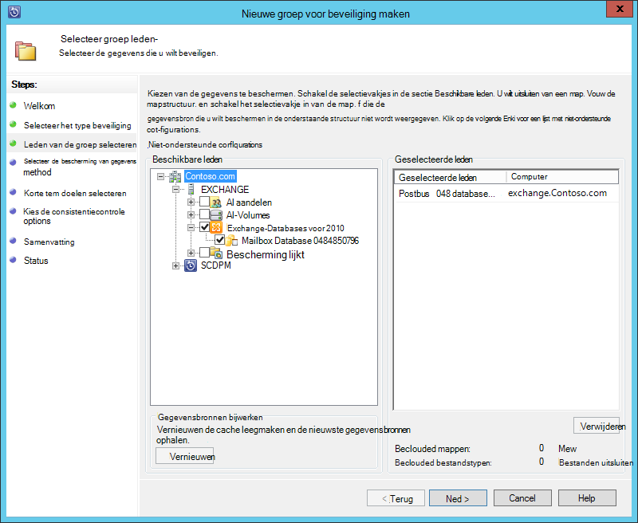
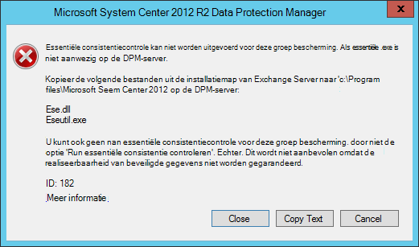
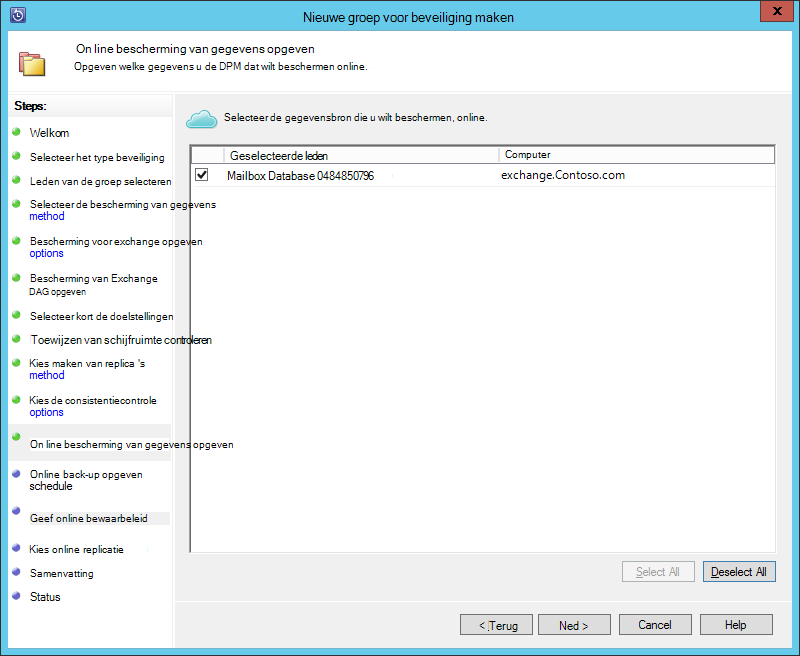
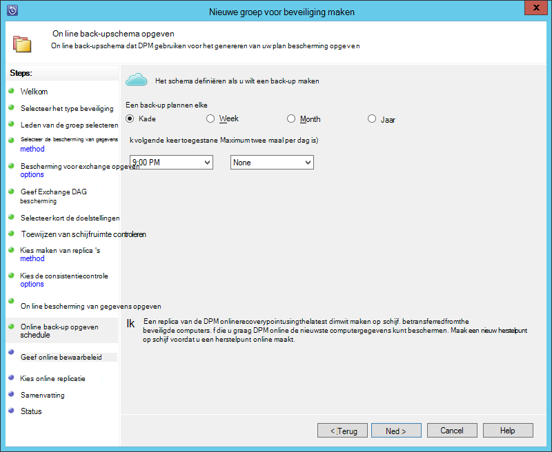
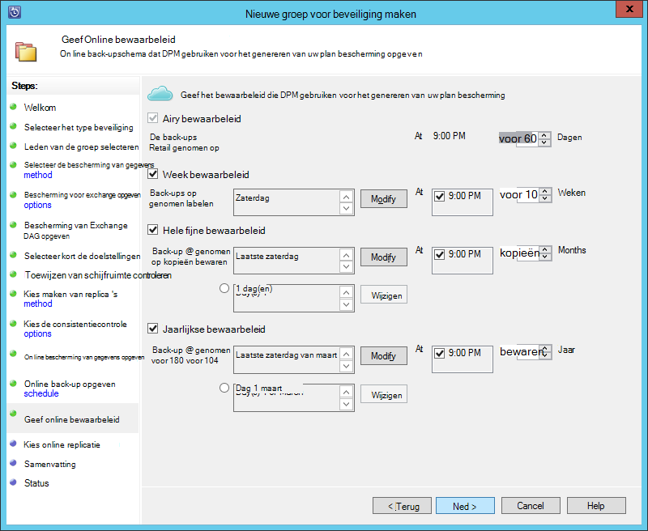
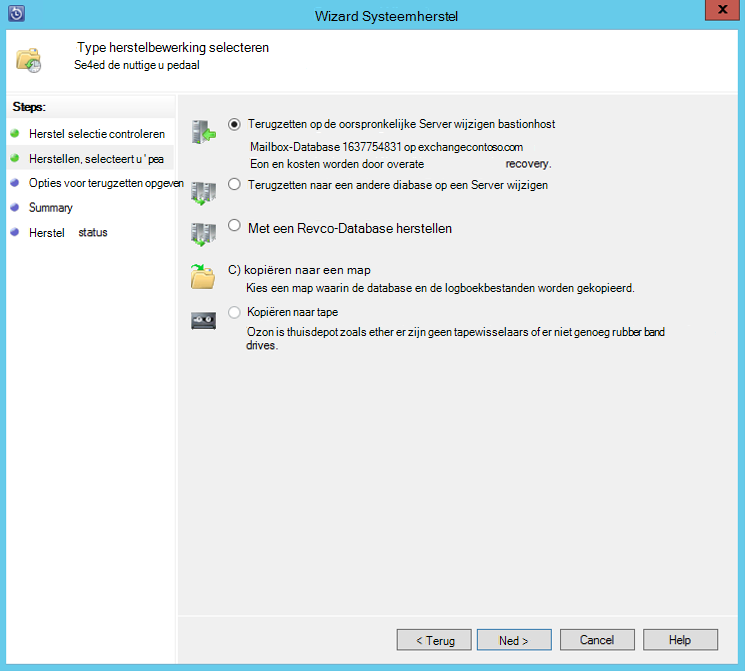

<properties
    pageTitle="Back-up van een Exchange-server naar Azure back-up met System Center 2012 R2 DPM | Microsoft Azure"
    description="Meer informatie over het back-up van een Exchange-server naar Azure back-up met behulp van System Center 2012 R2 DPM"
    services="backup"
    documentationCenter=""
    authors="MaanasSaran"
    manager="NKolli1"
    editor=""/>

<tags
    ms.service="backup"
    ms.workload="storage-backup-recovery"
    ms.tgt_pltfrm="na"
    ms.devlang="na"
    ms.topic="article"
    ms.date="08/15/2016"
    ms.author="anuragm;jimpark;delhan;trinadhk;markgal"/>

# Back-up van een Exchange-server naar Azure back-up met System Center 2012 R2 DPM
In dit artikel wordt beschreven hoe een server System Center 2012 R2 Data Protection Manager (DPM) naar de back-up van een Microsoft Exchange-server naar Azure back-up configureren.  

## Updates
Om te registreren de DPM-server is met Azure back-up, moet u het nieuwste updatepakket voor System Center 2012 R2 DPM en de meest recente versie van de back-up Azure Agent te installeren. Het nieuwste updatepakket ophalen uit de [Microsoft-catalogus](http://catalog.update.microsoft.com/v7/site/Search.aspx?q=System%20Center%202012%20R2%20Data%20protection%20manager).

>[AZURE.NOTE] Versie 2.0.8719.0 van de back-up Azure Agent is geïnstalleerd voor de voorbeelden in dit artikel en System Center 2012 R2 DPM updatepakket 6 is geïnstalleerd.

## Vereisten
Voordat u verdergaat, moet voldaan aan alle [vereisten](backup-azure-dpm-introduction.md#prerequisites) voor het gebruik van back-up van Microsoft Azure werkbelasting te beschermen. Deze vereisten zijn de volgende:

- Een back-up kluis op de Azure-site is gemaakt.
- Agent en kluis referenties zijn naar de DPM-server gedownload.
- De agent is geïnstalleerd op de DPM-server.
- De kluis referenties zijn gebruikt om te registreren de DPM-server.
- Als u de beveiliging van Exchange 2016, voer een upgrade uit naar DPM 2012 R2 UR9 of hoger

## DPM protection-agent  
De DPM protection-agent installeren op de Exchange-server, als volgt te werk:

1. Zorg ervoor dat de firewall correct zijn geconfigureerd. Zie [firewall-uitzonderingen configureren voor de agent](https://technet.microsoft.com/library/Hh758204.aspx).

2. De agent installeren op de Exchange-server door te klikken op **Management > medewerkers > installeren** in DPM Administrator-Console. Zie [de beveiliging DPM agent installeren](https://technet.microsoft.com/library/hh758186.aspx?f=255&MSPPError=-2147217396) voor gedetailleerde stappen.

## Een groep bescherming voor de Exchange-server maken

1. In de DPM Administrator-Console op **beveiliging**en klik vervolgens op **Nieuw** op het lint tool voor het openen van de wizard **Nieuwe bescherming groep maken** .

2. Klik op **volgende**in **het welkomstscherm van de wizard** .

3. Op het scherm **selecteert u het groepstype beveiliging** **Servers** selecteren en klik op **volgende**.

4. Selecteer de Exchange server-database die u wilt beveiligen en klik op **volgende**.

    >[AZURE.NOTE] Als de beveiliging van Exchange 2013, controleert u de [vereisten van Exchange 2013](https://technet.microsoft.com/library/dn751029.aspx).

    In het volgende voorbeeld wordt is de database van Exchange 2010 geselecteerd.

    

5. Selecteer de methode van de bescherming van gegevens.

    Naam van de groep voor de bescherming en selecteer vervolgens beide van de volgende opties:

    - Ik wil op korte termijn bescherming schijf gebruikt.
    - Ik wil online bescherming.

6. Klik op **volgende**.

7. Selecteer de optie **Uitvoeren van Eseutil integriteit controleren** als u wilt controleren van de integriteit van de Exchange Server-databases.

    Nadat u deze optie, back-consistentiecontrole wordt uitgevoerd op de DPM-server om te voorkomen dat de i/o-verkeer dat wordt gegenereerd door het uitvoeren van de opdracht **eseutil** op de Exchange-server.

    >[AZURE.NOTE]Als u deze optie gebruikt, moet u de Ese.dll en Eseutil.exe bestanden kopiëren naar de map C:\Program Files\Microsoft System Center 2012 R2\DPM\DPM\bin op de DPM-server. Anders wordt wordt de volgende fout gegenereerd:  
    

8. Klik op **volgende**.

9. Selecteer de database voor **Kopie back-up**en klik op **volgende**.

    >[AZURE.NOTE] Als u geen "Volledige back-up" voor ten minste één DAG kopie van een database, worden logboekbestanden niet afgekapt.

10. De doelstellingen voor de **korte termijn back-up**configureren en klik vervolgens op **volgende**.

11. De beschikbare schijfruimte controleren en klik vervolgens op **volgende**.

12. Selecteer het tijdstip waarop de DPM-server maakt de eerste replicatie en klik op **volgende**.

13. Selecteer de opties voor consistentiecontrole en klik op **volgende**.

14. Kies de database die u back wilt-up op Azure en klik op **volgende**. Bijvoorbeeld:

    

15. Het schema voor de **Back-up Azure**definiëren en klik vervolgens op **volgende**. Bijvoorbeeld:

    

    >[AZURE.NOTE] Online herstel punten zijn gebaseerd op express volledig herstel punten. Daarom moet u het herstelpunt online plannen nadat u de tijd die opgegeven voor het volledige herstel punt.

16. Het bewaarbeleid voor **Azure back-up**configureren en klik vervolgens op **volgende**.

17. Kies een replicatieoptie voor on line en klik op **volgende**.

    Als u een grote database, kan het lang voordat de eerste back-up moet worden gemaakt via het netwerk krijgen. U voorkomt dit probleem, kunt u een off line back-up maken.  

    

18. Bevestig de instellingen en klik op **Groep maken**.

19. Klik op **sluiten**.

## De Exchange-database herstellen

1. Om te herstellen van een Exchange-database, klikt u op **herstellen** in de DPM-beheerconsole.

2. Ga naar de Exchange-database die u wilt herstellen.

3. Een online herstelpunt selecteert in de vervolgkeuzelijst *hersteltijd* .

4. Klik op **herstellen** om de **Wizard Systeemherstel**te starten.

Voor on line herstel punten zijn er vijf typen voor herstel:

- **Herstellen naar de oorspronkelijke locatie van de Exchange-Server:** De gegevens zullen worden hersteld naar de oorspronkelijke Exchange-server.
- **Herstellen naar een andere database op een Exchange-Server:** De gegevens zullen worden hersteld naar een andere database op een andere Exchange-server.
- **Herstellen naar een Database herstellen:** De gegevens wordt op een Exchange herstel Database (RDB) hersteld.
- **Kopiëren naar een netwerkmap:** De gegevens zullen worden hersteld naar een netwerkmap.
- **Kopiëren naar tape:** Als er een bandwisselaar of een zelfstandig tapestation zijn aangesloten en geconfigureerd op de DPM-server, wordt het herstelpunt op vrije tape gekopieerd.

    

## Volgende stappen

- [Azure back-Veelgestelde vragen](backup-azure-backup-faq.md)
