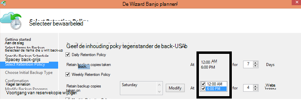

<properties
   pageTitle="Azure back-Veelgestelde vragen | Microsoft Azure"
   description="Antwoorden op veelgestelde vragen over de back-up service, reservekopie-agent, back-up en behoud, herstel, beveiliging en andere veelgestelde vragen over back-up en noodherstel."
   services="backup"
   documentationCenter=""
   authors="markgalioto"
   manager="jwhit"
   editor=""
   keywords="back-up en herstel na storing herstel; back-service"/>

<tags
   ms.service="backup"
   ms.workload="storage-backup-recovery"
     ms.tgt_pltfrm="na"
     ms.devlang="na"
     ms.topic="get-started-article"
     ms.date="10/21/2016"
     ms.author="trinadhk; giridham; arunak; markgal; jimpark;"/>

# <a name="azure-backup-service--faq"></a>Azure back-up service-Veelgestelde vragen


Dit artikel is een lijst met veelgestelde vragen (en de bijbehorende antwoorden) over de Azure back-up service. Onze community antwoorden snel, en als een vraag wordt vaak gevraagd, we toe te voegen aan dit artikel. De antwoorden op vragen meestal bieden verwijzing of ondersteuningsinformatie. U kunt vragen stellen over Azure back-up in de sectie Disqus van dit artikel of een relevant artikel. U kunt ook vragen over de back-up Azure service boeken in het [forum voor discussie](https://social.msdn.microsoft.com/forums/azure/home?forum=windowsazureonlinebackup).


## <a name="what-is-the-list-of-supported-operating-systems-from-which-i-can-back-up-to-azure-using-azure-backup-br"></a>Wat is de lijst met ondersteunde besturingssystemen van waaruit ik kan back-up op Azure met Azure back-up? <br/>
Azure back-up ondersteunt de volgende lijst met besturingssystemen voor bestand map back-up, back-up toepassing met behulp van back-upserver Azure en SCDPM.

| Besturingssysteem        | Platform           | SKU  |
| :------------- |-------------| :-----|
| Windows 8 en de meest recente SPs      | 64-bits | Enterprise, Pro |
| Windows 7 en de meest recente SPs      | 64-bits | Ultimate, Enterprise, Professional, Home Premium, Home Basic, Starter |
| Windows 8.1 en de nieuwste SPs | 64-bits      |    Enterprise, Pro |
| Windows 10      | 64-bits | Enterprise, Pro, Home |
|Windows Server 2012 R2 en de meest recente SPs| 64-bits| Standaard, Datacenter, Foundation|
|Windows Server 2012 en de meest recente SPs|    64-bits| Datacenter, Foundation, standaard|
|Windows Storage Server 2012 R2 en de meest recente SPs  |64-bits|    Standaard, werkgroep|
|Windows Storage Server 2012 en de meest recente SPs |64-bits |Standaard, werkgroep
|Windows Server 2012 R2 en de meest recente SPs  |64-bits|    Essentiële|
|Windows Server 2008 R2 SP1 |64-bits|    Standard, Enterprise, Datacenter, Foundation|
|Windows Server 2008 SP2    |64-bits|    Standard, Enterprise, Datacenter, Foundation|

Voor Azure VM back-up

- **Linux**: Azure Backup biedt ondersteuning voor [een lijst met distributies die door Azure worden geviseerd](../virtual-machines/virtual-machines-linux-endorsed-distros.md) , met uitzondering van Core OS Linux.  Andere plaatsen-uw-eigen-Linux-distributies kunnen ook werken als de agent VM beschikbaar op de virtuele machine is en ondersteuning voor Python bestaat.
- **Windows Server**: versies ouder dan Windows Server 2008 R2 worden niet ondersteund.

## <a name="where-can-i-download-the-latest-azure-backup-agent-br"></a>Waar kan ik de meest recente back-up Azure agent downloaden? <br/>
U kunt de nieuwste agent voor back-ups van Windows Server System Center DPM of Windows-client, [hier](http://aka.ms/azurebackup_agent)downloaden. Als u back-up van een virtuele machine wilt, gebruikt u de VM-Agent (die u installeert automatisch de juiste extensie). De Agent VM nog op virtuele machines gemaakt uit de galerie met Azure.

## <a name="which-version-of-scdpm-server-is-supported-br"></a>Welke versie van SCDPM-server wordt ondersteund? <br/>
Het is raadzaam de [meest recente](http://aka.ms/azurebackup_agent) back-up Azure agent te installeren op het nieuwste updatepakket van SCDPM (UR11 vanaf augustus 2016)

## <a name="when-configuring-the-azure-backup-agent-i-am-prompted-to-enter-the-vault-credentials-do-vault-credentials-expire"></a>Bij het configureren van de back-up Azure agent mij gevraagd de kluis referenties in te voeren. Verlopen kluis referenties?
Ja, de referenties van de kluis vervallen na 48 uur. Als het bestand is verlopen, log in op de Azure portal en de referenties vault bestanden downloaden van uw kluis.

## <a name="is-there-any-limit-on-the-number-of-vaults-that-can-be-created-in-each-azure-subscription-br"></a>Is er een limiet op het aantal kluizen die kunnen worden gemaakt in elk abonnement Azure? <br/>
Ja. Vanaf September 2016, kunt u 25 back-kluizen per abonnement. U kunt maximaal 25 Recovery Services kluizen per elke ondersteunde regio Azure back-up per abonnement maken. Als u meer kluizen nodig hebt, maakt u een nieuw abonnement.

## <a name="are-there-any-limits-on-the-number-of-serversmachines-that-can-be-registered-against-each-vault-br"></a>Zijn er eventuele limieten voor het aantal servers/machines die tegen elke kluis kan worden geregistreerd? <br/>
Ja, kunt u maximaal 50 computers per kluis registreren. Limiet is voor virtuele machines die Azure IaaS, 200 VMs per kluis. Als u nodig hebt voor het registreren van meer machines, maakt u een nieuwe kluis.

## <a name="how-do-i-register-my-server-to-another-datacenterbr"></a>Hoe registreer ik mijn server aan een ander datacenter<br/>
Back-ups wordt verzonden naar het datacenter van de kluis waar het is geregistreerd. De eenvoudigste manier om het wijzigen van het datacenter is de agent verwijderen en opnieuw installeren van de agent en registreren voor een nieuwe kluis die tot de gewenste datacenter behoort.

## <a name="what-happens-if-i-rename-a-windows-server-that-is-backing-up-data-to-azurebr"></a>Wat gebeurt er als ik de naam van een Windows-server die is back-ups van gegevens naar Azure?<br/>
Als u de naam van een server, worden alle momenteel geconfigureerde back-ups worden gestopt.
U moet de nieuwe naam van de server met de back-up kluis registreren. Wanneer u een nieuwe registratie maakt, is de eerste back-up een volledige back-up en niet een incrementele back-up. Als u gegevens die is eerder een back-up naar de kluis met de oude servernaam te herstellen, kunt u met de optie [**een andere server**](backup-azure-restore-windows-server.md#recover-to-an-alternate-machine) in de wizard **Herstellen** gegevens herstellen.

## <a name="what-types-of-drives-can-i-backup-files-and-folders-from-br"></a>Welke soorten schijven kan ik back-up van bestanden en mappen? <br/>
De volgende reeks schijven/volumes kan back-up niet ophalen:

- Verwisselbare Media: Het station moet melden als een vaste worden gebruikt een back-bron.
- Alleen-lezen Volumes: het volume moet schrijfbaar zijn voor de volume shadow copy service (VSS) functie.
- Off line Volumes: Het volume moet on line zijn voordat VSS functie.
- Netwerkshare: het volume moet lokaal op de server kan een reservekopie worden gemaakt met behulp van online back-up.
- BitLocker beveiligde volumes: het volume moet worden ontgrendeld voordat de back-up kan plaatsvinden.
- Systeemidentificatie bestand: NTFS is het enige bestandssysteem voor deze versie van de online back-up-service ondersteund.

## <a name="what-file-and-folder-types-can-i-back-up-from-my-serverbr"></a>Welke typen bestanden en mappen kan ik back-up van mijn server?<br/>
De volgende typen worden ondersteund:

- Gecodeerd
- Gecomprimeerd
- Sparse
- Gecomprimeerde + Sparse
- Vaste koppelingen: Niet ondersteund, wordt overgeslagen
- Reparse-punt: Niet ondersteund, wordt overgeslagen
- Gecodeerd + gecomprimeerd: Niet ondersteund, wordt overgeslagen
- Gecodeerde + Sparse: Niet ondersteund, wordt overgeslagen
- Gecomprimeerde Stream: Niet ondersteund, wordt overgeslagen
- Verspreide Stream: Niet ondersteund, wordt overgeslagen

## <a name="whats-the-minimum-size-requirement-for-the-cache-folder-br"></a>Wat is de vereiste minimale grootte voor de cachemap? <br/>
De grootte van de cachemap bepaalt de hoeveelheid gegevens die u back-ups maken. Uw map moet 5% van de benodigde ruimte voor opslag van gegevens.

## <a name="if-my-organization-has-one-vault-how-can-i-isolate-one-servers-data-from-another-server-when-restoring-databr"></a>Als mijn organisatie een kluis heeft, hoe kan ik isoleren van één server gegevens van een andere server bij het terugzetten van gegevens?<br/>
Alle servers die zijn geregistreerd op de dezelfde kluis kunnen herstellen door andere servers *die gebruikmaken van dezelfde wachtwoordzin*back-ups van gegevens. Als u servers waarvan back-up van de gegevens die u wilt isoleren van andere servers in uw organisatie, gebruikt u een wachtwoordzin aangewezen voor deze servers. HRM-servers kunnen bijvoorbeeld een wachtwoordzin codering, accounting servers, en de opslagservers een derde gebruiken.

## <a name="can-i-migrate-my-backup-data-or-vault-between-subscriptions-br"></a>Kan ik 'migreren' Mijn back-upgegevens of kluis tussen abonnementen? <br/>
Nr. De kluis wordt gemaakt in een abonnement en kan niet worden toegewezen aan een ander abonnement zodra deze wordt gemaakt.

## <a name="does-the-azure-backup-agent-work-on-a-server-that-uses-windows-server-2012-deduplication-br"></a>Werkt de Agent Azure back-up op een server met Windows Server 2012 deduplication? <br/>
Ja. De agent-service deze gegevens deduplicated voor normale gegevens zorgt ervoor dat de back-upbewerking. Het optimaliseert vervolgens de gegevens voor de back-up, worden gegevens gecodeerd en stuurt de gecodeerde gegevens naar de online back-up service.

## <a name="if-i-cancel-a-backup-job-once-it-has-started-is-the-transferred-backup-data-deleted-br"></a>Als ik een back-uptaak annuleren nadat deze is gestart, de overgebrachte gegevens back-up verwijderd? <br/>
Nr. De back-kluis slaat de back-upgegevens die was tot aan het moment van de annulering zijn overgebracht. Azure back-up gebruikt een mechanisme checkpoint controlepunten af en toe aan de back-upgegevens toevoegen tijdens de back-up. Omdat er in de back-upgegevens controlepunten, kan het volgende back-upproces de integriteit van de bestanden valideren. De volgende back-up gestart zou oplopen via de gegevens die waren is eerder een reservekopie. Een incrementele back-up biedt betere benutting van bandbreedte, hoeft u niet herhaaldelijk dezelfde gegevens overbrengen.

In het geval van Azure VM back-up, zodra de taak wordt geannuleerd, overgebrachte gegevens genegeerd en wordt vers back-up brengt incrementele gegevens van back-uptaak eerder gelukt.

## <a name="why-am-i-seeing-the-warning-azure-backups-have-not-been-configured-for-this-server-even-though-i-had-scheduled-regular-backups-previously-br"></a>Waarom de waarschuwing 'Azure back-ups zijn niet geconfigureerd voor deze server', hoewel ik had regelmatig back-ups eerder gepland? <br/>
Deze waarschuwing optreedt wanneer het back-upschema instellingen die zijn opgeslagen op de lokale server niet hetzelfde als de instellingen die zijn opgeslagen in de back-kluis zijn. Als de server of de instellingen zijn hersteld naar een bekende, goede staat, kunnen de back-up schema's synchronisatie verloren. Als u deze waarschuwing, [de back-beleid configureren](backup-azure-manage-windows-server.md) en vervolgens **Back Up nu uitvoeren** om te synchroniseren van de lokale server met Azure ontvangt.

## <a name="what-firewall-rules-should-be-configured-for-azure-backup-br"></a>Welke firewall regels moeten worden geconfigureerd voor Azure back-up? <br/>
Het is raadzaam dat u de firewall toestaat te communiceren met de volgende URL's voor een naadloze bescherming van gegevens op-locatie-naar-Azure en werkbelasting aan Azure:

- www.msftncsi.com
- \*. Microsoft.com
- \*. WindowsAzure.com
- \*. microsoftonline.com
- \*. windows.net

##<a name="can-i-install-the-azure-backup-agent-on-an-azure-vm-already-backed-by-the-azure-backup-service-using-the-vm-extension-br"></a>Kan ik de back-up Azure-agent installeren op een Azure VM al gesteund door de back-up Azure service met de extensie VM <br/>
Absoluut. Azure back-up biedt VM niveau back-up voor Azure VMs met de VM-extensie. U kunt de Azure Backup agent installeren op een Windows-Gastbesturingssysteem beveiligen van bestanden en mappen op die gast OS.

## <a name="can-i-install-the-azure-backup-agent-on-an-azure-vm-to-back-up-files-and-folders-present-on-temporary-storage-provided-by-the-azure-vm-br"></a>Kan ik de back-up Azure-agent installeren op een Azure VM back-up bestanden en mappen aanwezig op tijdelijke opslag die door de Azure VM <br/>
U kunt de back-up Azure-agent installeren op de Windows-Gastbesturingssysteem en back-up van bestanden en mappen voor tijdelijke opslag. Maar houd er rekening mee dat de back-ups mislukken nadat de gegevens in de tijdelijke opslag is de aandelenkoer. Ook als de gegevens in de tijdelijke opslag is verwijderd, kunt u alleen terugzetten naar de niet-vluchtige opslag.

## <a name="i-have-installed-azure-backup-agent-to-protect-my-files-and-folders-can-i-now-install-scdpm-to-work-with-azure-backup-agent-to-protect-on-premises-applicationvm-workloads-to-azure-br"></a>Ik heb geïnstalleerd Azure Backup agent ter bescherming van deze bestanden en mappen. Kan ik SCDPM om te werken met Azure Backup agent te beschermen op ruimten toepassing/VM werkbelasting aan Azure nu installeren? <br/>
Azure back-up gebruikt met SCDPM, is het aanbevolen SCDPM installeren eerst en vervolgens alleen Azure Backup agent installeren. Dit zorgt voor naadloze integratie van de Azure Backup agent met SCDPM en kan beschermen van bestanden/mappen, -werklasten en VMs naar Azure, rechtstreeks vanuit de beheerconsole van SCDPM. SCDPM installeren na de installatie van Azure back-up wordt agent voor bovengenoemde doeleinden niet aanbevolen of ondersteund.

## <a name="what-is-the-length-of-file-path-that-can-be-specified-as-part-of-azure-backup-policy-using-azure-backup-agent-br"></a>Wat is de lengte van het pad dat kan worden opgegeven als onderdeel van Azure back-up beleid met Azure Backup agent? <br/>  
Azure Backup agent is gebaseerd op NTFS. De die wordt [filepath lengte-aanduiding wordt beperkt door de Windows API](https://msdn.microsoft.com/library/aa365247.aspx#fully_qualified_vs._relative_paths). Klanten kunnen kiezen bij een back-up maken van bestanden met bestand padlengte groter is dan de opgegeven door de Windows API, back-up van de bovenliggende map of de schijf van de back-upbestanden.  

## <a name="what-characters-are-allowed-in-file-path-of-azure-backup-policy-using-azure-backup-agent-br"></a>Welke tekens zijn toegestaan in pad naar Azure back-up beleid met Azure Backup agent? <br>  
 Azure Backup agent is gebaseerd op NTFS. Kunt [NTFS tekens ondersteund](https://msdn.microsoft.com/library/aa365247.aspx#naming_conventions) als onderdeel van de specificatie.  

## <a name="can-i-use-azure-backup-server-to-create-a-bare-metal-recovery-bmr-backup-for-a-physical-server-br"></a>Kan ik back-upserver Azure gebruiken voor het maken van een back-up-Bare Metal Recovery (BMR) voor een fysieke server? <br/>
Ja.

## <a name="can-i-configure-the-backup-service-to-send-mail-if-a-backup-job-fails-br"></a>Kan ik de back-up-service te configureren voor e-mail verzenden als een back-up mislukt? <br/>
Ja, de back-up-service heeft verschillende waarschuwingen op basis van een gebeurtenis die kunnen worden gebruikt met een PowerShell-script. Zie [waarschuwingen](backup-azure-manage-vms.md#alert-notifications) voor een volledige beschrijving.

## <a name="is-there-a-limit-on-the-size-of-each-data-source-being-backed-up-br"></a>Is er een limiet voor de grootte van elke gegevensbron back-up worden gemaakt? <br/>
Terwijl er geen limiet op het bedrag van het maken van reservekopieën van gegevens op het niveau van de kluis is, Azure back-up opleggen van een beperking (voor praktische doeleinden kunnen deze limieten zijn zeer hoog) op de maximale grootte van de gegevensbron. Vanaf augustus 2015 is de gegevensbron voor de maximale grootte voor de ondersteunde besturingssystemen:

|S.No | Besturingssysteem |  Maximale grootte van gegevensbron |
| :-------------: |:-------------| :-----|
|1| Windows Server 2012 of hoger| 54400 GB|
|2| Windows 8 of hoger| 54400 GB|
|3| Windows Server 2008, Windows Server 2008 R2 | 1700 GB|
|4| Windows 7 | 1700 GB|

De volgende tabel wordt uitgelegd hoe u elke bron data grootte wordt bepaald.

|   Gegevensbron  |   Details |
| :-------------: |:-------------|
|Volume |De hoeveelheid gegevens die worden back-up van één volume van een server of client machine|
|Hyper-V virtuele machine | Som van de gegevens van de VHD's van de virtuele machine back-up gemaakt|
|Microsoft SQL Server-database | Grootte van één grootte van SQL database back-up gemaakt |
|Microsoft SharePoint |Som van de inhouds- en configuratiedatabases in een SharePoint-farm back-up gemaakt|
|Microsoft Exchange |Som van alle Exchange-databases in een Exchange-server back-up gemaakt|
|BMR/systeemstatus |Elk afzonderlijk exemplaar van BMR of systeem staat van de machine wordt een back-up|

## <a name="are-there-limits-on-the-number-of-times-a-backup-job-can-be-scheduled-per-daybr"></a>Zijn er beperkingen op het aantal keren dat een back-up per dag kan worden gepland?<br/>
Ja, u kunt uitvoeren back-uptaken op Windows Server of Windows client maximaal drie keer per dag. U kunt back-uptaken uitvoeren op System Center DPM tot twee keer per dag. U kunt een reservekopietaak eenmaal per dag voor VMs IaaS uitvoeren.

## <a name="is-there-a-difference-between-the-scheduling-policy-for-dpm-and-windows-server-ie-on-windows-server-without-dpm-br"></a>Is er een verschil is tussen de planning voor DPM en Windows Server (dat wil zeggen op Windows Server zonder DPM)? <br/>
Ja. DPM kunt u dagelijkse, wekelijkse, maandelijkse en jaarlijkse planning opgeven. Windows Server (zonder DPM) kunt u alleen dagelijkse en wekelijkse schema's opgeven.

## <a name="is-there-a-difference-between-the-retention-policy-for-dpm-and-windows-serverclient-ie-on-windows-server-without-dpmbr"></a>Is er een verschil tussen het bewaarbeleid voor DPM en Windows Server/client (dat wil zeggen op Windows Server zonder DPM)?<br/>
Nee, beide DPM en Windows Server/client hebben dagelijks, wekelijkse, maandelijkse en jaarlijkse bewaarbeleid.

## <a name="can-i-configure-my-retention-policies-selectively--ie-configure-weekly-and-daily-but-not-yearly-and-monthlybr"></a>Kan ik mijn behoud beleid selectief – dat wil zeggen wekelijks configureren en dagelijks maar niet jaarlijks en maandelijks configureren?<br/>
Ja, de structuur van de inhouding Azure back-up kunt u hebt volledige flexibiliteit bij het definiëren van het bewaarbeleid voor aan de hand van uw eisen.

## <a name="can-i-schedule-a-backup-at-6pm-and-specify-retention-policies-at-a-different-timebr"></a>Zijn er 'een back-up plannen"om 6 uur en 'bewaarbeleid' op een ander tijdstip opgeven?<br/>
Nr. Bewaarbeleid kunnen alleen worden toegepast op back-punten. In de volgende afbeelding wordt het bewaarbeleid voor back-ups op 12 am en 6 uur genomen opgegeven. <br/>


<br/>

## <a name="is-an-incremental-copy-transferred-for-the-retention-policies-scheduled-br"></a>Een incrementele kopie overgebracht voor het bewaarbeleid gepland? <br/>
Nee, de incrementele kopie verzonden op basis van de tijd vermeld op de pagina back-upschema. De punten die kunnen worden bewaard, worden bepaald op basis van het bewaarbeleid.

## <a name="if-a-backup-is-retained-for-a-long-duration-does-it-take-more-time-to-recover-an-older-data-point-br"></a>Als u een back-up wordt bewaard voor een lange duur, duurt het meer tijd om te herstellen van een oudere gegevenspunt? <br/>
 Nee – de tijd om te herstellen van de oudste of de nieuwste punt is hetzelfde. Elk herstelpunt gedraagt zich als een volledige punt.

## <a name="if-each-recovery-point-is-like-a-full-point-does-it-impact-the-total-billable-backup-storagebr"></a>Als elk herstelpunt vergelijkbaar met een vol punt is, deze invloed heeft de totale te factureren, back-up opslaan?<br/>
Back-upgegevens typische op lange termijn behoud punt producten opgeslagen als volledige punten. De volledige punten zijn *inefficiënt* opslag maar eenvoudiger en sneller te herstellen. Incrementele kopieën zijn *efficiënte* opslag maar moet u een reeks gegevens die van invloed op de hersteltijd te herstellen. Azure back-up opslagarchitectuur biedt u het beste van beide werelden door optimaal gegevens opslaan voor snel herstelt en lage opslagkosten aangaan. Deze gegevens opslag benadering zorgt ervoor dat de ingress- en egress-bandbreedte efficiënter wordt gebruikt. Zowel het bedrag van de opslag van gegevens en de tijd die nodig is om te herstellen van de gegevens wordt tot een minimum beperkt. Lees meer over hoe de [incrementele back-ups](https://azure.microsoft.com/blog/microsoft-azure-backup-save-on-long-term-storage/) opslaan efficiënt.

## <a name="is-there-a-limit-on-the-number-of-recovery-points-that-can-be-createdbr"></a>Is er een limiet op het aantal herstel punten die kunnen worden gemaakt?<br/>
Nr. We hebben limieten op herstel punten geschrapt. U kunt zoveel herstel punten als u wilt maken.

## <a name="why-is-the-amount-of-data-transferred-in-backup-not-equal-to-the-amount-of-data-i-backed-upbr"></a>Waarom is de hoeveelheid gegevens in de back-up niet gelijk is aan het bedrag van de gegevens die ik een back-up overgebracht?<br/>
 De gegevens waarvan een reservekopie van Azure Backup Agent of SCDPM of Azure back-up Server, wordt gecomprimeerd en gecodeerd voordat deze worden overgebracht. Zodra de codering en compressie wordt toegepast, is de gegevens in de back-kluis 30-40% kleiner.

## <a name="is-there-a-way-to-adjust-the-amount-of-bandwidth-used-by-the-backup-servicebr"></a>Is er een manier om de hoeveelheid bandbreedte die wordt gebruikt door de back-up service aanpassen?<br/>
 Ja, de optie **Eigenschappen wijzigen** in de reservekopie-Agent gebruiken om aan te passen bandbreedte. Pas de hoeveelheid bandbreedte en de tijden waarop u die bandbreedte gebruiken. Zie het [Netwerk beperken](../backup-configure-vault.md#enable-network-throttling), voor meer informatie.

## <a name="my-internet-bandwidth-is-limited-for-the-amount-of-data-i-need-to-back-up-is-there-a-way-i-can-move-data-to-a-certain-location-with-a-large-network-pipe-and-push-that-data-into-azure-br"></a>Mijn internet-bandbreedte is beperkt voor de hoeveelheid gegevens die ik nodig om een back-up. Is er een manier kan ik gegevens naar een bepaalde locatie met een groot netwerk pipe en push-gegevens in Azure verplaatsen? <br/>
U kunt back-ups in Azure via de standaard on line back-up, of kunt u de service Azure importeren/exporteren om opslag in Azure blob-gegevens overbrengen. Er zijn geen extra manieren om back-datum in Azure opslag. Voor informatie over het gebruik van de service Azure importeren/exporteren met Azure back-up, raadpleegt u het artikel [off line back-up-workflow](backup-azure-backup-import-export.md) .

## <a name="how-many-recoveries-can-i-perform-on-the-data-that-is-backed-up-to-azurebr"></a>Hoeveel herstel kan ik uitvoeren op de gegevens die de back-up in Azure<br/>
Er is geen limiet op het aantal herstelbewerkingen van Azure back-up.

## <a name="do-i-have-to-pay-for-the-egress-traffic-from-azure-data-center-during-recoveriesbr"></a>Heb ik betalen voor de egress-verkeer van Azure Datacenter tijdens herstel?<br/>
 Nr. Uw gegevens zijn gratis en u niet worden aangerekend voor de egress-verkeer.

## <a name="is-the-data-sent-to-azure-encrypted-br"></a>Worden de gegevens naar Azure gecodeerd verzonden? <br/>
Ja. Gegevens worden gecodeerd op de op ruimten client-server/SCDPM machine met behulp van AES256 en de gegevens worden verzonden via een beveiligde HTTPS-verbinding.

## <a name="is-the-backup-data-on-azure-encrypted-as-wellbr"></a>De back-upgegevens op Azure ook gecodeerd is?<br/>
 Ja. De gegevens verzonden naar Azure blijven gecodeerd (in rust). Microsoft heeft de back-upgegevens op enig moment niet worden gedecodeerd. Azure back-is afhankelijk van de codering van de virtuele machine dat wil zeggen als uw VM is gecodeerd met Azure schijfversleuteling of sommige coderingstechnologie voor Azure VM back-up, Azure back-codering wordt gebruikt die uw gegevens te beveiligen.

## <a name="what-is-the-minimum-length-of-encryption-key-used-to-encrypt-backup-data-br"></a>Wat is de minimale lengte van de coderingssleutel die wordt gebruikt voor het coderen van gegevens back-up? <br/>
 De sleutel moet minimaal 16 tekens.

## <a name="what-happens-if-i-misplace-the-encryption-key-can-i-recover-the-data-or-can-microsoft-recover-the-data-br"></a>Wat gebeurt er als ik de sleutel misplace? Kan ik de gegevens herstellen (of) kan Microsoft de gegevens herstellen? <br/>
De sleutel voor het versleutelen van de back-upgegevens is alleen op de locatie van de klant aanwezig. Microsoft houdt niet bij een kopie in Azure en heeft geen toegang tot de sleutel. Als de klant de sleutel misplaces, herstellen niet de back-upgegevens in Microsoft.

## <a name="how-do-i-change-the-cache-location-specified-for-the-azure-backup-agentbr"></a>Hoe wijzig ik de locatie van de cache voor de Azure Backup agent opgegeven?<br/>
 Doorloop opeenvolgend opsommingsteken onderstaande lijst om de locatie van de cache te wijzigen.
- Stop de motor back-up door het uitvoeren van de volgende opdracht bij een opdrachtprompt:

  ```PS C:\> Net stop obengine```

- Verplaats de bestanden niet. In plaats daarvan de cachemap ruimte kopiëren naar een ander station met voldoende ruimte. De oorspronkelijke ruimte in de cache kan na het bevestigen van dat de back-ups werkt met de nieuwe ruimte in de cache worden verwijderd.

- De volgende registervermeldingen bijwerken met het pad naar de nieuwe map met ruimte.<br/>

|Register-pad | Registersleutel | Waarde |
| ------ | ------- | ------|
| `HKEY_LOCAL_MACHINE\SOFTWARE\Microsoft\Windows Azure Backup\Config` | ScratchLocation | *Nieuwe locatie van de cache map* |
| `HKEY_LOCAL_MACHINE\SOFTWARE\Microsoft\Windows Azure Backup\Config\CloudBackupProvider` | ScratchLocation | *Nieuwe locatie van de cache map* |

- De back-up-engine opnieuw door het uitvoeren van de volgende opdracht bij een opdrachtprompt:

  ```PS C:\> Net start obengine```

  Zodra de back-up maken op de nieuwe cachelocatie is voltooid, kunt u de oorspronkelijke map verwijderen.

## <a name="where-can-i-put-the-cache-folder-for-the-azure-backup-agent-to-work-as-expectedbr"></a>Waar kan ik de cache-map werken zoals verwacht de back-up agent Azure plaatsen?<br/>
De volgende locaties naar de cachemap wordt niet aanbevolen:

- Netwerk-share of verwisselbare Media: de cache-map moet lokaal op de server die moet worden back-ups maken met behulp van online back-up. Netwerklocaties of verwijderbare media zoals USB-stations worden niet ondersteund.
- Off line Volumes: De cachemap moet zijn voor de verwachte back-up met behulp van de reservekopie-Agent Azure online.

## <a name="are-there-any-attributes-of-the-cache-folder-that-are-not-supportedbr"></a>Zijn er kenmerken van de cachemap die niet worden ondersteund?<br/>
 De volgende kenmerken of combinaties daarvan worden niet ondersteund voor de cache-map:

- Gecodeerd
- Opgeheven gedupliceerd.
- Gecomprimeerd
- Sparse
- Reparse-punt

Het is raadzaam de cachemap noch de metagegevens VHD de kenmerken hierboven is voor de verwachte werking van de agent Azure back-up.
