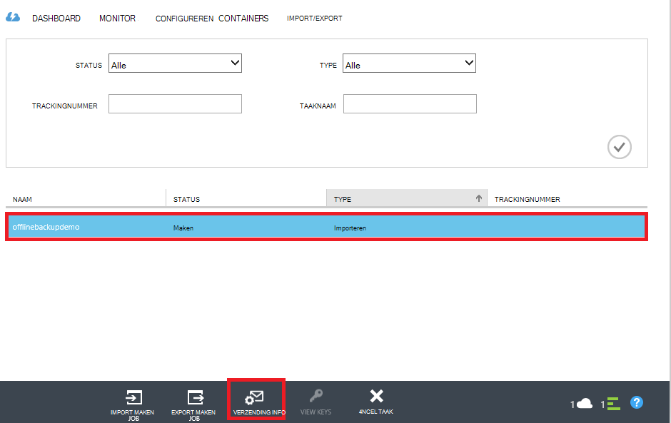

<properties
   pageTitle="Azure back - off line back-up of eerste enten met de service Azure Import/Export | Microsoft Azure"
   description="Informatie over hoe Azure back-up kunt u gegevens uit het netwerk via de Azure Import/Export-service te verzenden. In dit artikel wordt uitgelegd in de off line verzorgt de seeding van de initiële back-upgegevens via de service Azure importeren exporteren."
   services="backup"
   documentationCenter=""
   authors="saurabhsensharma"
   manager="shivamg"
   editor=""/>
<tags
   ms.service="backup"
   ms.devlang="na"
   ms.topic="article"
   ms.tgt_pltfrm="na"
   ms.workload="storage-backup-recovery"
   ms.date="08/16/2016"
   ms.author="jimpark;saurabhsensharma;nkolli;trinadhk"/>

# Off line back-up-workflow in Azure back-up
Azure back-up heeft verschillende ingebouwde efficiëntie die netwerk- en kosten tijdens de eerste volledige back-ups van gegevens naar Azure besparen. Eerste volledige back-ups van grote hoeveelheden gegevens overbrengen meestal en meer netwerkbandbreedte in vergelijking met de volgende back-ups die alleen de delta/incrementals transfer. Azure back-up worden de eerste back-ups gecomprimeerd. Aan de hand van het off line seeding kunt Azure back-up schijven gecomprimeerde initiële back-upgegevens offline uploaden naar Azure.  

Het proces voor off line seeding van Azure back-up is nauw geïntegreerd met de [service Azure importeren/exporteren](../storage/storage-import-export-service.md) kunt u gegevens overbrengen naar Azure schijven. Als u terabytes (TBs) van de eerste back-up gegevens die moeten worden overgebracht via een netwerk met hoge latentie en een lage bandbreedte hebt, kunt u de off line seeding workflow de eerste back-up op een of meer harde schijven voor een datacenter Azure levert. Dit artikel bevat een overzicht van de stappen die deze werkstroom voltooien.

## Overzicht

Met de voorziening off line seeding van Azure back-up en Azure importeren/exporteren is het eenvoudig off line gegevens uploaden naar Azure schijven. In plaats van het eerste exemplaar van de volledige overdracht via het netwerk, wordt de back-upgegevens geschreven naar een *tijdelijke locatie*. Als de kopie naar de tijdelijke locatie met behulp van het hulpprogramma Azure importeren/exporteren is voltooid, wordt deze gegevens weggeschreven naar een of meer SATA-schijven, afhankelijk van de hoeveelheid gegevens. Deze stations zijn uiteindelijk verzonden naar de dichtstbijzijnde Azure datacenter.

De [augustus 2016 bijwerken van Azure back-up (en hoger)](http://go.microsoft.com/fwlink/?LinkID=229525) bevat het *voorbereidingsprogramma Azure schijf*, met de naam AzureOfflineBackupDiskPrep, die:

   - Kunt u de schijven voorbereiden voor Azure importeren met behulp van het hulpprogramma voor importeren/exporteren van Azure.
   - Een taak importeren met Azure voor de service Azure importeren/exporteren op de [Azure klassieke portal](https://manage.windowsazure.com) in plaats van dezelfde handmatig te maken met oudere versies van Azure back-up wordt automatisch gemaakt.

Na het uploaden van de back-upgegevens op Azure, Azure back-up back-up worden de gegevens gekopieerd om de back-up en de incrementele back-ups worden gepland.

  > [AZURE.NOTE] Ervoor zorgen dat de update van augustus 2016 van Azure back-up (of hoger) hebt geïnstalleerd en de stappen van de werkstroom met deze voor het gebruik van het hulpprogramma voor het voorbereiden van Azure-schijf. Als u een oudere versie van Azure back-up gebruikt, kunt u de SATA harde schijf voorbereiden via de Azure importeren/exporteren als omschreven in latere secties van dit artikel.

## Vereisten

- [Vertrouwd raken met de werkstroom Azure importeren/exporteren](../storage/storage-import-export-service.md).
- Voordat de werkstroom is gestart, controleert u of:
    - Een kluis Azure back-up is gemaakt.
    - Kluis referenties zijn gedownload.
    - De Azure Backup agent is geïnstalleerd op Windows Server, Windows client- of System Center Data Protection Manager en de computer is geregistreerd bij de kluis Azure back-up.
- [De instellingen voor het publiceren van Azure downloaden](https://manage.windowsazure.com/publishsettings) op de computer van waaruit u wilt back-up van uw gegevens.
- Voorbereiden op een tijdelijke locatie, is mogelijk een netwerkshare of een extra schijf op de computer. De tijdelijke locatie is de tijdelijke opslag en tijdelijk tijdens deze workflow wordt gebruikt. Zorg ervoor dat de tijdelijke locatie onvoldoende schijfruimte heeft voor het opslaan van uw eerste exemplaar. Als u probeert ervoor te zorgen dat back-up van een bestandsserver met 500 GB is de staging-ruimte ten minste 500 GB. (Een kleiner bedrag wordt gebruikt vanwege de compressie).
- Zorg ervoor dat u een ondersteunde station gebruikt. Slechts 3,5-inch SATA III-II harde schijven worden ondersteund voor gebruik met de service voor importeren/exporteren. Vaste schijven groter dan 8 TB worden niet ondersteund. U kunt een schijf met SATA III-II extern koppelen op de meeste computers met behulp van een SATA II/III USB-adapter. Raadpleeg de documentatie van Azure importeren/exporteren voor de meest recente set van stations die de service ondersteunt.
- BitLocker inschakelen op de computer waarop de schrijver SATA-station is aangesloten.
- [Download het hulpprogramma Azure importeren/exporteren](http://go.microsoft.com/fwlink/?LinkID=301900&clcid=0x409) op de computer waarop de SATA schrijver station is aangesloten. Deze stap is niet vereist als u hebt gedownload en geïnstalleerd van de update van augustus 2016 van Azure back-up (of hoger).

## Workflow
De informatie in deze sectie kunt u de off line back-up-workflow uitvoeren, zodat uw gegevens kunnen worden bezorgd in een datacenter Azure en geüpload naar de opslag van Azure. Als u vragen over de Import- of enig aspect van het proces hebt, Zie de documentatie van [service-overzicht importeren](../storage/storage-import-export-service.md) waarnaar eerder is verwezen.

### Off line back-up starten

1. Wanneer u een back-up plant, ziet u het volgende scherm (in Windows Server, Windows client of System Center Data Protection Manager).

    

    Hier wordt het bijbehorende scherm in System Center Data Protection Manager:  
    

    De omschrijving van de "inputs" is als volgt:

    - **Tijdelijke locatie**: de tijdelijke opslaglocatie waarnaar de eerste back-up wordt geschreven. Dit is mogelijk op een netwerkshare of op een lokale computer. Als de broncomputer en de kopie computer verschillend zijn, is het raadzaam dat u het volledige netwerkpad van de tijdelijke locatie opgeven.
    - **Naam van Azure importeren**: de unieke naam die door invoer Azure service en Azure back-up de overdracht van gegevens die worden verzonden op schijven met Azure houden.
    - **Azure publicatie-instellingen**: een XML-bestand dat informatie over het profiel van uw abonnement bevat. Het bevat ook een veilige referenties die gekoppeld aan uw abonnement zijn. U kunt [het bestand downloaden](https://manage.windowsazure.com/publishsettings). Geef het lokale pad naar het bestand publiceren.
    - **Azure abonnements-ID**: Azure de abonnement-ID voor het abonnement waar u van plan bent het project Azure importeren te starten. Als er meerdere Azure abonnementen, de ID van het abonnement dat u wilt koppelen aan de taak importeren gebruiken.
    - **Azure opslag Account**: de rekening van de klassieke type opslag in het opgegeven Azure abonnement die gekoppeld aan het project Azure importeren zijn.
    - **Azure opslag Container**: de naam van de bestemming opslag blob opslag Azure rekening waar de gegevens van deze taak wordt geïmporteerd.

    > [AZURE.NOTE] Als u hebt de server vanaf de [Azure portal](https://portal.azure.com) naar een kluis Azure Recovery Services geregistreerd voor uw back-ups en niet op een abonnement Cloud Solution Provider (CSP), kunt u nog steeds een klassieke type opslag-account maken vanaf de portal Azure en voor de off line back-up-workflow gebruiken.

    Al deze informatie niet opslaan omdat u opnieuw invoeren moet in de volgende stappen uit. Alleen de in *tijdelijke locatie* is vereist als u het voorbereidingsprogramma Azure schijf gebruikt voor de schijven voorbereiden.    

2. De werkstroom voltooien en selecteer vervolgens **Nu een Back-Up maken** in de beheerconsole Azure back-up van de off line back-up starten. De eerste back-up is naar de staging-ruimte als onderdeel van deze stap geschreven.

    

    Om de desbetreffende werkstroom in System Center Data Protection Manager met de rechtermuisknop op de **Groep bescherming**en kies vervolgens de optie **Create herstel punt** . Vervolgens kiest u de optie **On line beveiliging** .

    

    Nadat de bewerking is voltooid, kan de tijdelijke locatie worden gebruikt voor de schijfvoorbereiding.

    

### Een SATA-schijf voorbereiden en maken van een taak Azure importeren met behulp van het hulpprogramma voor het voorbereiden van Azure-schijf
Het voorbereidingsprogramma Azure schijf beschikbaar is in de installatiemap van de agent Recovery Services (augustus 2016 bijwerken en hoger) in het volgende pad.

   *\Microsoft* *Azure* *Herstel* *Diensten* * Agent\Utils\*

1. Ga naar de map en kopieer de map **AzureOfflineBackupDiskPrep** op een up-computer waarop de stations worden voorbereid zijn gemonteerd. Controleer het volgende met betrekking tot de computer kopiëren:

      - De kopie computer toegang tot de tijdelijke locatie voor de werkstroom offline seeding via hetzelfde netwerkpad dat is opgegeven in de workflow **off line back-up starten** .

      - BitLocker is ingeschakeld op de computer.

      - De computer toegang tot de portal Azure.

      Indien nodig, kan de computer kopiëren hetzelfde zijn als de broncomputer.

2. Open een opdrachtprompt op de computer kopiëren met de Azure voorbereid als de schijf hulpprogramma map als de huidige map en voer de volgende opdracht uit:

      S: *.\AzureOfflineBackupDiskPrep.exe* <*Pad naar de tijdelijke locatie*> [p: <*pad naar PublishSettingsFile*>]

| Parameter | Beschrijving
|-------------|-------------|
|s: <*Pad naar de tijdelijke locatie*> | Verplichte invoer die wordt gebruikt om het pad naar de tijdelijke locatie die u hebt opgegeven in de workflow **off line back-up starten** . |
|p: <*pad naar PublishSettingsFile*> | Optionele invoer die wordt gebruikt om het pad naar het bestand **Azure publicatie-instellingen** die u hebt opgegeven in de workflow **off line back-up starten** . |

> [AZURE.NOTE] De &lt;pad naar PublishSettingFile&gt; waarde is verplicht wanneer de computer kopiëren en de broncomputer verschillend zijn.

Wanneer u de opdracht uitvoert, vraagt het hulpprogramma voor de selectie van het project Azure importeren die overeenkomt met de schijven die moeten worden voorbereid. Als er slechts een enkele invoer gekoppeld aan de opgegeven tijdelijke locatie wordt, ziet u een scherm zoals in de volgende.

     
3. Geef de stationsletter zonder de afsluitende dubbele punt voor de gekoppelde schijf die u wilt voorbereiden voor overdracht naar Azure. Bevestigt u de bewerking voor de opmaak van het station wanneer daarom wordt gevraagd.

Het hulpprogramma begint dan de schijf met de back-upgegevens voorbereiden. Wellicht moet u extra schijven wanneer daarom wordt gevraagd door het programma wanneer de opgegeven schijf voldoende ruimte voor de back-upgegevens niet heeft koppelen.  

Aan het einde van het hulpprogramma is uitgevoerd, worden een of meer schijven die u hebt opgegeven voor verzending naar Azure bereid. Bovendien wordt een taak importeren met de naam die u tijdens de werkstroom **starten off line back-up** gemaakt op de klassieke Azure portal. Ten slotte wordt weergegeven het verzendadres op de Azure datacenter waar de schijven moeten worden verzonden en de koppeling om naar de taak importeren op de klassieke Azure portal.

    
4. De schijven op het adres dat het hulpprogramma geleverd en het volgnummer voor toekomstig gebruik houden. 
5. Wanneer u naar de koppeling die het hulpprogramma wordt weergegeven gaat, ziet u de Azure opslag-account die u hebt opgegeven in de workflow **off line back-up starten** . Hier ziet u de zojuist gemaakte importeren taak op het tabblad **Importeren/EXPORTEREN** van de opslag-account.

    
6. Klik op **Verzending INFO** onderaan de pagina om uw contactgegevens bijwerken, zoals in het volgende scherm. Microsoft gebruikt deze informatie om uw schijven naar u verzenden nadat het importeren is voltooid.

    
7. De verzendgegevens invoeren in het volgende scherm. De **Vervoerder** en **Volgnummer** details die overeenkomen met de schijven die u hebt verzonden naar het datacenter Azure bieden.

    

### De werkstroom voltooien
Nadat de taak importeren is voltooid, is initiële gegevens back-up beschikbaar in uw account voor opslag. De agent Recovery Services vervolgens kopieert de inhoud van de gegevens van deze account naar de kluis van de back-up of Recovery Services vault, indien dit van toepassing is. In de volgende geplande back-up tijd uit de Azure reservekopie-agent de incrementele back-up via de eerste back-up.

> [AZURE.NOTE] In de volgende secties van toepassing op gebruikers van eerdere versies van Azure back-up die u geen toegang tot het voorbereidingsprogramma Azure schijf hebt.

### Een SATA-schijf voorbereiden

1. Het [Hulpprogramma voor importeren/exporteren van Microsoft Azure](http://go.microsoft.com/fwlink/?linkid=301900&clcid=0x409) downloaden naar de computer kopiëren. Zorg ervoor dat de tijdelijke locatie is toegankelijk vanaf de computer waarop u van plan bent de volgende reeks opdrachten uitvoeren. Indien nodig, kan de computer kopiëren hetzelfde zijn als de broncomputer.

2. Pak het bestand WAImportExport.zip. Het hulpprogramma voor WAImportExport die worden opgemaakt van de SATA harde schijf, de back-up gegevens schrijft naar de SATA harde schijf en codeert deze uitvoeren. Voordat u de volgende opdracht uitvoert, moet u ervoor zorgen dat BitLocker is ingeschakeld op de computer.  

    *.\WAImportExport.exe PrepImport /j: <* JournalFile*> .jrn /id: <*sessie-id*> /sk: <*StorageAccountKey*> /BlobType:**PageBlob* * /t: <*TargetDriveLetter*>/format / /srcdir coderen: <*tijdelijke locatie*> /dstdir: <*DestinationBlobVirtualDirectory*>/*

    > [AZURE.NOTE] Als u de update van augustus 2016 van Azure back-up (of hoger) hebt geïnstalleerd, ervoor te zorgen dat de tijdelijke locatie die u hebt ingevoerd hetzelfde als een op het scherm **Nu een Back-Up maken is** en AIB en Base Blob-bestanden bevat.

| Parameter | Beschrijving
|-------------|-------------|
| /j: <*JournalFile*>| Het pad naar een journal-bestand. Elk station moet precies één journal-bestand. De journal-bestand mag geen op het doelstation. De bestandsextensie van het dagboek is .jrn en wordt gemaakt als onderdeel van het uitvoeren van deze opdracht.|
|/ID: <*sessie-id*> | De sessie-ID identificeert de kopieersessie van een. Het wordt gebruikt om ervoor te zorgen nauwkeurige herstel van een sessie onderbroken kopiëren. Bestanden die worden gekopieerd in een kopieersessie worden opgeslagen in een map met de naam van de sessie-ID op het doelstation.|
| /SK: <*StorageAccountKey*> | De sleutel van de account voor de opslag account waarnaar de gegevens worden geïmporteerd. De sleutel moet dezelfde die is ingevoerd tijdens het maken van de groep Back-beleid/bescherming.|
| / BlobType | Het type van de blob. Deze werkstroom slaagt alleen als **PageBlob** is opgegeven. Dit is niet standaard en moet worden vermeld in deze opdracht. |
|/ t: <*TargetDriveLetter*> | De stationsletter zonder de afsluitende dubbele punt van de harde schijf van het doel voor de huidige kopieersessie.|
|/ Format | De optie om het station te formatteren. Deze parameter opgeven wanneer het station worden geformatteerd moet. anders laat u het achterwege. Voordat u het hulpprogramma voor het station is geformatteerd, wordt gevraagd om een bevestiging van de console. Als u geen bevestiging, geeft u de parameter /silentmode.|
|/ coderen | De optie voor het versleutelen van het station. Deze parameter kunt u opgeven wanneer het station nog niet is versleuteld met BitLocker en moet door het hulpprogramma worden gecodeerd. Als het station al is versleuteld met BitLocker, deze parameter weglaat, geeft u de parameter /bk en bieden de bestaande sleutel van BitLocker. Als u de parameter/Format opgeeft, moet u ook opgeven de / parameter coderen. |
|/srcdir: <*SourceDirectory*> | De bronmap met bestanden die worden gekopieerd naar het doelstation. Zorg ervoor dat de naam van de opgegeven map een volledige in plaats van relatieve pad.|
|/dstdir: <*DestinationBlobVirtualDirectory*> | Het pad naar de virtuele map van bestemming in uw account Azure opslag. Zorg ervoor dat geldige container namen gebruiken als u de virtuele mappen van bestemming of BLOB's opgeven. Houd er rekening mee dat de namen van de container in kleine letters moeten.  De naam van de container moet degene die u hebt opgegeven tijdens het maken van de groep Back-beleid/bescherming.|

  > [AZURE.NOTE] Een journal-bestand wordt gemaakt in de map WAImportExport die de volledige gegevens van de werkstroom worden vastgelegd. Dit bestand moet u bij het maken van een taak importeren in Azure portal.

  

### Een taak importeren maken in de portal voor Azure
1. Ga naar uw account opslag in [Azure klassieke portal](https://manage.windowsazure.com/), klikt u op **Importeren/exporteren**en **Importeren-taak maken** in het taakvenster.

    

2. In stap 1 van de wizard aangeven dat u het station hebt voorbereid en u hebt het station journal-bestand beschikbaar.
3. Bieden de contactgegevens van de persoon die verantwoordelijk voor deze taak importeren is in stap 2 van de wizard.
4. In stap 3 het station journal-bestanden die u hebt verkregen in de vorige sectie te uploaden.
5. Voer een beschrijvende naam voor de taak importeren die u hebt opgegeven tijdens het maken van de groep Back-beleid/bescherming in stap 4. De naam die u invoert mag alleen kleine letters, cijfers, koppeltekens en onderstrepingstekens, moet beginnen met een letter en mag geen spaties bevatten. De naam die u kiest, wordt gebruikt voor het bijhouden van uw taken terwijl ze worden uitgevoerd en nadat ze zijn voltooid.
6. Selecteer vervolgens uw datacenter-regio in de lijst. Het datacenter regio geeft de datacenter en het adres waarnaar het pakket moet worden verzonden.

    

7. In stap 5, uw retour vervoerder selecteren uit de lijst en voer het nummer van de vervoerder. Microsoft gebruikt deze account om uw schijven naar u verzenden nadat de taak importeren is voltooid.

8. Verzend de schijf en voer het volgnummer voor het bijhouden van de status van de verzending. Nadat de schijf is binnengekomen in het datacenter, wordt het gekopieerd naar de rekening voor de opslag en de status wordt bijgewerkt.

    

### De werkstroom voltooien
Na de eerste back-upgegevens beschikbaar is in uw account voor de opslag, de agent Microsoft Azure Recovery Services kopieert de inhoud van de gegevens van deze account om de back-up of Recovery Services kluis, indien dit van toepassing is. In het volgende schema back-tijd uitvoert de Azure reservekopie-agent de incrementele back-up via de eerste back-up.

## Volgende stappen
- Raadpleeg voor vragen over de werkstroom Azure importeren/exporteren, [gebruik van de service Microsoft Azure importeren/exporteren om gegevens naar een Blob-opslag te brengen](../storage/storage-import-export-service.md).
- Raadpleeg de sectie off line back-up van de back-Azure [Veelgestelde vragen](backup-azure-backup-faq.md) voor eventuele vragen over de werkstroom.
