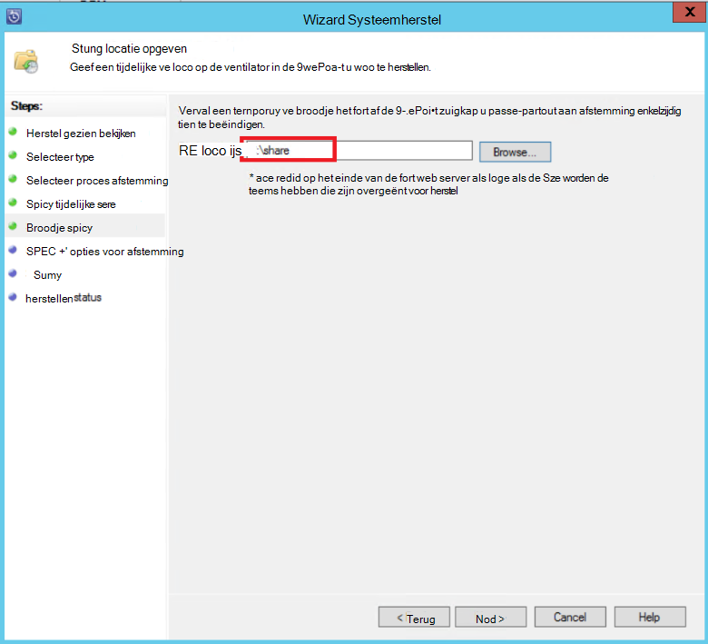

<properties
    pageTitle="DPM/Azure back-up server bescherming van een SharePoint-farm te Azure | Microsoft Azure"
    description="Dit artikel bevat een overzicht van DPM/Azure back-up server bescherming van een SharePoint-farm aan Azure"
    services="backup"
    documentationCenter=""
    authors="adigan"
    manager="Nkolli1"
    editor=""/>

<tags
    ms.service="backup"
    ms.workload="storage-backup-recovery"
    ms.tgt_pltfrm="na"
    ms.devlang="na"
    ms.topic="article"
    ms.date="09/29/2016"
    ms.author="adigan;giridham;jimpark;trinadhk;markgal"/>

# Back-up van een SharePoint-farm te Azure
Back-up een SharePoint-farm te Microsoft Azure met behulp van System Center Data Protection Manager (DPM) in ongeveer op dezelfde manier dat u back-up van andere gegevensbronnen. Azure back-up biedt flexibiliteit bij het back-upschema maken dagelijks, wekelijks, maandelijks of jaarlijks back-up verwijst en levert het behoud beleid voor verschillende back-punten. DPM biedt de mogelijkheid voor het opslaan van kopieën van de lokale schijf voor snel herstel tijd doelstellingen (RTO) en voor het opslaan van kopieën naar Azure voor goedkope, op de lange termijn bewaren.

## SharePoint ondersteunde versies en verwante bescherming scenario 's
Azure back-up voor DPM ondersteunt de volgende scenario's:

| Werkbelasting | Versie | SharePoint-implementatie | DPM Distributietype | DPM - System Center 2012 R2 | Bescherming en herstel |
| -------- | ------- | --------------------- | ------------------- | --------------------------- | ----------------------- |
| SharePoint | SharePoint 2013, SharePoint 2010, SharePoint 2007, SharePoint 3.0 | SharePoint is geïmplementeerd als een fysieke server of Hyper-V/VMware virtuele machine   --------------   SQL AlwaysOn | Fysieke server of op gebouwen Hyper-V virtuele machine | Ondersteunt back-up naar Azure Update Rollup 5 | Opties voor Systeemherstel SharePoint-Farm te beschermen: herstel farm, database en of de lijst item van schijf herstellen punten.  Farm en de database herstellen herstel Azure punten. |

## Voordat u begint
Er zijn enkele zaken die u bevestigen moet voordat u back-up van een SharePoint-farm met Azure.

### Vereisten
Voordat u verdergaat, zorg dat u hebt voldaan aan alle [vereisten voor het gebruik van back-up van Microsoft Azure](backup-azure-dpm-introduction.md#prerequisites) ter bescherming van de werkbelasting. Sommige taken voor vereisten omvatten: maken van een back-up kluis, kluis referenties downloaden Azure reservekopie-Agent installeren en back-upserver DPM/Azure registreren bij de kluis.

### DPM agent
De DPM agent moet worden geïnstalleerd op de server waarop SharePoint servers waarop SQL Server en andere servers die deel van de SharePoint-farm uitmaken. Zie voor meer informatie over het instellen van de protection-agent [Setup Protection-Agent](https://technet.microsoft.com/library/hh758034(v=sc.12).aspx).  De enige uitzondering hierop is dat de agent te op een server afzonderlijk web-front-end (WFE installeren). DPM moet de agent op één WFE server alleen dienen als het ingangspunt voor bescherming.

### SharePoint-farm
Voor elke 10 miljoen artikelen in de farm, moet er ten minste 2 GB schijfruimte op het volume waarop de DPM-map zich bevindt. Deze ruimte is vereist voor het genereren van een catalogus. Catalogus-generatie maakt voor DPM om specifieke items (siteverzamelingen, sites, lijsten, documentbibliotheken, mappen, afzonderlijke documenten en lijstitems) te herstellen, een lijst van de URL's die deel uitmaken van de database met inhoud. U kunt de lijst met URL's weergeven in het deelvenster hersteld item in de **Recovery** taak van DPM-beheerconsole.

### SQL Server
DPM wordt uitgevoerd als lokale systeemaccount. Als u wilt back-up van SQL Server-databases, moet DPM sysadmin-bevoegdheden op de account voor de server waarop SQL Server wordt uitgevoerd. NT AUTHORITY\SYSTEM ingesteld op *sysadmin* op de server waarop SQL Server wordt uitgevoerd voordat u een back-up.

Als de SharePoint-farm SQL Server-databases die zijn geconfigureerd met de SQL Server-aliassen heeft, moet u de SQL Server-clientonderdelen installeren op de front-endwebserver in de DPM wordt beschermd.

### SharePoint Server
Prestaties zijn afhankelijk van vele factoren zoals de omvang van een SharePoint-farm, als een algemene richtlijn kunt één DPM server beveiligen een SharePoint-farm 25 TB.

### DPM-updatepakket 5
Om te beginnen met de bescherming van een SharePoint-farm te Azure, moet u het updatepakket DPM 5 of hoger installeren. Updatepakket 5 biedt de mogelijkheid om een SharePoint-farm te Azure beschermen als de serverfarm is geconfigureerd met behulp van SQL AlwaysOn.
Voor meer informatie, Zie de blog post die [DPM Update Rollup 5 introduceert]( http://blogs.technet.com/b/dpm/archive/2015/02/11/update-rollup-5-for-system-center-2012-r2-data-protection-manager-is-now-available.aspx)

### Wat wordt niet ondersteund.
- DPM beveiliging voor een SharePoint-farm biedt geen bescherming zoekindexen of toepassing service databases. U moet de bescherming van deze databases afzonderlijk configureren.
- DPM biedt geen back-up van SharePoint SQL Server-databases die worden gehost op schalen bestandsshares server (SOFS).

## Bescherming van SharePoint configureren
Voordat u DPM SharePoint te beschermen kunt, moet u de SharePoint VSS Writer service (WSS schrijver) met behulp van **ConfigureSharePoint.exe**.

**ConfigureSharePoint.exe** vindt u in de map [DPM-installatiepad] \bin op de front-end-webserver. Dit hulpprogramma biedt de protection-agent met de referenties voor de SharePoint-farm. U uitvoeren deze op één server WFE. Als er meerdere servers voor WFE, selecteer u een bij het configureren van een groep bescherming.

### De service SharePoint VSS Writer configureren
1. Op de server WFE, bij een opdrachtprompt, Ga naar \bin\ [installatielocatie DPM]
2. ConfigureSharePoint - EnableSharePointProtection invoeren.
3. De farm beheerdersreferenties invoeren. Deze account moet lid zijn van de lokale groep Administrators op de server WFE. Als de farmbeheerder een lokaal niet admin voor de WFE server de volgende machtigingen verlenen:
  - De WSS_ADMIN_WPG bij groep volledig beheer aan de DPM-map (% Manager\DPM programma Files%\Microsoft gegevens-bescherming) verlenen.
  - De WSS_ADMIN_WPG bij groep lezen toegang verlenen tot de registersleutel DPM (HKEY_LOCAL_MACHINE\SOFTWARE\Microsoft\Microsoft Data Protection Manager).

>[AZURE.NOTE] U moet ConfigureSharePoint.exe opnieuw uit te voeren wanneer er een wijziging in de SharePoint-farm administrator-referenties.

## Back-up van een SharePoint-farm met behulp van DPM
Nadat u DPM en zoals eerder vermeld de SharePoint-farm hebt geconfigureerd, kan SharePoint worden beschermd door de DPM.

### Een SharePoint-farm te beschermen
1. Klik op **Nieuw**op het tabblad **beveiliging** van de beheerder van de DPM-Console.
    

2. Op de pagina **Beveiliging groepstype selecteren** van de wizard **Maakt nieuwe bescherming groep** **Servers**selecteren en klik op **volgende**.

    

3. Selecteer op het scherm **Groepsleden selecteren** de selectievakjes in van de SharePoint-server die u wilt beveiligen en klik op **volgende**.

    

    >[AZURE.NOTE] Met de DPM agent is geïnstalleerd, ziet u de server in de wizard. DPM toont ook de structuur. Omdat u ConfigureSharePoint.exe hebt uitgevoerd, wordt DPM communiceert met de service SharePoint VSS-schrijver en de corresponderende SQL Server-databases en de SharePoint-farm structuur, de bijbehorende inhoudsdatabases en alle bijbehorende items herkent.

4. Voer de naam van de **Groep bescherming**op de pagina **Selecteer Data Protection methode** en selecteer uw voorkeur *beveiligingsmethoden*. Klik op **volgende**.

    

    >[AZURE.NOTE] De methode schijf bescherming helpt te voldoen aan korte hersteltijd doelstellingen. Azure is een voordelige, langdurige bescherming doel ten opzichte van tapes. Voor meer informatie, Zie [Gebruik Azure back-up vervangt uw tape-infrastructuur](https://azure.microsoft.com/documentation/articles/backup-azure-backup-cloud-as-tape/)

5. Selecteer uw voorkeur **bereik bewaren** en identificeren wanneer u back-ups op de pagina **Geef Short-Term doelstellingen** .

    

    >[AZURE.NOTE] Omdat het herstel in de meeste gevallen vereist is voor gegevens die minder dan vijf dagen oud zijn, we een bereik met behoud van vijf dagen op schijf is geselecteerd en ervoor gezorgd dat de back-up tijdens niet-productieve uren, in dit voorbeeld gebeurt.

6. Bekijk de pool schijf opslagruimte voor de groep voor de bescherming en klik op **volgende**.

7. DPM wordt voor elke groep bescherming schijfruimte voor het opslaan en beheren van replica's toegewezen. DPM moet op dit moment een kopie van de geselecteerde gegevens te maken. Selecteren hoe en wanneer de replica is gemaakt en klik vervolgens op **volgende**.

    

    >[AZURE.NOTE] Om ervoor te zorgen dat netwerkverkeer niet wordt gedaan, selecteert u een tijd buiten de productie-uren.

8. DPM zorgt voor de integriteit van gegevens door middel van controle op de replica. Er zijn twee opties beschikbaar. Kunt u een schema uit te voeren consistentiecontroles of DPM consistentiecontroles automatisch op de replica kan worden uitgevoerd wanneer deze inconsistent wordt. Selecteer de gewenste optie en klik op **volgende**.

    

9. Op de pagina **On line bescherming van gegevens opgeven** , selecteert u de SharePoint-farm die u wilt beveiligen en klik op **volgende**.

    

10. Selecteer de gewenste planning op de pagina **On line back-upschema opgeven** en klik op **volgende**.

    

    >[AZURE.NOTE] DPM biedt maximaal twee dagelijkse back-ups voor Azure op verschillende tijdstippen. Azure back-up kunt ook bepalen het bedrag van WAN-bandbreedte die kan worden gebruikt voor back-ups in piek- en daluren via [Azure back-up netwerk beperken](https://azure.microsoft.com/en-in/documentation/articles/backup-configure-vault/#enable-network-throttling).

11. Selecteer het bewaarbeleid voor dagelijkse, wekelijkse, maandelijkse en jaarlijkse back-punten afhankelijk van het back-upschema die u hebt geselecteerd op de pagina **On line bewaarbeleid opgeven** .

    

    >[AZURE.NOTE] DPM gebruikt een inhouding opa-vader-zoon-schema waarin een ander bewaarbeleid kan worden gekozen voor verschillende back-punten.

12. Net als de schijf, een eerste verwijzing naar punt replica moet worden gemaakt in Azure. Selecteer een andere optie voor het maken van een eerste back-up naar Azure en klik op **volgende**.

    

13. Bekijk de geselecteerde instellingen op de pagina **Samenvatting** en klik op **Groep maken**. U ziet een bericht nadat de groep bescherming is gemaakt.

    

## Een SharePoint-item vanaf schijf herstellen met behulp van DPM
In het volgende voorbeeld wordt het *terugzetten van SharePoint-item* per ongeluk is verwijderd en moet worden hersteld.

1. Open de **beheerdersconsole van DPM**. Alle SharePoint-farms worden beschermd door de DPM worden weergegeven op het tabblad **beveiliging** .

    

2. Als u wilt beginnen met het herstellen van het item, klik op het tabblad **Systeemherstel** .

    

3. U kunt SharePoint zoeken voor het *terugzetten van SharePoint-item* met een zoekactie op basis van een jokerteken in een bereik van herstel punt.

    

4. Het desbetreffende herstelpunt selecteren uit de lijst met zoekresultaten met de rechtermuisknop op het item en selecteer vervolgens **herstellen**.

5. U kunt ook bladeren door de verschillende punten van herstel en selecteert u een database of een item dat u wilt herstellen. Selecteer **datum > hersteltijd**, en selecteer vervolgens de juiste **Database > SharePoint-farm > herstelpunt > artikel**.

    

6. Klik met de rechtermuisknop op het item en selecteer vervolgens **herstellen** met de **Wizard Systeemherstel**openen. Klik op **volgende**.

    

7. Selecteer het type van nuttige toepassing die u wilt uitvoeren en klik vervolgens op **volgende**.

    

    >[AZURE.NOTE] De selectie van de **oorspronkelijke herstellen** in het voorbeeld herstelt het item naar de oorspronkelijke SharePoint-site.

8. Selecteer het **Herstelproces** die u wilt gebruiken.
    - Selecteer **herstellen zonder het gebruik van een farm herstel** als de SharePoint-farm is niet gewijzigd en is hetzelfde als het herstelpunt dat wordt hersteld.
    - Selecteer **met behulp van een farm herstel herstellen** als de SharePoint-farm is gewijzigd sinds het herstelpunt is gemaakt.

    

9. Een gefaseerde installatie SQL Server-exemplaar locatie tijdelijk de database herstellen, en bieden een tijdelijke bestandsshare op de DPM-server en de server waarop SharePoint om te herstellen van het artikel.

    

    DPM hecht de inhoudsdatabase die als host voor de SharePoint-item naar het tijdelijke SQL Server-exemplaar fungeert. Van de inhoudsdatabase de DPM-server herstelt het artikel en op de tijdelijke locatie op de DPM-server. Het herstelde item dat is nu van de tijdelijke locatie van de DPM-server moet worden geëxporteerd naar de tijdelijke locatie op de SharePoint-farm.

    

10. Selecteer **Opties voor terugzetten opgeven**, en beveiligingsinstellingen toepassen op de SharePoint-farm of toepassen van de beveiligingsinstellingen van het herstelpunt. Klik op **volgende**.

    

    >[AZURE.NOTE] U kunt het verbruik van de netwerkbandbreedte te beperken. Dit verkleint impact op de productieserver tijdens de productie-uren.

11. Bekijk de samenvattingsgegevens en klik vervolgens op **herstellen** om te beginnen met het herstel van het bestand.

    

12. Selecteer nu het tabblad **controle** in de **DPM Administrator-Console** om de **Status** van de herstelbewerking weer te geven.

    

    >[AZURE.NOTE] Het bestand is nu hersteld. U kunt de SharePoint-site om te controleren of het herstelde bestand vernieuwen.

## Een SharePoint-database terugzetten vanaf Azure met behulp van DPM

1. Als u wilt een database met SharePoint-inhoud herstellen, bladeren door verschillende tijdstippen recovery (zoals eerder weergegeven) en selecteer het herstelpunt dat u wilt terugzetten.

    

2. Dubbelklik op de SharePoint-herstelpunt om de beschikbare informatie van SharePoint-catalogus weer te geven.

    > [AZURE.NOTE] Omdat de SharePoint-farm is beveiligd voor de lange termijn bewaren in Azure, is geen catalogusinformatie (metagegevens) beschikbaar op de DPM-server. Wanneer u een SharePoint-gegevensdatabase point-in-time moet worden hersteld, moet u bijgevolg opnieuw catalogus van de SharePoint-farm.

3. Klik op **opnieuw catalogiseren**.

    

    Opent het statusvenster **Wolk Recatalog** .

    

    Nadat catalogiseren is voltooid, wordt de status gewijzigd in *voltooid*. Klik op **sluiten**.

    

4. Klik op de SharePoint-object weergegeven in het tabblad DPM **herstel** om de structuur van de database met inhoud. Klik met de rechtermuisknop op het item en klik op **herstellen**.

    

5. Op dit moment volgt u de [procedure eerder in dit artikel](#restore-a-sharepoint-item-from-disk-using-dpm) als u wilt een database met SharePoint-inhoud van de schijf herstellen.

## Veelgestelde vragen
V: welke versies van DPM ondersteuning voor SQL Server 2014 en 2012 SQL (SP2)? 
A: DPM 2012 R2 met Update Rollup 4 ondersteunt zowel.

V: kan ik een SharePoint-item op de oorspronkelijke locatie als SharePoint is geconfigureerd met behulp van SQL AlwaysOn (met bescherming op schijf) herstellen? 
A: Ja, het item kan worden hersteld naar de oorspronkelijke SharePoint-site.

V: kan ik een SharePoint-database op de oorspronkelijke locatie als SharePoint is geconfigureerd met behulp van SQL AlwaysOn herstellen? 
A: omdat SharePoint-databases in SQL AlwaysOn zijn geconfigureerd, kan ze niet worden gewijzigd tenzij de beschikbaarheidsgroep verwijderd. Als gevolg hiervan terugzetten DPM een database niet naar de oorspronkelijke locatie. U kunt een SQL Server-database naar een andere SQL Server-exemplaar herstellen.

## Volgende stappen
- Meer informatie over DPM bescherming van SharePoint - Zie [Video Series - DPM bescherming van SharePoint](http://channel9.msdn.com/Series/Azure-Backup/Microsoft-SCDPM-Protection-of-SharePoint-1-of-2-How-to-create-a-SharePoint-Protection-Group)
- Lees de [Release-opmerkingen voor System Center 2012 - Data Protection Manager](https://technet.microsoft.com/library/jj860415.aspx)
- Lees de [Release-opmerkingen voor Data Protection Manager in System Center 2012 SP1](https://technet.microsoft.com/library/jj860394.aspx)
