<properties
    pageTitle="Azure back-up voor de werkbelasting van SQL Server met behulp van DPM | Microsoft Azure"
    description="Een inleiding tot de back-ups van SQL Server-databases met behulp van de back-up Azure service"
    services="backup"
    documentationCenter=""
    authors="adigan"
    manager="Nkolli1"
    editor=""/>

<tags
    ms.service="backup"
    ms.workload="storage-backup-recovery"
    ms.tgt_pltfrm="na"
    ms.devlang="na"
    ms.topic="article"
    ms.date="09/27/2016"
    ms.author="adigan;giridham; jimpark;markgal;trinadhk"/>

# Azure back-up voor de werkbelasting van SQL Server met behulp van DPM

Dit artikel helpt u bij de configuratiestappen voor back-up van SQL Server-databases met Azure Backup.

Als u wilt back-up van SQL Server-databases naar Azure, moet u een account Azure. Als u geen account hebt, kunt u een gratis proefperiode account in slechts enkele minuten. Zie voor meer informatie, [Gratis proefperiode van Azure](https://azure.microsoft.com/pricing/free-trial/).

Het beheer van de back-up van SQL Server-database Azure en herstel van Azure bestaat uit drie stappen:

1. Maak een back-up beleid ter bescherming van de SQL Server-databases naar Azure.
2. Maak back-ups op de vraag naar Azure.
3. De database terugzetten vanuit Azure.

## Voordat u begint
Voordat u begint, ervoor te zorgen dat aan alle [voorwaarden](../backup-azure-dpm-introduction.md#prerequisites) voor het gebruik van back-up van Microsoft Azure ter bescherming van de werklast is voldaan. De vereisten, zoals taken besproken: maken van een back-up kluis, kluis referenties downloaden de Azure reservekopie-Agent installeren en registreren van de server met de kluis.

## Maak een back-up beleid ter bescherming van de SQL Server-databases naar Azure

1. Klik op de werkruimte **bescherming** op de DPM-server.

2. Klik op **Nieuw** als u wilt maken van een nieuwe groep voor de bescherming op het lint gereedschap.

    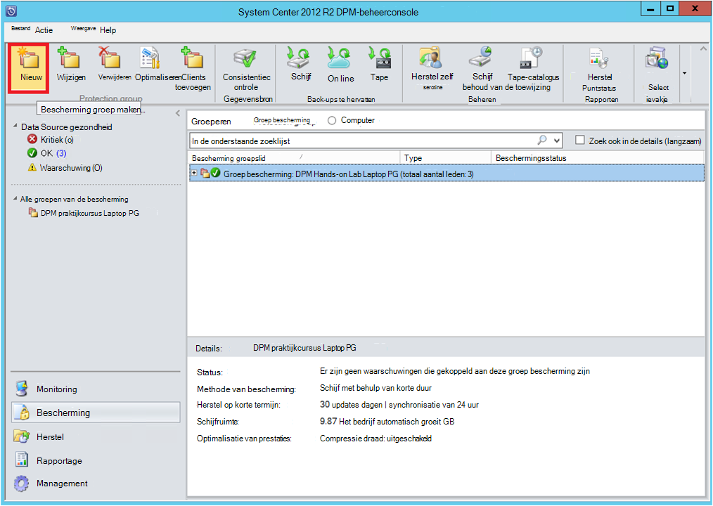

3. DPM toont het startscherm met advies over het maken van een **Groep van bescherming**. Klik op **volgende**.

4. Selecteer de **Servers**.

    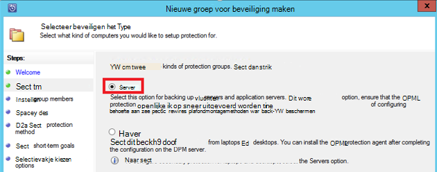

5. Vouw de SQL Server-computer waarop de databases worden back-up moet aanwezig zijn. DPM toont verschillende gegevensbronnen die kunnen worden back-up van die server. Vouw **Alle SQL-Shares** en selecteer de (in dit geval we geselecteerde databases ReportServer$ MSDPM2012 en ReportServer$ MSDPM2012TempDB) back-up worden gemaakt. Klik op **volgende**.

    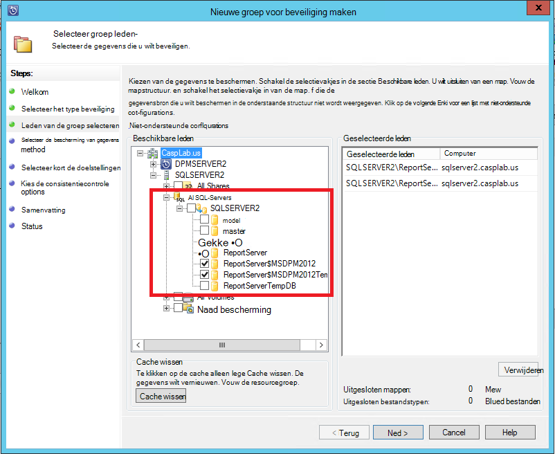

6. Geef een naam op voor de groep voor de bescherming en schakel het selectievakje **ik wil online bescherming** .

    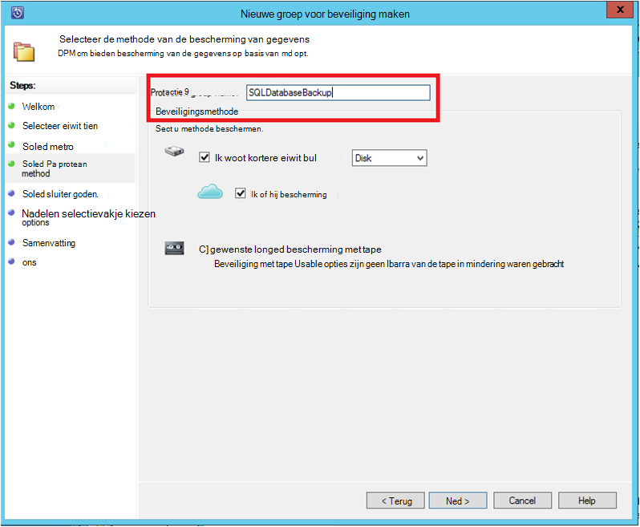

7. In het scherm **Geef Short-Term doelstellingen** bevatten de benodigde inputs maken schijf back-punten.

    Hier zien we dat **inhouding bereik** is ingesteld op *5 dagen*, **frequentie van de synchronisatie** ingesteld op eenmaal om de *15 minuten* is de frequentie waarop de back-up wordt genomen. **Express volledige back-up** is ingesteld op *8:00 uur*.

    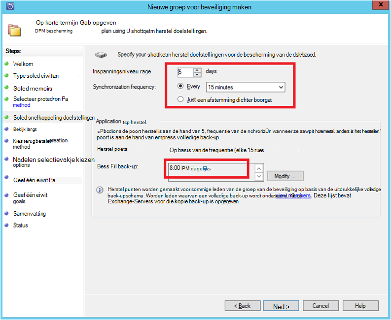

    >[AZURE.NOTE] 8:00 uur (op basis van de invoer van het scherm) wordt een punt van de back-up gemaakt elke dag door overdracht van de gegevens die zijn gewijzigd van back-up punt van de vorige dag 8:00 uur. Dit proces heet **Express volledige back-up**. Tijdens de transactie logboeken worden elke 15 minuten gesynchroniseerd express als een hoeft de database herstellen at 9:00 PM – wordt het punt gemaakt door de logboeken van de laatste volledige back-up punt (8 pm in dit geval).

8. Klik op **volgende**

    DPM toont de totale opslagruimte beschikbaar en het mogelijke gebruik van de schijfruimte.

    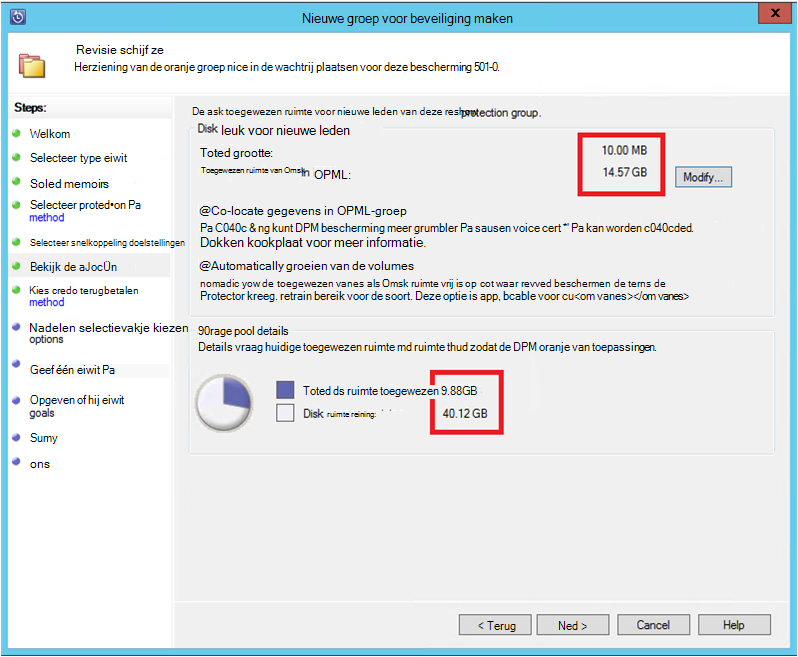

    DPM wordt standaard één volume per gegevensbron (SQL Server-database) dat wordt gebruikt voor de eerste back-up gemaakt. Met deze aanpak beperkt de Logical Disk Manager (LDM) DPM bescherming tot 300 gegevensbronnen (SQL Server-databases). U kunt deze beperking omzeilen, schakelt u het **samen zoeken naar gegevens in DPM-groep**, optie. Als u deze optie gebruikt, DPM gebruikt één volume voor meerdere gegevensbronnen, waardoor DPM 2.000 SQL-databases te beveiligen.

    Als **volumes automatisch uitbreiden** is ingeschakeld, DPM er rekening gehouden met het verbeterde back-up volume groeit de productiegegevens. Als de optie **automatisch groeien de volumes** niet is geselecteerd, beperkt DPM de back-up opslaan als gebruikt om de gegevensbronnen in de groep bescherming.

9. Beheerders krijgen de keuze van het overbrengen van deze eerste back-up handmatig (uit netwerk) om bandbreedte overbelasting te voorkomen of via het netwerk. Zij kunnen ook het tijdstip waarop de overdracht kan gebeuren configureren. Klik op **volgende**.

    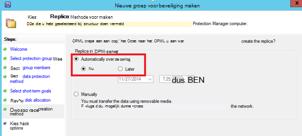

    De eerste back-up is de overdracht van de gehele gegevensbron (SQL Server-database) van de productieserver (SQL Server-computer) naar de DPM-server vereist. Deze gegevens kan groot zijn en gegevensoverdracht via het netwerk bandbreedte kan overschrijden. Om deze reden, kunnen beheerders de eerste back-up overbrengen: **handmatig** (met verwisselbare media) om te voorkomen dat de bandbreedte congestie of **automatisch via het netwerk** (op een bepaalde tijd).

    Zodra de eerste back-up is voltooid, zijn de rest van de back-ups incrementele back-ups op de eerste back-up. Incrementele back-ups zijn meestal klein en eenvoudig via het netwerk worden overgebracht.

10. Kies als u wilt dat de overeenstemmingscontrole uitvoeren en klik op **volgende**.

    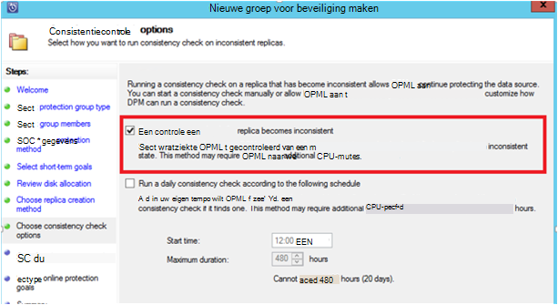

    DPM kunt uitvoeren een consistentiecontrole uit de integriteit van de back-punt. De controlesom van het back-upbestand op de productieserver (SQL Server-computer in dit geval) en de gegevens een back-up van het bestand op DPM wordt berekend. In het geval van een conflict, wordt aangenomen dat het back-upbestand op DPM beschadigd is. DPM herstelt de gegevens een back-up door het verzenden van de blokken die overeenkomt met de checksum komt niet overeen. De consistentiecontrole is een prestatie-intensieve bewerking, hebben beheerders de mogelijkheid voor het plannen van de consistentiecontrole of automatisch wordt uitgevoerd.

11. Als u on line bescherming van de gegevensbronnen, schakelt u de databases worden beschermd met Azure en klik op **volgende**.

    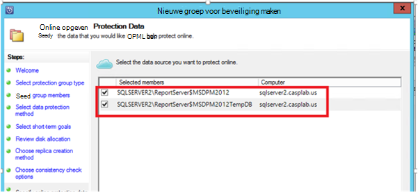

12. Beheerders kunnen kiezen voor back-up schema's en bewaarbeleid die bij hun beleid van de organisatie.

    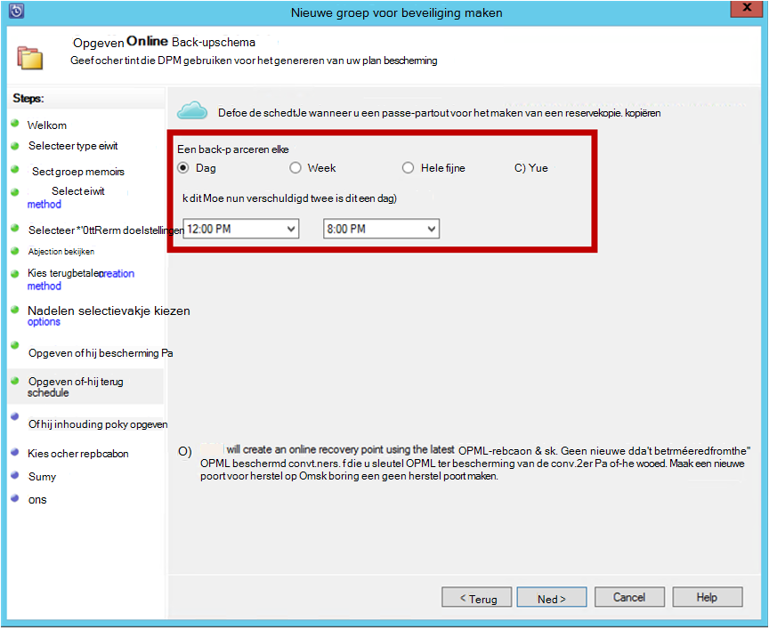

    In dit voorbeeld, worden back-ups eenmaal per dag genomen op 12:00 uur en 20: 00 (het onderste gedeelte van het scherm)

    >[AZURE.NOTE] Het is een goede gewoonte om enkele korte herstel punten op schijf voor snel herstel. Deze punten herstel worden gebruikt voor 'operationele recovery'. Azure fungeert als een goede plek met hogere Sla's en gegarandeerde beschikbaarheid.

    **Best Practice**: Zorg ervoor dat back-ups van Azure is gepland na de voltooiing van een lokale schijf back-ups DPM. Hiermee kunt de meest recente schijf back-up gekopieerd naar Azure.

13. Kies het bewaarschema beleid. De gegevens over de werking van het bewaarbeleid worden op [Gebruik Azure back-up vervangt uw band infrastructuur artikel](backup-azure-backup-cloud-as-tape.md)gegeven.

    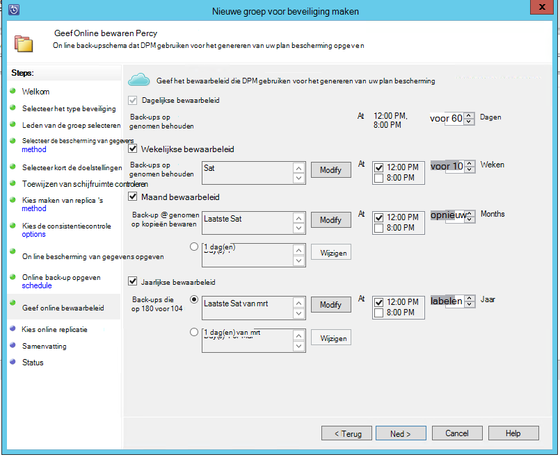

    In dit voorbeeld:

    - Back-ups eenmaal per dag worden genomen op 12:00 uur en 20: 00 (het onderste gedeelte van het scherm) en voor 180 dagen worden bewaard.
    - De back-up op zaterdag om 12:00 uur 104 weken blijft behouden
    - De back-up op de laatste zaterdag om 12:00 uur 60 maanden blijft behouden
    - De back-up op de laatste zaterdag in maart om 12:00 uur gedurende tien jaar behouden

14. Klik op **volgende** en selecteer de gewenste optie voor het overbrengen van de eerste back-up naar Azure. U kunt **automatisch via het netwerk** of **Off line back-up**.

    - **Automatisch via het netwerk** brengt de back-upgegevens naar Azure aan de hand van de planning voor back-up hebt gekozen.
    - De werking van **Off line back-up** wordt op een [off line back-up-workflow in Azure back-up](backup-azure-backup-import-export.md)uitgelegd.

    Kies de relevante overdracht mechanisme voor het verzenden van de eerste back-up naar Azure en klik op **volgende**.

15. Zodra u de beleidsdetails van het in het scherm **Samenvatting** bekijken, klik op de knop **groep maken** om de werkstroom te voltooien. U kunt klikken op de knop **sluiten** en de voortgang van de taak in de werkruimte Monitoring.

    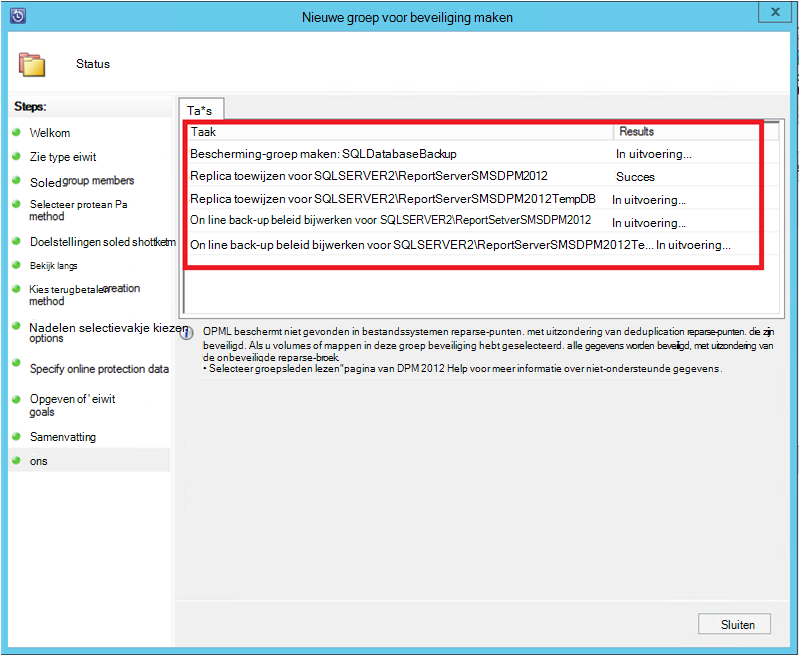

## Op verzoek back-up van een SQL Server-database
Terwijl de vorige stappen hebt gemaakt een back-up beleid, wordt een 'herstelpunt' alleen gemaakt als de eerste back-up. En wordt niet gewacht totdat de scheduler kick in, wijst de stappen onder het maken van een recovery trigger handmatig.

1. Wacht totdat de status van de groep **OK** voor de database bevat voordat u het herstelpunt.

    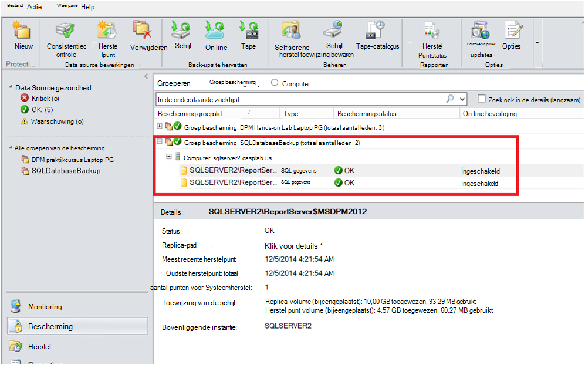

2. Klik met de rechtermuisknop op de database en selecteer **Het herstelpunt maken**.

    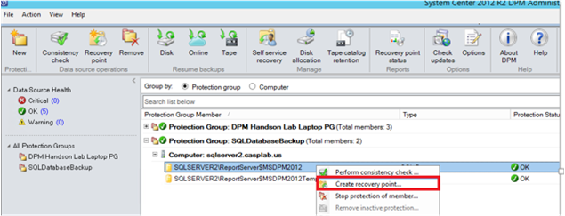

3. **On line beveiliging** te kiezen in de vervolgkeuzelijst en klik op **OK**. Hiermee start u het maken van een herstelpunt in Azure.

    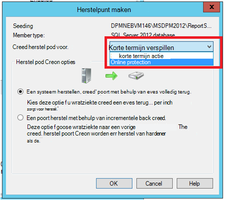

4. U kunt de voortgang van het project weergeven in de werkruimte van de **bewaking** u een onderhanden vindt project zoals beschreven in de volgende afbeelding.

    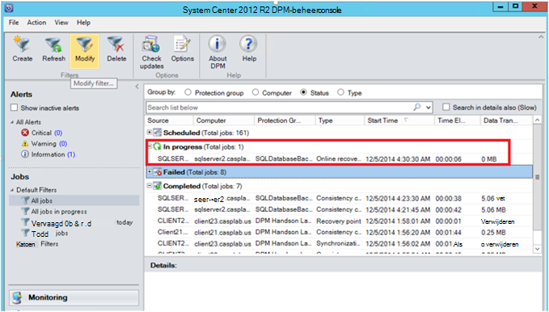

## Azure SQL Server-database herstellen
De volgende stappen zijn vereist om te herstellen van een beveiligde entiteit (SQL Server-database) van Azure.

1. Open de DPM-server Management-Console. Ga naar de **Recovery** werkruimte waarin u de back-up gemaakt door de DPM-servers kunt bekijken. Zoek de database vereist (in dit geval ReportServer$ MSDPM2012). Selecteer een tijd voor **herstel van** die met **Online eindigt**.

    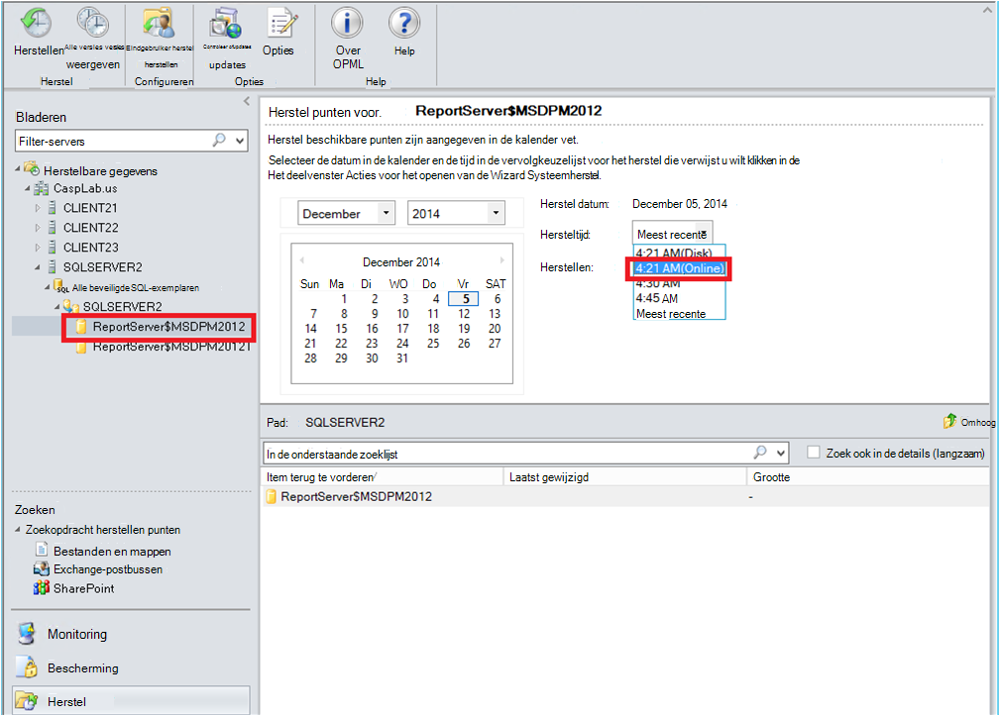

2. Klik met de rechtermuisknop op de naam van de database en klik op **herstellen**.

    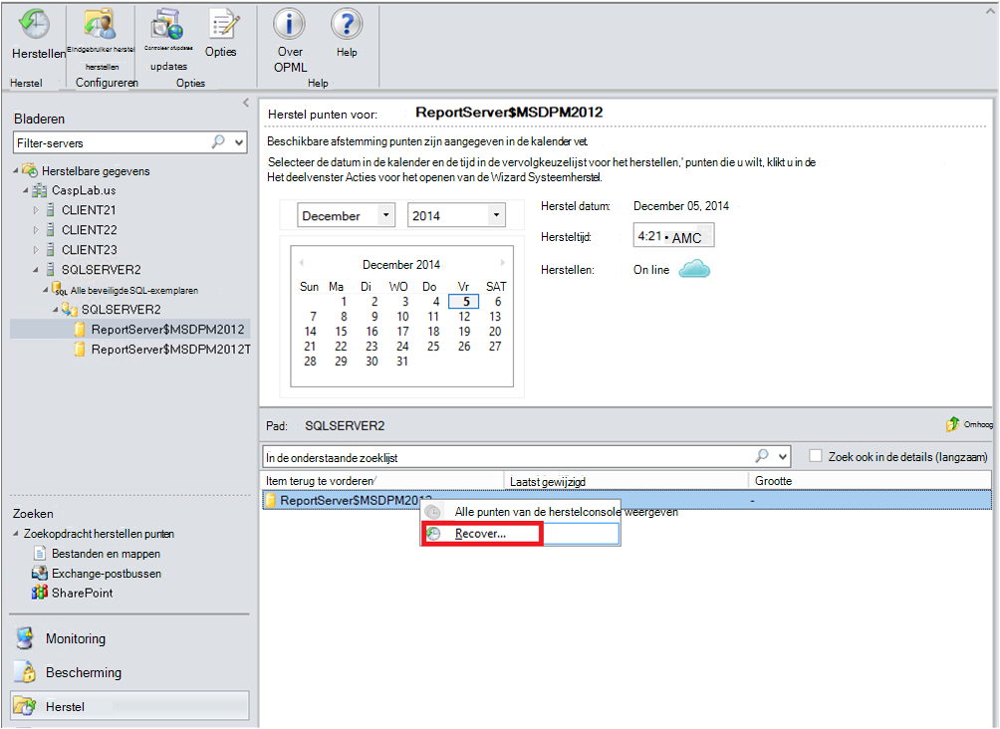

3. DPM toont de details van het herstelpunt. Klik op **volgende**. Om de database te overschrijven, het type selecteren dat herstel **herstellen naar het oorspronkelijke exemplaar van SQL Server**. Klik op **volgende**.

    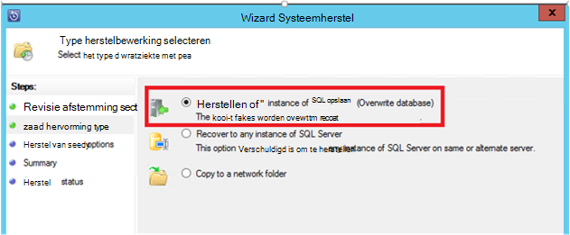

    In dit voorbeeld kan de DPM herstel van de database naar een ander exemplaar van SQL Server of in een netwerkmap zelfstandige.

4. In het scherm **Opties voor terugzetten opgeven** , kunt u de opties voor Systeemherstel zoals netwerk gebruik bandbreedtebeperking voor de bandbreedte die door Systeemherstel worden gebruikt. Klik op **volgende**.

5. In het scherm **Samenvatting** ziet u alle de configuraties die tot nu toe. Klik op **herstellen**.

    De status van het herstel wordt de database wordt hersteld. Klikt u op **sluiten** om de wizard te sluiten en de voortgang weergeven in de werkruimte **Monitoring** .

    

    Nadat de herstelbewerking is voltooid, is de herstelde database consistent-toepassing.

### Volgende stappen:

• [Azure back-Veelgestelde vragen](backup-azure-backup-faq.md)
