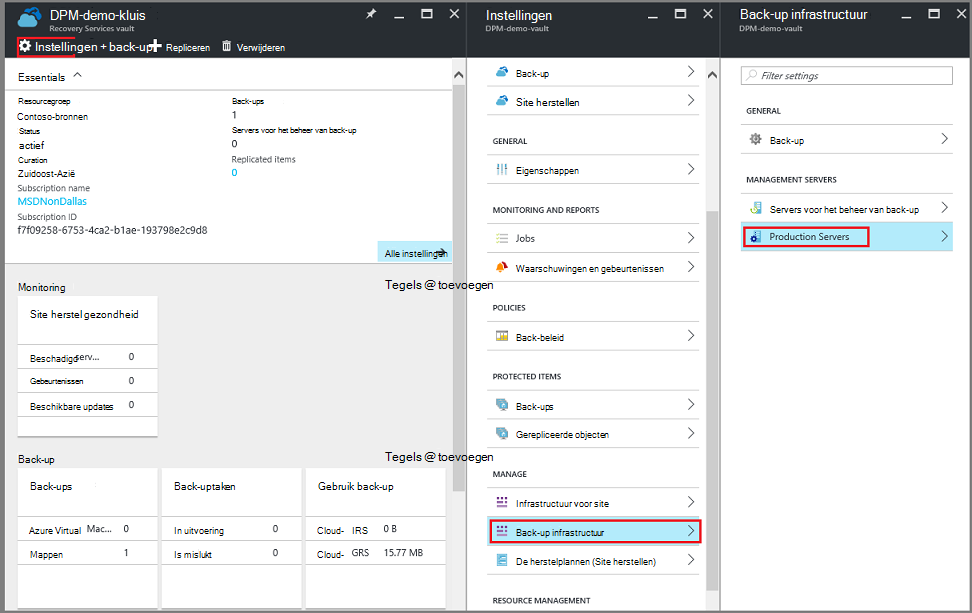

<properties
   pageTitle="Een back-up Azure kluis verwijderen | Microsoft Azure"
   description="Het verwijderen van een kluis Azure back-up. Het oplossen van waarom u een back-up kluis niet verwijderen. "
   services="service-name"
   documentationCenter="dev-center-name"
   authors="markgalioto"
   manager="cfreeman"
   editor=""/>

<tags
   ms.service="backup"
   ms.devlang="na"
   ms.topic="article"
   ms.tgt_pltfrm="na"
   ms.workload="storage-backup-recovery"
   ms.date="08/29/2016"
   ms.author="markgal;trinadhk"/>

# Een back-up Azure kluis verwijderen

De back-up Azure-service kent twee soorten kluizen - de kluis back-up en de kluis Recovery Services. De back-up kluis kwam eerste. De kluis Recovery Services kwam vervolgens langs de uitgebreide Resource Manager-implementaties ondersteunen. Vanwege de uitgebreide mogelijkheden en de afhankelijkheden van de informatie die moeten worden opgeslagen in de kluis, een kluis Recovery Services verwijdert lijkt misschien moeilijker dan het moet worden.

|**Type installatie**|**Portal**|**Naam van de kluis**|
|--------------|----------|---------|
|Klassiek|Klassiek|Back-kluis|
|Resource Manager|Azure|Recovery Services kluis|

> [AZURE.NOTE] Back-up kluizen beveiligen niet oplossingen bronnenbeheerder geïmplementeerd. U kunt echter een kluis Recovery Services classically gedistribueerde servers en VMs te beschermen.  

In dit artikel gebruiken we de term kluis om te verwijzen naar de algemene vorm van de back-up kluis of Recovery Services kluis. We gebruiken de formele naam, back-up kluis of Recovery Services kluis, wanneer dit onderscheid maken tussen de kluizen nodig is.

## Een kluis Recovery Services verwijderen

Een kluis Recovery Services verwijderen is een stap-proces - *de kluis bevat geen bronnen beschikbaar*. Voordat u een kluis Recovery Services verwijdert kunt, moet u verwijderen of verwijderen van alle bronnen in de kluis. Als u probeert te verwijderen van een kluis die resources bevat, krijgt u een fout op als de volgende afbeelding.

  

Totdat u de resources uit de kluis hebt uitgeschakeld, maakt klikt u op **opnieuw** dezelfde fout. Als u op dit foutbericht wordt weergegeven vast zit, klikt u op **Annuleren** en voert u de onderstaande stappen voor het verwijderen van de bronnen in de kluis Recovery Services.

### Verwijderen van de items in een kluis een VM beschermen

Als u al de Recovery Services kluis openen, gaat u verder met de tweede stap.

1.  Open de Azure portal en open de kluis die u wilt verwijderen in het Dashboard.

    Als u de kluis Recovery Services is vastgemaakt aan het Dashboard, in het menu Hub geen Klik op **Meer Services** en typ **Recovery Services**in de lijst met resources. Als u te typen begint, de lijstfilters op basis van uw invoer. Klik op **kluizen Recovery Services**.

      

    De lijst van kluizen Recovery Services wordt weergegeven. Selecteer in de lijst, de kluis die u wilt verwijderen.

    

2. Bekijk de kluis in de weergave het deelvenster **Essentials** . Als u wilt verwijderen van een kluis, kan niet worden beveiligde items. Als u een ander getal dan nul onder **Back-up Items** of **back-up beheer van servers**, moet u deze items verwijderen voordat u de kluis kunt verwijderen.

    

    VMs bestanden/mappen back-up Items worden beschouwd en worden vermeld in de **Back-up van Items** van het deelvenster Essentials. Een DPM-server wordt vermeld in het gebied van **Management-Server back-up** van het deelvenster Essentials. **Gerepliceerd Items** heeft betrekking op de Azure-Site-Recovery-service.

3. Zoek de items in de kluis om te beginnen met het verwijderen van de beveiligde items in de kluis. In het dashboard kluis op **Instellingen**en klik vervolgens op **back-up van items** te openen dat blade.

    

    De **Back-up Items** blade heeft afzonderlijke lijsten, op basis van het Type Item: Azure Virtual Machines of bestandsmappen (Zie afbeelding). De standaardlijst Type Item weergegeven is Azure virtuele Machines. Om de lijst met mappen items weergeven in de kluis, selecteert u **Bestand mappen** uit de vervolgkeuzelijst.

4. Voordat u een item uit de kluis een VM te beschermen verwijderen kunt, moet u stoppen met de back-uptaak van het artikel en de punt herstelgegevens verwijderen. Voor elk item in de kluis, als volgt te werk:

    een. Op het blad **Back-ups** met de rechtermuisknop op het item en selecteer **back-up stoppen**in het contextmenu.

    

    Hiermee opent u de back-up stoppen blade.

    b. Selecteer **Back-upgegevens verwijderen** in het menu **een optie kiezen** op de **Back-up stoppen** blade > Typ de naam van het item > en klik op **back-up stoppen**.

      Typ de naam van het item om te controleren of dat u dit bestand wilt verwijderen. De knop **Stoppen back-up** wordt niet geactiveerd totdat u het item wilt controleren. Als u het dialoogvenster typt u de naam van de back-item niet ziet, hebt u de optie **Back-upgegevens behouden** .

    

      U kunt desgewenst een reden waarom u de gegevens wilt verwijderen en opmerkingen toevoegen. Nadat u op **Back-up stoppen**, kunt u de taak verwijderen te voltooien voordat u probeert te verwijderen van de kluis. Om te controleren dat de taak is voltooid, controleert u de berichten Azure .  
   Zodra de taak voltooid is, ontvangt u een bericht weergegeven van het back-upproces is gestopt en de back-upgegevens voor dat item is verwijderd.

    c. Na het verwijderen van een item in de lijst in het menu **Items voor back-up** klikt u op **vernieuwen** om te zien van de overige artikelen in de kluis.

      

      Als er geen items in de lijst, Ga naar het deelvenster **Essentials** in de back-up kluis blade. Er hoeft niet een **back-up**, **back-up beheer van servers**of **gerepliceerde objecten** in de lijst. Als items zijn nog steeds in de kluis weergegeven, terug naar stap 3 hierboven en kiest u een ander item type lijst.  

5. Als er geen items meer op de werkbalk van de kluis zijn, klikt u op **verwijderen**.

    

6. Klik op **Ja**wanneer wordt gevraagd om te verifiëren dat u wilt verwijderen van de kluis.

    De kluis wordt verwijderd en de portal wordt het menu **Nieuw** service.

## Wat gebeurt er als ik het back-upproces is gestopt, maar de gegevens bewaard?

Als u het back-upproces is gestopt, maar per ongeluk *verloren* gegevens, moet u de back-upgegevens voordat u de kluis kunt verwijderen. De back-up om gegevens te verwijderen:

1. Op het blad **Back-ups** met de rechtermuisknop op het item en klik op **back-upgegevens verwijderen**in het contextmenu.

    

    Het blad **Gegevens van back-up verwijderen** wordt geopend.

2. Typ de naam van het item op het blad **Verwijderen back-up van gegevens** en klikt u op **verwijderen**.

    

    Nadat u de gegevens hebt verwijderd, gaat u naar stap 4c, hierboven, en doorgaan met het proces.

## Een kluis die wordt gebruikt voor de beveiliging van een DPM-server verwijderen

Voordat u een kluis die wordt gebruikt voor de beveiliging van een server DPM verwijderen kunt, moet u wissen points herstellen die zijn gemaakt en vervolgens de registratie van de server van de kluis.

De gegevens die zijn gekoppeld aan een groep bescherming verwijderen:

1. In de DPM Administrator-Console, klik op **bescherming**Selecteer een groep voor de bescherming, selecteer het lid van de groep bescherming en op het lint hulpprogramma klikt u op **verwijderen**. U moet het lid van de knop **verwijderen** worden weergegeven in het lint van het gereedschap selecteren. In het voorbeeld is het lid **dummyvm9**. Als er meerdere leden in de groep voor de bescherming, houdt u Ctrl ingedrukt om meerdere leden te selecteren.

    

    Hiermee opent u het dialoogvenster **Beveiliging stoppen** .

2. **Verwijderen van beveiligde gegevens**selecteren in het dialoogvenster **Beveiliging stoppen** en klik op **Beveiliging stoppen**.

    

    U wilt niet behouden van beveiligde gegevens omdat u wilt wissen van de kluis om te verwijderen. Afhankelijk van hoeveel herstel punten en hoeveel gegevens in de groep voor de bescherming, duurt overal van een paar seconden tot een paar minuten om de gegevens te verwijderen. Het dialoogvenster **Beveiliging stoppen** geeft de status wanneer de taak is voltooid.

    

3. Herhaal deze procedure voor alle leden in alle groepen van de bescherming.

    U moet alle beveiligde gegevens en de bescherming groep(en) verwijderen.

4. Na het verwijderen van alle leden van de groep voor de bescherming, overschakelen naar de portal Azure. Open het dashboard kluis en zorg ervoor dat er geen **Back-up**, **back-up beheer van servers**of **gerepliceerde objecten**. Klik op **verwijderen**op de werkbalk kluis.

    

    Als er back-up beheerservers is geregistreerd op de kluis, niet mogelijk de kluis verwijderen, zelfs als er geen gegevens in de kluis. Als u dacht dat u de back-up beheer van servers die zijn gekoppeld aan de kluis was verwijderd, maar er zijn nog steeds weergegeven in het taakvenster **Essentials** servers, raadpleegt u [de back-up beheer van servers geregistreerd om de kluis te vinden](backup-azure-delete-vault.md#find-the-backup-management-servers-registered-to-the-vault).

5. Klik op **Ja**wanneer wordt gevraagd om te verifiëren dat u wilt verwijderen van de kluis.

    De kluis wordt verwijderd en de portal wordt het menu **Nieuw** service.

## Een kluis die wordt gebruikt voor het beveiligen van een productieserver verwijderen

Voordat u een kluis die wordt gebruikt voor het beveiligen van een productieserver verwijderen kunt, moet u deze verwijderen of de registratie van de server van de kluis.

De productie-server die is gekoppeld aan de kluis verwijderen:

1. Open het dashboard kluis in de Azure portal en klikt u op **Instellingen** > **Back-up infrastructuur** > **Productieservers**.

    

    De blade **-Servers productie** wordt geopend en geeft een overzicht van alle servers van de productie in de kluis.

    

2. De blade **-Servers productie** met de rechtermuisknop op de server, en klik op **verwijderen**.

    

    Hiermee opent u het blad **verwijderen** .

    

3. Controleer op het blad **verwijderen** of de naam van de server wilt verwijderen en klik op **verwijderen**. Goed moet u de naam van de server te activeren, de knop **verwijderen** .

    Zodra de kluis is verwijderd, ontvangt u een bericht met vermelding van dat de kluis is verwijderd. Na het verwijderen van Ga alle servers in de kluis, terug naar het deelvenster Essentials in het dashboard van de kluis.

4. Zorg ervoor dat er geen **Back-up**, **back-up beheer van servers**of **gerepliceerde objecten**in het dashboard kluis. Klik op **verwijderen**op de werkbalk kluis.

5. Klik op **Ja**wanneer wordt gevraagd om te verifiëren dat u wilt verwijderen van de kluis.

    De kluis wordt verwijderd en de portal wordt het menu **Nieuw** service.

## Een back-up kluis verwijderen

De volgende instructies zijn voor het verwijderen van een back-up kluis in de klassieke portal. Een kluis voor back-up en Recovery Services kluis zijn hetzelfde: voordat u de kluis verwijderen kunt, verwijdert u de artikelen en de gegevens van de ingehouden.

1. Open de klassieke portal.

2. Selecteer in de lijst met back-up kluizen, de kluis die u wilt verwijderen.

    

    Hiermee opent u het dashboard kluis. Kijk naar het aantal Windows-Servers en/of Azure virtuele machines die zijn gekoppeld aan de kluis. Bekijk ook de totale opslagruimte gebruikt in Azure. U moet alle back-uptaken stoppen en bestaande gegevens verwijderen voordat u de kluis verwijdert.

3. Klik op het tabblad **Beveiligde Items** en klik vervolgens op **Beveiliging stoppen**

    

    Het **stoppen van de bescherming van uw kluis'** dialoogvenster verschijnt.

4. Klik in het dialoogvenster **stoppen de bescherming van uw kluis'** **verwijderen van de bijbehorende gegevens back-up** en op .  
   Desgewenst kunt u Kies een reden voor het stoppen van bescherming en een commentaar.

    

    Na het verwijderen van de items in de kluis, is de kluis leeg.

    

5. In de lijst van tabs, klikt u op **Items geregistreerd**. Voor elk artikel dat is geregistreerd in de kluis, selecteert u het item en klikt u op **registratie**.

    

6. Klik in de lijst met tabbladen, **Dashboard** om dit tabblad te openen. Controleer of er zijn geen geregistreerde servers of Azure virtuele machines in de cloud wordt beschermd. Controleer ook of dat er zijn geen gegevens in de opslag. Klik op **verwijderen** als u wilt verwijderen van de kluis.

    

    De back-up verwijderen kluis bevestiging scherm wordt geopend. Selecteer een optie, waarom u de kluis wilt verwijderen en klik op .  

    

    De kluis is verwijderd en u terug naar het klassieke dashboard portal.

### Het beheer van back-up servers geregistreerd om de kluis te vinden

Als u meerdere servers in een kluis geregistreerd hebt, kan het lastig zijn om te onthouden zijn. Om te zien van de servers die zijn geregistreerd bij de kluis en verwijder deze:

1. Open het dashboard kluis.

2. Klik op **Instellingen** als u wilt dat blade openen in het deelvenster **Essentials** .

    

3. Klik op **instellingen, blade**, **Back-up infrastructuur**.

4. Klik op de **Back-up infrastructuur** -blade **Servers voor het beheer van back-up**. De blade Servers voor het beheer van back-up wordt geopend.

    

5. Als u een server uit de lijst verwijderen door met de rechtermuisknop op de naam van de server en klik vervolgens op **verwijderen**.
    Hiermee opent u het blad **verwijderen** .

6. Geef de naam van de server op het blad **verwijderen** . Als het een lange naam, kunt u kopiëren en plakken uit de lijst met Servers voor het beheer van back-up. Klik vervolgens op **verwijderen**.  
