<properties
    pageTitle="Inleiding tot Azure DPM back-up | Microsoft Azure"
    description="Een inleiding tot de back-ups van DPM servers met behulp van de back-up Azure service"
    services="backup"
    documentationCenter=""
    authors="Nkolli1"
    manager="shreeshd"
    editor=""
    keywords="System Center Data Protection Manager, data protection manager, dpm back-up"/>

<tags
    ms.service="backup"
    ms.workload="storage-backup-recovery"
    ms.tgt_pltfrm="na"
    ms.devlang="na"
    ms.topic="article"
    ms.date="08/08/2016"
    ms.author="trinadhk;giridham;jimpark;markgal;adigan"/>

# Back-up werkbelasting op Azure met DPM wordt voorbereid

> [AZURE.SELECTOR]
- [Azure back-upserver](backup-azure-microsoft-azure-backup.md)
- [SCDPM](backup-azure-dpm-introduction.md)
- [Azure reserveserver (klassiek)](backup-azure-microsoft-azure-backup-classic.md)
- [SCDPM (klassiek)](backup-azure-dpm-introduction-classic.md)

Dit artikel bevat een inleiding tot het gebruik van back-up van Microsoft Azure ter bescherming van uw servers van System Center Data Protection Manager (DPM) en werkbelasting. Deze leest, zult u begrijpen:

- De werking van Azure DPM server back-up
- De vereisten voor het bereiken van een goede back-ervaring
- De typische fouten heeft gevonden en het omgaan met deze
- Ondersteunde scenario 's

> [AZURE.NOTE] Azure heeft twee implementatiemodellen voor het maken en werken met resources: [Resource Manager en klassiek](../resource-manager-deployment-model.md). Dit artikel bevat informatie en procedures voor het terugzetten van VMs met behulp van het model van de bronnenbeheerder geïmplementeerd.

System Center DPM back-up van gegevens en de toepassing. Aan DPM back-ups van gegevens kunnen worden opgeslagen op tape, op schijf of back-up in Azure met back-up van Microsoft Azure. DPM samenwerkt met Azure back-up als volgt:

- **DPM is geïmplementeerd als een fysieke server of op gebouwen virtuele machine** , DPM als is geïmplementeerd als een fysieke server of als een op ruimten Hyper-V virtuele machine, u kunt back-ups naar een kluis Recovery Services naast de schijf en tape back-up.
- **DPM is geïmplementeerd als een Azure VM** : van System Center 2012 R2 Update 3 DPM kan worden geïmplementeerd als een Azure virtuele machine. DPM is geïmplementeerd als een Azure virtuele machine die u kunt back-ups naar Azure schijven gekoppeld aan de DPM Azure virtual machine of u kunt de opslag van gegevens een back-up naar een kluis Recovery Services-offload.

## Waarom back-up maken van DPM naar Azure?

De zakelijke voordelen van het gebruik van Azure back-up voor back-ups van servers DPM omvatten:

- DPM-implementatie voor gebouwen kunt u als alternatief voor de lange termijn implementatie op tape Azure.
- DPM-implementaties in Azure kunt Azure back-up u voor opslag van de schijf Azure offload zodat u om uit te breiden door oudere gegevens zijn opgeslagen in een kluis Recovery Services en nieuwe gegevens op schijf.

## Vereisten
Azure back-up back-up kunt DPM als volgt voorbereiden:

1. **Een kluis Recovery Services maken** , maakt u een kluis in Azure portal.
2. **Download kluis referenties** — de referenties waarmee u zich kunt registreren de DPM-server Recovery Services kluis downloaden.
3. **De back-up Azure Agent installeren** — van Azure back-up van de agent installeren op elke server DPM.
4. **De server registreren** , registreren de DPM-server Recovery Services kluis.

### 1. Maak een kluis recovery services
Voor het maken van een kluis recovery services:

1. Log in om de [Azure portal](https://portal.azure.com/).

2. Klik op **Bladeren** en typ in de lijst met resources **Recovery Services**in het menu Hub. Als u te typen begint, de lijst wordt gefilterd op basis van uw invoer. Klik op **de kluis Recovery Services**.

    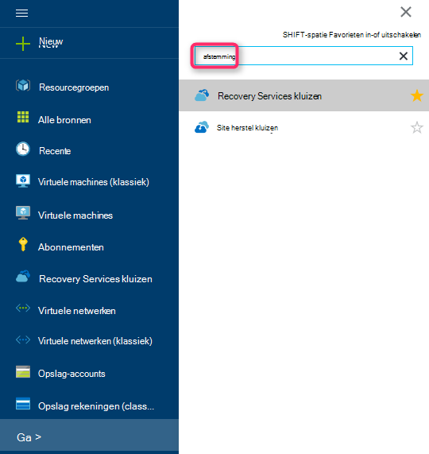

    De lijst van kluizen Recovery Services wordt weergegeven.

3. Klik in het menu **kluizen Recovery Services** op **toevoegen**.

    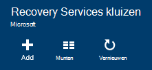

    De kluis Recovery Services blade wordt geopend, waarin u een **naam**, **abonnement**, **resourcegroep**en **locatie**.

    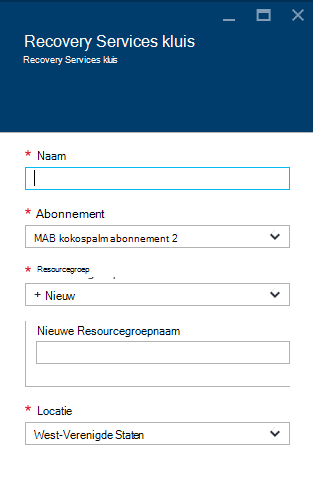

4. Voer voor de **naam**een beschrijvende naam ter identificatie van de kluis. De naam moet uniek zijn voor het abonnement Azure. Typ een naam die tussen 2 en 50 tekens bevat. Het moet beginnen met een letter en mag alleen letters, cijfers en streepjes.

5. Klik op **abonnement** overzicht de beschikbare abonnementen. Als u niet zeker weet welke abonnement wilt gebruiken, gebruikt u de standaardinstelling (of voorgesteld) abonnement. Zullen er meerdere opties als uw organisatie-account gekoppeld aan meerdere Azure abonnementen is.

6. Klik op **resourcegroep** overzicht de beschikbare brongroepen of klik op **Nieuw** om een nieuwe resourcegroep te maken. Zie voor volledige informatie over resourcegroepen, [Azure Resource Manager-overzicht](../azure-resource-manager/resource-group-overview.md)

7. Klik op **locatie** selecteren van de geografische regio van de kluis.

8. Klik op **maken**. Het kan even duren voor de kluis Recovery Services moet worden gemaakt. Controleren van de van statusmeldingen in het bovenste rechter gebied in de portal.
Zodra uw kluis is gemaakt, wordt het geopend in de portal.

### Opslag, replicatie instellen

De opslagoptie voor replicatie kunt u kiezen tussen geo-redundante opslag en lokaal redundante opslag. Standaard heeft de kluis geo-redundante opslag. Laat de optie ingesteld op geo-redundante opslag als dit uw primaire back-up. Kies lokaal redundante opslag als u wilt een goedkopere optie die niet helemaal zo duurzaam. Meer informatie over [geo-redundante](../storage/storage-redundancy.md#geo-redundant-storage) [lokaal redundante](../storage/storage-redundancy.md#locally-redundant-storage) opslagopties en in de [opslag van Azure replicatie-overzicht](../storage/storage-redundancy.md).

De instelling opslag replicatie bewerken:

1. Selecteer de kluis te openen de kluis dashboard en de instellingen voor blade. Als het blad **Instellingen** niet wordt geopend, klikt u op **alle instellingen** in het dashboard van de kluis.

2. Klik op het blad **Instellingen** **Back-up infrastructuur** > **Back-up configureren** voor het openen van de **Back-up configuratie** blade. Kies de optie van de replicatie opslag voor uw kluis op de **Back-up van configuratie** -blade.

    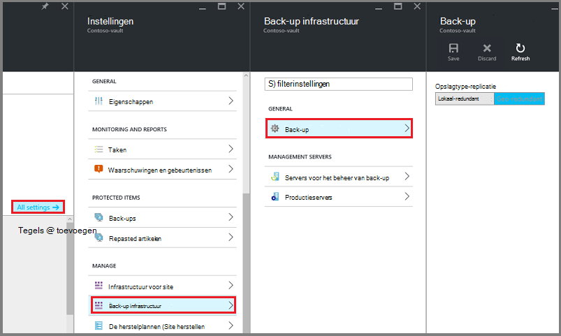

    Nadat u de opslagoptie voor uw kluis, bent u gereed om de VM koppelen aan de kluis. Om te beginnen met de koppeling, ontdekken en u registreren de Azure virtuele machines.

### 2. download referenties kluis

Het bestand kluis referenties is een certificaat dat is gegenereerd door de portal voor elke back-vault. De portal uploads van de openbare sleutel vervolgens de Access Control Service (ACS). De persoonlijke sleutel van het certificaat wordt beschikbaar gesteld aan de gebruiker als onderdeel van de workflow die als input in de werkstroom machine registratie wordt gegeven. Hierdoor wordt de machine back-up om gegevens te verzenden naar een geïdentificeerde kluis in de Azure back-service geverifieerd.

De referentie van de kluis wordt alleen gebruikt tijdens de registratie-workflow. Het is de verantwoordelijkheid van de gebruiker om ervoor te zorgen dat het bestand kluis referenties niet meer veilig. Als het valt in de handen van een rogue-gebruiker, kan de kluis referenties-bestand kan worden gebruikt voor het registreren van andere computers tegen de dezelfde kluis. Als u de gegevens van de back-up is gecodeerd met behulp van een wachtwoordzin die bij de klant hoort, kunnen bestaande back-ups echter kan niet worden aangetast. Om te verhelpen dit probleem, kluis referenties ingesteld 48hrs verloopt. Kunt u de referenties van de kluis een recovery Services een willekeurig aantal malen – downloaden, maar alleen de meest recente kluis referentie bestand tijdens de workflow van de registratie van toepassing is.

De kluis referentie-bestand wordt gedownload via een beveiligd kanaal vanaf de portal Azure. De back-up Azure-service is niet op de hoogte van de persoonlijke sleutel van het certificaat en de persoonlijke sleutel wordt niet in de portal of de service. Gebruik de volgende stappen de kluis referentie-bestand te downloaden naar een lokale computer.

1. Log in om de [Azure portal](https://portal.azure.com/).

2. Open Recovery Services kluis die machine die u wilt registreren de DPM.

3. Blade instellingen wordt standaard geopend. Als deze gesloten is, klik op **Instellingen** op dashboard kluis te openen, de instellingen voor blade. In de blade instellingen, klik op **Eigenschappen**.

    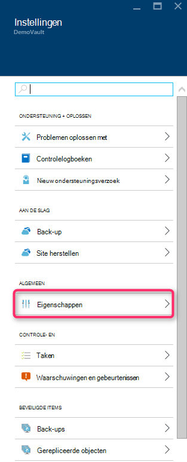

4. Klik op **Download** onder de **Referenties van de back-up**op de pagina eigenschappen. De portal genereert de kluis referentie-bestand, dat wordt beschikbaar gesteld voor download.

    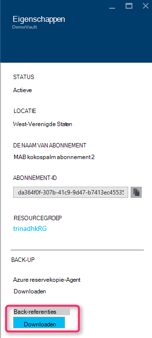

De portal, de referentie van een kluis met een combinatie van de naam van de kluis en de huidige datum wordt gegenereerd. Klik op **Opslaan** om de referenties van de kluis te downloaden naar de lokale account downloadmap, of selecteer OpslaanAls in het menu opslaan om een locatie voor de referenties van de kluis. Het zal duren tot een minuut voor het bestand moet worden gegenereerd.

### Opmerking
- Zorg ervoor dat de kluis referenties opgeslagen op een locatie die toegankelijk is vanaf uw computer. Als het is opgeslagen in een bestand delen/SMB, Controleer de toegangsmachtigingen.
- De referenties kluis bestand wordt alleen gebruikt tijdens de registratie-workflow.
- De referenties kluis bestand verloopt na 48hrs en kan worden gedownload vanaf de portal.

### 3. Installeer de reservekopie-Agent

Nadat de kluis Azure back-up is gemaakt, moet een agent worden geïnstalleerd op elk van uw Windows-computers (Windows-client Windows Server System Center Data Protection Manager-server of Azure back-up Server-machine) waarmee een back-up van gegevens en toepassingen op Azure.

1. Open Recovery Services kluis die machine die u wilt registreren de DPM.

2. Blade instellingen wordt standaard geopend. Als deze gesloten is, klik op **Instellingen** voor het openen van de bladeserver instellingen. In de blade instellingen, klik op **Eigenschappen**.

    

3. Klik op **Download** onder **Azure reservekopie-Agent**op de pagina instellingen.

    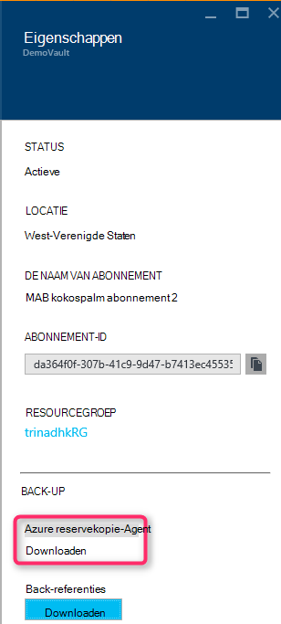

   Zodra de agent is gedownload, dubbelklikt u op MARSAgentInstaller.exe om de installatie van de agent Azure back-up starten. Kies de installatiemap en de tijdelijke map is vereist voor de agent. De opgegeven locatie van de cache moet vrije ruimte die ten minste 5% van de back-upgegevens.

4.  Als u een proxyserver gebruikt voor verbinding met het internet, voert u de proxy-server-gegevens in het scherm **configuratie van Proxy** . Als u een geverifieerde proxy gebruikt, voert u de gegevens van de gebruiker en het wachtwoord in dit scherm.

5.  De Azure Backup agent installeert u .NET Framework 4.5 en Windows PowerShell (als deze nog niet beschikbaar is) om de installatie te voltooien.

6.  Zodra de agent is geïnstalleerd, **sluiten** het venster.

    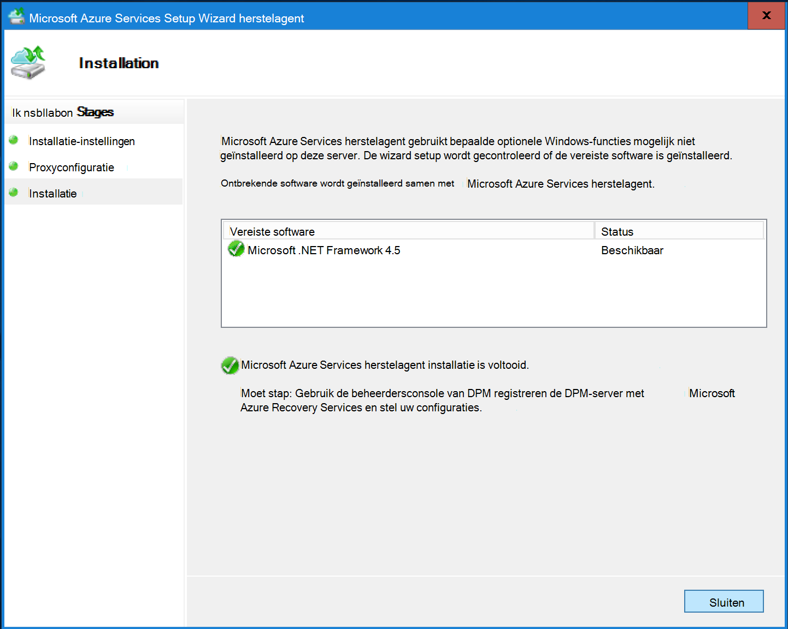

7. Klik op **on line** **registreren de DPM-Server** naar de kluis, klikt u op het tabblad **beheer** . Selecteer vervolgens **registreren**. De Wizard registreren wordt geopend.

8. Als u een proxyserver gebruikt voor verbinding met het internet, voert u de proxy-server-gegevens in het scherm **configuratie van Proxy** . Als u een geverifieerde proxy gebruikt, voert u de gegevens van de gebruiker en het wachtwoord in dit scherm.

    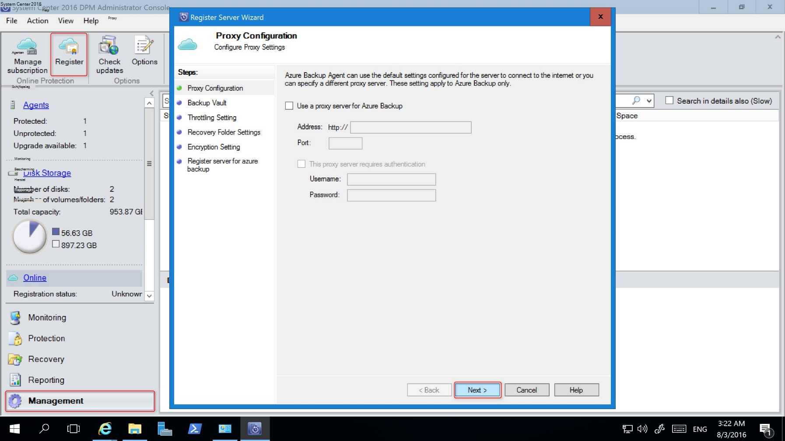

9. In het scherm kluis referenties, blader naar en selecteer het bestand kluis referenties eerder zijn gedownload.

    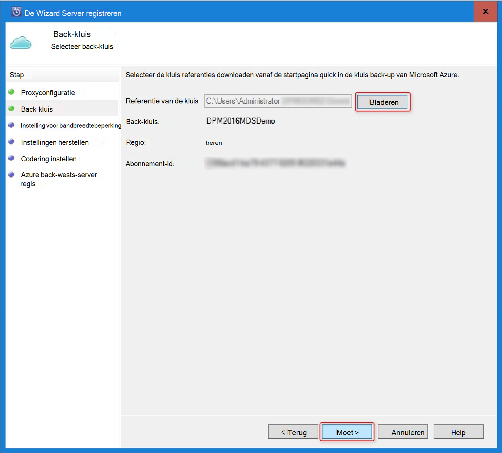

    Het bestand kluis referenties is alleen geldig voor 48 uur (na het downloaden vanaf de portal). Als er een fout in dit scherm (bijvoorbeeld "kluis referenties opgegeven bestand is verlopen'), aanmelding met Azure portal en de referenties van de kluis bestand opnieuw downloaden.

    Zorg ervoor dat het bestand kluis referenties op een locatie die toegankelijk is voor het setup-programma beschikbaar is. Als u toegang tot gerelateerde fouten de kluis referenties bestand kopiëren naar een tijdelijke locatie op deze computer en probeer het opnieuw.

    Als er een ongeldige kluis referentie-fout optreden (bijvoorbeeld "kluis ongeldige referenties voorwaarde") het bestand is beschadigd of heeft niet de meest recente referenties aan hebt gekoppeld de recovery-service. Probeer het opnieuw na het downloaden van een nieuwe kluis referentie-bestand vanaf de portal. Deze fout wordt meestal weergegeven als de gebruiker op de optie **Download kluis referentie** in de portal Azure snel achter elkaar klikt. In dit geval alleen het tweede kluis referentie bestand is geldig.

10. Voor het gebruik van de netwerkbandbreedte tijdens het werk en niet-gewerkte uren, in het **Beperken van** scherm, stelt u de bandbreedte gebruiksbeperkingen en definiëren van het werk en niet-werk uren.

    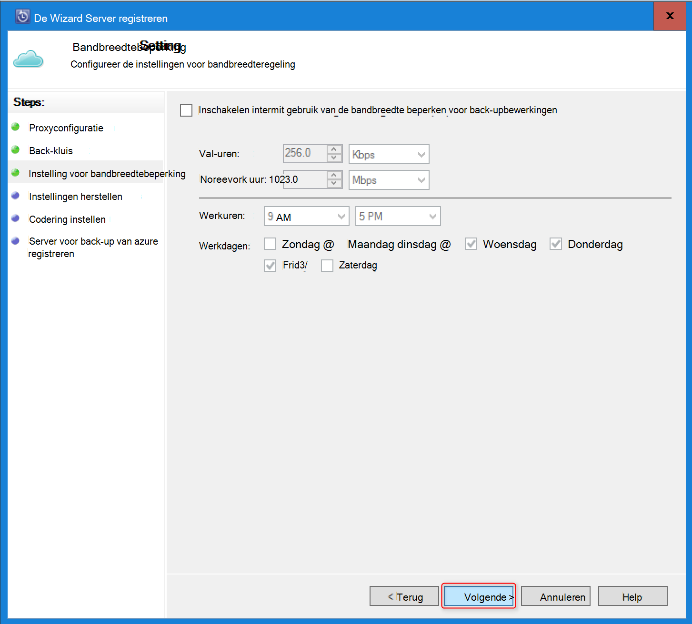

11. Blader in het scherm **Instellingen herstellen** voor de map die de bestanden gedownload van Azure waar tijdelijk klaargezet.

    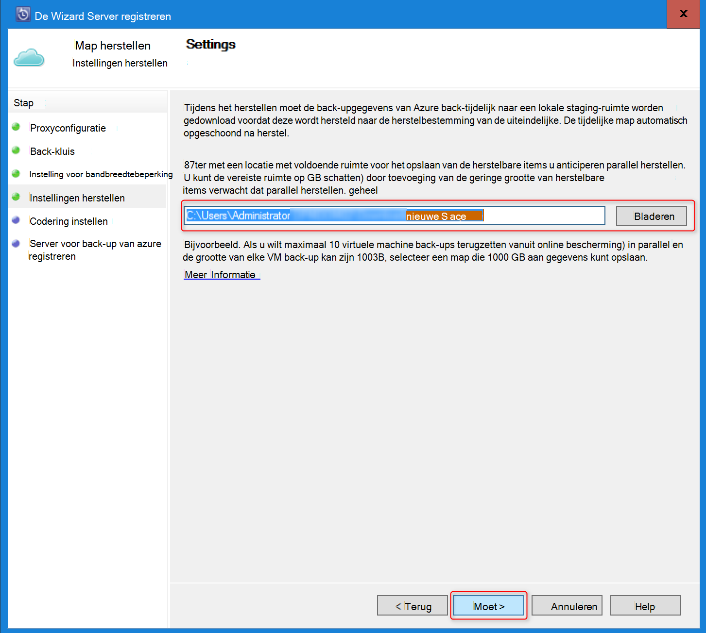

12. In het scherm **codering** , moet u een wachtwoordzin genereren of bieden een wachtwoordzin (minimaal 16 tekens). Moet de wachtwoordzin op een veilige locatie opslaan.

    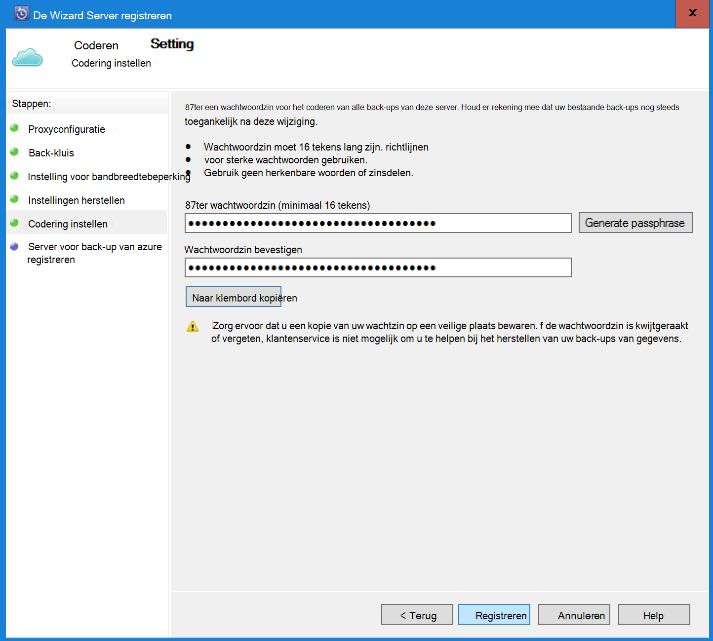

    > [AZURE.WARNING] Als de wachtwoordzin is kwijtgeraakt of vergeten; Microsoft kan niet helpen bij het herstellen van de back-upgegevens. De gebruiker eigenaar is van de wachtwoordzin codering en Microsoft geen inzicht in de wachtwoordzin die wordt gebruikt door de eindgebruiker. Sla het bestand op een veilige plaats als dit nodig tijdens een herstelbewerking is.

13. Nadat u op de knop **registreren** , wordt de computer geregistreerd naar de kluis en u bent nu klaar om een reservekopie op Microsoft Azure.

14. Wanneer u de Data Protection Manager, kunt u de instellingen die zijn opgegeven tijdens de registratie workflow door te klikken op de optie **configureren** door **Online** onder het tabblad **beheer** .

## Eisen (en beperkingen)

- DPM kan worden uitgevoerd als een fysieke server of een Hyper-V virtuele machine op System Center 2012 SP1 of System Center 2012 R2 is geïnstalleerd. Kan ook worden uitgevoerd als een Azure virtuele machine met System Center 2012 R2 met ten minste DPM 2012 R2 updatepakket 3 of een virtuele Windows-computer in VMWare met System Center 2012 R2 met ten minste Update Rollup 5.
- Als u DPM met System Center 2012 SP1 installeer Update draaien van 2 voor System Center Data Protection Manager SP1. Dit is vereist voordat u de reservekopie-Agent Azure kunt installeren.
- De DPM-server moet beschikken over Windows PowerShell en .net Framework 4.5 is geïnstalleerd.
- DPM back-up de meeste werklasten Azure back-up. De Azure back-up ondersteuning voor een volledig overzicht van wat is ondersteund Zie onderstaande items.
- Gegevens die zijn opgeslagen in Azure back-up kan niet worden hersteld met de optie 'kopiëren naar tape'.
- Een Azure-account moet u de functie back-up van Azure is ingeschakeld. Als u geen account hebt, kunt u een gratis proefperiode account in een paar minuten. Meer informatie over [back-up Azure prijzen](https://azure.microsoft.com/pricing/details/backup/).
- Azure back-up moet worden geïnstalleerd op de servers die u back wilt-up van de back-up Agent Azure. Elke server moet beschikken over ten minste 5% van de grootte van de gegevens die worden back-up, als lokale vrije opslagruimte beschikbaar. Back-up van gegevens van 100 GB is bijvoorbeeld minimaal 5 GB vrije ruimte op de tijdelijke locatie.
- Gegevens worden opgeslagen in de opslag Azure kluis. Er is geen limiet voor de hoeveelheid gegevens die u kunt back-up een back-up van Azure vault, maar de grootte van een gegevensbron (bijvoorbeeld een virtuele machine of database) 54400 GB niet mag overschrijden.

Back-up Azure worden voor deze bestandstypen ondersteund:

- Gecodeerde (volledige back-ups alleen)
- Gecomprimeerd (incrementele back-ups wordt ondersteund)
- Sparse (incrementele back-ups wordt ondersteund)
- Gecomprimeerd en verspreide (behandeld als Sparse)

En deze worden niet ondersteund:

- Servers in een hoofdlettergevoelig bestandssysteem wordt niet ondersteund.
- Vaste koppelingen (overgeslagen)
- Reparse-punten (overgeslagen)
- Gecodeerd en gecomprimeerd (overgeslagen)
- Gecodeerde en verspreid (overgeslagen)
- Gecomprimeerde gegevensstroom
- Sparse-stream

>[AZURE.NOTE] Uit in System Center 2012 DPM met ingang SP1 u kunt back-up van werkbelasting beschermd door de DPM naar Azure met Microsoft Azure Backup.
