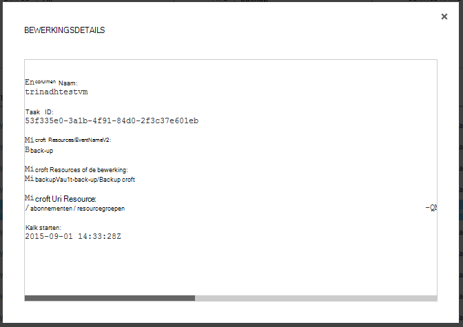

<properties
    pageTitle="Beheren en controleren van back-ups van Azure virtual machine | Microsoft Azure"
    description="Meer informatie over het beheren en controleren van een Azure virtuele machine back-ups"
    services="backup"
    documentationCenter=""
    authors="trinadhk"
    manager="shreeshd"
    editor=""/>

<tags
    ms.service="backup"
    ms.workload="storage-backup-recovery"
    ms.tgt_pltfrm="na"
    ms.devlang="na"
    ms.topic="article"
    ms.date="08/31/2016"
    ms.author="trinadhk; jimpark; markgal;"/>

# <a name="manage-and-monitor-azure-virtual-machine-backups"></a>Beheren en controleren van Azure virtual machine back-ups

> [AZURE.SELECTOR]
- [Azure VM back-ups beheren](backup-azure-manage-vms.md)
- [Klassieke VM back-ups beheren](backup-azure-manage-vms-classic.md)

Dit artikel bevat informatie over algemene beheer- en controletaken voor model Klassiek virtuele machines in Azure beschermd.  

>[AZURE.NOTE] Azure heeft twee implementatiemodellen voor het maken en werken met resources: [Resource Manager en klassiek](../resource-manager-deployment-model.md). Zie [voorbereiden uw omgeving back-up Azure virtuele machines maken](backup-azure-vms-prepare.md) voor meer informatie over het werken met klassieke implementatiemodel VMs.

## <a name="manage-protected-virtual-machines"></a>Beveiligde virtuele machines te beheren

Beveiligde virtuele machines te beheren:

1. Instellingen voor een virtuele machine back-up bekijken en beheren klikt u op het tabblad **Items beveiligd** .

2. Klik op de naam van een beveiligde item op de tab **Back-up gegevens** , waarin u informatie over de laatste back-up.

    

3. Als u wilt weergeven en beheren van back-beleid voor een virtuele machine klikt u op het tabblad **beleid** .

    

    Het tabblad **Back-up beleid** ziet u het bestaande beleid. U kunt zo nodig wijzigen. Als u nodig hebt voor het maken van een nieuw beleid **maken** Klik op de pagina **beleid** . Houd er rekening mee dat als u wilt verwijderen van een beleid niet moet er een virtuele machines gekoppeld.

    

4. U krijgt meer informatie over de acties of de status voor een virtuele machine op de pagina **taken** . Klik op een taak in de lijst voor meer informatie of filteren van taken voor een specifieke virtuele machine.

    

## <a name="on-demand-backup-of-a-virtual-machine"></a>Op verzoek back-up van een virtuele machine
U kunt een vraag op back-up van een virtuele machine nemen zodra deze is geconfigureerd voor bescherming. Als de eerste back-up in behandeling is voor de virtuele machine maakt back-up op verzoek een volledige kopie van de virtuele machine in Azure back-kluis. Als eerste back-up is voltooid, back-up wordt op verzoek alleen verzenden wijzigingen uit vorige back-up naar Azure back-up d.w.z. deze Vault worden altijd.

>[AZURE.NOTE] Inhouding bereik van back-up van een-op-verzoek is ingesteld op de waarde opgegeven voor de dagelijkse handhaving in de back-up beleid overeenkomt met de VM.  

Op aanvraag van een virtuele machine back-up te nemen:

1. Navigeer naar de pagina **Items beveiligd** en **Azure Virtual Machine** selecteert als **Type** (indien niet is ingeschakeld) en klikt u op de knop **selecteren** .

    

2. Selecteer de virtuele machine waarop u wilt nemen op aanvraag back-up en klik op **Nu back-** knop onder aan de pagina.

    

    Hiermee maakt u een back-up op de geselecteerde virtuele machine. Bereik van een herstelpunt dat is gemaakt met behulp van deze taak bewaren zijn dat is opgegeven in het beleid dat is gekoppeld aan de virtuele machine dezelfde.

    

    >[AZURE.NOTE] Als u het beleid dat is gekoppeld aan een virtuele machine, Inzoomen op een virtuele machine in de pagina **-Items beveiligd** en Ga naar het tabblad back-beleid.

3. Zodra de taak is gemaakt, kunt u op de knop **taak weergeven** in de balk toast voor een overzicht van de bijbehorende taak op de pagina taken.

    

4. Nadat de taak is voltooid, een herstelpunt gemaakt waarmee u de virtuele machine te herstellen. Dit wordt ook de waarde van de herstel punt verhogen met 1 in pagina **-Items beveiligd** .

## <a name="stop-protecting-virtual-machines"></a>Stoppen met het beveiligen van virtuele machines
U kunt kiezen om te stoppen met de toekomstige back-ups van een virtuele machine met de volgende opties:

- Back-ups die zijn gekoppeld aan een virtuele machine in Azure back-kluis bewaren
- Verwijderen van back-ups die zijn gekoppeld aan een virtuele machine

Als u back-ups die zijn gekoppeld aan de virtuele machine behouden hebt geselecteerd, kunt u de back-upgegevens terugzetten van de virtuele machine. Details van deze virtuele machines prijzen, klikt u op [hier](https://azure.microsoft.com/pricing/details/backup/).

Meer bescherming voor een virtuele machine:

1. Navigeer naar de pagina **Items beveiligd** en **Azure virtuele machine** als het filtertype selecteren (als deze nog niet is geselecteerd) en klik op de knop **selecteren** .

    

2. Selecteer de virtuele machine en klik op **Beveiliging stoppen** onder aan de pagina.

    

3. Standaard Azure back-up niet de back-up gegevens verwijderen die is gekoppeld aan de virtuele machine.

    

    Als u back-up gegevens verwijderen wilt, schakel het selectievakje in.

    

    Selecteer een reden voor het stoppen van de back-up. Dit is optioneel, helpt een reden die Azure back-up van de feedback en prioriteren van scenario's voor de klant.

4. Klik op de knop **indienen** aan de taak **stoppen bescherming** indienen. Klik op **Taak weergeven** voor een overzicht van de bijbehorende de taak op de pagina **taken** .

    

    Als u niet tijdens de wizard **Beveiliging stoppen** en vervolgens boeken Taakvoltooiing optie **verwijderen van de bijbehorende gegevens back-up** hebt geselecteerd, verandert beschermingsstatus **Bescherming gestopt**. Totdat deze expliciet wordt verwijderd, blijven de gegevens met back-up van Azure. U kunt de gegevens altijd verwijderen door de virtuele machine op de pagina **Beveiligde Items** selecteren en op **verwijderen**te klikken.

    

    Als u de optie voor het **verwijderen van de bijbehorende gegevens back-up** hebt geselecteerd, is de virtuele machine niet deel van de pagina **Beveiligde Items** .

## <a name="re-protect-virtual-machine"></a>Virtuele machine opnieuw te beveiligen
Als u hebt niet de optie **koppelen back-upgegevens verwijderen** geselecteerd in **Beveiliging stoppen**, kunt u de virtuele machine opnieuw door de stappen vergelijkbaar met back-ups van geregistreerde virtuele machines beveiligen. Zodra een beveiligd, hebben deze virtuele machine back-upgegevens behouden voor stop-bescherming en herstel punten gemaakt na opnieuw te beveiligen.

Na het opnieuw te beveiligen, wordt de status van de virtuele machine wordt gewijzigd in **Protected** indien er herstel voor **Beveiliging stoppen**.

  

>[AZURE.NOTE] Wanneer de virtuele machine opnieuw beveiligt, kunt u een ander beleid dan het beleid dat virtuele machine aanvankelijk is beveiligd.

## <a name="unregister-virtual-machines"></a>De registratie van virtuele machines

Als u wilt dat de virtuele machine te verwijderen uit de back-kluis:

1. Klik op de knop **UNREGISTER** onderaan de pagina.

    

    Een toast melding verschijnt onderaan het scherm bevestiging vraagt. Klik op **Ja** om door te gaan.

    

## <a name="delete-backup-data"></a>Back-up van gegevens verwijderen
U kunt de back-upgegevens die is gekoppeld aan een virtuele machine, ofwel verwijderen:

- Bescherming tijdens Stop
- Na een stop bescherming is taak voltooid op een virtuele machine

Back-upgegevens op een virtuele machine, in de staat *Bescherming gestopt wordt* boeken als u wilt verwijderen een **Stop back-** uptaak is voltooid:

1. Navigeer naar de pagina **Items beveiligd** en **Azure Virtual Machine** selecteert als *type* en klik op de knop **selecteren** .

    

2. Selecteer de virtuele machine. De virtuele machine wordt niet **Gestopt bescherming** .

    

3. Klik op de knop **verwijderen** onder aan de pagina.

    

4. Selecteer een reden voor het verwijderen van back-upgegevens (sterk aanbevolen) en klik op **verzenden**in de wizard **back-up gegevens verwijderen** .

    

5. Hiermee maakt u een taak te verwijderen, back-upgegevens van geselecteerde virtuele machine. Klik op **taak weergeven** als u wilt zien van de overeenkomstige taak in de pagina taken.

    

    Zodra de taak is voltooid, wordt het item dat correspondeert met de virtuele machine uit pagina **beveiligde items** worden verwijderd.

## <a name="dashboard"></a>Dashboard
U kunt informatie over Azure virtuele machines, de opslag en de taken die zijn gekoppeld aan deze in de laatste 24 uur bekijken op de **Dashboard** -pagina. U kunt back-status en eventuele bijbehorende back-fouten weergeven.


>[AZURE.NOTE] Waarden in het dashboard worden elke 24 uur vernieuwd.

## <a name="auditing-operations"></a>Activiteiten controleren
Azure back-up biedt een herziening van de 'logboeken' back-upbewerkingen geactiveerd door de klant zodat u gemakkelijk kunt zien precies welke beheertaken uit te voeren op de back-kluis zijn uitgevoerd. Bewerkingen Logboeken inschakelen geweldige post-mortem- en controle-ondersteuning voor back-upbewerkingen.

De volgende bewerkingen worden in Logboeken geregistreerd:

- Registreren
- Registratie ongedaan maken
- Beveiliging configureren
- Back-up (beide gepland en op verzoek back-ups via BackupNow)
- Herstellen
- Beveiliging stoppen
- Back-ups verwijderen
- Beleid toevoegen
- Beleid verwijderen
- Updatebeleid
- Taak annuleren

Overeenkomt met een back-up kluis logboeken bekijken:

1. Ga naar **Management services** in Azure portal en klik vervolgens op het tabblad **Logboeken** .

    

2. **Back-up** selecteert als *Type* in de filters, en geeft u de naam van de back-kluis in de *naam van de service* en klik op **verzenden**.

    

3. In de logboeken bewerkingen bewerking selecteren en klik op **Details** om details voor een bewerking te zien.

    

    De **wizard Details** bevat informatie over de werking veroorzaakt, taak-Id, de bron op waarop deze bewerking wordt geactiveerd en de begintijd van de bewerking.

    

## <a name="alert-notifications"></a>Meldingen
U kunt aangepaste waarschuwingen voor de taken in portal. Dit wordt bereikt door het definiëren van waarschuwingsregels PowerShell gebaseerd op operationele legt gebeurtenissen. Met behulp van het beste *PowerShell versie 1.3.0 of hoger*.

U definieert een aangepaste melding om te waarschuwen voor back-up, eruitziet een voorbeeld van een opdracht:

```
PS C:\> $actionEmail = New-AzureRmAlertRuleEmail -CustomEmail contoso@microsoft.com
PS C:\> Add-AzureRmLogAlertRule -Name backupFailedAlert -Location "East US" -ResourceGroup RecoveryServices-DP2RCXUGWS3MLJF4LKPI3A3OMJ2DI4SRJK6HIJH22HFIHZVVELRQ-East-US -OperationName Microsoft.Backup/backupVault/Backup -Status Failed -TargetResourceId /subscriptions/86eeac34-eth9a-4de3-84db-7a27d121967e/resourceGroups/RecoveryServices-DP2RCXUGWS3MLJF4LKPI3A3OMJ2DI4SRJK6HIJH22HFIHZVVELRQ-East-US/providers/microsoft.backupbvtd2/BackupVault/trinadhVault -Actions $actionEmail
```

**ResourceId**: kun je dit uit logboeken bewerkingen pop-up zoals beschreven in boven de sectie. ResourceUri in het pop-upvenster details van een bewerking is de ResourceId te leveren voor deze cmdlet.

**OperationName**: dit is de notatie ' Microsoft.Backup/backupvault/<EventName>"wanneer de gebeurtenisnaam is een van de kassa, registratie, ConfigureProtection, back-up maken, terugzetten, StopProtection, DeleteBackupData, CreateProtectionPolicy, DeleteProtectionPolicy, UpdateProtectionPolicy

**Status**: ondersteunde waarden zijn-gestart is geslaagd en mislukt.

**ResourceGroup**: ResourceGroup van de resource waarop de bewerking wordt geactiveerd. U kunt deze verkrijgen van ResourceId waarde. Tussen velden, */resourceGroups/* en */providers/* in ResourceId waarde is de waarde voor ResourceGroup.

**Naam**: de naam van de huidige regel.

**CustomEmail**: Hiermee geeft u het aangepaste e-mailadres waarnaar u wilt signaalberichten te verzenden

**SendToServiceOwners**: deze optie berichtgeving verzendt naar alle beheerders en CO-beheerders van het abonnement. Deze kan worden gebruikt in de cmdlet **New-AzureRmAlertRuleEmail**

### <a name="limitations-on-alerts"></a>Beperkingen voor waarschuwingen
Waarschuwingen op basis van een gebeurtenis worden onderworpen aan de volgende beperkingen:

1. Waarschuwingen op alle virtuele machines in de back-kluis geactiveerd. U kan niet aanpassen als u waarschuwingen voor specifieke virtuele machines in een kluis met back-up.
2. Deze functie is in de voorvertoning. [Meer informatie](../monitoring-and-diagnostics/insights-powershell-samples.md#create-alert-rules)
3. Je ontvangt meldingen van "alerts-noreply@mail.windowsazure.com". Momenteel kunt u de afzender van het e-mailadres niet wijzigen.

## <a name="next-steps"></a>Volgende stappen

- [Azure VMs herstellen](backup-azure-restore-vms.md)
