<properties
    pageTitle="Back-ups maken van virtuele machine bronnenbeheerder geïmplementeerd | Microsoft Azure"
    description="Meer informatie over het beheren en controleren van de bronnenbeheerder geïmplementeerd virtuele machine back-ups"
    services="backup"
    documentationCenter=""
    authors="trinadhk"
    manager="shreeshd"
    editor=""/>

<tags
    ms.service="backup"
    ms.workload="storage-backup-recovery"
    ms.tgt_pltfrm="na"
    ms.devlang="na"
    ms.topic="article"
    ms.date="08/11/2016"
    ms.author="jimpark; markgal; trinadhk"/>

# Azure virtuele machine back-ups beheren

> [AZURE.SELECTOR]
- [Azure VM back-ups beheren](backup-azure-manage-vms.md)
- [Klassieke VM back-ups beheren](backup-azure-manage-vms-classic.md)

Dit artikel bevat richtlijnen voor het beheren van back-ups van VM en de back-up waarschuwingen informatie beschikbaar in de portal dashboard wordt uitgelegd. De richtlijnen in dit artikel is van toepassing op het gebruik van VMs met kluizen Recovery Services. In dit artikel geldt niet voor het maken van virtuele machines en leg het beveiligen van virtuele machines. Zie voor een primer over het beschermen van VMs in Azure Azure bronnenbeheerder geïmplementeerd met een kluis Recovery Services [wordt eerst gezocht: Back-up van VMs naar een kluis Recovery Services](backup-azure-vms-first-look-arm.md).

## Kluizen en beveiligde virtuele machines te beheren

Het dashboard van de kluis Recovery Services biedt in de Azure portal toegang tot informatie over de kluis met inbegrip van:

- de meest recente back-momentopname, die ook het meest recente herstelpunt < br\>
- de back-up beleid < br\>
- totale grootte van alle back-momentopnamen < br\>
- aantal virtuele machines die zijn beveiligd met de kluis < br\>

Veel taken met een virtuele machine back-up beginnen met het openen van de kluis in het dashboard. Omdat kluizen kunnen worden gebruikt ter bescherming van meerdere items (of meerdere VMs), gedetailleerde informatie over een bepaalde VM, opent u het dashboard vault item. De volgende procedure wordt beschreven hoe u het *dashboard van de kluis* te openen en ga verder met de *vault item dashboard*. Er zijn 'tips' in beide procedures die wijzen op het toevoegen van de kluis en vault item aan het dashboard Azure met behulp van de pincode op dashboard opdracht. Pincode voor dashboard is een manier van het maken van een snelkoppeling naar de kluis of het artikel. Ook kunt u veelgebruikte opdrachten uitvoeren vanaf de snelkoppeling.

>[AZURE.TIP] Gebruik de schuifregelaar donkerblauwe onderaan in het venster als u meerdere dashboards blades openen, de Azure dashboard heen en weer schuift.

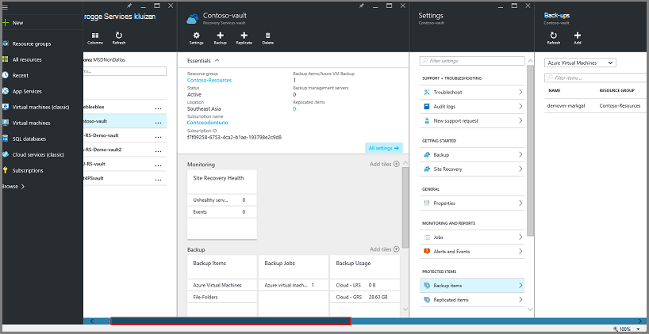

### Open een kluis Recovery Services in het dashboard:

1. Log in om de [Azure portal](https://portal.azure.com/).

2. Klik op **Bladeren** en typ in de lijst met resources **Recovery Services**in het menu Hub. Als u te typen begint, de lijstfilters op basis van uw invoer. Klik op **de kluis Recovery Services**.

      

    De lijst van kluizen Recovery Services worden weergegeven.

    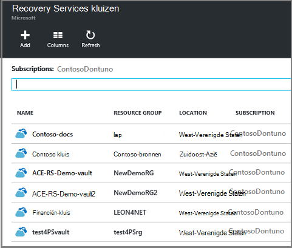  

    >[AZURE.TIP] Als u een kluis aan het Dashboard Azure vastmaken, is de kluis die direct toegankelijk wanneer u de Azure portal opent. Als u wilt een kluis op het dashboard, vastzetten in de lijst van de kluis, klik met de rechtermuisknop op de kluis en selecteer **vastmaken aan het dashboard**.

3. Selecteer in de lijst van kluizen, de kluis te openen van het dashboard. Wanneer u de kluis, open het dashboard van de kluis en de **Instellingen voor** blade. In de volgende afbeelding wordt het dashboard **Contoso kluis** gemarkeerd.

    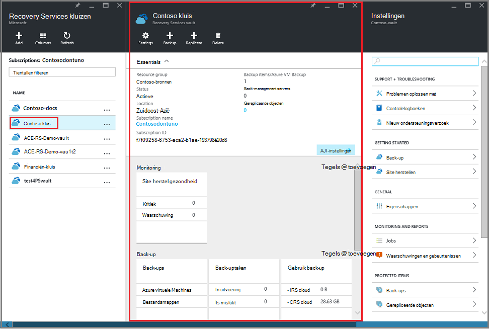

### Een dashboard vault item openen

In de voorgaande procedure kunt u het dashboard kluis geopend. Het dashboard vault item openen:

1. Klik in het dashboard kluis op de tegel **Back-up Items** **Azure virtuele Machines**.

    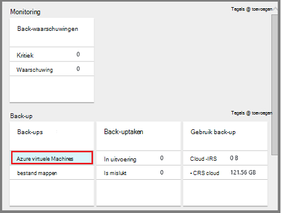

    De **Back-up Items** blade geeft een overzicht van de laatste back-uptaak voor elk artikel. In dit voorbeeld is er één virtuele machine, demovm-markgal, beschermd door deze kluis.  

    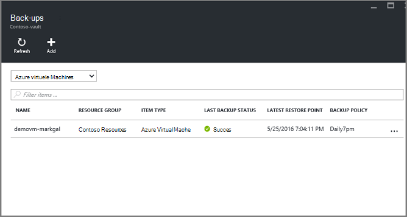

    >[AZURE.TIP] U kunt een item kluis aan het Dashboard Azure vastmaken voor eenvoudige toegang. Als u wilt een kluis-item in de itemlijst kluis vastmaken, klik met de rechtermuisknop op het item en selecteer **vastmaken aan het dashboard**.

2. Klik op het item om het dashboard vault item openen in de blade **Back-up van Items** .

    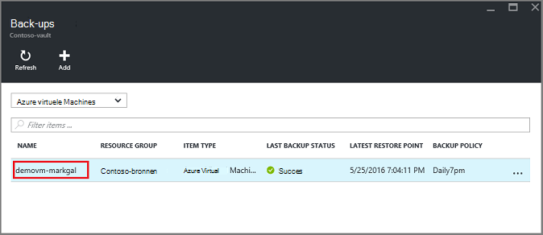

    Het dashboard vault item en de **Instellingen voor** blade geopend.

    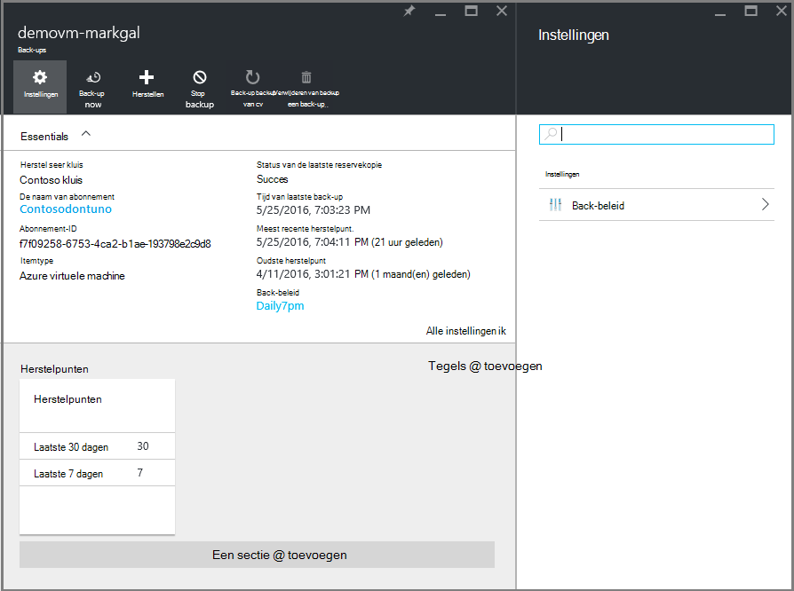

    Uit het dashboard vault item, kunt u veel belangrijke taken, zoals uitvoeren:

    - beleid wijzigen of een nieuw beleid voor back-up maken < br\>
    - herstelpunten, en bekijken de consistentie staat < br\>
    - op verzoek back-up van een virtuele machine < br\>
    - Stop de virtuele machines beveiligen < br\>
    - hervatten van de bescherming van een virtuele machine < br\>
    - verwijderen van een back-up van gegevens (of een herstelpunt) < br\>
    - [terugzetten van een back-up (of een herstelpunt)](./backup-azure-arm-restore-vms.md#restore-a-recovery-point) < br\>

Het uitgangspunt is voor de volgende procedures, het dashboard vault item.

## Back-beleid beheren

1. Op het [dashboard van vault item](backup-azure-manage-vms.md#open-a-vault-item-dashboard), klikt u op **Alle instellingen** om te openen de blade **Instellingen** .

    

2. Klik op het blad **Instellingen** **back-up beleid** dat blade openen.

    Op het blad, worden de back-up frequentie en vasthouden bereik details weergegeven.

    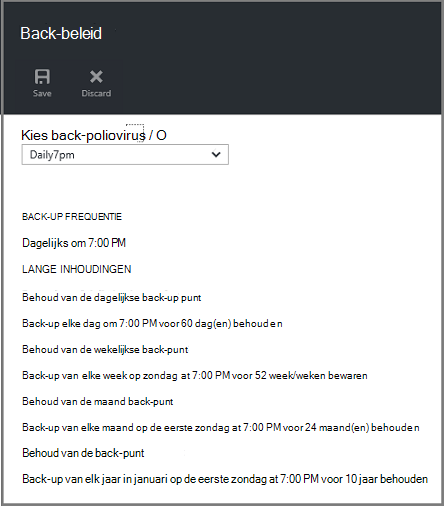

3. In het menu **Kies back-beleid** :
    - Als beleid wilt wijzigen, selecteert u een ander beleid en klik op **Opslaan**. Het nieuwe beleid wordt onmiddellijk toegepast op de kluis. < br\>
    - Als u een beleid maken, **Nieuw**te selecteren.

    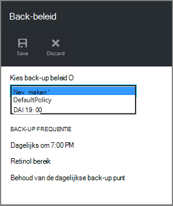

    Zie [een back-beleid definiëren](backup-azure-manage-vms.md#defining-a-backup-policy)voor instructies over het maken van een back-up beleid.

[AZURE.INCLUDE [backup-create-backup-policy-for-vm](../../includes/backup-create-backup-policy-for-vm.md)]

## Op verzoek back-up van een virtuele machine
U kunt een vraag op back-up van een virtuele machine nemen zodra deze is geconfigureerd voor bescherming. Als de eerste back-up in behandeling is, maakt u back-up op verzoek een volledige kopie van de virtuele machine in de kluis Recovery Services. Als de eerste back-up is voltooid, verzendt back-up van een-op-verzoek alleen wijzigingen van de vorige momentopname om de Recovery Services. Dat wil zeggen zijn volgende back-ups altijd incrementele.

>[AZURE.NOTE] Het bereik bewaren voor back-up van een-op-verzoek is de waarde voor de dagelijkse back-up punt in het beleid zijn opgegeven. Als er geen dagelijkse back-up is geselecteerd, wordt de punt van de wekelijkse back-up gebruikt.

Voor het starten van een back-up-op verzoek van een virtuele machine:

- Klik op het [dashboard van vault item](backup-azure-manage-vms.md#open-a-vault-item-dashboard) **Nu reservekopie maken**.

    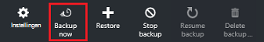

    De portal zorgt ervoor dat u wilt een back-uptaak op verzoek starten. Klik op **Ja** om te beginnen de back-uptaak.

    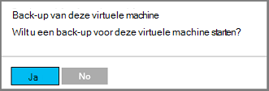

    De back-uptaak wordt een herstelpunt gemaakt. Het bereik van het behoud van het herstelpunt is hetzelfde als bewaren bereik dat is opgegeven in het beleid dat is gekoppeld aan de virtuele machine. Klik op de tegel **Back-uptaken** voor het bijhouden van de voortgang van de taak, klikt u in het dashboard kluis.  

## Stoppen met het beveiligen van virtuele machines
Als u ervoor kiest om te stoppen met het beveiligen van een virtuele machine, wordt u gevraagd als u wilt bewaren van de herstel-punten. Er zijn twee manieren om te stoppen met het beveiligen van virtuele machines:
- Stop alle toekomstige back-uptaken en verwijder alle punten voor herstel, of
- Stop alle toekomstige back-uptaken maar laat de punten herstel  

Er is een kosten in verband met het verlaten van de herstel-punten in opslag. Het voordeel van het verlaten van de punten van het herstel is echter dat u later de virtuele machine kunt herstellen indien gewenst. Zie de [prijsdetails](https://azure.microsoft.com/pricing/details/backup/)voor informatie over de kosten van het verlaten van de herstel-punten. Als u verwijderen van alle punten voor herstel wilt, kunt u de virtuele machine niet terugzetten.

Meer bescherming voor een virtuele machine:

1. Op het [dashboard van vault item](backup-azure-manage-vms.md#open-a-vault-item-dashboard), klikt u op **back-up stoppen**.

    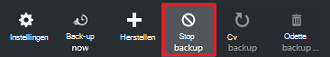

    Hiermee opent u de back-up stoppen blade.

    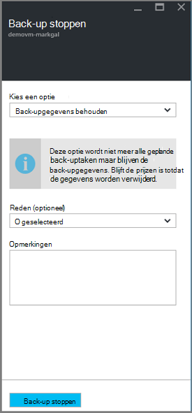

2. Kies of u wilt behouden of verwijderen van de back-upgegevens op de **Back-up stoppen** blade. Het informatievak bevat details over uw keuze.

    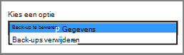

3. Als u de back-upgegevens behouden, gaat u verder met stap 4. Als u back-upgegevens verwijderen, bevestigen dat u wilt stoppen, back-uptaken en verwijder de punten van de herstel - Typ de naam van het item.

    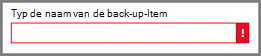

    Als u niet weet van de naam van het item, de muisaanwijzer op het uitroepteken om de naam weer te geven. Ook is de naam van het item onder **Back-up stoppen** bij de bovenkant van het blad.

4. Eventueel een **reden** of **Opmerking**opgeven.

5. Als u wilt stoppen met de back-uptaak voor het huidige item, klikt u op  

    Een melding kunt u dat back-uptaken zijn gestopt.

    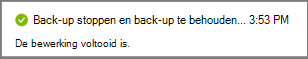

## Doorgaan met bescherming van een virtuele machine
Als de optie **Back-up van gegevens behouden** is gekozen als bescherming voor de virtuele machine is gestopt, is het mogelijk bescherming te hervatten. Bescherming voor de virtuele machine hervatten niet als de optie **Back-up gegevens verwijderen** is geselecteerd.

Bescherming voor de virtuele machine te hervatten

1. Op het [dashboard van vault item](backup-azure-manage-vms.md#open-a-vault-item-dashboard), klikt u op **back-up te hervatten**.

    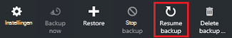

    Hiermee opent u de back-up beleid blade.

    >[AZURE.NOTE] Wanneer de virtuele machine opnieuw beveiligt, kunt u een ander beleid dan het beleid dat virtuele machine aanvankelijk is beveiligd.

2. Volg de stappen in het [beleid voor het wijzigen of een nieuw beleid voor back-up maken](backup-azure-manage-vms.md#change-policies-or-create-a-new-backup-policy), als het beleid voor de virtuele machine wilt toewijzen.

    Nadat de back-beleid wordt toegepast op de virtuele machine, ziet u het volgende bericht weergegeven.

    

## Back-up van gegevens verwijderen
U kunt de back-upgegevens die is gekoppeld aan een virtuele machine verwijderen tijdens het **stoppen van de back-up** of op elk gewenst moment na de back-up taak is voltooid. Kan zelfs het nuttig zijn te wachten dagen of weken voor het verwijderen van de herstel-punten. In tegenstelling tot herstellen herstellen punten bij het verwijderen van back-ups, kunt u niet herstellen van specifieke punten te verwijderen. Als u uw back-up gegevens te verwijderen, moet u alle herstel-punten dat is gekoppeld aan het item verwijderen.

De volgende procedure wordt ervan uitgegaan dat de back-uptaak voor de virtuele machine is gestopt of uitgeschakeld. Zodra de back-uptaak is uitgeschakeld, zijn de opties voor **back-up te hervatten** en **verwijderen van back-up** in het dashboard vault item beschikbaar.

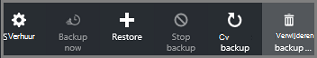

Back-up om gegevens te verwijderen op een virtuele machine met de *back-up is uitgeschakeld*:

1. Op het [dashboard van vault item](backup-azure-manage-vms.md#open-a-vault-item-dashboard), klikt u op **back-up te verwijderen**.

    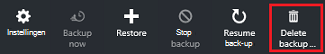

    Het blad **Gegevens van back-up verwijderen** wordt geopend.

    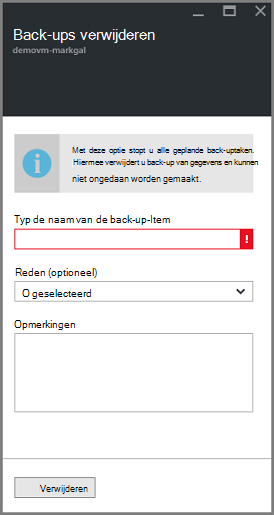

2. Typ de naam van het item dat u wilt verwijderen van de herstelconsole punten.

    

    Als u niet weet van de naam van het item, de muisaanwijzer op het uitroepteken om de naam weer te geven. Ook is de naam van het item onder **Back-up gegevens verwijderen** aan de bovenkant van het blad.

3. Eventueel een **reden** of **Opmerking**opgeven.

4. De back-up om gegevens te verwijderen voor het huidige item, klikt u op  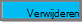

    Een melding kunt u op de hoogte van dat de gegevens van de back-up is verwijderd.

## Volgende stappen

Bekijk voor meer informatie over het opnieuw maken van een virtuele machine vanaf een herstelpunt [Herstellen Azure VMs](backup-azure-restore-vms.md). Als u informatie over het beveiligen van uw virtuele machines, Zie [wordt eerst gezocht: Back-up van VMs naar een kluis Recovery Services](backup-azure-vms-first-look-arm.md). Zie voor meer informatie over het controleren van gebeurtenissen, [waarschuwingen voor back-ups van Azure virtual machine Monitor](backup-azure-monitor-vms.md).
