<properties
    pageTitle="Beheren van back-up Azure kluizen en servers met behulp van het klassieke implementatiemodel Azure | Microsoft Azure"
    description="Deze zelfstudie gebruiken voor meer informatie over het beheren van back-up Azure kluizen en servers."
    services="backup"
    documentationCenter=""
    authors="markgalioto"
    manager="jwhit"
    editor="tysonn"/>

<tags
    ms.service="backup"
    ms.workload="storage-backup-recovery"
    ms.tgt_pltfrm="na"
    ms.devlang="na"
    ms.topic="article"
    ms.date="09/27/2016"
    ms.author="jimpark;markgal"/>

# Back-up Azure kluizen en servers met behulp van het implementatiemodel klassiek beheren

> [AZURE.SELECTOR]
- [Resource Manager](backup-azure-manage-windows-server.md)
- [Klassiek](backup-azure-manage-windows-server-classic.md)

In dit artikel vindt u een overzicht van de back-beheertaken die beschikbaar is via de klassieke Azure portal en de Microsoft Azure reservekopie-agent.

[AZURE.INCLUDE [learn-about-deployment-models](../../includes/learn-about-deployment-models-classic-include.md)]Resource Manager implementatiemodel.

## Portal-beheertaken
1. Aanmelden bij de [Portal beheren](https://manage.windowsazure.com).

2. **Recovery Services**, klik op de naam van de back-up naar de pagina Quick Start-kluis.

    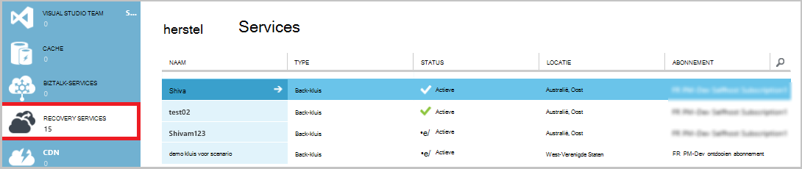

Als u de opties boven aan de pagina Quick Start, ziet u de beschikbare beheertaken.

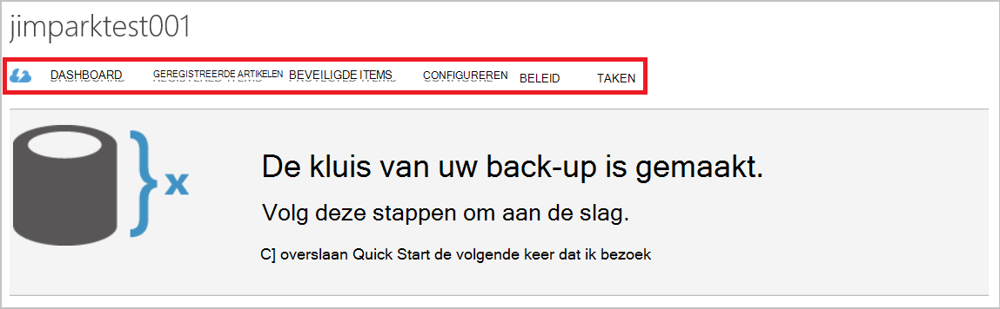

### Dashboard
**Dashboard** overzicht gebruik voor de server selecteren. Het **overzicht van de syntaxis** omvat:

- Het aantal Servers van Windows geregistreerd naar cloud
- Het nummer van Azure virtual machines beveiligd in de cloud
- De totale opslagruimte gebruikt in Azure
- De status van recente projecten

Onderaan het Dashboard kunt u de volgende taken uitvoeren:

- **Certificaten beheren** - als een certificaat is gebruikt voor het registreren van de server en vervolgens werkt het certificaat. Gebruik geen **certificaat beheren**als u referenties kluis.
- **Verwijderen** - Hiermee verwijdert u de huidige back-kluis. Als u een back-up kluis niet langer wordt gebruikt, kunt u verwijderen opslagruimte vrijmaken. **Verwijderen** is alleen ingeschakeld nadat alle geregistreerde servers zijn verwijderd uit de kluis.

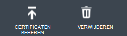

## Geregistreerde artikelen
Selecteer **Items geregistreerd** voor het weergeven van de namen van de servers die zijn geregistreerd op deze kluis.

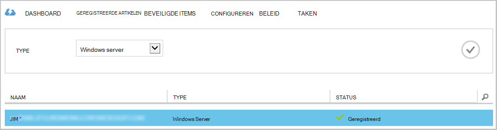

Het **Type** filter standaard Azure Virtual Machine. Als u wilt weergeven van de namen van de servers die zijn geregistreerd op deze kluis, selecteer **Windows server** uit de vervolgkeuzelijst.

Hier kunt u de volgende taken uitvoeren:

- **Toestaan Re-registratie** - als deze optie is ingeschakeld voor een server kunt u de **Wizard registratie** in de op het bedrijf Microsoft Azure reservekopie-agent voor het registreren van de server met de back-kluis een tweede keer. U moet mogelijk opnieuw te registreren door een fout in het certificaat of als een server moest opnieuw worden opgebouwd.
- **Verwijder** - verwijderen een server uit de back-kluis. Alle opgeslagen gegevens die zijn gekoppeld aan de server wordt onmiddellijk verwijderd.

    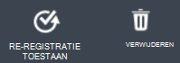

## Beveiligde items
Selecteer **Beveiligde Items** aan de artikelen weergeven die is gemaakt van de servers.

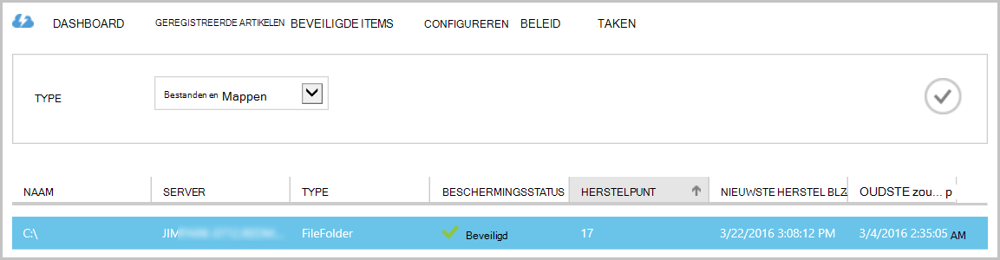

## Configureren

In het tabblad **configureren** kunt u de optie de juiste opslag redundantie. Het beste tijdstip om de optie opslag redundantie klopt na het maken van een kluis en voordat alle machines worden geregistreerd.

>[AZURE.WARNING] Nadat u een item naar de kluis is geregistreerd, wordt de optie opslag redundantie is vergrendeld en kan niet worden gewijzigd.

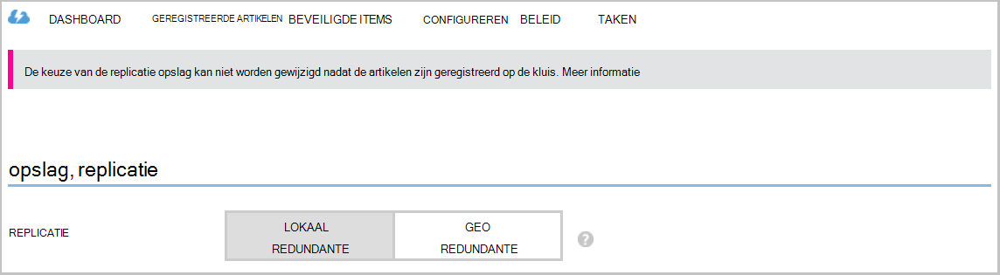

Zie dit artikel voor meer informatie over [redundantie voor opslag](../storage/storage-redundancy.md).

## Microsoft Azure Backup agent-taken

### Console

Open de **Microsoft Azure Backup agent** (kunt u het vinden door te zoeken op uw computer *Microsoft Azure back-up*).

Van de **Acties** die beschikbaar zijn aan de rechterkant van de reservekopie-agent-console kunt u de volgende beheertaken uitvoeren:

- Server registreren
- Back-up plannen
- Nu een back-Up
- Eigenschappen wijzigen

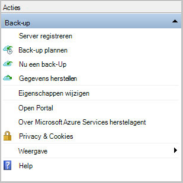

>[AZURE.NOTE] **Gegevens herstellen**Zie [bestanden terugzetten naar een Windows-server of een Windows-clientcomputer](backup-azure-restore-windows-server.md).

### Een bestaande back-up wijzigen

1. Klik op **Back-up plannen**in de agent Microsoft Azure back-up.

    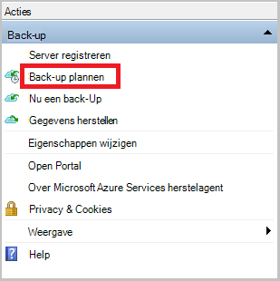

2. Laat de optie **wijzigingen aanbrengt in de back-up items of tijden** geselecteerd in de **Wizard Back-upschema** op en klik op **volgende**.

    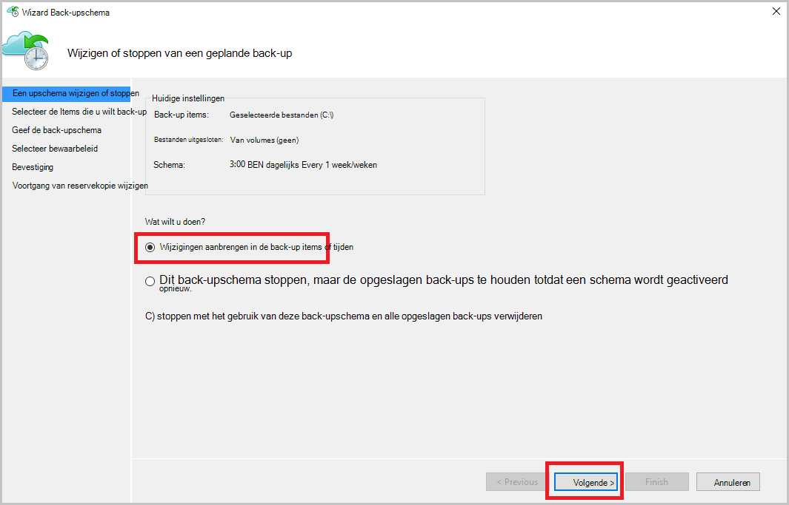

3. Als u items toevoegen of wijzigen, klikt u op het scherm **Items selecteren voor back-up** op **Items toevoegen**.

    Op deze pagina in de wizard kunt u ook **Instellingen voor uitsluiting** instellen. Als u bestanden wilt uitsluiten of bestandstypen Zie de procedure voor het toevoegen van [uitsluiting](#exclusion-settings).

4. Selecteer de bestanden en mappen die u wilt back-up en klik op **OK**.

    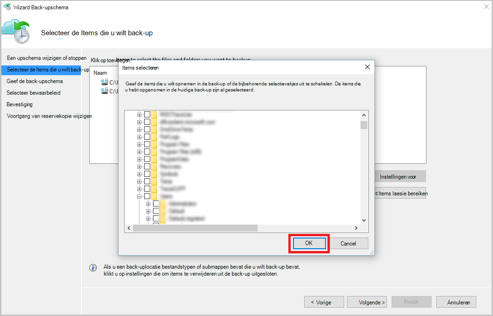

5. Geef de **back-upschema** en klik op **volgende**.

    U kunt dagelijks (met een maximum van 3 keer per dag) of een wekelijkse back-ups plannen.

    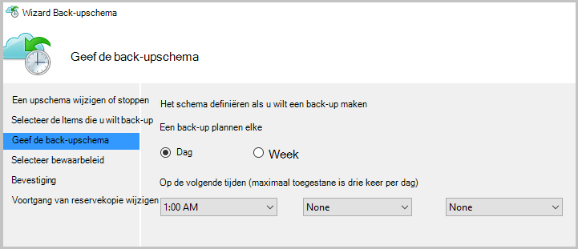

    >[AZURE.NOTE] Opgeven van het back-upschema wordt uitvoerig beschreven in dit [artikel](backup-azure-backup-cloud-as-tape.md).

6. Selecteer het **Bewaarbeleid** voor de back-up en klik op **volgende**.

    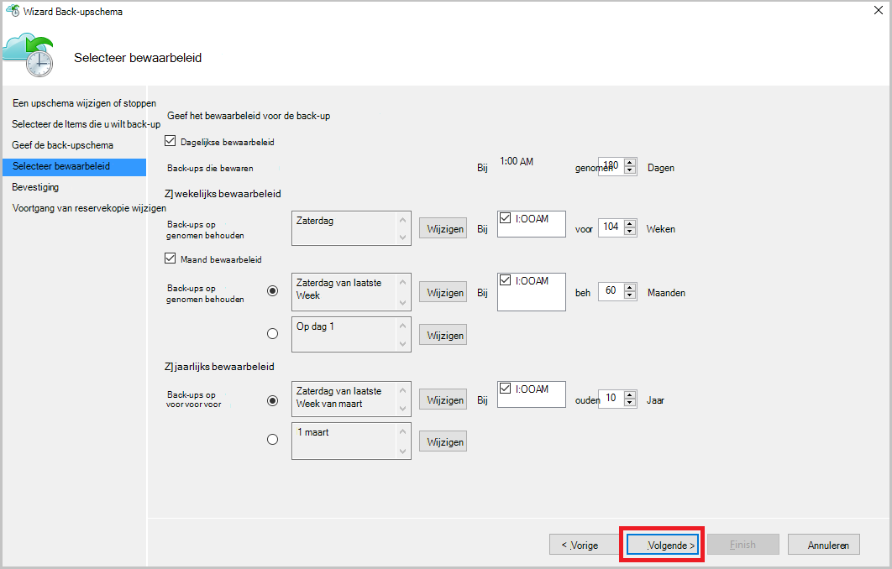

7. Lees de informatie op het scherm voor **bevestiging** en klik op **Voltooien**.

8. Klik op **sluiten**nadat de wizard is voltooid voor het maken van de **back-upschema**.

    Na het wijzigen van de beveiliging kunt u back-ups correct worden geactiveerd door te gaan naar het tabblad **taken** en waarin wordt bevestigd dat de wijzigingen worden doorgevoerd in de back-uptaken bevestigen.

### Bandbreedtebeperking inschakelen  
De agent Azure back-up biedt een Throttling tabblad kunt u bepalen hoe netwerkbandbreedte tijdens de overdracht van gegevens wordt gebruikt. Dit besturingselement is handig als u back wilt-up van gegevens tijdens werkuren, maar niet wilt dat de back-upprocedure te mengen met andere internet-verkeer. Beperking van de gegevens overbrengen van toepassing op back-up en terugzetten van activiteiten.  

Inschakelen van bandbreedtebeperking:

1. Klik op **Eigenschappen wijzigen**in de **Backup agent**.

2. Schakel het selectievakje **internet bandbreedtegebruik voor back-upbewerkingen bandbreedtebeperking inschakelen** .

    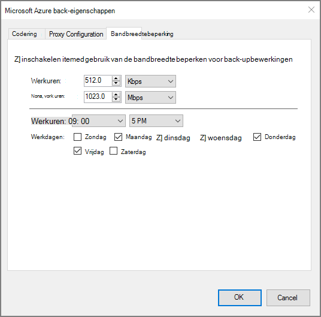

3. Zodra u de bandbreedtebeperking hebt ingeschakeld, geeft u de toegestane bandbreedte voor de overdracht van gegevens met back-up tijdens **werkuren** en **niet-gewerkte uren**.

    De waarden van de bandbreedte begint in 512 kB per seconde (Kbps) en maximaal 1023 MB per seconde (Mbps) kunnen gaan. Ook geven het begin en einddatum voor **werkuren**en welke dagen van de week worden beschouwd als werk dagen. De tijd buiten de werkuren van de aangewezen, wordt beschouwd als niet-werkuren.

4. Klik op **OK**.

## Instellingen voor uitsluiting

1. Open de **Microsoft Azure Backup agent** (kunt u het vinden door te zoeken op uw computer *Microsoft Azure back-up*).

    

2. Klik op **Back-up plannen**in de agent Microsoft Azure back-up.

    

3. Laat de optie **wijzigingen aanbrengt in de back-up items of tijden** geselecteerd in de Wizard Back-up van schema en klik op **volgende**.

    

4. Klik op **Instellingen voor uitzonderingen**.

    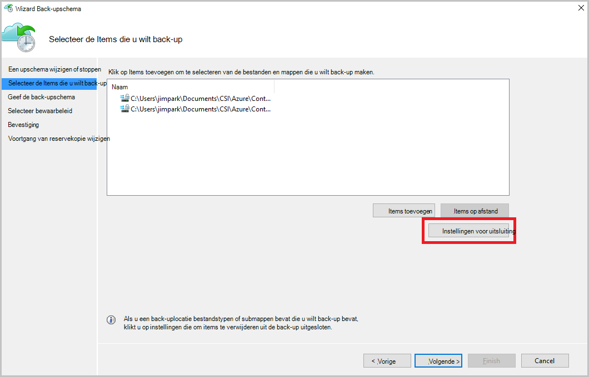

5. Klik op **uitsluiting toevoegen**.

    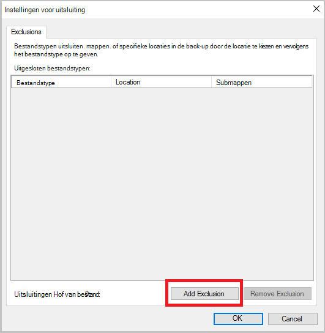

6. Selecteer de locatie en klik vervolgens op **OK**.

    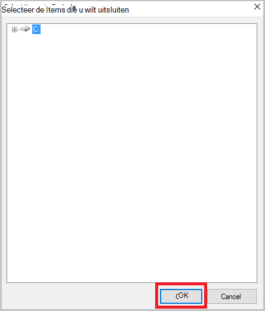

7. De bestandsextensie in het veld **Bestandstype** toevoegen.

    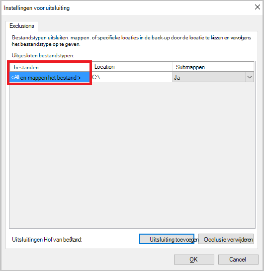

    Een .mp3-extensie toe te voegen

    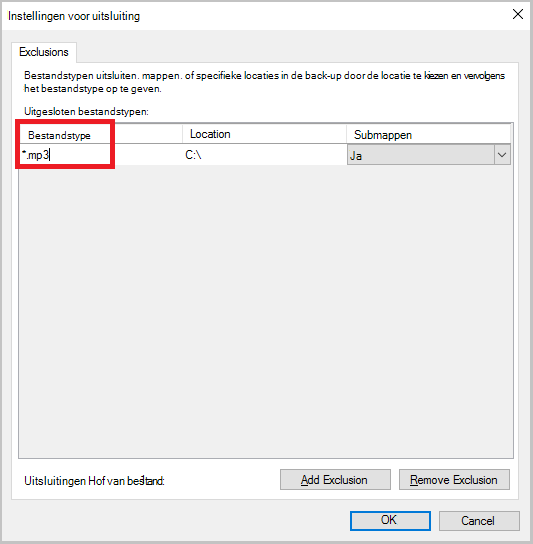

    Naar een andere extensie toevoegen, klik op **Uitsluiting toevoegen** en voer een ander bestandstype (extensie .jpeg toevoegen).

    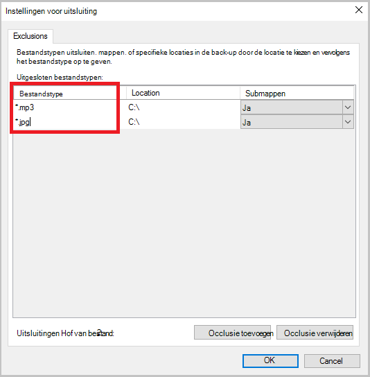

8. Als u alle extensies hebt toegevoegd, klikt u op **OK**.

9. Doorgaan met de Wizard planning back-up door te klikken op **volgende** totdat de **pagina Bevestiging**en klik vervolgens op **Voltooien**.

    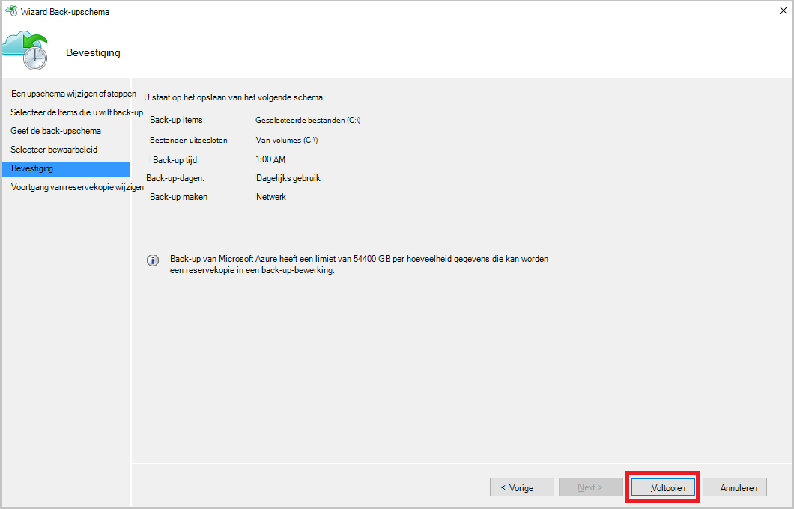

## Volgende stappen
- [Windows Server of Client Windows Azure terugzetten](backup-azure-restore-windows-server.md)
- Zie voor meer informatie over back-up Azure, [Azure back-up-overzicht](backup-introduction-to-azure-backup.md)
- Ga naar [Azure back-Forum](http://go.microsoft.com/fwlink/p/?LinkId=290933)
