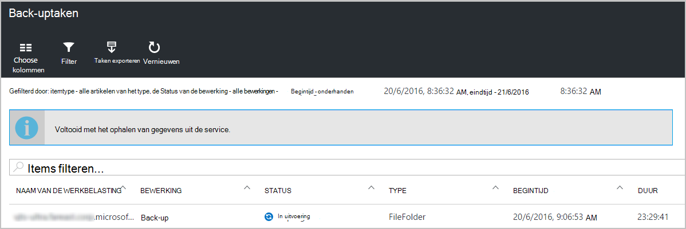
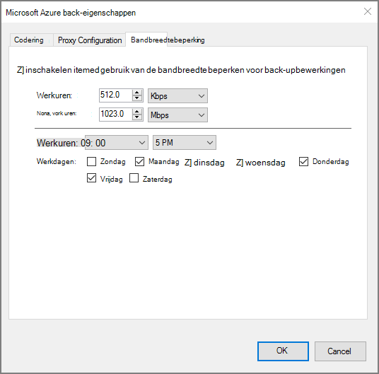

<properties
    pageTitle="Azure recovery services kluizen en servers beheren | Microsoft Azure"
    description="Deze zelfstudie gebruiken voor informatie over het herstel van Azure services kluizen en servers te beheren."
    services="backup"
    documentationCenter=""
    authors="markgalioto"
    manager="cfreeman"
    editor="tysonn"/>

<tags
    ms.service="backup"
    ms.workload="storage-backup-recovery"
    ms.tgt_pltfrm="na"
    ms.devlang="na"
    ms.topic="article"
    ms.date="10/19/2016"
    ms.author="jimpark; markgal"/>


# <a name="monitor-and-manage-azure-recovery-services-vaults-and-servers-for-windows-machines"></a>Bewaken en kluizen van Azure recovery services en servers voor Windows-computers beheren

> [AZURE.SELECTOR]
- [Resource Manager](backup-azure-manage-windows-server.md)
- [Klassiek](backup-azure-manage-windows-server-classic.md)

In dit artikel vindt u een overzicht van de back-beheertaken die beschikbaar is via de portal Azure en de Microsoft Azure reservekopie-agent.

[AZURE.INCLUDE [learn-about-deployment-models](../../includes/learn-about-deployment-models-rm-include.md)]klassieke implementatiemodel.

## <a name="management-portal-tasks"></a>Portal-beheertaken

### <a name="access-your-recovery-services-vaults"></a>Toegang tot uw kluizen Recovery Services

1. Log in om de [Azure Portal](https://portal.azure.com/) met behulp van uw abonnement op Azure.

2. Klik op **Bladeren** en typ in de lijst met resources **Recovery Services**in het menu Hub. Als u te typen begint, de lijst wordt gefilterd op basis van uw invoer. Klik op **kluizen Recovery Services**.

     <br/>

2. Selecteer de naam van de kluis die u weergeven uit de lijst wilt te openen van de bladeserver Recovery Services kluis dashboard.

     <br/>

## <a name="monitor-jobs-and-alerts"></a>Taken van de monitor en waarschuwingen
U controleren taken en waarschuwingen van het dashboard Recovery Services kluis, waarin u ziet:

- Details van de back-waarschuwingen
- Bestanden en mappen, evenals Azure virtuele machines die worden beschermd in de cloud
- Totale opslagruimte gebruikt in Azure
- Status van de back-uptaak


De informatie in elk van deze tegels te klikken op het bijbehorende blad waarin u gerelateerde taken beheren geopend.

Vanaf de bovenkant van het Dashboard:

- Instellingen biedt toegang tot beschikbare back-uptaken.
- Back-up - Hiermee kunt u back-up van bestanden en mappen (of VMs Azure) om de Recovery Services.
- DELETE - als een kluis recovery services niet meer gebruikt wordt, kunt u verwijderen om opslagruimte vrijmaken. Delete wordt alleen ingeschakeld nadat alle beveiligde servers zijn verwijderd uit de kluis.


## <a name="alerts-for-backups-using-azure-backup-agent"></a>Waarschuwingen voor back-ups back-upagent Azure:
| Waarschuwingsniveau  | Waarschuwingen verzonden |
| ------------- | ------------- |
| Kritiek | Back-fout, herstel  |
| Waarschuwing  | Back-up voltooid met waarschuwingen (bij minder dan honderd bestanden zijn niet een back-up door corruptie problemen en meer dan 1 miljoen bestanden wordt een reservekopie gemaakt van)  |
| Informatieve  | Geen  |
## <a name="manage-backup-alerts"></a>Back-up waarschuwingen beheren
Klik op de tegel **Waarschuwingen voor back-up** om de **Back-up waarschuwingen** blade openen en beheren van waarschuwingen.


De tegel back-up waarschuwingen bevat het nummer van:

- Kritieke signalen niet omgezet in de afgelopen 24 uur
- waarschuwing waarschuwingen niet omgezet in de afgelopen 24 uur

Op elk van deze koppelingen te klikken gaat u naar de **Back-up waarschuwingen** bladeserver met een gefilterde weergave van deze waarschuwingen (kritieke of waarschuwing).

Van de bladeserver back-up waarschuwingen u:

- Kies de juiste informatie op te nemen met uw waarschuwingen.

    

- Waarschuwingen voor ernst, status en begin/einde tijden filteren.

    

- Configureren van kennisgevingen voor de ernst, de frequentie en de geadresseerden, alsmede waarschuwingen inschakelen of uitschakelen.

    

Als **Per waarschuwing** is geselecteerd als de frequentie **Waarschuwen** geen groepering of vermindering in e-mails treedt op. Alle waarschuwingsresultaten in 1 melding. Dit is de standaardinstelling en de e-mail oplossing ook direct wordt verstuurd.

Als **Digest per uur** is geselecteerd als het **Waarschuwen** frequentie een e-mailbericht verzonden aan de gebruiker gemeld dat er onopgeloste nieuwe waarschuwingen gegenereerd in het afgelopen uur zijn. Een resolutie per e-mail verzonden aan het einde van het uur.

Voor de volgende niveaus kunnen waarschuwingen worden verzonden:

- kritiek
- Waarschuwing
- informatie

U uitschakelen de waarschuwing met de knop **uitschakelen** in het project details blade. Wanneer u klikt op deactiveren, kunt u notities oplossing bieden.

U kiest de kolommen die u wilt weergeven als onderdeel van de waarschuwing met de knop **kolommen kiezen** .

>[AZURE.NOTE] Van de bladeserver **Instellingen** u back-up waarschuwingen beheren door te selecteren **controle en rapporten > gebeurtenissen en waarschuwingen > waarschuwingen back-** en vervolgens te klikken op **Filter** of **Meldingen configureren**.

## <a name="manage-backup-items"></a>Back-up items beheren
Beheer van back-ups op ruimten is nu beschikbaar in de portal beheren. In de sectie back-up van het dashboard ziet de tegel **Back-up Items** u het aantal back-items om de beveiligde.

Klik op **Bestand-mappen** in de back-up Items naast elkaar.


De back-up Items blade geopend met het filter ingesteld op bestand map waar u de specifieke back-up vermeld item zien.


Als u een back-item uit de lijst selecteert, ziet u de essentiële gegevens voor dat item.

>[AZURE.NOTE] Van de bladeserver **Instellingen** u bestanden en mappen beheren door **beveiligde Items > back-up Items** en **- Mappen** te selecteren in de vervolgkeuzelijst.


## <a name="manage-backup-jobs"></a>Back-uptaken beheren
Back-up voor beide ruimten op projecten (als de server op locatie is een back-up naar Azure) en Azure back-ups worden weergegeven in het dashboard.

In de sectie back-up van het dashboard en ziet de back-up taak tegel u het aantal taken:

- in uitvoering
- kan niet in de laatste 24 uur.

Als u wilt uw back-uptaken beheren, klikt u op de **Back-uptaken** tegel, waarna het blade back-uptaken.



U wijzigt de gegevens in de back-uptaken bladeserver met de knop **Kies kolommen** aan de bovenkant van de pagina.

Gebruik de knop **filteren** van bestanden en mappen en Azure VM back-up kunt selecteren.

Als er geen back-ups van bestanden en mappen, klikt u op de knop **Filter** aan de bovenkant van de pagina en selecteer de **bestanden en mappen** in het menu Item Type.

>[AZURE.NOTE] Vanaf de blade **Instellingen** u back-uptaken beheren door te selecteren **controle en rapporten > projecten > back-uptaken** en **- Mappen** te selecteren in de vervolgkeuzelijst.

## <a name="monitor-backup-usage"></a>Gebruik back-up controleren
De back-up gebruik naast elkaar weergeven in de sectie back-up van het dashboard, de opslag die wordt gebruikt in Azure. Gebruik van opslag is beschikbaar voor:
- Wolk LRS gebruik van opslag die is gekoppeld aan de kluis
- Wolk GRS gebruik van opslag die is gekoppeld aan de kluis

## <a name="production-servers"></a>Productieservers
Klik op **Instellingen**voor het beheren van de productieservers. Klik onder beheren op **back-up infrastructuur > productieservers**.

De productieservers blade lijsten van alle beschikbare productieservers. Klik op een server in de lijst om de Serverdetails te openen.


## <a name="microsoft-azure-backup-agent-tasks"></a>Microsoft Azure Backup agent-taken

## <a name="open-the-backup-agent"></a>Open de reservekopie-agent

Open de **Microsoft Azure Backup agent** (u deze vinden door te zoeken op uw computer *Microsoft Azure back-up*).


Van de **Acties** die beschikbaar zijn aan de rechterkant van de reservekopie-agent-console kunt u de volgende beheertaken uitvoeren:

- Server registreren
- Back-up plannen
- Nu een back-Up
- Eigenschappen wijzigen


>[AZURE.NOTE] **Gegevens herstellen**Zie [bestanden terugzetten naar een Windows-server of een Windows-clientcomputer](backup-azure-restore-windows-server.md).

## <a name="modify-an-existing-backup"></a>Een bestaande back-up wijzigen

1. Klik op **Back-up plannen**in de agent Microsoft Azure back-up.

    

2. Laat de optie **wijzigingen aanbrengt in de back-up items of tijden** geselecteerd in de **Wizard Back-upschema** op en klik op **volgende**.

    

3. Als u items toevoegen of wijzigen, klikt u op het scherm **Items selecteren voor back-up** op **Items toevoegen**.

    Op deze pagina in de wizard kunt u ook **Instellingen voor uitsluiting** instellen. Als u bestanden wilt uitsluiten of bestandstypen Zie de procedure voor het toevoegen van [uitsluiting](#exclusion-settings).

4. Selecteer de bestanden en mappen die u wilt back-up en klik op **OK**.

    

5. Geef de **back-upschema** en klik op **volgende**.

    U kunt dagelijks (met een maximum van 3 keer per dag) of een wekelijkse back-ups plannen.

    

    >[AZURE.NOTE] Opgeven van het back-upschema wordt uitvoerig beschreven in dit [artikel](backup-azure-backup-cloud-as-tape.md).

6. Selecteer het **Bewaarbeleid** voor de back-up en klik op **volgende**.

    

7. Lees de informatie op het scherm voor **bevestiging** en klik op **Voltooien**.

8. Klik op **sluiten**nadat de wizard is voltooid voor het maken van de **back-upschema**.

    Na het wijzigen van de beveiliging kunt u back-ups correct worden geactiveerd door te gaan naar het tabblad **taken** en waarin wordt bevestigd dat de wijzigingen worden doorgevoerd in de back-uptaken bevestigen.

## <a name="enable-network-throttling"></a>Bandbreedtebeperking inschakelen  
De agent Azure back-up biedt een Throttling tabblad kunt u bepalen hoe netwerkbandbreedte tijdens de overdracht van gegevens wordt gebruikt. Dit besturingselement is handig als u back wilt-up van gegevens tijdens werkuren, maar niet wilt dat de back-upprocedure te mengen met andere internet-verkeer. Beperking van de gegevens overbrengen van toepassing op back-up en terugzetten van activiteiten.  

Inschakelen van bandbreedtebeperking:

1. Klik op **Eigenschappen wijzigen**in de **Backup agent**.

2. Schakel op het **tabblad beperken selecteren **internet bandbreedtegebruik beperken voor back-bewerkingen **.

    

    Zodra u de bandbreedtebeperking hebt ingeschakeld, geeft u de toegestane bandbreedte voor de overdracht van gegevens met back-up tijdens **werkuren** en **niet-gewerkte uren**.

    De waarden van de bandbreedte begint in 512 kB per seconde (Kbps) en maximaal 1023 MB per seconde (Mbps) kunnen gaan. Ook geven het begin en einddatum voor **werkuren**en welke dagen van de week worden beschouwd als werk dagen. De tijd buiten de werkuren van de aangewezen, wordt beschouwd als niet-werkuren.

3. Klik op **OK**.

## <a name="manage-exclusion-settings"></a>Uitsluiting-instellingen beheren

1. Open de **Microsoft Azure Backup agent** (kunt u het vinden door te zoeken op uw computer *Microsoft Azure back-up*).

    

2. Klik op **Back-up plannen**in de agent Microsoft Azure back-up.

    

3. Laat de optie **wijzigingen aanbrengt in de back-up items of tijden** geselecteerd in de Wizard Back-up van schema en klik op **volgende**.

    

4. Klik op **Instellingen voor uitzonderingen**.

    

5. Klik op **uitsluiting toevoegen**.

    

6. Selecteer de locatie en klik vervolgens op **OK**.

    

7. De bestandsextensie in het veld **Bestandstype** toevoegen.

    

    Een .mp3-extensie toe te voegen

    

    Naar een andere extensie toevoegen, klik op **Uitsluiting toevoegen** en voer een ander bestandstype (extensie .jpeg toevoegen).

    

8. Als u alle extensies hebt toegevoegd, klikt u op **OK**.

9. Doorgaan met de Wizard planning back-up door te klikken op **volgende** totdat de **pagina Bevestiging**en klik vervolgens op **Voltooien**.

    

## <a name="frequently-asked-questions"></a>Veelgestelde vragen
**Q1. De status van de back-uptaak wordt als voltooid in de reservekopie-agent Azure, waarom niet deze krijgen onmiddellijk weergegeven in de portal?**

A1. Er wordt bij maximale vertraging van 15 minuten tussen de status van de back-uptaak weerspiegeld in de Azure reservekopie-agent en de Azure portal.

**Q.2 wanneer een back-up mislukt, hoe lang duurt het voordat een waarschuwing te verhogen?**

A.2 een waarschuwing wordt gegenereerd binnen 20 minuten van de Azure back-fout.

**Q3. Is er een geval waarbij een e-mailbericht niet verzonden als meldingen zijn geconfigureerd?**

A3. Hieronder worden de gevallen wanneer de kennisgeving niet verzonden ter vermindering van het lawaai alert:

   - Als u meldingen per uur zijn geconfigureerd en een waarschuwing wordt ingediend en binnen het uur is opgelost
   - Taak wordt geannuleerd.
   - Tweede back-uptaak is mislukt omdat de oorspronkelijke back-up wordt uitgevoerd.

## <a name="troubleshooting-monitoring-issues"></a>Problemen met bewaking

**Probleem:** Taken en/of waarschuwingen van de agent Azure back-up worden niet weergegeven in de portal.

**Stappen voor probleemoplossing:** Het proces, ```OBRecoveryServicesManagementAgent```, de gegevens van de taak en een waarschuwing verzonden naar de Azure back-up-service. Soms kan dit proces kan zijn vastgelopen of afsluiten.

1. Open **Taakbeheer** om te controleren of het proces niet wordt uitgevoerd, en als de ```OBRecoveryServicesManagementAgent``` -proces wordt uitgevoerd.

2. Ervan uitgaande dat het proces niet wordt uitgevoerd, opent u **Het Configuratiescherm** en de lijst met services. Starten of opnieuw starten van **Microsoft Azure Services Management herstelagent**.

    Ga voor meer informatie de logboeken op:<br/>
`<AzureBackup_agent_install_folder>\Microsoft Azure Recovery Services Agent\Temp\GatewayProvider*`. Bijvoorbeeld:<br/> `C:\Program Files\Microsoft Azure Recovery Services Agent\Temp\GatewayProvider0.errlog`.

## <a name="next-steps"></a>Volgende stappen
- [Windows Server of Client Windows Azure terugzetten](backup-azure-restore-windows-server.md)
- Zie voor meer informatie over back-up Azure, [Azure back-up-overzicht](backup-introduction-to-azure-backup.md)
- Ga naar [Azure back-Forum](http://go.microsoft.com/fwlink/p/?LinkId=290933)
