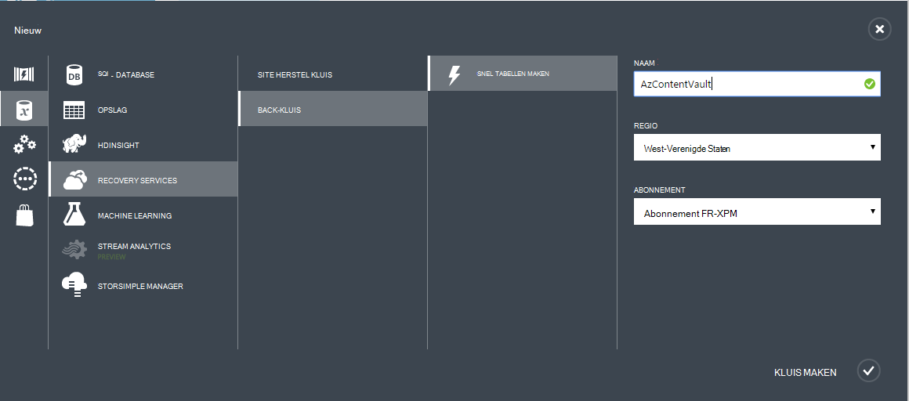

<properties
  pageTitle="Voorbereiden van uw back-up van werkbelasting met Azure Backup Server-omgeving | Microsoft Azure"
  description="Zorg ervoor dat uw omgeving goed is voorbereid op de back-up van werkbelasting met Azure back-up Server"
  services="backup"
  documentationCenter=""
  authors="pvrk"
  manager="shivamg"
  editor=""
  keywords="back-upserver Azure; back-kluis"/>

<tags
  ms.service="backup"
  ms.workload="storage-backup-recovery"
  ms.tgt_pltfrm="na"
  ms.devlang="na"
  ms.topic="article"
  ms.date="08/22/2016"
  ms.author="jimpark;trinadhk;pullabhk; markgal"/>

# <a name="preparing-to-back-up-workloads-using-azure-backup-server"></a>Back-up van werkbelasting met Azure back-up Server wordt voorbereid

> [AZURE.SELECTOR]
- [Azure back-upserver](backup-azure-microsoft-azure-backup.md)
- [SCDPM](backup-azure-dpm-introduction.md)
- [Azure reserveserver (klassiek)](backup-azure-microsoft-azure-backup-classic.md)
- [SCDPM (klassiek)](backup-azure-dpm-introduction-classic.md)


Dit artikel is over het voorbereiden van uw back-up van werkbelasting met Azure Backup Server-omgeving. Met Azure back-up Server, kunt u de werkbelasting van toepassingen zoals VMs Hyper-V, Microsoft SQL Server, SharePoint Server, Microsoft Exchange en Windows-clients beveiligen vanaf één console.

>[AZURE.WARNING] Back-upserver Azure neemt de functionaliteit van de Data Protection Manager (DPM) voor de back-up van de werkbelasting. Vindt u verwijzingen naar DPM documentatie voor sommige van deze mogelijkheden. Echter Azure reserveserver niet bieden bescherming op tape of integratie met System Center.

## <a name="1-windows-server-machine"></a>1. Windows Server-computer


De eerste stap in de richting van de reserveserver Azure slag is dat een Windows Server-computer.

| Locatie | Minimale vereisten | Er zijn aanvullende instructies |
| -------- | -------------------- | ----------------------- |
| Azure | Azure IaaS virtuele machine<br><br>A2 Standaard: 2 cores, 3,5 GB RAM-geheugen | U kunt beginnen met een eenvoudige afbeelding van Windows Server 2012 R2 Datacenter. [IaaS beschermen werkbelasting met Azure back-up Server (DPM)](https://technet.microsoft.com/library/jj852163.aspx) heeft vele nuances bevatten. Zorg ervoor dat u het artikel volledig lezen voordat u de computer. |
| In gebouwen | Hyper-V-VM<br> VMWare-VM<br> of een fysieke host<br><br>2 kernen en 4GB RAM-geheugen | U kunt de DPM-opslag met behulp van Windows Server Deduplication deduplicate. Meer informatie over hoe [DPM en deduplication](https://technet.microsoft.com/library/dn891438.aspx) samen wanneer in Hyper-V VMs geïmplementeerd. |

> [AZURE.NOTE] Het verdient aanbeveling dat Azure back-up Server worden geïnstalleerd op een computer met Windows Server 2012 R2 Datacenter. Veel van de vereisten worden gedekt met de nieuwste versie van het Windows-besturingssysteem.

Als u van plan bent deze server toevoegen aan een domein op een bepaald moment, is het raadzaam dat de activiteit lid worden van een domein worden uitgevoerd voordat de installatie van Azure back-up Server. Een bestaande Azure back-up Server-computer verplaatst naar een nieuw domein nadat de implementatie is *niet ondersteund*.

## <a name="2-backup-vault"></a>2. back-kluis


Of u een back-up gegevens naar Azure verzenden of lokaal houden, moet de software verbinding met Azure. Meer specifiek, de reserveserver Azure machine moet worden geregistreerd met een back-up kluis.

Voor het maken van een back-up kluis:

1. Aanmelden bij de [Portal beheren](http://manage.windowsazure.com/).

2. Klik op **nieuwe** > **Data Services** > **Recovery Services** > **kluis back-** > **snel tabellen maken**. Als er meerdere abonnementen aan uw organisatie-account is gekoppeld, kiest u het juiste abonnement te koppelen aan de back-kluis.

3. Voer in het vak **naam**een beschrijvende naam ter identificatie van de kluis. Dit moet uniek zijn voor elk abonnement.

4. Selecteer de regio voor de kluis in de **regio**. Regio van de kluis wordt meestal gekozen op basis van soevereiniteit of netwerk latentie gegevensbeperkingen.

    

5. Klik op de **kluis te maken**. Het kan even duren voor de kluis back-up moet worden gemaakt. Controleren van de statusmeldingen onderaan in de portal.

    

6. Een bericht wordt bevestigd dat de kluis is gemaakt en worden weergegeven in de actieve pagina Recovery Services.
    

  > [AZURE.IMPORTANT] Zorg ervoor dat de juiste opslag redundantie optie wordt gekozen nadat de kluis is gemaakt. Meer informatie over [geo-redundante](../storage/storage-redundancy.md#geo-redundant-storage) en [lokaal redundante](../storage/storage-redundancy.md#locally-redundant-storage) opties in dit [Overzicht](../storage/storage-redundancy.md).


## <a name="3-software-package"></a>3. het softwarepakket


### <a name="downloading-the-software-package"></a>Het softwarepakket downloaden

Net als bij de kluis referenties, kunt u downloaden Microsoft Azure back-up voor de werkbelasting van toepassingen op de **Quick Start-pagina** van de back-kluis.

1. Klik hier **voor de werkbelasting van toepassingen (schijf naar schijf naar Cloud)**. Hiervoor gaat u naar de pagina van het Download Center uit waar het softwarepakket kan worden gedownload.

    

2. Klik op **downloaden**.

    

3. Selecteer alle bestanden en klik op **volgende**. Download alle bestanden die binnenkomen vanaf de downloadpagina van Microsoft Azure back-up en alle bestanden in dezelfde map plaatsen.


    Aangezien de downloadgrootte van alle bestanden bij elkaar > 3G, op een 10 Mbps downloadkoppeling duurt maximaal 60 minuten voor de downloadbewerking is voltooid.


### <a name="extracting-the-software-package"></a>Uitpakken van het softwarepakket met

Nadat u alle bestanden hebt gedownload, klikt u op **MicrosoftAzureBackupInstaller.exe**. Hiermee start u de **Wizard Setup van Microsoft Azure back-up** om uit te pakken van de setup-bestanden naar een door u opgegeven locatie. Ga verder met de wizard en klik op de knop **ophalen** om te beginnen met het uitpakken gestart.

> [AZURE.WARNING] Minimaal 4GB vrije schijfruimte is vereist voor de setup-bestanden uitpakken.


Als de extractie proces voltooid, schakel het selectievakje in om te starten om te beginnen met de installatie van Microsoft Azure back-up Server en klik op de knop **Voltooien** de vers uitgepakte *setup.exe* .

### <a name="installing-the-software-package"></a>Het softwarepakket installeren

1. Klik op **Microsoft Azure back-up** om de setup wizard te starten.

    

2. Klik op de knop **volgende** op het Welkom-scherm. Hiermee gaat u naar de sectie *Vereiste controles* . Klik op de knop **controleren** om te bepalen als de vereisten voor hardware en software voor Azure Backup Server is voldaan op dit scherm. Als alle vereisten is voldaan is, wordt er een bericht dat aangeeft dat de computer voldoet aan de vereisten. Klik op de knop **volgende** .

    

3. Microsoft Azure back-up Server vereist SQL Server Standard en het installatiepakket Azure Backup Server wordt meegeleverd met de juiste SQL Server binaire bestanden die nodig zijn. Bij het starten van een nieuwe installatie van Azure back-up Server, moet u kiest u de optie **Nieuwe exemplaar van SQL Server installeren met deze instellingen** en klik op de knop **Zoeken en installeren** . Zodra de vereisten zijn geïnstalleerd, klikt u op **volgende**.

    

    Als een fout met de aanbeveling optreedt om de computer opnieuw hebt opgestart, doet en klik op **Opnieuw controleren**.

    > [AZURE.NOTE] Azure Backup Server werkt niet met een externe SQL Server-exemplaar. Het exemplaar dat wordt gebruikt door Azure back-up Server moet lokaal zijn.

4. Een locatie voor de installatie van Microsoft Azure Backup server-bestanden en klik op **volgende**.

    

    De tijdelijke locatie is een vereiste voor back-ups Azure maken. Controleer dat de tijdelijke locatie is ten minste 5% van de gegevens die zijn gepland om te worden een back-up naar de cloud. Voor de bescherming van de schijf moeten aparte schijven worden geconfigureerd nadat de installatie is voltooid. Zie voor meer informatie over opslagpools [opslagpools configureren en opslagruimte op een schijf](https://technet.microsoft.com/library/hh758075.aspx).

5. Voor beperkte lokale gebruikersaccounts een sterk wachtwoord en klik op **volgende**.

    

6. Selecteer of u *Microsoft Update* gebruikt om te controleren op updates en klik op **volgende**.

    >[AZURE.NOTE] Het aan te raden Windows Update omleiden naar Microsoft Update, beveiliging en belangrijke updates voor Windows en andere producten zoals Microsoft Azure back-up Server biedt.

    

7. Bekijk de *Samenvatting van instellingen* en klik op **installeren**.

    

8. De installatie gebeurt in fasen. In de eerste fase is de Microsoft Azure herstelagent Services op de server geïnstalleerd. De wizard controleert ook of er verbinding met het Internet. Als Internet-verbinding beschikbaar is kunt u doorgaan met de installatie, zo niet, moet u details van de proxy verbinding maakt met het Internet.

    De volgende stap is het configureren van Microsoft Azure Services herstelagent. U moet bieden je de kluis referenties voor het registreren van de machine om de back-up als een onderdeel van de configuratie. U krijgt ook een wachtwoordzin te coderen/decoderen van gegevens die worden verzonden tussen Azure en uw locatie. Als u automatisch een wachtwoordzin genereren of uw eigen wachtwoordzin met minimaal 16 tekens bevatten. Doorgaan met de wizard totdat u de agent is geconfigureerd.

    

9. Zodra de registratie van de Microsoft Azure back-up server met succes is uitgevoerd, verloopt de algemene setup wizard de installatie en configuratie van SQL Server en de serveronderdelen Azure back-up. Nadat de installatie van SQL Server-onderdelen is voltooid, wordt de Azure back-up-serveronderdelen zijn geïnstalleerd.

    


Wanneer de installatiestap is voltooid, wordt pictogrammen op het bureaublad van het product gemaakt ook. Dubbelklik op het pictogram om het product te starten.

### <a name="add-backup-storage"></a>Back-up opslag toevoegen

De eerste back-up wordt bewaard op de opslag is aangesloten op de machine Azure back-upserver. Zie voor meer informatie over het toevoegen van schijven [configureren opslagpools en opslagruimte op een schijf](https://technet.microsoft.com/library/hh758075.aspx).

> [AZURE.NOTE] U moet een back-up opslag toevoegen, zelfs als u van plan bent om gegevens te verzenden naar Azure. De kluis Azure back-up bevat de *tweede* kopie van de gegevens in de huidige architectuur van de back-upserver Azure, terwijl de lokale opslag de eerste (en verplicht) back-up bevat.  

## <a name="4-network-connectivity"></a>4. verbinding met het netwerk


Azure back-up Server moet verbinding met de service Azure back-up voor het product om probleemloos te werken. Gebruiken om te controleren of de computer de verbinding met Azure heeft, het ```Get-DPMCloudConnection``` commandlet in de console Azure back-up Server PowerShell. Als de uitvoer van de commandlet ingesteld op TRUE is en vervolgens de verbinding bestaat, anders er geen verbinding is.

Op hetzelfde moment moet het Azure abonnement in orde zijn. De status van uw abonnement en als u wilt beheren, log in op de [portal abonnement]( https://account.windowsazure.com/Subscriptions).

Zodra u weet dat de status van de verbinding Azure en de Azure abonnement, kunt u in de onderstaande tabel voor informatie over de gevolgen voor de functionaliteit maken en terugzetten.

| Connectiviteit staat | Azure-abonnement | Back-up naar Azure| Back-ups naar schijf | Terugzetten vanuit Azure | Herstellen van de schijf |
| -------- | ------- | --------------------- | ------------------- | --------------------------- | ----------------------- |
| Verbonden | Actieve | Toegestaan | Toegestaan | Toegestaan | Toegestaan |
| Verbonden | Verlopen | Gestopt | Gestopt | Toegestaan | Toegestaan |
| Verbonden | Deprovisioned | Gestopt | Gestopt | Herstel gestopt en Azure punten verwijderd | Gestopt |
| Verbroken verbindingen > 15 dagen | Actieve | Gestopt | Gestopt | Toegestaan | Toegestaan |
| Verbroken verbindingen > 15 dagen | Verlopen | Gestopt | Gestopt | Toegestaan | Toegestaan |
| Verbroken verbindingen > 15 dagen | Deprovisioned | Gestopt | Gestopt |  Herstel gestopt en Azure punten verwijderd | Gestopt |

### <a name="recovering-from-loss-of-connectivity"></a>Het systeem herstellen na verlies van connectiviteit
Als u een firewall of een proxy die toegang tot Azure is voorkomen, moet u "witte" lijst de volgende domein adressen in het profiel van de firewall-proxy:

- www.msftncsi.com
- \*. Microsoft.com
- \*. WindowsAzure.com
- \*. microsoftonline.com
- \*. windows.net

Zodra er verbinding met Azure is teruggezet naar de Azure back-up Server, worden de bewerkingen die worden uitgevoerd door de Azure abonnement staat bepaald. De bovenstaande tabel bevat details over de bewerkingen toegestaan nadat de machine 'verbonden'.

### <a name="handling-subscription-states"></a>Verwerking van provincies abonnement

Het is mogelijk een Azure-abonnement nemen vanuit een *vervallen* of *Deprovisioned* staat voor de *actieve* status. Echter dit heeft enkele gevolgen van de werking van het product als de status niet *actief*is:

- Functionaliteit verloren gaat voor de periode waarin het is deprovisioned voor een *Deprovisioned* -abonnement. Over het *actief*, de functionaliteit van back-up en terugzetten van het product opnieuw actief. De back-upgegevens op de lokale schijf kan ook worden opgehaald als deze met een voldoende lange bewaartermijn is gehouden. De back-upgegevens in Azure is onherstelbaar verloren wanneer de *Deprovisioned* staat het abonnement heeft ingevoerd.
- Functionaliteit voor verliest een *verlopen* abonnement alleen totdat deze is gedaan *actieve* opnieuw. Alle back-ups die is gepland voor de periode dat het abonnement *verlopen is* , wordt niet uitgevoerd.


## <a name="troubleshooting"></a>Het oplossen van problemen

Als Microsoft Azure back-up mislukt met fouten tijdens de installatiefase (of back-up of terugzetten), verwijzen naar deze [fout codes document](https://support.microsoft.com/kb/3041338) voor meer informatie.
U kunt ook verwijzen naar de [dat back-up Azure gerelateerde Veelgestelde vragen](backup-azure-backup-faq.md)


## <a name="next-steps"></a>Volgende stappen

U kunt gedetailleerde informatie over het [voorbereiden van uw omgeving voor DPM](https://technet.microsoft.com/library/hh758176.aspx) op de Microsoft TechNet-website. Het bevat ook informatie over de ondersteunde configuraties waarop Azure Backup Server kan worden geïmplementeerd en gebruikt.

Deze artikelen kunt u een beter begrip van de werkbelasting bescherming met Microsoft Azure Backup server krijgen.

- [Back-up van SQL Server](backup-azure-backup-sql.md)
- [Back-up van SharePoint server](backup-azure-backup-sharepoint.md)
- [Alternatieve server back-up](backup-azure-alternate-dpm-server.md)
